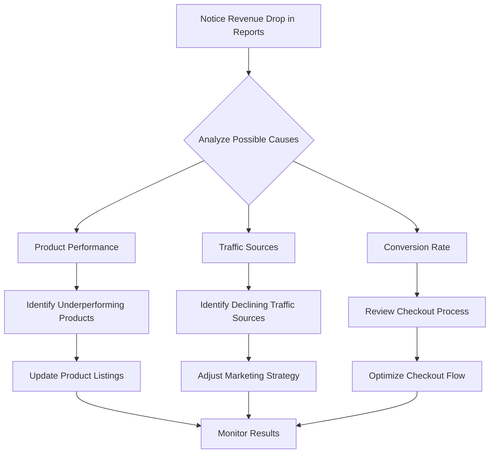

# WordPress E-commerce Reports

## Introduction

In the competitive world of online retail, data is your most valuable asset. WordPress e-commerce reports provide crucial insights into your store's performance, customer behavior, and sales trends. This knowledge empowers you to make informed business decisions, optimize your product offerings, and increase your revenue.

In this guide, we'll explore how to set up, generate, and interpret various reports in WordPress e-commerce platforms, with a focus on WooCommerce as the most popular e-commerce solution for WordPress. Whether you're just starting your online store or looking to optimize an existing one, understanding e-commerce reports will help take your business to the next level.

## Why E-commerce Reports Matter

Before diving into the technical aspects, let's understand why reports are essential:

- **Data-driven decisions**: Replace guesswork with concrete data
- **Performance tracking**: Monitor KPIs and business growth
- **Customer insights**: Understand buyer behavior and preferences
- **Inventory management**: Optimize stock levels based on sales trends
- **Marketing effectiveness**: Measure the ROI of your marketing campaigns

## Getting Started with WooCommerce Reports

### Built-in WooCommerce Reports

WooCommerce comes with a basic reporting system out of the box. To access it:

1. Log in to your WordPress admin dashboard
2. Navigate to WooCommerce → Analytics (or Reports in older versions)

The default report dashboard looks like this:

```jsx
// This is a representation of what the dashboard UI would look like
// Not actual code to be implemented
const WooCommerceDashboard = () => {
  return (
    <div className="woocommerce-dashboard">
      <SalesOverview data={revenueData} />
      <OrderStatistics orders={recentOrders} />
      <TopProducts products={bestSellingProducts} />
      <CustomerInsights customers={customerData} />
    </div>
  );
};
```

### Types of Built-in Reports

WooCommerce offers several report categories:

#### 1. Orders Reports

These reports show your store's order and revenue data over time:

- Total sales
- Net sales
- Average order value
- Orders count
- Refunded orders

#### 2. Products Reports

Track how your products are performing:

- Best sellers
- Most profitable items
- Product trends over time
- Inventory levels

#### 3. Customer Reports

Understand your customer base:

- New vs. returning customers
- Customer lifetime value
- Geographical distribution
- Purchase frequency

#### 4. Stock Reports

Monitor inventory status:

- Low stock items
- Out of stock products
- Inventory valuation

## Enhancing Reports with WooCommerce Analytics

In newer versions of WooCommerce, the Analytics section provides more advanced reporting with better visualizations. Here's how to get the most out of it:

### Customizing Date Ranges

To analyze data for specific periods:

```jsx
// Example of how the date range selection might work in WooCommerce
function selectDateRange(startDate, endDate) {
  // This would fetch data for the specified date range
  const reportData = fetchReportData(startDate, endDate);
  
  return {
    labels: reportData.dates,
    datasets: [
      {
        label: 'Revenue',
        data: reportData.revenue,
        borderColor: '#7f54b3',
        backgroundColor: 'rgba(127, 84, 179, 0.2)',
      }
    ]
  };
}

// Example usage
const monthlyReport = selectDateRange('2023-01-01', '2023-01-31');
```

### Exporting Reports

WooCommerce allows you to export report data for further analysis:

1. Navigate to the report you want to export
2. Look for the "Export" button (usually CSV format)
3. Download and open in your preferred spreadsheet program

## Advanced Reporting with Third-Party Plugins

While WooCommerce's built-in reporting is useful, third-party plugins can provide more comprehensive analytics.

### Setting Up Enhanced E-commerce with MonsterInsights

MonsterInsights connects your WordPress store with Google Analytics for deeper insights:

1. Install and activate the MonsterInsights plugin
2. Connect it to your Google Analytics account
3. Enable Enhanced E-commerce tracking

Example implementation:

```jsx
// Example of how MonsterInsights might track an e-commerce transaction
// This would be automatically handled by the plugin
function trackEcommerceTransaction(transaction) {
  window.gtag('event', 'purchase', {
    transaction_id: transaction.id,
    value: transaction.total,
    currency: 'USD',
    tax: transaction.tax,
    shipping: transaction.shipping,
    items: transaction.items.map(item => ({
      id: item.id,
      name: item.name,
      price: item.price,
      quantity: item.quantity,
      category: item.category
    }))
  });
}
```

### Metorik for Advanced Analytics

Metorik is a powerful reporting tool designed specifically for WooCommerce:

1. Install the Metorik Helper plugin
2. Create and connect your Metorik account
3. Access advanced reports and automated email summaries

## Creating Custom Reports

For unique business needs, you might want to create custom reports:

### Using the WooCommerce REST API

```jsx
// Example of fetching order data via the WooCommerce REST API
async function getCustomSalesReport(startDate, endDate) {
  const response = await fetch(
    `https://your-site.com/wp-json/wc/v3/reports/sales?date_min=${startDate}&date_max=${endDate}`,
    {
      headers: {
        'Authorization': 'Basic ' + btoa('consumer_key:consumer_secret')
      }
    }
  );
  
  const data = await response.json();
  return data;
}

// Process and visualize the data
function visualizeReport(reportData) {
  // Implementation for visualization
  // This could use a library like Chart.js
}
```

### Custom Database Queries

For very specific reports, direct database queries might be necessary:

```php
<?php
// Example PHP code for a custom report (this would be in a plugin or theme functions file)
function get_product_category_performance() {
    global $wpdb;
    
    $results = $wpdb->get_results("
        SELECT terms.name as category_name, 
               SUM(order_items.product_qty) as quantity_sold,
               SUM(order_items.product_net_revenue) as revenue
        FROM {$wpdb->prefix}wc_order_product_lookup as order_items
        JOIN {$wpdb->prefix}wc_product_meta_lookup as product_meta 
            ON order_items.product_id = product_meta.product_id
        JOIN {$wpdb->prefix}term_relationships as relationships
            ON product_meta.product_id = relationships.object_id
        JOIN {$wpdb->prefix}term_taxonomy as taxonomy
            ON relationships.term_taxonomy_id = taxonomy.term_taxonomy_id AND taxonomy.taxonomy = 'product_cat'
        JOIN {$wpdb->prefix}terms as terms
            ON taxonomy.term_id = terms.term_id
        WHERE order_items.date_created >= '2023-01-01'
        GROUP BY terms.term_id
        ORDER BY revenue DESC
    ");
    
    return $results;
}
```

## Visualizing Your Data

Raw numbers don't always tell the complete story. Visualizing your data can provide clearer insights:

### Using Chart.js with WordPress

```jsx
// Example of implementing Chart.js in WordPress
// This could be part of a custom dashboard widget
function renderSalesChart() {
  const ctx = document.getElementById('sales-chart').getContext('2d');
  
  // Fetch your data from an AJAX endpoint
  fetch('/wp-json/my-store/v1/sales-data')
    .then(response => response.json())
    .then(data => {
      new Chart(ctx, {
        type: 'line',
        data: {
          labels: data.dates,
          datasets: [{
            label: 'Daily Sales',
            data: data.amounts,
            backgroundColor: 'rgba(54, 162, 235, 0.2)',
            borderColor: 'rgba(54, 162, 235, 1)',
            borderWidth: 1
          }]
        },
        options: {
          responsive: true,
          scales: {
            y: {
              beginAtZero: true
            }
          }
        }
      });
    });
}
```

### Creating a Report Dashboard

You can create a custom dashboard to display your most important metrics:

```jsx
// Example React component for a custom dashboard
// This could be integrated with Gutenberg or a custom admin page
function EcommerceDashboard() {
  const [data, setData] = useState(null);
  const [isLoading, setIsLoading] = useState(true);
  
  useEffect(() => {
    async function fetchDashboardData() {
      setIsLoading(true);
      try {
        const response = await fetch('/wp-json/my-store/v1/dashboard-data');
        const dashboardData = await response.json();
        setData(dashboardData);
      } catch (error) {
        console.error('Error fetching dashboard data:', error);
      }
      setIsLoading(false);
    }
    
    fetchDashboardData();
  }, []);
  
  if (isLoading) return <p>Loading dashboard data...</p>;
  
  return (
    <div className="dashboard-container">
      <div className="metric-card">
        <h3>Today's Revenue</h3>
        <p className="metric-value">${data.todayRevenue}</p>
      </div>
      <div className="metric-card">
        <h3>Orders This Month</h3>
        <p className="metric-value">{data.monthlyOrders}</p>
      </div>
      <div className="chart-container">
        <h3>Sales Trend</h3>
        <canvas id="sales-trend-chart"></canvas>
      </div>
      <div className="chart-container">
        <h3>Top Products</h3>
        <canvas id="top-products-chart"></canvas>
      </div>
    </div>
  );
}
```

## Real-world Example: Actionable Insights

Let's walk through a practical example of using e-commerce reports to improve your business:

### Scenario: Identifying and Addressing Sales Decline



#### Step 1: Identify the Issue

In your monthly sales report, you notice a 15% decrease in revenue compared to the previous month.

#### Step 2: Dig Deeper with Reports

1. Check the Products Report to see if specific products are underperforming
2. Review the Traffic Report to identify any changes in traffic sources
3. Analyze the Conversion Rate Report to see if fewer visitors are completing purchases

#### Step 3: Discover the Root Cause

The reports reveal that while traffic remained consistent, the conversion rate dropped from 3.2% to 2.1%, and abandoned carts increased by 20%.

#### Step 4: Take Action Based on Data

Based on these insights, you might:
- Simplify the checkout process
- Implement an abandoned cart recovery email campaign
- Add trust signals on product pages

#### Step 5: Measure Results

After implementing these changes, continue monitoring your reports to verify improvement.

## Best Practices for E-commerce Reporting

1. **Establish KPIs**: Define what metrics matter most to your business
2. **Regular Review**: Schedule weekly and monthly report reviews
3. **Compare Periods**: Always compare data to previous periods to identify trends
4. **Segment Data**: Break down reports by product categories, traffic sources, etc.
5. **Action Plan**: For each insight, develop a corresponding action item

## Summary

WordPress e-commerce reports provide invaluable insights that can transform your online store's performance. By leveraging built-in WooCommerce reports, enhancing them with third-party tools, or creating custom solutions, you can gain a deep understanding of your business metrics and customer behavior.

Remember that the true value of reports lies not in the data itself, but in the actions you take based on that data. Regular analysis and strategic responses to what you learn will help you build a more profitable and customer-focused e-commerce business.

## Additional Resources

- WooCommerce Documentation: [WooCommerce Analytics](https://woocommerce.com/document/woocommerce-analytics/)
- Google Analytics for WooCommerce setup guide
- Video tutorials on e-commerce data analysis
- Online courses on business intelligence for e-commerce

## Exercises

1. Set up WooCommerce Analytics and generate a report comparing this month's sales to last month.
2. Create a custom dashboard showing your top 5 products and their contribution to overall revenue.
3. Analyze your conversion rate by traffic source and develop a plan to improve the lowest-performing channel.
4. Set up an automated weekly email report summarizing your key e-commerce metrics.
5. Use the WooCommerce REST API to create a custom report for a specific business question you have.

By mastering e-commerce reports, you'll transform from a reactive store owner to a proactive business strategist, making decisions backed by data rather than intuition alone.