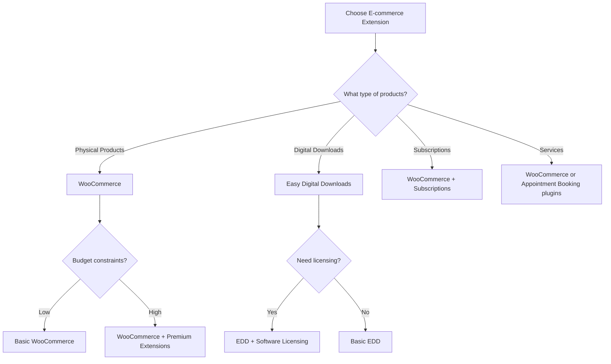

# WordPress E-commerce Extensions

## Introduction

WordPress powers approximately 43% of all websites on the internet, and a significant portion of these are e-commerce stores. The platform's popularity for online stores stems from its flexibility and the wide range of e-commerce extensions available. These extensions transform a standard WordPress site into a fully functional online store with features like product management, payment processing, shipping integration, and inventory tracking.

In this guide, we'll explore the most popular WordPress e-commerce extensions, how to choose the right one for your needs, and how to extend their functionality with add-ons. Whether you're selling physical products, digital downloads, or services, there's a WordPress e-commerce solution for you.

## Understanding WordPress E-commerce Extensions

### What Are WordPress E-commerce Extensions?

E-commerce extensions (or plugins) are software components that add online store functionality to your WordPress website. They integrate seamlessly with WordPress core to provide shopping cart functionality, payment processing, inventory management, and more.

### Key Types of E-commerce Extensions

1. **Full e-commerce platforms** - Complete solutions with comprehensive store management features
2. **Payment gateways** - Connect your store to payment processors
3. **Shipping integrations** - Calculate shipping costs and print labels
4. **Marketing tools** - Drive sales through email marketing, discounts, etc.
5. **Analytics extensions** - Track store performance and customer behavior

## Popular WordPress E-commerce Extensions

### WooCommerce

WooCommerce is by far the most popular e-commerce solution for WordPress, powering over 28% of all online stores worldwide.

#### Key Features

- Complete store management
- Extensive payment gateway options
- Flexible shipping settings
- Product variations and attributes
- Inventory management
- Tax calculation
- Order management

#### Basic Setup Example

To add a simple product in WooCommerce:

```php
// Programmatically create a simple WooCommerce product
$product = new WC_Product_Simple();
$product->set_name('Sample Product');
$product->set_regular_price('19.99');
$product->set_description('This is a sample product description.');
$product->set_short_description('Short product description.');
$product->set_status('publish');
$product->save();
```

#### Plugin Extension Architecture

WooCommerce uses hooks and filters to allow developers to extend its functionality:

```php
// Add a custom field to product pages
add_action('woocommerce_before_add_to_cart_button', 'add_custom_field');

function add_custom_field() {
    echo '<div class="custom-field">';
    echo '<label for="custom_field">Special Instructions:</label>';
    echo '<input type="text" id="custom_field" name="custom_field">';
    echo '</div>';
}

// Save the custom field value when added to cart
add_filter('woocommerce_add_cart_item_data', 'save_custom_field_data', 10, 3);

function save_custom_field_data($cart_item_data, $product_id, $variation_id) {
    if(isset($_POST['custom_field'])) {
        $cart_item_data['custom_field'] = sanitize_text_field($_POST['custom_field']);
    }
    return $cart_item_data;
}
```

### Easy Digital Downloads

Easy Digital Downloads (EDD) is specialized for selling digital products like e-books, software, music, and other downloadable items.

#### Key Features

- Digital product management
- Secure file delivery
- Licensing system
- Frontend submissions
- Discount codes

#### Example: Creating a Download Product with EDD API

```php
// Creating a digital product programmatically
$download = array(
    'post_title'   => 'Digital Product Title',
    'post_content' => 'Product description goes here',
    'post_status'  => 'publish',
    'post_type'    => 'download',
);

// Insert the download into the database
$download_id = wp_insert_post($download);

// Set the price
update_post_meta($download_id, 'edd_price', '29.99');

// Add download files
$files = array(
    array(
        'name'      => 'Main Product File',
        'file'      => 'http://example.com/files/product-file.zip',
        'condition' => 'all'
    )
);
update_post_meta($download_id, 'edd_download_files', $files);
```

### WP eCommerce

One of the oldest WordPress e-commerce plugins, WP eCommerce offers a solid foundation for online stores.

#### Key Features

- Product management
- Shopping cart
- Checkout system
- Payment gateway integrations
- Tax calculation

### BigCommerce for WordPress

This plugin connects your WordPress site to the BigCommerce platform, combining WordPress's content management strengths with BigCommerce's robust e-commerce features.

#### Key Features

- Headless commerce architecture
- PCI compliance handling
- Product syndication
- Multi-channel selling

## Choosing the Right E-commerce Extension

When selecting an e-commerce extension, consider:

1. **Type of products** - Physical, digital, services, or subscriptions
2. **Budget** - Initial cost and ongoing expenses
3. **Technical requirements** - Server requirements and compatibility
4. **Scalability needs** - Growth potential and performance under load
5. **Extension ecosystem** - Available add-ons for future expansion



## Extending E-commerce Plugins

One of WordPress's greatest strengths is extendability. Each major e-commerce plugin has its own ecosystem of extensions.

### WooCommerce Extensions

WooCommerce has thousands of extensions available, including:

#### Payment Gateways

```php
// Example of integrating a custom payment gateway with WooCommerce
add_filter('woocommerce_payment_gateways', 'add_custom_gateway');

function add_custom_gateway($gateways) {
    $gateways[] = 'WC_Custom_Payment_Gateway'; // Your custom gateway class
    return $gateways;
}

// Custom payment gateway class
class WC_Custom_Payment_Gateway extends WC_Payment_Gateway {
    public function __construct() {
        $this->id = 'custom_gateway';
        $this->title = 'Custom Payment';
        $this->description = 'Pay using our custom payment method.';
        // Additional setup...
    }
    
    // Process the payment
    public function process_payment($order_id) {
        $order = wc_get_order($order_id);
        // Payment processing logic
        
        // Mark as complete
        $order->payment_complete();
        
        // Empty cart
        WC()->cart->empty_cart();
        
        // Return success redirect
        return array(
            'result' => 'success',
            'redirect' => $this->get_return_url($order)
        );
    }
}
```

#### Shipping Methods

- WooCommerce Shipping
- ShipStation Integration
- Table Rate Shipping

#### Marketing Extensions

- Follow-Up Emails
- Google Product Feed
- Product Recommendations

### Easy Digital Downloads Extensions

EDD's extension ecosystem focuses on digital product needs:

- Software Licensing
- Recurring Payments
- Frontend Submissions
- Commission calculations

## Real-World Implementation Example

Let's walk through a practical example of setting up a basic online store using WooCommerce:

### Step 1: Install WooCommerce

1. Go to Plugins > Add New in your WordPress dashboard
2. Search for "WooCommerce"
3. Click "Install Now" then "Activate"
4. Follow the setup wizard to configure basic store settings

### Step 2: Configure Payment Methods

```php
// Example: Customize payment gateway display order
add_filter('woocommerce_available_payment_gateways', 'customize_payment_gateways_order');

function customize_payment_gateways_order($gateways) {
    // Define the desired order
    $new_order = array(
        'stripe', // Stripe first
        'paypal', // PayPal second
        'cod',    // Cash on Delivery third
        // Other gateways
    );
    
    $reordered_gateways = array();
    
    // Reorder gateways according to our preference
    foreach($new_order as $gateway_id) {
        if(isset($gateways[$gateway_id])) {
            $reordered_gateways[$gateway_id] = $gateways[$gateway_id];
            unset($gateways[$gateway_id]);
        }
    }
    
    // Add any remaining gateways
    foreach($gateways as $gateway_id => $gateway) {
        $reordered_gateways[$gateway_id] = $gateway;
    }
    
    return $reordered_gateways;
}
```

### Step 3: Add Products

Create your first product by going to Products > Add New and filling in:

1. Product name and description
2. Product data (Simple, Variable, etc.)
3. Product price
4. Inventory settings
5. Shipping details
6. Product images

### Step 4: Customize Checkout Experience

```php
// Example: Add a custom field to checkout
add_action('woocommerce_after_order_notes', 'add_custom_checkout_field');

function add_custom_checkout_field($checkout) {
    echo '<div id="custom_checkout_field">';
    
    woocommerce_form_field('how_did_you_hear', array(
        'type' => 'select',
        'class' => array('form-row-wide'),
        'label' => 'How did you hear about us?',
        'options' => array(
            '' => 'Please select...',
            'search' => 'Search Engine',
            'social' => 'Social Media',
            'friend' => 'Friend Referral',
            'other' => 'Other'
        )
    ), $checkout->get_value('how_did_you_hear'));
    
    echo '</div>';
}

// Save the field value to the order
add_action('woocommerce_checkout_update_order_meta', 'save_custom_checkout_field');

function save_custom_checkout_field($order_id) {
    if($_POST['how_did_you_hear']) {
        update_post_meta($order_id, 'how_did_you_hear', sanitize_text_field($_POST['how_did_you_hear']));
    }
}
```

### Step 5: Test Your Store

Before launching:
1. Test the checkout process
2. Verify payment gateway integration
3. Test order emails
4. Check mobile responsiveness

## Performance Considerations

E-commerce sites often face performance challenges due to:
- High product counts
- Image-heavy pages
- Multiple plugin integrations

To optimize performance:

```php
// Example: Optimize WooCommerce for performance
function optimize_woocommerce_performance() {
    // Disable cart fragments on non-cart/checkout pages
    if(!is_cart() && !is_checkout()) {
        wp_dequeue_script('wc-cart-fragments');
    }
    
    // Disable WooCommerce styles on non-WooCommerce pages
    if(!is_woocommerce() && !is_cart() && !is_checkout()) {
        wp_dequeue_style('woocommerce-general');
        wp_dequeue_style('woocommerce-layout');
        wp_dequeue_style('woocommerce-smallscreen');
    }
}
add_action('wp_enqueue_scripts', 'optimize_woocommerce_performance', 99);
```

## Security Best Practices

E-commerce sites are common targets for attacks. Implement these security measures:

1. **Keep plugins updated** - Security patches are crucial
2. **Use SSL encryption** - Protect customer data
3. **Implement strong passwords** - Prevent unauthorized access
4. **Use security plugins** - Add additional protection layers

```php
// Example: Force secure checkout
add_action('template_redirect', 'force_ssl_checkout');

function force_ssl_checkout() {
    if(!is_ssl() && (is_checkout() || is_account_page())) {
        wp_redirect('https://' . $_SERVER['HTTP_HOST'] . $_SERVER['REQUEST_URI'], 301);
        exit;
    }
}
```

## Summary

WordPress e-commerce extensions transform your website into a powerful online store. The key points to remember:

1. Choose the right extension based on your specific needs (product type, budget, technical requirements)
2. WooCommerce dominates the market but specialized solutions like Easy Digital Downloads may be better for specific use cases
3. Extend your chosen platform with add-ons that address your specific business requirements
4. Pay attention to performance optimization and security
5. Test thoroughly before launching

By understanding the available options and how to implement them effectively, you can build a successful online store on WordPress that meets your business goals and provides a great shopping experience for your customers.

## Additional Resources

- [WooCommerce Documentation](https://docs.woocommerce.com/)
- [Easy Digital Downloads Documentation](https://easydigitaldownloads.com/docs/)
- [WordPress.org Plugin Directory](https://wordpress.org/plugins/)

## Exercises

1. Install WooCommerce on a test WordPress site and set up a simple product
2. Create a custom payment gateway for a specific use case
3. Implement a custom field on the checkout page and save it with the order
4. Set up a digital download product with EDD and test the download process
5. Research and compare three different WordPress e-commerce solutions for a specific business case