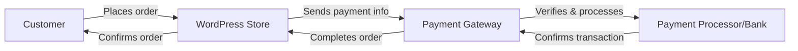

# WordPress Payment Gateways

## Introduction

Payment gateways are essential components of any e-commerce website, serving as the bridge between your online store and the financial institutions that process your customers' payments. For WordPress e-commerce sites, implementing reliable and secure payment gateways is crucial to business success.

In this guide, we'll explore how payment gateways work within the WordPress ecosystem, how to choose and integrate the right payment solutions for your store, and how to optimize the checkout experience for your customers.

## What Are Payment Gateways?

Payment gateways are services that authorize and process credit card payments or direct payments for online businesses. They act as intermediaries between your e-commerce store, your customers, and the various financial entities involved in a transaction.



## Types of Payment Gateways in WordPress

WordPress e-commerce sites typically utilize two primary types of payment gateways:

1. **On-site (Direct) Payment Gateways**: The customer completes the entire payment process on your website.
   - Advantages: Seamless user experience, no redirection
   - Examples: Stripe, Authorize.net, Braintree

2. **Off-site (Redirect) Payment Gateways**: The customer is redirected to the payment provider's site to complete the payment.
   - Advantages: Lower security burden on your site, trusted third-party handling
   - Examples: PayPal Standard, Amazon Pay, 2Checkout

## Popular WordPress Payment Gateway Plugins

### WooCommerce Payment Gateways

[WooCommerce](https://woocommerce.com/) is the most popular e-commerce platform for WordPress, and it comes with several built-in payment options:

1. **Direct Bank Transfer**
2. **Check Payment**
3. **Cash on Delivery**
4. **PayPal Standard**
5. **Stripe** (via extension)

### Other Popular Payment Gateway Plugins

- **PayPal for WooCommerce**
- **Stripe for WooCommerce**
- **Square for WooCommerce**
- **Amazon Pay**
- **Authorize.net**
- **2Checkout**
- **Mollie**

## Setting Up a Payment Gateway in WooCommerce

Let's walk through setting up two of the most common payment gateways in WooCommerce: PayPal and Stripe.

### Setting Up PayPal Standard

1. Navigate to **WooCommerce > Settings > Payments**
2. Find PayPal and click the **Manage** button
3. Enable the gateway by checking the "Enable PayPal Standard" box
4. Enter your PayPal email address
5. Configure additional settings as needed

Here's what the basic configuration looks like in code:

```php
// This would typically be handled through the WooCommerce admin UI
// but can be modified programmatically if needed
add_filter('woocommerce_paypal_args', 'customize_paypal_settings', 10, 2);

function customize_paypal_settings($args, $order) {
    // Modify PayPal arguments if needed
    $args['bn'] = 'My-Store-Name';
    
    return $args;
}
```

### Setting Up Stripe

1. First, install the Stripe for WooCommerce plugin:

```bash
# Using WP-CLI (if available on your server)
wp plugin install woocommerce-gateway-stripe --activate
```

2. Navigate to **WooCommerce > Settings > Payments**
3. Find Stripe and click the **Manage** button
4. Enable the gateway and enter your API keys

```php
// Example of programmatically modifying Stripe settings
// (Usually done through the admin interface)
add_filter('woocommerce_gateway_stripe_settings', 'customize_stripe_settings');

function customize_stripe_settings($settings) {
    // Enable test mode for development
    $settings['testmode'] = 'yes';
    
    // Custom statement descriptor
    $settings['statement_descriptor'] = 'My Awesome Store';
    
    return $settings;
}
```

## Advanced Payment Gateway Integration

For more complex scenarios, you might need to create custom payment gateways or extend existing ones.

### Creating a Custom Payment Gateway

Here's a simplified example of creating a basic custom payment gateway for WooCommerce:

```php
/**
 * Custom Payment Gateway
 */
add_action('plugins_loaded', 'initialize_custom_gateway');

function initialize_custom_gateway() {
    if (!class_exists('WC_Payment_Gateway')) {
        return;
    }

    class WC_Custom_Payment_Gateway extends WC_Payment_Gateway {
        public function __construct() {
            $this->id = 'custom_gateway';
            $this->method_title = 'Custom Payment Gateway';
            $this->method_description = 'A custom payment gateway for demonstration';
            $this->has_fields = true;
            
            // Initialize form fields and settings
            $this->init_form_fields();
            $this->init_settings();
            
            // Define user-set variables
            $this->title = $this->get_option('title');
            $this->description = $this->get_option('description');
            
            // Actions
            add_action('woocommerce_update_options_payment_gateways_' . $this->id, array($this, 'process_admin_options'));
        }
        
        public function init_form_fields() {
            $this->form_fields = array(
                'enabled' => array(
                    'title' => 'Enable/Disable',
                    'type' => 'checkbox',
                    'label' => 'Enable Custom Payment Gateway',
                    'default' => 'no'
                ),
                'title' => array(
                    'title' => 'Title',
                    'type' => 'text',
                    'description' => 'This controls the title which the user sees during checkout.',
                    'default' => 'Custom Payment',
                    'desc_tip' => true,
                ),
                'description' => array(
                    'title' => 'Description',
                    'type' => 'textarea',
                    'description' => 'Payment method description that the customer will see on your checkout.',
                    'default' => 'Pay using our custom payment method.',
                )
            );
        }
        
        public function process_payment($order_id) {
            $order = wc_get_order($order_id);
            
            // Mark as on-hold (we're awaiting the payment)
            $order->update_status('on-hold', __('Awaiting custom payment', 'woocommerce'));
            
            // Reduce inventory
            wc_reduce_stock_levels($order_id);
            
            // Remove cart
            WC()->cart->empty_cart();
            
            // Return thankyou redirect
            return array(
                'result' => 'success',
                'redirect' => $this->get_return_url($order)
            );
        }
    }

    // Add to WooCommerce payment gateways
    add_filter('woocommerce_payment_gateways', 'add_custom_gateway_class');
    
    function add_custom_gateway_class($methods) {
        $methods[] = 'WC_Custom_Payment_Gateway';
        return $methods;
    }
}
```

This is a basic implementation and would need additional logic for actual payment processing.

## Security Considerations

When implementing payment gateways, security should be your top priority:

1. **SSL Certificate**: Always use HTTPS for your entire checkout process.

```php
// Force SSL on checkout pages
add_action('template_redirect', 'force_ssl_on_checkout');

function force_ssl_on_checkout() {
    if (!is_ssl() && is_checkout()) {
        wp_redirect('https://' . $_SERVER['HTTP_HOST'] . $_SERVER['REQUEST_URI'], 301);
        exit();
    }
}
```

2. **PCI Compliance**: When possible, use payment gateways that handle card data directly to minimize your PCI compliance burden.

3. **Regular Updates**: Keep your WordPress, WooCommerce, and payment gateway plugins updated.

```php
// Example of checking for outdated plugins
add_action('admin_notices', 'check_payment_gateway_versions');

function check_payment_gateway_versions() {
    if (is_plugin_active('woocommerce-gateway-stripe/woocommerce-gateway-stripe.php')) {
        // Check if version is outdated and display warning
        // Implementation would depend on how you track versions
    }
}
```

## Optimizing the Checkout Experience

Here are some best practices for optimizing your payment process:

1. **Multiple Payment Options**: Offer several payment methods to accommodate customer preferences.

2. **Streamlined Checkout**: Minimize the number of steps in your checkout process.

3. **Clear Error Messages**: Provide understandable error messages when payment issues occur.

```php
// Example of customizing payment error messages
add_filter('woocommerce_gateway_stripe_process_payment_error', 'customize_stripe_error_message', 10, 2);

function customize_stripe_error_message($error_message, $error) {
    if (strpos($error_message, 'card was declined') !== false) {
        return 'Your card was declined. Please check your card details or try a different payment method.';
    }
    return $error_message;
}
```

4. **Mobile Optimization**: Ensure your checkout works well on mobile devices.

## Testing Payment Gateways

Before going live, thoroughly test your payment gateways:

1. **Sandbox/Test Mode**: Most payment gateways offer sandbox environments for testing.

```php
// Example of checking if Stripe is in test mode
add_action('admin_notices', 'check_stripe_test_mode');

function check_stripe_test_mode() {
    $stripe_settings = get_option('woocommerce_stripe_settings', array());
    
    if (isset($stripe_settings['testmode']) && $stripe_settings['testmode'] === 'yes' && !is_admin()) {
        echo '<div class="notice notice-warning"><p>Stripe is currently in test mode. Real payments will not be processed.</p></div>';
    }
}
```

2. **Test Cards**: Use test card numbers provided by payment gateways.

   - Stripe Test Card: `4242 4242 4242 4242` (Visa)
   - PayPal Sandbox: Create test accounts through the PayPal Developer site

3. **End-to-End Testing**: Walk through the entire purchase process multiple times.

## Handling Payment Failures and Disputes

Despite best efforts, payment issues can occur. Here's how to handle them:

1. **Failed Payments**: Implement a system to automatically notify customers of failed payments.

```php
// Example of handling failed payments
add_action('woocommerce_order_status_failed', 'notify_customer_payment_failed');

function notify_customer_payment_failed($order_id) {
    $order = wc_get_order($order_id);
    $mailer = WC()->mailer();
    
    $subject = 'Payment failed for your order #' . $order->get_order_number();
    $message = 'Unfortunately, your payment for order #' . $order->get_order_number() . ' has failed. Please try again or contact us for assistance.';
    
    $mailer->send($order->get_billing_email(), $subject, $message);
}
```

2. **Payment Disputes**: Create a clear process for handling payment disputes or chargebacks.

## Real-World Example: Subscription Payments

Let's explore how to implement recurring payments using WooCommerce Subscriptions with Stripe:

1. Install and activate the WooCommerce Subscriptions plugin
2. Configure Stripe as a payment gateway that supports subscriptions

```php
// Example of customizing subscription renewal
add_filter('woocommerce_subscriptions_renewal_order_data', 'customize_renewal_order_data', 10, 3);

function customize_renewal_order_data($renewal_order_data, $original_order, $subscription) {
    // Add custom meta to renewal orders
    $renewal_order_data['custom_meta_data'] = array(
        'subscription_id' => $subscription->get_id(),
        'renewal_count' => $subscription->get_payment_count()
    );
    
    return $renewal_order_data;
}
```

3. Create a subscription product in WooCommerce:
   - Go to Products > Add New
   - Set up a product as usual
   - In the Product Data section, select "Simple subscription"
   - Set the subscription price, period, and other details

## Summary

Payment gateways are critical components of any WordPress e-commerce site. By understanding how they work and implementing them correctly, you can provide a secure and smooth purchasing experience for your customers.

Key takeaways from this guide:

1. Choose payment gateways that suit your business needs and customer preferences
2. Prioritize security with SSL encryption and PCI compliance
3. Test thoroughly before going live
4. Optimize the checkout experience for conversions
5. Have systems in place to handle payment failures and disputes

## Additional Resources

- [WooCommerce Payment Gateway Documentation](https://docs.woocommerce.com/document/payment-gateways/)
- [Stripe API Documentation](https://stripe.com/docs/api)
- [PayPal Developer Documentation](https://developer.paypal.com/docs/api/overview/)

## Exercises

1. **Basic**: Set up a test WooCommerce store with PayPal Standard and place a test order.
2. **Intermediate**: Implement Stripe with custom error handling and test various payment scenarios.
3. **Advanced**: Create a simple custom payment gateway plugin for a specific payment method not covered by existing plugins.
4. **Expert**: Implement a subscription-based product with recurring payments and build a custom dashboard for subscription management.

By mastering WordPress payment gateways, you'll be well on your way to building successful e-commerce sites that can securely process transactions and provide an excellent customer experience.