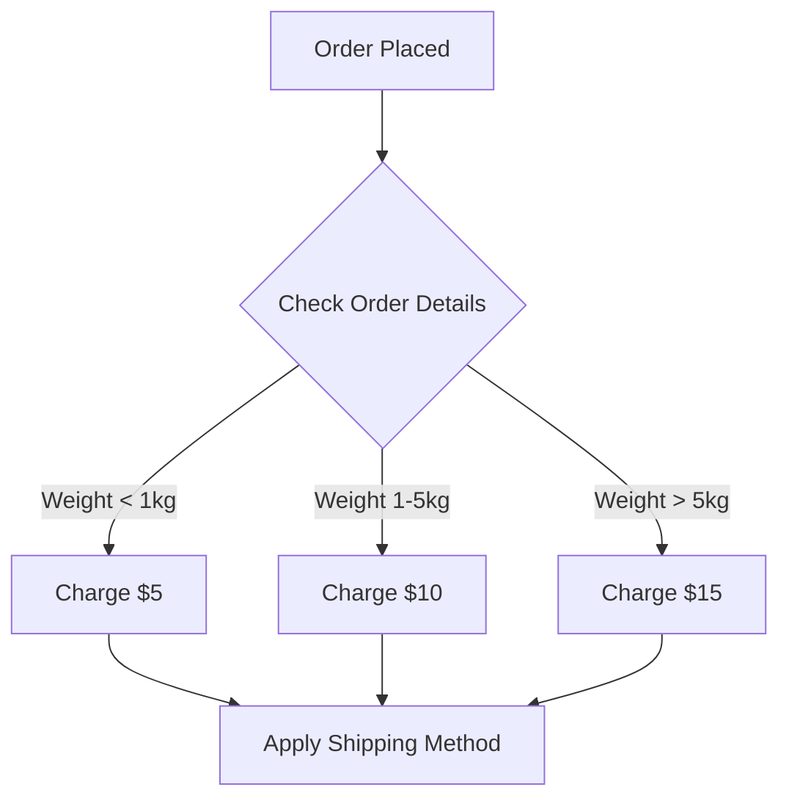
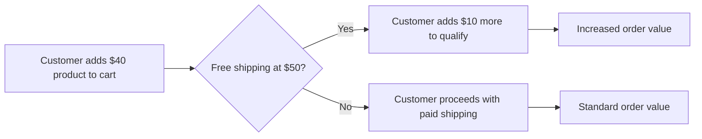

# WordPress Shipping Methods

## Introduction

Shipping is a crucial aspect of any e-commerce store. Properly configured shipping methods not only help you manage your logistics effectively but also significantly impact your customers' shopping experience. In WordPress, particularly with WooCommerce, you have access to various shipping options that can be tailored to meet your business needs.

This guide will walk you through the different shipping methods available in WordPress e-commerce, how to set them up, and best practices for optimizing your shipping strategy to enhance customer satisfaction and increase conversions.

## Understanding Shipping Zones

Before diving into specific shipping methods, it's important to understand shipping zones in WooCommerce.

Shipping zones are geographical regions where specific shipping methods are available. By setting up shipping zones, you can offer different shipping options to customers based on their location.

### Setting Up Shipping Zones

1. Navigate to WooCommerce > Settings > Shipping
2. Click on "Add shipping zone"
3. Define the zone by giving it a name and specifying regions
4. Add shipping methods to the zone

Here's how a basic shipping zone configuration looks in the WooCommerce dashboard:

```javascript
// This is not actual code but represents the data structure behind shipping zones
const shippingZone = {
  name: "United States",
  regions: ["US"],
  shippingMethods: [
    {
      id: "flat_rate",
      title: "Flat Rate",
      cost: 5.99
    },
    {
      id: "free_shipping",
      title: "Free Shipping",
      requires: "min_order_amount",
      minOrderAmount: 50
    }
  ]
};
```

## Common Shipping Methods in WooCommerce

WooCommerce comes with several built-in shipping methods that you can enable and customize for your store:

### 1. Flat Rate Shipping

Flat rate shipping applies a fixed rate to all orders or specific products, regardless of quantity or weight.

#### Setting Up Flat Rate Shipping:

1. Go to WooCommerce > Settings > Shipping
2. Select a shipping zone or create a new one
3. Click "Add shipping method" and select "Flat rate"
4. Configure the shipping method:

```php
// Example of how flat rate costs can be calculated programmatically
// This is typically handled through the admin UI, but shows the logic
function calculate_flat_rate_cost($package) {
    $base_cost = 5; // Base shipping cost
    $per_item_cost = 2; // Cost per item
    $item_count = count($package['contents']);
    
    return $base_cost + ($per_item_cost * $item_count);
}
```

#### Advanced Flat Rate Configuration

You can use cost calculation formulas to create more dynamic flat rates:

- `[qty]` - Cart quantity
- `[cost]` - Cart cost
- `[fee]` - Additional fee

Example: `10 + ([qty] * 2)` would charge $10 plus $2 per item.

### 2. Free Shipping

Free shipping is a powerful promotional tool that can increase conversion rates.

#### Setting Up Free Shipping:

1. Go to WooCommerce > Settings > Shipping
2. Select a shipping zone
3. Add "Free shipping" method
4. Configure when free shipping should be available:
   - Always available
   - When a minimum order amount is reached
   - When a coupon is applied

```php
// Sample logic for free shipping eligibility check
function is_eligible_for_free_shipping($order_total, $has_coupon = false) {
    $min_amount = 50; // Minimum order amount for free shipping
    
    if ($has_coupon) {
        return true;
    }
    
    if ($order_total >= $min_amount) {
        return true;
    }
    
    return false;
}
```

### 3. Local Pickup

Local pickup allows customers to pick up their orders directly from your location.

#### Setting Up Local Pickup:

1. Go to WooCommerce > Settings > Shipping
2. Select a shipping zone
3. Add "Local pickup" method
4. Configure the pickup details:
   - Title (e.g., "Store Pickup")
   - Cost (can be free or charged)
   - Pickup instructions

When enabled, customers will see this option during checkout:

```html
<div class="shipping-method">
  <input type="radio" name="shipping_method" id="shipping_method_local_pickup" value="local_pickup" />
  <label for="shipping_method_local_pickup">Store Pickup - Free</label>
  <p class="description">You can pick up your order from our store at 123 Main Street during business hours.</p>
</div>
```

## Table Rate Shipping

Table rate shipping allows for more complex shipping rules based on multiple conditions. While not included in the core WooCommerce plugin, it's available as an extension.

### Using the Table Rate Shipping Extension

With table rate shipping, you can set rates based on:

- Weight
- Price
- Item count
- Shipping class
- Destination

Here's an example of how table rate shipping might be structured:



## Integrating Third-Party Shipping Carriers

WooCommerce can integrate with major shipping carriers to provide real-time shipping quotes.

### Popular Shipping Carrier Integrations

1. **USPS**: United States Postal Service
2. **UPS**: United Parcel Service
3. **FedEx**: Federal Express
4. **DHL**: DHL Express

### Example: Setting Up USPS Integration

1. Install the WooCommerce USPS Shipping plugin
2. Go to WooCommerce > Settings > Shipping > USPS
3. Enter your USPS Web Tools User ID
4. Configure which USPS services to offer

```php
// Example of how shipping API integration works behind the scenes
function get_usps_shipping_rates($package) {
    $weight = calculate_package_weight($package);
    $destination_zip = $package['destination']['postcode'];
    
    $api_url = "https://secure.shippingapis.com/ShippingAPI.dll";
    $api_params = [
        'API' => 'RateV4',
        'XML' => generate_rate_request_xml($weight, $destination_zip)
    ];
    
    $response = wp_remote_post($api_url, [
        'body' => $api_params
    ]);
    
    return parse_usps_response($response);
}
```

## Shipping Classes

Shipping classes allow you to group products with similar shipping requirements.

### Creating Shipping Classes

1. Go to WooCommerce > Settings > Shipping > Shipping classes
2. Add a new shipping class (e.g., "Bulky Items", "Fragile Items")
3. Assign products to these shipping classes

Once created, you can set specific shipping costs for each shipping class within your shipping methods.

Example of assigning a shipping class to a product programmatically:

```php
// Assign a product to a shipping class
function assign_shipping_class($product_id, $shipping_class_slug) {
    $term = get_term_by('slug', $shipping_class_slug, 'product_shipping_class');
    
    if ($term) {
        wp_set_object_terms($product_id, $term->term_id, 'product_shipping_class');
        
        // If it's a variable product, assign to all variations
        $product = wc_get_product($product_id);
        if ($product->is_type('variable')) {
            $variations = $product->get_children();
            foreach ($variations as $variation_id) {
                wp_set_object_terms($variation_id, $term->term_id, 'product_shipping_class');
            }
        }
    }
}
```

## Best Practices for WordPress E-commerce Shipping

### 1. Offer Multiple Shipping Options

Provide customers with choices to accommodate different needs:
- Economy shipping for price-conscious customers
- Express shipping for those who need items quickly
- Local pickup for nearby customers

### 2. Display Shipping Costs Early

Show shipping costs before the checkout step to reduce cart abandonment:

```php
// Example function to show shipping estimate on cart page
function display_shipping_estimate_on_cart() {
    $packages = WC()->cart->get_shipping_packages();
    $package = reset($packages);
    $zone = wc_get_shipping_zone(WC_Shipping_Zones::get_zone_matching_package($package));
    
    echo '<div class="shipping-estimate">';
    echo '<h4>Estimated Shipping</h4>';
    
    foreach ($zone->get_shipping_methods(true) as $method) {
        $rate = $method->get_rate();
        echo '<p>' . esc_html($method->get_title()) . ': ' . wc_price($rate) . '</p>';
    }
    
    echo '</div>';
}
```

### 3. Set Up Shipping Rules Carefully

Incorrect shipping configurations can lead to lost revenue or customer dissatisfaction. Always test your shipping settings before going live.

### 4. Consider Free Shipping Thresholds

Free shipping with a minimum order value can increase average order value:



### 5. Communicate Shipping Information Clearly

Add shipping information to your product pages and FAQs:

```php
// Add shipping information to product pages
function add_shipping_info_to_product_page() {
    echo '<div class="product-shipping-info">';
    echo '<h4>Shipping Information</h4>';
    echo '<p>Orders typically ship within 24 hours.</p>';
    echo '<p>Free shipping on orders over $50!</p>';
    echo '</div>';
}
add_action('woocommerce_after_add_to_cart_form', 'add_shipping_info_to_product_page');
```

## Troubleshooting Common Shipping Issues

### Issue 1: Shipping Methods Not Showing at Checkout

Possible causes:
- Incorrectly configured shipping zones
- Customer's address doesn't match any zone
- Product weight/dimensions not set

Solution:
```php
// Debug shipping methods availability
function debug_shipping_methods() {
    if (is_checkout()) {
        $packages = WC()->shipping->get_packages();
        
        echo '<pre style="display: none;">';
        echo 'Customer Package: ';
        print_r($packages);
        
        echo 'Available Methods: ';
        print_r(WC()->shipping->get_shipping_methods());
        echo '</pre>';
    }
}
add_action('wp_footer', 'debug_shipping_methods');
```

### Issue 2: Incorrect Shipping Calculations

If shipping costs are incorrectly calculated:
1. Verify product weights and dimensions
2. Check shipping zone configurations
3. Test with different addresses and cart compositions

## Advanced Shipping Solutions

For more complex shipping needs, consider these options:

### 1. Shipping Extensions

- WooCommerce Distance Rate Shipping
- WooCommerce Advanced Shipping
- Flexible Shipping

### 2. Custom Shipping Methods

You can create your own shipping methods with a custom plugin:

```php
<?php
/**
 * Plugin Name: My Custom Shipping Method
 * Description: Adds a custom shipping method to WooCommerce
 */

// Make sure WooCommerce is active
if (!in_array('woocommerce/woocommerce.php', apply_filters('active_plugins', get_option('active_plugins')))) {
    return;
}

function add_custom_shipping_method($methods) {
    $methods['custom_shipping'] = 'WC_Custom_Shipping_Method';
    return $methods;
}
add_filter('woocommerce_shipping_methods', 'add_custom_shipping_method');

function custom_shipping_method_init() {
    if (!class_exists('WC_Custom_Shipping_Method')) {
        class WC_Custom_Shipping_Method extends WC_Shipping_Method {
            public function __construct($instance_id = 0) {
                $this->id = 'custom_shipping';
                $this->method_title = 'Custom Shipping';
                $this->method_description = 'A custom shipping method with special rules';
                $this->enabled = 'yes';
                $this->title = 'Special Delivery';
                
                $this->init();
                
                $this->instance_id = absint($instance_id);
                $this->supports = array(
                    'shipping-zones',
                    'instance-settings',
                );
            }
            
            function init() {
                $this->init_form_fields();
                $this->init_settings();
                
                add_action('woocommerce_update_options_shipping_' . $this->id, array($this, 'process_admin_options'));
            }
            
            function calculate_shipping($package = array()) {
                $rate = array(
                    'id' => $this->id,
                    'label' => $this->title,
                    'cost' => 15.00,
                );
                
                $this->add_rate($rate);
            }
        }
    }
}
add_action('woocommerce_shipping_init', 'custom_shipping_method_init');
```

## Summary

Setting up shipping methods in WordPress e-commerce is crucial for providing a seamless shopping experience. WooCommerce offers flexible options including flat rate, free shipping, and local pickup out of the box, while also supporting integrations with major carriers and custom shipping solutions.

To implement an effective shipping strategy:
1. Define your shipping zones based on your business reach
2. Select appropriate shipping methods for each zone
3. Configure shipping classes for products with special requirements
4. Consider strategic free shipping to increase conversion and average order value
5. Clearly communicate shipping costs and policies to customers

By carefully configuring your shipping options, you can balance operational efficiency with customer satisfaction, leading to increased sales and customer loyalty.

## Additional Resources

- [WooCommerce Shipping Documentation](https://docs.woocommerce.com/document/shipping/)
- [Setting Up Shipping Zones in WooCommerce](https://woocommerce.com/document/setting-up-shipping-zones/)
- [WooCommerce Shipping Methods Extension](https://woocommerce.com/product-category/woocommerce-extensions/shipping-methods/)

## Exercises

1. Set up a shipping zone for your country with at least two different shipping methods.
2. Create a shipping class for "Heavy Items" and configure special shipping rates for this class.
3. Implement a free shipping threshold of $75 and test that it works correctly.
4. Configure table rate shipping based on cart total with at least three rate brackets.
5. Add shipping information to your product pages to improve customer experience.