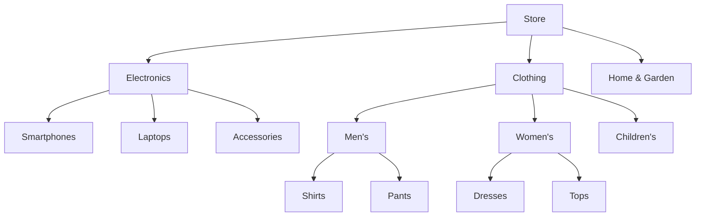

# WordPress Product Categories

## Introduction

Product categories are a fundamental component of any e-commerce website built with WordPress. They serve as a taxonomic system to organize your products logically, making it easier for customers to browse and find what they're looking for. Properly structured product categories can significantly enhance user experience, improve SEO, and increase sales conversion rates.

In this guide, you'll learn how to create, manage, and optimize product categories in WordPress e-commerce platforms, with a focus on WooCommerce - the most popular e-commerce plugin for WordPress.

## Understanding Product Categories in WordPress

Product categories in WordPress function similarly to blog post categories but are specifically designed for organizing products. They create a hierarchical structure that can include:

- Parent categories (main categories)
- Subcategories (child categories)
- Multiple levels of nesting for complex product catalogs

This taxonomy system helps both you and your customers navigate through your product offerings efficiently.

## Setting Up Product Categories in WooCommerce

### Prerequisites

Before getting started, make sure you have:

1. WordPress installed
2. WooCommerce plugin installed and activated
3. Admin access to your WordPress site

### Creating Your First Product Category

Let's start by creating a basic product category:

1. Navigate to your WordPress admin dashboard
2. Go to **Products** → **Categories**
3. You'll see a form on the left side for adding new categories

Here's how to fill out the category creation form:

```jsx
// Product Category Creation Fields
Name: Electronics         // The name displayed on your site
Slug: electronics         // URL-friendly version of the name
Parent Category: None     // Leave as "None" for top-level categories
Description: All electronic products including smartphones, laptops, and accessories.
```

Once you've filled out these fields, click the "Add New Product Category" button, and your category will be created.

### Adding a Category Thumbnail and Image

Category images help make your store more visually appealing and navigable:

```jsx
// After filling out the basic information fields:
Thumbnail: [Select image file]   // Displayed in category listings
Header Image: [Select image file] // Displayed at the top of the category page
```

### Creating Subcategories (Hierarchical Structure)

For organizing products more granularly, you can create subcategories:

```jsx
// Creating a subcategory
Name: Smartphones
Slug: smartphones
Parent Category: Electronics    // Select the parent category from dropdown
Description: All smartphone products including Android and iOS devices.
```

## Managing Product Categories

Once you've created your categories, you'll need to assign products to them and manage the category structure.

### Assigning Products to Categories

When creating or editing a product:

1. Go to **Products** → **All Products**
2. Select an existing product or add a new one
3. In the Product Data box, look for the "Product categories" panel on the right side
4. Check the box next to the category or categories you want to assign

```jsx
// Example Product Data Field
Product name: Samsung Galaxy S21
Regular price: 799.99
Sale price: 749.99
Product categories: [✓] Electronics
                    [✓] Smartphones
```

A single product can belong to multiple categories if needed.

### Reordering and Managing Categories

By default, WordPress displays categories alphabetically, but you can install plugins like "Category Order and Taxonomy Terms Order" to customize the display order.

### Bulk Editing Product Categories

To change categories for multiple products at once:

1. Go to **Products** → **All Products**
2. Select the products you want to modify
3. Choose "Edit" from the Bulk Actions dropdown
4. Click "Apply"
5. In the bulk edit panel, you can add or remove product categories

## Displaying Product Categories on Your Store

### Default Category Display

WooCommerce automatically creates archive pages for your categories that can be accessed at:

```
https://yourstore.com/product-category/category-slug/
```

### Customizing Category Display with Code

You can display custom category listings using the WooCommerce shortcode:

```jsx
// Basic category display shortcode
[product_categories]

// Customized category display
[product_categories number="4" columns="4" hide_empty="0"]
```

For more advanced customization, you can use the WordPress template system:

```php
<?php
// Display product categories in a custom template
$args = array(
    'taxonomy'     => 'product_cat',
    'orderby'      => 'name',
    'show_count'   => 1,
    'pad_counts'   => 0,
    'hierarchical' => 1,
    'title_li'     => '',
    'hide_empty'   => 0
);
$all_categories = get_categories( $args );

foreach ($all_categories as $cat) {
    if($cat->category_parent == 0) {
        $category_id = $cat->term_id;
        echo '<h2><a href="'. get_term_link($cat->slug, 'product_cat') .'">'.$cat->name.'</a></h2>';
        
        $args2 = array(
            'taxonomy'     => 'product_cat',
            'child_of'     => 0,
            'parent'       => $category_id,
            'orderby'      => 'name'
        );
        $sub_cats = get_categories( $args2 );
        
        if($sub_cats) {
            echo '<ul>';
            foreach($sub_cats as $sub_category) {
                echo '<li><a href="'.get_term_link($sub_category->slug, 'product_cat').'">'.$sub_category->name.'</a></li>';
            }
            echo '</ul>';
        }
    }
}
?>
```

### Using Category Widgets

WordPress and WooCommerce offer widgets for displaying product categories in your sidebar or other widget areas:

1. Go to **Appearance** → **Widgets**
2. Find the "Product Categories" widget
3. Drag it to your desired widget area
4. Configure the widget options (title, display type, show product counts, etc.)

## Advanced Category Features and Best Practices

### SEO Optimization for Categories

To optimize your categories for search engines:

1. Use descriptive, keyword-rich category names
2. Write unique, informative descriptions for each category
3. Use custom slugs that include relevant keywords
4. Add custom meta titles and descriptions using SEO plugins

### Category Restrictions and Visibility

You can control category visibility with plugins or custom code:

```php
// Example: Hide a specific category from the shop page but keep it accessible via direct link
add_filter( 'get_terms', 'ts_get_subcategory_terms', 10, 3 );
function ts_get_subcategory_terms( $terms, $taxonomies, $args ) {
  $hidden_term_ids = array(15); // Add your category IDs to hide
  
  if ( in_array( 'product_cat', $taxonomies ) && isset( $args['hide_empty'] ) && $args['hide_empty'] == 1 ) {
    foreach($terms as $key => $term){
      if(in_array($term->term_id, $hidden_term_ids)){
        unset($terms[$key]);
      }
    }
  }
  return $terms;
}
```

### Category URL Structure and Permalinks

Customize your category URL structure in WordPress:

1. Go to **Settings** → **Permalinks**
2. Choose your preferred permalink structure
3. For WooCommerce-specific settings, go to **WooCommerce** → **Settings** → **Products** → **Permalinks**

### Visualizing Your Category Structure

Here's a visualization of a common product category structure:



## Real-World Example: Building a Technology Store Category Structure

Let's walk through creating a practical category structure for an online technology store:

1. Create main categories:
   - Electronics
   - Computers
   - Software
   - Services

2. Add subcategories to Electronics:
   - Smartphones
   - Tablets
   - Audio & Headphones
   - Wearables

3. Add subcategories to Computers:
   - Laptops
   - Desktop PCs
   - Components
   - Peripherals

4. For the Components subcategory, add another level:
   - Graphics Cards
   - Processors
   - Memory
   - Storage

5. Assign products to appropriate categories and subcategories

This multi-level structure helps customers drill down to exactly what they're looking for.

## Troubleshooting Common Category Issues

### Categories Not Displaying Correctly

If your categories aren't displaying properly:

1. Check your theme's compatibility with WooCommerce
2. Verify that the categories aren't empty (some themes hide empty categories)
3. Check for plugin conflicts
4. Review your permalink structure

### Products Not Appearing in Categories

If products aren't showing up in assigned categories:

1. Make sure the product is published (not draft)
2. Verify the product is correctly assigned to the category
3. Check if the product is set to "visible" in catalog
4. Clear your site cache

### Too Many Categories Slowing Down Your Site

If you have many categories affecting performance:

1. Consider consolidating similar categories
2. Use subcategories more effectively
3. Implement caching solutions
4. Optimize your database regularly

## Summary

Product categories are essential for organizing your WordPress e-commerce store effectively. By creating a logical and user-friendly category structure, you can enhance navigation, improve SEO, and provide a better shopping experience for your customers.

Key takeaways:
- Create a hierarchical category structure with parent and child categories
- Use descriptive names and customize category images
- Assign products to relevant categories
- Optimize categories for SEO with proper descriptions and slugs
- Display categories strategically throughout your store

By mastering product categories in WordPress, you'll create a more organized and professional online store that's easier for customers to navigate and for you to manage.

## Additional Resources

- [WooCommerce Official Documentation on Product Categories](https://docs.woocommerce.com/document/managing-product-taxonomies/)
- [WordPress Codex on Taxonomies](https://codex.wordpress.org/Taxonomies)

## Exercises

1. Create a three-level category structure for a fictional clothing store with at least 5 main categories and appropriate subcategories.
2. Write custom code to display only the top 3 product categories with the most products on your homepage.
3. Create a custom category template that displays the category description, a featured image, and a grid of products.
4. Set up category-specific promotions where products in a certain category show a special banner or discount.