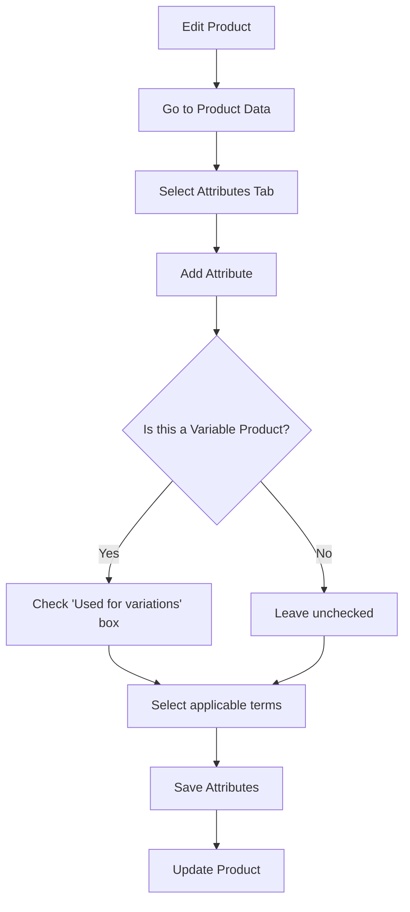

# WordPress Product Attributes

## Introduction

Product attributes are one of the most powerful yet often underutilized features in WordPress e-commerce platforms, particularly WooCommerce. They allow you to define specific characteristics of your products such as size, color, material, or any other feature that helps customers make informed purchasing decisions.

In this tutorial, we'll explore how product attributes work in WordPress, why they're essential for your e-commerce site, and how to implement them effectively to enhance your store's functionality and user experience.

## What Are Product Attributes?

Product attributes are specific characteristics or features that define your products. Think of them as the DNA of your product catalog - they help distinguish one product from another and provide valuable information to your customers.

For example, if you're selling t-shirts, attributes might include:
- Size (S, M, L, XL)
- Color (Red, Blue, Green)
- Material (Cotton, Polyester, Blend)
- Sleeve Type (Short sleeve, Long sleeve)

When properly implemented, attributes enable:
1. Better product filtering and searching
2. Creation of variable products
3. Enhanced product organization
4. Improved customer shopping experience

## Setting Up Product Attributes in WooCommerce

### Step 1: Accessing the Attributes Section

To begin working with product attributes, navigate to your WordPress admin dashboard:

1. Go to **Products** > **Attributes**
2. You'll see the main attributes management screen

### Step 2: Creating a New Attribute

Let's create a "Size" attribute for clothing products:

```js
// This is a conceptual representation, not actual code
// The following steps show the UI workflow

// Step 1: Enter attribute information
attributeName = "Size";
attributeSlug = "size";
enableArchives = true;
defaultSortOrder = "Custom ordering";

// Step 2: Click "Add attribute" button
```

After clicking "Add attribute", you'll see your new "Size" attribute appear in the attributes list.

### Step 3: Adding Terms to Your Attribute

Once you've created an attribute, you need to add terms (values) to it:

1. Click on the "Configure terms" link next to your newly created "Size" attribute
2. Add each size as a separate term:

```js
// For each term:
termName = "Small";
termSlug = "small"; // Optional - WooCommerce can generate this
termDescription = "Small size - fits chest 36-38 inches"; // Optional

// Click "Add new size" button
// Repeat for Medium, Large, etc.
```

### Step 4: Assigning Attributes to Products

Now that you've created your attributes and their terms, it's time to assign them to products:

1. Edit an existing product or create a new one
2. Scroll down to the "Product data" section
3. Click on the "Attributes" tab
4. Select your attribute from the dropdown
5. Click "Add"
6. Check the "Visible on the product page" option if you want customers to see it
7. Select the relevant terms that apply to this product
8. Click "Save attributes"

Here's a visual representation of the attribute assignment flow:



## Creating Variable Products with Attributes

One of the most powerful features of product attributes is the ability to create variable products. These are products that have different variations (like a t-shirt available in multiple colors and sizes).

### Step 1: Set Up the Main Product

1. Create a new product or edit an existing one
2. In the "Product data" dropdown, select "Variable product"
3. Set the general product information (name, description, main image)

### Step 2: Add Attributes for Variations

1. Go to the "Attributes" tab
2. Add your attributes (e.g., Size and Color)
3. Make sure to check "Used for variations" for each attribute
4. Select all applicable terms
5. Save attributes

### Step 3: Create Variations

1. Go to the "Variations" tab
2. From the dropdown, select "Create variations from all attributes" and click "Go"
3. This will create all possible combinations of your attributes
4. For each variation, you can set:
   - A different price
   - Different stock levels
   - A specific SKU
   - A unique image

Here's an example of how your PHP code might look when programmatically creating a variable product:

```php
// Example of programmatically creating a variable product
function create_variable_tshirt_product() {
    // Create the main product
    $product = new WC_Product_Variable();
    $product->set_name('Premium Cotton T-Shirt');
    $product->set_description('Our premium quality cotton t-shirt available in multiple colors and sizes.');
    $product->set_status('publish');
    $product->set_catalog_visibility('visible');
    $product->set_price(19.99);
    $product->set_regular_price(19.99);
    $product->save();
    
    // Get product ID
    $product_id = $product->get_id();
    
    // Set product attributes
    $attributes = array(
        'size' => array(
            'name' => 'Size',
            'value' => 'Small | Medium | Large | X-Large',
            'is_visible' => 1,
            'is_variation' => 1,
            'is_taxonomy' => 0
        ),
        'color' => array(
            'name' => 'Color',
            'value' => 'Red | Blue | Green | Black',
            'is_visible' => 1,
            'is_variation' => 1,
            'is_taxonomy' => 0
        )
    );
    
    // Set the attributes on the product
    update_post_meta($product_id, '_product_attributes', $attributes);
    
    // Creating variations
    $sizes = array('Small', 'Medium', 'Large', 'X-Large');
    $colors = array('Red', 'Blue', 'Green', 'Black');
    
    foreach ($sizes as $size) {
        foreach ($colors as $color) {
            $variation = new WC_Product_Variation();
            $variation->set_parent_id($product_id);
            $variation->set_attributes(array(
                'size' => $size,
                'color' => $color
            ));
            
            // Set some variation specific data
            $variation->set_regular_price(19.99);
            
            // Special price for large sizes
            if ($size == 'Large' || $size == 'X-Large') {
                $variation->set_regular_price(24.99);
            }
            
            // Limited stock for red items
            if ($color == 'Red') {
                $variation->set_manage_stock(true);
                $variation->set_stock_quantity(10);
            }
            
            $variation->save();
        }
    }
    
    return $product_id;
}
```

## Using Global vs. Custom Product Attributes

WooCommerce offers two types of attributes:

### 1. Global Attributes
- Created in Products > Attributes
- Can be used across multiple products
- Enable filtering in shop pages
- Ideal for consistent attributes across your store
- Work with layered navigation widgets

### 2. Custom (Local) Attributes
- Created directly on the product page
- Only apply to the specific product
- Cannot be used for filtering
- Useful for unique product features

### When to Use Each Type

Use **Global Attributes** when:
- The attribute applies to many products (like size, color)
- You want customers to filter products by this attribute
- You need to create variable products

Use **Custom Attributes** when:
- The attribute is unique to a specific product
- You don't need filtering capabilities
- You're adding supplementary information

## Enhancing the Shopping Experience with Attributes

### Creating Filter Widgets

One of the main benefits of global attributes is the ability to add filter widgets to your shop pages:

1. Go to **Appearance** > **Widgets**
2. Add the "Filter Products by Attribute" widget to your sidebar
3. Select which attribute to filter by
4. Configure display options (dropdown, list, etc.)
5. Save your changes

Your customers can now filter products based on attributes, making it easier to find exactly what they're looking for.

### Customizing Attribute Display on Product Pages

You can customize how attributes appear on your product pages using hooks and filters:

```php
// Add this to your theme's functions.php or a custom plugin
// Change the attribute label from "Color" to "Available Colors"
add_filter('woocommerce_attribute_label', 'custom_attribute_label', 10, 3);
function custom_attribute_label($label, $name, $product) {
    if ($name === 'color') {
        return 'Available Colors';
    }
    return $label;
}

// Customize how color attributes are displayed
add_filter('woocommerce_dropdown_variation_attribute_options_html', 'color_swatch_variation_attribute_options', 10, 2);
function color_swatch_variation_attribute_options($html, $args) {
    if ($args['attribute'] === 'pa_color') {
        // Create custom HTML for color swatches
        $options = $args['options'];
        $product = $args['product'];
        $attribute = $args['attribute'];
        $custom_html = '<div class="color-swatches">';
        
        foreach ($options as $option) {
            $term = get_term_by('slug', $option, $attribute);
            if ($term) {
                $color_code = get_term_meta($term->term_id, 'color_code', true);
                if (!$color_code) $color_code = '#ffffff'; // Default color
                
                $custom_html .= '<div class="color-swatch" data-value="' . esc_attr($option) . '"';
                $custom_html .= ' style="background-color:' . esc_attr($color_code) . ';">';
                $custom_html .= '</div>';
            }
        }
        
        $custom_html .= '</div>';
        return $custom_html;
    }
    return $html;
}
```

## Best Practices for Product Attributes

To get the most out of WordPress product attributes, follow these best practices:

1. **Be consistent**: Use the same attribute structure across similar products
2. **Use clear labels**: Make attribute names descriptive and easy to understand
3. **Don't overdo it**: Only include attributes that are relevant to customers
4. **Consider searchability**: Include important keywords in your attribute terms
5. **Group related products**: Use attributes to establish relationships between similar items
6. **Update regularly**: Keep attributes current with your inventory changes
7. **Test filtering**: Make sure your attribute filters work properly on the frontend
8. **Mobile optimization**: Ensure attribute dropdowns and filters work well on mobile devices

## Common Issues and Solutions

### Issue 1: Attributes Not Appearing in Filters

**Solution:**
- Make sure your attributes are set as "Global" attributes
- Check that they're marked as "Enable Archives" in the attribute settings
- Verify that your theme supports WooCommerce's filtering functionality

### Issue 2: Variable Product Dropdowns Not Working

**Solution:**
- Ensure you've checked "Used for variations" on the attribute
- Verify you've created variations for the product
- Check if all variations have been saved properly

### Issue 3: Too Many Variations Causing Slow Performance

**Solution:**
- Consider using Ajax-enabled variations (available in some themes)
- Only create necessary variations (avoid creating unused combinations)
- Use a caching plugin to improve performance
- Consider using a "product configurator" approach instead of variations

## Real-World Example: Building a Clothing Store

Let's put everything together in a real-world example of setting up attributes for a clothing store:

### Step 1: Plan Your Attribute Structure

For a clothing store, you might need these global attributes:
- Size (XS, S, M, L, XL, XXL)
- Color (Black, White, Red, Blue, Green, etc.)
- Material (Cotton, Polyester, Wool, etc.)
- Fit (Regular, Slim, Loose)
- Gender (Men, Women, Unisex)
- Season (Summer, Winter, All-season)

### Step 2: Create the Attributes and Terms

Create each attribute in Products > Attributes, then add the appropriate terms.

### Step 3: Set Up Product Categories

Before adding products, create categories like:
- T-shirts
- Jeans
- Dresses
- Jackets
- Accessories

### Step 4: Create Variable Products

Create your first variable product, for example, a t-shirt:
1. Add basic information (name, description, images)
2. Assign it to the "T-shirts" category
3. Select "Variable product" as the product type
4. Add attributes: Size, Color, Material
5. Generate variations for each combination
6. Set prices, stock status, and images for variations

### Step 5: Set Up Filtering Widgets

Add attribute filters to your shop sidebar to help customers easily find what they're looking for.

## Summary

Product attributes are an essential component of a well-organized WordPress e-commerce store. They help you create a structured product catalog, enable powerful filtering capabilities, and allow for the creation of variable products with multiple options.

By mastering product attributes in WordPress, you can:
- Improve your store's organization
- Enhance the customer shopping experience
- Reduce the time needed to manage your product catalog
- Increase conversions by helping customers find exactly what they want

Remember to plan your attribute structure carefully, be consistent in your implementation, and regularly review and update your attributes as your product range evolves.

## Additional Resources

- [WooCommerce Official Documentation on Product Attributes](https://docs.woocommerce.com/document/managing-product-taxonomies/)
- [Advanced Variations & Attributes Management Plugins](https://woocommerce.com/product-category/woocommerce-extensions/product-attributes/)

## Practice Exercises

1. **Basic Exercise**: Create a "Material" global attribute with at least 5 terms, then assign it to an existing product.

2. **Intermediate Exercise**: Create a variable product with Size and Color attributes, with at least 9 different variations.

3. **Advanced Exercise**: Write custom code to display color attributes as visual swatches instead of a dropdown on your product pages.

4. **Challenge**: Implement a custom filter that will show only products that match multiple attribute selections (for example, show only products that are both "Red" AND "Cotton").

With these skills, you're well on your way to creating a professional, user-friendly WordPress e-commerce store with well-structured product attributes!