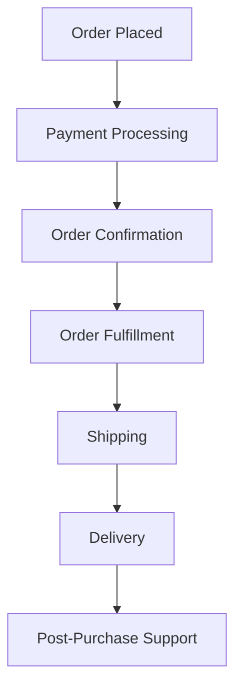

# WordPress Order Management

## Introduction

Order management is a critical component of any e-commerce operation. In WordPress e-commerce stores, particularly those running WooCommerce, an efficient order management system can mean the difference between a thriving business and one that struggles with logistics. This guide will walk you through the fundamentals of WordPress order management, providing you with the knowledge and tools to handle customer purchases effectively.

## Understanding the Order Management Lifecycle

Before diving into the technical aspects, it's important to understand the typical lifecycle of an order in a WordPress e-commerce store:



Each stage involves specific actions within your WordPress admin dashboard, most of which are handled through the WooCommerce plugin or similar e-commerce solutions.

## WooCommerce Orders Dashboard

The central hub for order management in WordPress with WooCommerce is the Orders dashboard. You can access it through your WordPress admin panel:

1. Log in to your WordPress admin dashboard
2. Navigate to WooCommerce → Orders

Here you'll find a comprehensive overview of all orders placed on your site, with capabilities to:

- View order details
- Process payments
- Update order statuses
- Generate invoices
- Handle refunds
- Export order data

## Order Statuses and Their Meaning

WooCommerce comes with several default order statuses that help track an order's progress:

| Status | Description |
|--------|-------------|
| Pending | Order received, awaiting payment |
| Processing | Payment received, stock reduced, ready for fulfillment |
| On-hold | Awaiting payment or stock confirmation |
| Completed | Order fulfilled and complete |
| Cancelled | Cancelled by admin or customer |
| Refunded | Refunded by admin |
| Failed | Payment failed or was declined |

### Managing Order Statuses

To change an order's status:

1. Go to WooCommerce → Orders
2. Click on the specific order
3. In the "Order Actions" meta box, select the new status
4. Click "Update"

## Handling Individual Orders

When you click on an individual order, you'll access a detailed order page containing all relevant information.

### Key Components of an Order Page

- Customer details (name, email, shipping/billing address)
- Order items and quantities
- Payment method and status
- Shipping method
- Order notes
- Order actions

### Adding Order Notes

Order notes are useful for tracking communication about an order:

```php
// Example code for programmatically adding an order note
$order = wc_get_order(123); // Replace 123 with the actual order ID
$note = 'Package shipped via USPS with tracking #123456789';
$is_customer_note = true; // Set to true if you want to send this note to the customer
$order->add_order_note($note, $is_customer_note);
$order->save();
```

When executed, this code adds a note to order #123 and optionally emails it to the customer if `$is_customer_note` is set to true.

## Bulk Order Management

For stores with high order volumes, individual order processing can become time-consuming. WooCommerce allows for bulk actions:

1. Select multiple orders by checking the boxes next to each order
2. From the "Bulk Actions" dropdown, select the action (e.g., "Change status to Processing")
3. Click "Apply"

## Setting Up Email Notifications

Email notifications keep customers informed about their order status. To configure these:

1. Go to WooCommerce → Settings → Emails
2. Here you can customize various automated emails sent to customers

You can modify the content of these emails by editing their templates. For customized emails, you might need to use a plugin or custom code.

## Custom Order Management Workflows

### Creating a Custom Order Status

Sometimes the default statuses aren't enough. Here's how to add a custom order status:

```php
// Add this code to your theme's functions.php or a custom plugin
add_action('init', 'register_awaiting_shipment_order_status');
function register_awaiting_shipment_order_status() {
    register_post_status('wc-awaiting-shipment', array(
        'label' => 'Awaiting Shipment',
        'public' => true,
        'exclude_from_search' => false,
        'show_in_admin_all_list' => true,
        'show_in_admin_status_list' => true,
        'label_count' => _n_noop('Awaiting shipment <span class="count">(%s)</span>',
            'Awaiting shipment <span class="count">(%s)</span>')
    ));
}

add_filter('wc_order_statuses', 'add_awaiting_shipment_to_order_statuses');
function add_awaiting_shipment_to_order_statuses($order_statuses) {
    $new_order_statuses = array();
    
    // Add new status after "Processing"
    foreach ($order_statuses as $key => $status) {
        $new_order_statuses[$key] = $status;
        if ($key === 'wc-processing') {
            $new_order_statuses['wc-awaiting-shipment'] = 'Awaiting Shipment';
        }
    }
    return $new_order_statuses;
}
```

After adding this code and refreshing your site, you'll see a new "Awaiting Shipment" status in your order management options.

### Automating Order Processing

For more efficiency, you can automate certain order processing tasks. Here's an example of automatically marking orders as "Completed" when using specific payment methods:

```php
add_action('woocommerce_payment_complete', 'auto_complete_paid_orders');
function auto_complete_paid_orders($order_id) {
    $order = wc_get_order($order_id);
    $payment_method = $order->get_payment_method();
    
    // Automatically complete orders paid with specific payment methods
    $auto_complete_for = array('bacs', 'cheque', 'cod');
    
    if (in_array($payment_method, $auto_complete_for) && $order->get_status() === 'processing') {
        $order->update_status('completed', 'Order automatically completed after payment verification.');
    }
}
```

## Order Management Reporting

WooCommerce provides built-in reports to monitor your order data:

1. Navigate to WooCommerce → Reports → Orders
2. View sales by date, product, or category
3. Track order counts and average order values

## Best Practices for WordPress Order Management

1. **Regular monitoring**: Check your orders dashboard daily to ensure timely processing
2. **Organized workflow**: Establish a systematic approach for handling different order statuses
3. **Clear communication**: Use order notes and email templates to keep customers informed
4. **Documentation**: Maintain records of special requests or issues with orders
5. **Backup**: Regularly back up your order data to prevent loss

## Advanced: Order Management with the REST API

WooCommerce provides a REST API for programmatic order management. Here's a simple example of retrieving orders via the API:

```php
// Example of using the WooCommerce REST API to fetch recent orders
require_once __DIR__ . '/vendor/autoload.php';

use Automattic\WooCommerce\Client;

$woocommerce = new Client(
    'https://your-website.com',
    'ck_your_consumer_key',
    'cs_your_consumer_secret',
    [
        'wp_api' => true,
        'version' => 'wc/v3'
    ]
);

try {
    // Get 10 most recent orders
    $orders = $woocommerce->get('orders', ['per_page' => 10]);
    
    foreach ($orders as $order) {
        echo "Order #{$order->id} - Total: {$order->total} - Status: {$order->status}\n";
    }
    
} catch (HttpClientException $e) {
    echo $e->getMessage();
}
```

This code snippet connects to the WooCommerce API and retrieves the 10 most recent orders.

## Enhancing Order Management with Plugins

While WooCommerce offers robust basic order management, plugins can extend functionality:

1. **ShipStation**: Connect your store to multiple shipping carriers
2. **Print Invoice & Delivery Notes**: Generate printable invoices and packing slips
3. **Order Export & Order Import**: Export and import orders in CSV format
4. **AutomateWoo**: Create automated workflows for orders
5. **Custom Order Status**: Add and manage custom order statuses

## Troubleshooting Common Order Issues

### Missing Orders

If orders aren't appearing in your dashboard:
1. Check if payment was actually completed
2. Verify that WooCommerce hooks are firing properly
3. Check for plugin conflicts
4. Review your server logs for errors

### Order Status Not Updating

If statuses are stuck:
1. Ensure you have proper permissions
2. Check for plugin conflicts
3. Try disabling caching temporarily
4. Verify webhook deliveries if using external services

## Summary

Effective order management is essential for running a successful WordPress e-commerce store. By understanding the order lifecycle, utilizing the built-in tools of WooCommerce, implementing custom workflows, and following best practices, you can create an order management system that enhances customer satisfaction and operational efficiency.

## Additional Resources

- [WooCommerce Documentation on Orders](https://docs.woocommerce.com/document/managing-orders/)
- [WordPress.org Plugin Directory](https://wordpress.org/plugins/) for additional order management plugins
- [WooCommerce REST API Documentation](https://woocommerce.github.io/woocommerce-rest-api-docs/) for advanced integrations

## Practice Exercises

1. Set up a custom order status for "Ready for Pickup" and implement it in your workflow.
2. Create a custom email template for when orders change to "Shipped" status.
3. Generate a report showing your top 5 highest-value orders from the past month.
4. Write a simple plugin that adds a "Priority Customer" flag to orders over a certain value.
5. Design an order processing workflow diagram for your specific business needs.

By mastering WordPress order management, you'll ensure your e-commerce operation runs smoothly, leading to satisfied customers and business growth.