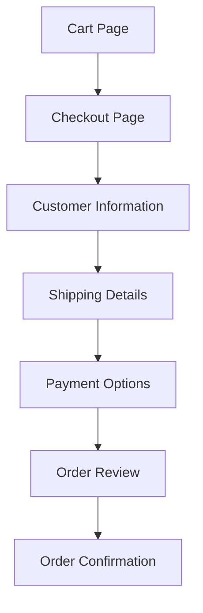

# WordPress Checkout Process

## Introduction

The checkout process is the most critical part of any e-commerce website. It's where customers finalize their purchases and make payments. A well-designed checkout process can significantly increase conversion rates, while a poorly implemented one can lead to abandoned carts and lost sales.

In this tutorial, we'll explore how to implement and customize a checkout process in WordPress using popular e-commerce plugins, with a focus on WooCommerce as it powers over 28% of all online stores worldwide. By the end, you'll have a solid understanding of how to create an effective, user-friendly checkout experience for your WordPress store.

## Understanding the Checkout Flow

Before diving into implementation details, let's understand the typical checkout flow in an e-commerce website:



Each step serves a specific purpose and requires careful consideration in its implementation.

## Setting Up WooCommerce Checkout

### Installation Prerequisites

Before customizing the checkout, make sure you have:

1. A WordPress website installed
2. WooCommerce plugin installed and activated
3. At least one product added to your store

### Basic Checkout Configuration

Let's start with configuring the basic checkout settings in WooCommerce:

1. Navigate to **WooCommerce > Settings > Advanced > Checkout**
2. Here you can set your checkout page and other fundamental options

```php
// You can also programmatically set the checkout page
update_option('woocommerce_checkout_page_id', 123); // Replace 123 with your page ID
```

### Default Checkout Pages

WooCommerce automatically creates several pages during installation:

- Cart
- Checkout
- My Account
- Shop

The checkout page uses the `[woocommerce_checkout]` shortcode to display the checkout form.

## Customizing the Checkout Form

### Adding and Removing Checkout Fields

WooCommerce provides several hooks to customize checkout fields:

```php
// Add a custom field to the checkout form
add_filter('woocommerce_checkout_fields', 'add_custom_checkout_field');

function add_custom_checkout_field($fields) {
    $fields['billing']['billing_business_name'] = array(
        'label'       => 'Business Name',
        'placeholder' => 'Your Business Name',
        'required'    => false,
        'class'       => array('form-row-wide'),
        'clear'       => true
    );
    return $fields;
}
```

To remove a field:

```php
// Remove phone field from checkout
add_filter('woocommerce_checkout_fields', 'remove_phone_field');

function remove_phone_field($fields) {
    unset($fields['billing']['billing_phone']);
    return $fields;
}
```

### Rearranging Checkout Fields

You can change the order of fields by modifying their priority:

```php
add_filter('woocommerce_checkout_fields', 'reorder_checkout_fields');

function reorder_checkout_fields($fields) {
    $fields['billing']['billing_email']['priority'] = 5;
    $fields['billing']['billing_first_name']['priority'] = 10;
    $fields['billing']['billing_last_name']['priority'] = 15;
    return $fields;
}
```

### Field Validation

Adding custom validation to checkout fields:

```php
add_action('woocommerce_checkout_process', 'custom_checkout_field_validation');

function custom_checkout_field_validation() {
    // Check if business name is entered for business customers
    if (isset($_POST['billing_customer_type']) && $_POST['billing_customer_type'] == 'business' && empty($_POST['billing_business_name'])) {
        wc_add_notice('Please enter your business name', 'error');
    }
}
```

## Payment Processing Integration

### Available Payment Gateways

WooCommerce comes with several built-in payment gateways:

- Direct bank transfer
- Check payments
- Cash on delivery
- PayPal Standard

Popular payment gateway plugins include:
- Stripe
- PayPal Pro
- Square
- Authorize.net

### Adding a Payment Gateway

To enable a payment gateway:

1. Navigate to **WooCommerce > Settings > Payments**
2. Toggle on the required payment methods
3. Click on each to configure their settings

For third-party gateways, install the respective plugin:

```php
// Example: How to register a custom payment gateway
add_filter('woocommerce_payment_gateways', 'add_custom_gateway');

function add_custom_gateway($gateways) {
    $gateways[] = 'WC_Gateway_Custom'; // Your custom gateway class
    return $gateways;
}
```

### Securing the Checkout Process

For payment security, consider:

1. Installing an SSL certificate on your site
2. Using PCI-compliant payment gateways
3. Implementing CAPTCHA to prevent fraud

```php
// Force SSL on checkout
add_action('template_redirect', 'force_ssl_on_checkout');

function force_ssl_on_checkout() {
    if (is_checkout() && !is_ssl()) {
        wp_redirect(str_replace('http:', 'https:', $_SERVER['REQUEST_URI']));
        exit;
    }
}
```

## Enhancing the User Experience

### One-Page vs. Multi-Step Checkout

WooCommerce, by default, offers a one-page checkout. However, some sites benefit from multi-step checkouts:

```php
// Simple way to enqueue a multi-step checkout script
add_action('wp_enqueue_scripts', 'enqueue_multistep_checkout');

function enqueue_multistep_checkout() {
    if (is_checkout()) {
        wp_enqueue_script('multistep-checkout', get_template_directory_uri() . '/js/multistep-checkout.js', array('jquery'), '1.0', true);
        wp_enqueue_style('multistep-checkout-style', get_template_directory_uri() . '/css/multistep-checkout.css');
    }
}
```

### Cart Abandonment Recovery

Implementing cart abandonment recovery:

```php
// Simplified example to capture email early in checkout
add_action('woocommerce_before_checkout_form', 'capture_email_field');

function capture_email_field() {
    echo '<div class="email-capture">';
    echo '<p>Enter your email to save your cart:</p>';
    echo '<input type="email" id="early_email" name="early_email" />';
    echo '<button type="button" id="save_cart">Save My Cart</button>';
    echo '</div>';
    
    // You would also need JavaScript to handle the AJAX submission
}
```

### Order Receipt and Confirmation

Customizing the thank you page:

```php
add_action('woocommerce_thankyou', 'custom_thankyou_message');

function custom_thankyou_message($order_id) {
    $order = wc_get_order($order_id);
    
    echo '<div class="custom-thank-you">';
    echo '<h2>Thank you for your purchase, ' . $order->get_billing_first_name() . '!</h2>';
    echo '<p>Your order #' . $order->get_order_number() . ' has been received and is being processed.</p>';
    echo '</div>';
}
```

## Practical Example: Building a Streamlined Checkout

Let's implement a practical example of a streamlined checkout process with custom fields, optimized UX, and Google Analytics integration:

### Step 1: Add Custom Fields and Optimize Layout

Create a new file in your theme called `custom-checkout-functions.php` and include it in your `functions.php`:

```php
// In functions.php
require_once get_template_directory() . '/custom-checkout-functions.php';
```

In the custom-checkout-functions.php file:

```php
<?php
// Add custom fields and reorder checkout fields
add_filter('woocommerce_checkout_fields', 'optimize_checkout_fields');

function optimize_checkout_fields($fields) {
    // Add a how did you hear about us field
    $fields['billing']['billing_source'] = array(
        'label'       => 'How did you hear about us?',
        'placeholder' => 'Select an option',
        'required'    => false,
        'class'       => array('form-row-wide'),
        'clear'       => true,
        'type'        => 'select',
        'options'     => array(
            ''        => 'Select an option',
            'search'  => 'Search Engine',
            'social'  => 'Social Media',
            'friend'  => 'Friend Referral',
            'other'   => 'Other'
        ),
        'priority'    => 120
    );
    
    // Make phone optional
    $fields['billing']['billing_phone']['required'] = false;
    
    // Remove company field unless B2B option is selected
    unset($fields['billing']['billing_company']);
    
    return $fields;
}

// Add B2B toggle with conditional fields
add_action('woocommerce_before_checkout_billing_form', 'add_b2b_toggle');

function add_b2b_toggle($checkout) {
    echo '<div class="b2b-toggle">';
    woocommerce_form_field('is_b2b', array(
        'type'        => 'checkbox',
        'class'       => array('b2b-checkbox'),
        'label'       => 'Purchasing for a business?',
    ), $checkout->get_value('is_b2b'));
    echo '</div>';
    
    echo '<div class="b2b-fields" style="display: none;">';
    woocommerce_form_field('billing_company', array(
        'label'       => 'Company Name',
        'placeholder' => 'Your Company Name',
        'required'    => false,
        'class'       => array('form-row-wide'),
        'clear'       => true
    ), $checkout->get_value('billing_company'));
    
    woocommerce_form_field('billing_vat', array(
        'label'       => 'VAT Number',
        'placeholder' => 'Your VAT/Tax ID',
        'required'    => false,
        'class'       => array('form-row-wide'),
        'clear'       => true
    ), $checkout->get_value('billing_vat'));
    echo '</div>';
    
    // Add JavaScript to toggle B2B fields visibility
    ?>
    <script type="text/javascript">
        jQuery(document).ready(function($) {
            $('#is_b2b').change(function() {
                if ($(this).is(':checked')) {
                    $('.b2b-fields').show();
                } else {
                    $('.b2b-fields').hide();
                }
            });
            // Run on page load
            if ($('#is_b2b').is(':checked')) {
                $('.b2b-fields').show();
            }
        });
    </script>
    <?php
}
```

### Step 2: Implement Progress Indicator

Add a progress indicator to the checkout page:

```php
add_action('woocommerce_before_checkout_form', 'add_checkout_progress_bar', 5);

function add_checkout_progress_bar() {
    echo '<div class="checkout-progress-wrapper">';
    echo '<ul class="checkout-progress-bar">';
    echo '<li class="active">Customer Information</li>';
    echo '<li>Shipping Details</li>';
    echo '<li>Payment</li>';
    echo '<li>Confirm Order</li>';
    echo '</ul>';
    echo '</div>';
}
```

Add the corresponding CSS to your theme's stylesheet:

```css
/* Add this to your stylesheet */
.checkout-progress-wrapper {
    margin-bottom: 30px;
}

.checkout-progress-bar {
    display: flex;
    justify-content: space-between;
    list-style-type: none;
    padding: 0;
    margin: 0;
}

.checkout-progress-bar li {
    flex: 1;
    text-align: center;
    padding: 10px;
    background-color: #f5f5f5;
    border-right: 1px solid #ddd;
    position: relative;
}

.checkout-progress-bar li:last-child {
    border-right: none;
}

.checkout-progress-bar li.active {
    background-color: #4CAF50;
    color: white;
}

.checkout-progress-bar li.active:after {
    content: '';
    position: absolute;
    bottom: -10px;
    left: 50%;
    margin-left: -10px;
    border-width: 10px 10px 0;
    border-style: solid;
    border-color: #4CAF50 transparent transparent transparent;
}
```

### Step 3: Add Google Analytics Enhanced Ecommerce Tracking

```php
add_action('wp_head', 'add_checkout_tracking');

function add_checkout_tracking() {
    if (!is_checkout()) return;
    
    ?>
    <!-- Google Analytics Enhanced Ecommerce -->
    <script>
    window.addEventListener('load', function() {
        jQuery(document).ready(function($) {
            // Track checkout steps
            gtag('event', 'begin_checkout', {
                'items': getCartItems(),
                'coupon': getCouponCode()
            });
            
            // Track when shipping method is selected
            $(document.body).on('updated_shipping_method', function() {
                gtag('event', 'set_checkout_option', {
                    'checkout_step': 2,
                    'checkout_option': 'shipping_method',
                    'value': getSelectedShippingMethod()
                });
            });
            
            // Track when payment method is selected
            $('form.checkout').on('change', 'input[name^="payment_method"]', function() {
                gtag('event', 'set_checkout_option', {
                    'checkout_step': 3,
                    'checkout_option': 'payment_method',
                    'value': $('input[name^="payment_method"]:checked').val()
                });
            });
            
            // Helper functions would be defined here
            function getCartItems() {
                // Code to get cart items in GA format
                return [];
            }
            
            function getCouponCode() {
                // Code to get coupon code
                return '';
            }
            
            function getSelectedShippingMethod() {
                // Code to get selected shipping method
                return $('input[name^="shipping_method"]:checked').val() || '';
            }
        });
    });
    </script>
    <?php
}
```

## Optimizing Checkout for Conversions

### Best Practices for Checkout Optimization

1. **Minimize Form Fields**: Only ask for essential information
2. **Show Progress**: Use visual indicators to show checkout progress
3. **Guest Checkout**: Always offer guest checkout option
4. **Trust Signals**: Display security badges, guarantees, and testimonials
5. **Mobile Optimization**: Ensure smooth checkout on all devices

### A/B Testing Checkout Variations

```php
// Simple A/B test implementation for checkout layouts
add_action('wp_head', 'checkout_ab_test');

function checkout_ab_test() {
    if (!is_checkout()) return;
    
    // Get or set user's test variant
    if (!isset($_COOKIE['checkout_variant'])) {
        $variant = rand(0, 1) ? 'A' : 'B';
        setcookie('checkout_variant', $variant, time() + (30 * DAY_IN_SECONDS), '/');
    } else {
        $variant = $_COOKIE['checkout_variant'];
    }
    
    // Apply variant-specific CSS/JS
    if ($variant == 'A') {
        // Standard layout (default)
    } else {
        // Test variant - e.g., different layout
        echo '<style>
            .woocommerce-billing-fields, .woocommerce-shipping-fields {
                float: left;
                width: 48%;
            }
            .woocommerce-billing-fields {
                margin-right: 4%;
            }
            #order_review {
                clear: both;
                padding-top: 20px;
            }
        </style>';
    }
    
    // Track which variant is being shown
    ?>
    <script>
    window.addEventListener('load', function() {
        if (typeof gtag === 'function') {
            gtag('event', 'checkout_variant', {
                'variant': '<?php echo $variant; ?>'
            });
        }
    });
    </script>
    <?php
}
```

## Summary

In this guide, we've covered the essential aspects of implementing and customizing a checkout process in WordPress e-commerce stores:

1. **Understanding the checkout flow** and its importance to conversions
2. **Setting up and configuring WooCommerce checkout** pages
3. **Customizing checkout fields** by adding, removing, and rearranging fields
4. **Integrating payment gateways** securely into your store
5. **Enhancing user experience** with one-page or multi-step checkout options
6. **Building a practical, streamlined checkout** with custom fields and optimizations
7. **Implementing analytics tracking** to measure checkout performance
8. **Optimizing for conversions** with best practices and A/B testing

A well-designed checkout process is the final step in converting visitors to customers. By implementing the techniques covered in this guide, you'll create a smoother, more efficient checkout experience that can significantly increase your store's conversion rates.

## Additional Resources

1. **WooCommerce Documentation**: [WooCommerce Docs](https://docs.woocommerce.com/)
2. **WordPress Hooks Reference**: [WordPress Developer Resources](https://developer.wordpress.org/)
3. **Payment Gateway Integration Guides**:
   - [Stripe Documentation](https://stripe.com/docs)
   - [PayPal Developer](https://developer.paypal.com/)

## Exercises

1. **Implement a custom checkout field** that appears only for certain product categories.
2. **Create a multi-step checkout** for your WooCommerce store.
3. **Add conversion tracking** for your checkout using Google Analytics or another analytics tool.
4. **Implement conditional logic** to show/hide fields based on customer selection.
5. **Design and implement a custom thank-you page** that includes product recommendations.

By mastering the WordPress checkout process, you'll create a more professional e-commerce site that converts better and provides a superior user experience for your customers.