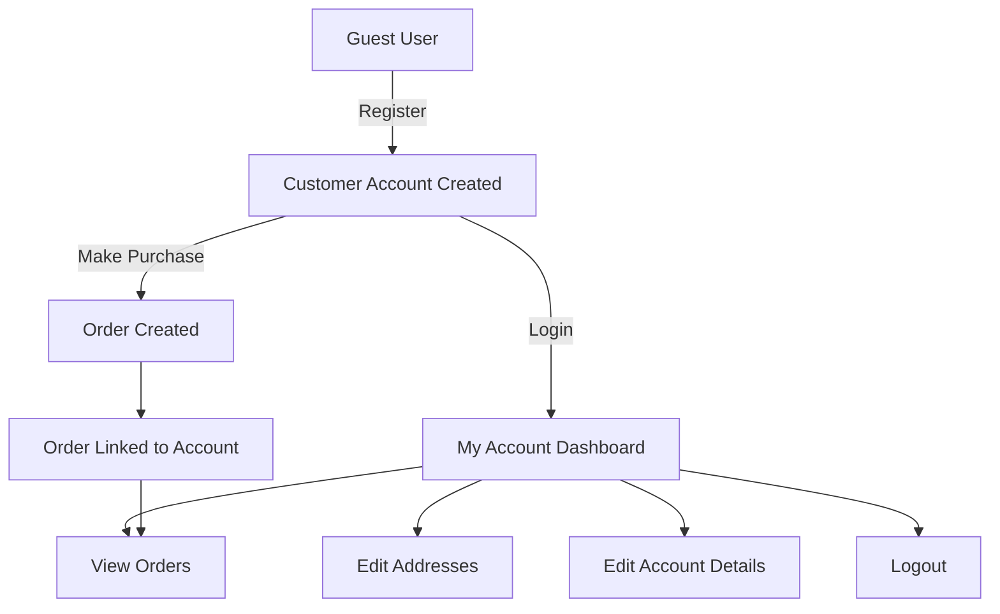

# WordPress Customer Accounts

## Introduction

Customer accounts are a fundamental component of any e-commerce platform, allowing users to register, log in, view their purchase history, manage personal information, and streamline the checkout process. In WordPress e-commerce implementations, particularly with WooCommerce, customer accounts play a crucial role in enhancing the shopping experience and building customer loyalty.

In this guide, you'll learn how to set up, customize, and manage customer accounts in WordPress e-commerce sites. We'll focus primarily on WooCommerce, the most popular e-commerce plugin for WordPress, but the concepts apply to many other e-commerce solutions as well.

## Why Customer Accounts Matter

Before diving into implementation details, let's understand why customer accounts are valuable:

- **Improved user experience**: Returning customers don't need to re-enter their information
- **Order tracking**: Customers can view their order history and check order status
- **Personalization**: Enables tailored product recommendations and marketing
- **Customer loyalty**: Account features like wish lists and rewards encourage repeat visits
- **Streamlined checkout**: Saved payment and shipping information speeds up purchases

## Setting Up Customer Accounts in WooCommerce

### Installing WooCommerce

If you haven't already installed WooCommerce, follow these steps:

1. In your WordPress dashboard, go to **Plugins > Add New**
2. Search for "WooCommerce"
3. Click **Install Now** and then **Activate**
4. Follow the setup wizard to configure basic store settings

### Configuring Account Settings

Once WooCommerce is installed:

1. Go to **WooCommerce > Settings > Accounts & Privacy**
2. Configure the following options:

```
Account creation options:
- [ ] Allow customers to create an account during checkout
- [ ] Allow customers to create an account on the "My account" page
- [ ] When creating an account, automatically generate an account username from the customer's email address
- [ ] When creating an account, automatically generate an account password
```

You can enable all of these options for the most user-friendly experience, or customize based on your specific needs.

## The My Account Page

WooCommerce automatically creates a "My Account" page when installed. This page provides customers with:

- Account dashboard
- Order history
- Address management
- Payment methods (if enabled)
- Account details
- Logout option

### Adding the My Account Page to Navigation

To make the account page easily accessible:

1. Go to **Appearance > Menus**
2. Select your main navigation menu
3. Find "My Account" in the Pages section and add it to your menu
4. Save the menu

### Customizing the My Account Page

You can adjust the appearance and functionality of the My Account page through code. Here's an example of adding a new tab:

```php
// Add a custom tab to My Account page
add_filter('woocommerce_account_menu_items', 'add_custom_account_tab');
function add_custom_account_tab($menu_items) {
    $menu_items['custom-tab'] = 'My Custom Tab';
    return $menu_items;
}

// Add content to the custom tab
add_action('woocommerce_account_custom-tab_endpoint', 'custom_tab_content');
function custom_tab_content() {
    echo '<h2>Welcome to your custom tab</h2>';
    echo '<p>Here is some custom content for your account area.</p>';
}

// Register the endpoint
add_action('init', 'add_custom_endpoint');
function add_custom_endpoint() {
    add_rewrite_endpoint('custom-tab', EP_ROOT | EP_PAGES);
}

// Flush rewrite rules on plugin activation
register_activation_hook(__FILE__, 'flush_rewrite_rules');
```

This code would add a new "My Custom Tab" to the account navigation with some basic content.

## Registration Forms and Process

### Default Registration

By default, WooCommerce provides a simple registration form that collects:
- Email address
- Password
- (Optionally) First and Last name

### Enhancing Registration with Custom Fields

To add custom fields to the registration form:

```php
// Add a phone number field to registration form
add_action('woocommerce_register_form', 'add_phone_to_registration');
function add_phone_to_registration() {
    ?>
    <p class="form-row">
        <label for="reg_phone">Phone number <span class="required">*</span></label>
        <input type="tel" id="reg_phone" name="phone" value="<?php echo esc_attr($_POST['phone'] ?? ''); ?>" />
    </p>
    <?php
}

// Validate the custom field
add_action('woocommerce_register_post', 'validate_phone_field', 10, 3);
function validate_phone_field($username, $email, $validation_errors) {
    if (empty($_POST['phone'])) {
        $validation_errors->add('phone_error', 'Please enter your phone number.');
    }
    return $validation_errors;
}

// Save the custom field value
add_action('woocommerce_created_customer', 'save_phone_field');
function save_phone_field($customer_id) {
    if (isset($_POST['phone'])) {
        update_user_meta($customer_id, 'phone', sanitize_text_field($_POST['phone']));
    }
}
```

This example adds a required phone number field to the registration form.

## User Roles and Capabilities

WordPress uses a role-based system for user permissions. WooCommerce adds two customer-specific roles:

1. **Customer**: Can view their orders, edit account details, etc.
2. **Shop Manager**: Can manage shop settings, orders, products, etc.

### Understanding the Default User Flow

Here's a diagram showing the typical customer account flow:



## Enhancing Customer Accounts

### Social Login Integration

You can add social login options using plugins like:
- NextendSocial Login
- WooCommerce Social Login

Example of adding social login buttons:

```php
// This would typically be handled by a plugin, but here's a conceptual example
add_action('woocommerce_login_form_start', 'add_social_login_buttons');
function add_social_login_buttons() {
    echo '<div class="social-login">';
    echo '<a href="#" class="facebook-login">Login with Facebook</a>';
    echo '<a href="#" class="google-login">Login with Google</a>';
    echo '</div>';
}
```

### Implementing Password Reset Flow

WooCommerce handles password resets automatically, but here's how the flow works:

1. User clicks "Lost your password?" link
2. Enters their email address
3. Receives a password reset link by email
4. Clicks the link and sets a new password

## Guest Checkout vs. Required Registration

WooCommerce allows you to choose whether users must create accounts to checkout:

1. Go to **WooCommerce > Settings > Accounts & Privacy**
2. In "Guest checkout" section, toggle "Allow customers to place orders without an account"

### Converting Guest Purchases to Accounts

When a guest checks out, you can offer to create an account:

```php
add_action('woocommerce_after_checkout_form', 'encourage_account_creation');
function encourage_account_creation() {
    // Only show to logged out users
    if (!is_user_logged_in()) {
        echo '<div class="account-creation-prompt">';
        echo '<h3>Create an account for faster checkout next time!</h3>';
        echo '<p>Check "Create an account" in the form above to save your information.</p>';
        echo '</div>';
    }
}
```

## Customer Account Security

### Implementing Two-Factor Authentication

For enhanced security, consider adding two-factor authentication:

```php
// This is a simplified example - in practice, use a dedicated 2FA plugin
add_action('woocommerce_login_form_end', 'add_2fa_field');
function add_2fa_field() {
    // Only show if user has 2FA enabled (check would happen in real implementation)
    echo '<p class="form-row">';
    echo '<label for="2fa_code">Two-factor authentication code</label>';
    echo '<input type="text" id="2fa_code" name="2fa_code" />';
    echo '</p>';
}
```

### GDPR Compliance

To help with GDPR compliance:

1. Go to **WooCommerce > Settings > Accounts & Privacy**
2. Configure the data retention and privacy policy settings
3. Enable personal data export and erasure features

## Real-world Example: Building a Premium Customer Account Area

Let's create a more comprehensive example of a premium account area with membership levels:

```php
// First, register a custom user role
add_action('init', 'register_premium_customer_role');
function register_premium_customer_role() {
    add_role(
        'premium_customer',
        'Premium Customer',
        array(
            'read' => true,
            'access_premium_content' => true,
            // Include standard customer capabilities too
            'customer' => true
        )
    );
}

// Add a premium tab to the My Account area
add_filter('woocommerce_account_menu_items', 'add_premium_account_tab');
function add_premium_account_tab($menu_items) {
    // Only show for premium customers
    if (current_user_can('access_premium_content')) {
        $menu_items['premium'] = 'Premium Benefits';
    }
    return $menu_items;
}

// Add content for premium tab
add_action('woocommerce_account_premium_endpoint', 'premium_tab_content');
function premium_tab_content() {
    echo '<h2>Your Premium Benefits</h2>';
    echo '<div class="premium-benefits">';
    echo '<div class="benefit">';
    echo '<h3>Free Shipping</h3>';
    echo '<p>All orders ship free, no minimum purchase required.</p>';
    echo '</div>';
    echo '<div class="benefit">';
    echo '<h3>Early Access</h3>';
    echo '<p>Shop new arrivals 24 hours before regular customers.</p>';
    echo '</div>';
    echo '<div class="benefit">';
    echo '<h3>Dedicated Support</h3>';
    echo '<p>Contact your personal shopping assistant anytime.</p>';
    echo '</div>';
    echo '</div>';
}

// Register the endpoint
add_action('init', 'add_premium_endpoint');
function add_premium_endpoint() {
    add_rewrite_endpoint('premium', EP_ROOT | EP_PAGES);
    flush_rewrite_rules();
}

// Upgrade user to premium after purchasing membership
add_action('woocommerce_order_status_completed', 'check_for_membership_purchase');
function check_for_membership_purchase($order_id) {
    $order = wc_get_order($order_id);
    $user_id = $order->get_user_id();
    
    // If no user account, can't upgrade role
    if ($user_id === 0) return;
    
    // Check if order contains premium membership product
    $premium_product_id = 123; // Replace with your membership product ID
    
    foreach ($order->get_items() as $item) {
        if ($item->get_product_id() == $premium_product_id) {
            // Upgrade user to premium
            $user = new WP_User($user_id);
            $user->add_role('premium_customer');
            
            // Maybe send email notification
            do_action('premium_membership_activated', $user_id);
            break;
        }
    }
}
```

This example creates:
1. A custom "Premium Customer" role
2. A special account tab only visible to premium members
3. A system to upgrade users after purchasing a membership product

## Troubleshooting Common Issues

### Login/Registration Not Working

If customers can't log in or register:

1. Check that account creation is enabled in WooCommerce settings
2. Verify email functionality with a test message
3. Check for plugin conflicts that might be affecting login forms
4. Ensure your theme has proper WooCommerce integration

### Lost Password Emails Not Arriving

If password reset emails aren't being received:

```php
// Add custom functionality to WordPress emails
add_filter('wp_mail_from', 'custom_mail_from');
function custom_mail_from($email) {
    return 'noreply@yourdomain.com';  // Use a real email from your domain
}

add_filter('wp_mail_from_name', 'custom_mail_from_name');
function custom_mail_from_name($name) {
    return 'Your Store Name';  // Use your actual store name
}
```

## Summary

WordPress customer accounts are a critical component of e-commerce websites, offering benefits for both shoppers and store owners. Through WooCommerce settings and custom code, you can create a tailored account experience that meets your specific business needs.

Key points to remember:
- Customer accounts enhance user experience and increase loyalty
- WooCommerce provides built-in account functionality that can be extended
- Custom fields and tabs can personalize the account area
- Security considerations should be a priority
- Advanced functionality can create premium experiences for members

## Additional Resources

To further enhance your WordPress customer account implementation:

1. Explore the [WooCommerce Documentation](https://docs.woocommerce.com/)
2. Learn about WordPress hooks and filters on the [WordPress Developer Resources](https://developer.wordpress.org/)
3. Consider membership plugins like MemberPress or WooCommerce Memberships for advanced functionality

## Practice Exercises

1. Add a custom field to the registration form that captures how the customer heard about your store
2. Create a custom My Account tab that displays personalized product recommendations
3. Implement a loyalty points system that shows in the customer account dashboard
4. Create a custom email template for welcoming new account registrations
5. Build a dashboard widget that shows customer registration statistics in the admin area

By mastering WordPress customer accounts, you'll provide a better shopping experience while gathering valuable customer data to grow your business.