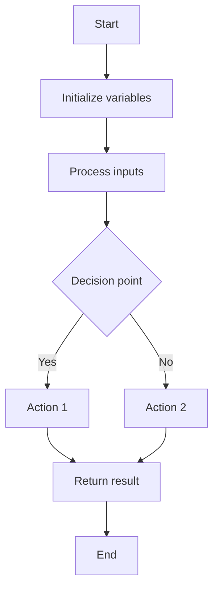

# Algorithm Introduction

## What is an Algorithm?

An algorithm is a step-by-step procedure for solving a problem or accomplishing a task. Think of it as a recipe that tells you exactly what to do in what order to achieve a certain result. In computer science, algorithms are the foundation for everything we do - from simple calculations to complex data processing.

:::tip Definition
**Algorithm**: A finite sequence of well-defined, computer-implementable instructions to solve a specific problem or perform a computation.
:::

<svg xmlns="http://www.w3.org/2000/svg" viewBox="0 0 800 600">
    <!-- Background -->
    <rect width="800" height="600" fill="#f5f5f5"/>

    <!-- Title -->
    <text x="400" y="50" font-family="Arial, sans-serif" font-size="24" font-weight="bold" text-anchor="middle" fill="#333">What is an Algorithm in Computer Science?</text>

    <!-- Definition Box -->
    <rect x="100" y="80" width="600" height="80" rx="10" fill="#e3f2fd" stroke="#1565c0" stroke-width="2"/>
    <text x="400" y="120" font-family="Arial, sans-serif" font-size="18" text-anchor="middle" fill="#333">
        <tspan x="400" dy="0">An algorithm is a step-by-step procedure or set of rules</tspan>
        <tspan x="400" dy="25">designed to solve a specific problem or perform a computation.</tspan>
    </text>

    <!-- Algorithm Example Box -->
    <rect x="100" y="180" width="280" height="320" rx="10" fill="#fff" stroke="#333" stroke-width="2"/>
    <text x="240" y="210" font-family="Arial, sans-serif" font-size="18" font-weight="bold" text-anchor="middle" fill="#333">Binary Search Algorithm</text>

    <!-- Example Steps -->
    <rect x="120" y="230" width="240" height="40" rx="5" fill="#e8f5e9" stroke="#2e7d32" stroke-width="1"/>
    <text x="140" y="255" font-family="Arial, sans-serif" font-size="14" fill="#333">1. Find the middle element</text>

    <rect x="120" y="280" width="240" height="40" rx="5" fill="#e8f5e9" stroke="#2e7d32" stroke-width="1"/>
    <text x="140" y="305" font-family="Arial, sans-serif" font-size="14" fill="#333">2. Compare with target value</text>

    <rect x="120" y="330" width="240" height="40" rx="5" fill="#e8f5e9" stroke="#2e7d32" stroke-width="1"/>
    <text x="140" y="355" font-family="Arial, sans-serif" font-size="14" fill="#333">3. If equal, return position</text>

    <rect x="120" y="380" width="240" height="40" rx="5" fill="#e8f5e9" stroke="#2e7d32" stroke-width="1"/>
    <text x="140" y="405" font-family="Arial, sans-serif" font-size="14" fill="#333">4. If larger, search left half</text>

    <rect x="120" y="430" width="240" height="40" rx="5" fill="#e8f5e9" stroke="#2e7d32" stroke-width="1"/>
    <text x="140" y="455" font-family="Arial, sans-serif" font-size="14" fill="#333">5. If smaller, search right half</text>

    <!-- Characteristics Box -->
    <rect x="420" y="180" width="280" height="320" rx="10" fill="#fff" stroke="#333" stroke-width="2"/>
    <text x="560" y="210" font-family="Arial, sans-serif" font-size="18" font-weight="bold" text-anchor="middle" fill="#333">Key Characteristics</text>

    <!-- Characteristics -->
    <circle cx="440" cy="250" r="8" fill="#f44336"/>
    <text x="460" y="255" font-family="Arial, sans-serif" font-size="14" fill="#333">Finite: Has clear start and end</text>

    <circle cx="440" cy="290" r="8" fill="#f44336"/>
    <text x="460" y="295" font-family="Arial, sans-serif" font-size="14" fill="#333">Definite: Steps are unambiguous</text>

    <circle cx="440" cy="330" r="8" fill="#f44336"/>
    <text x="460" y="335" font-family="Arial, sans-serif" font-size="14" fill="#333">Effective: Solves the problem</text>

    <circle cx="440" cy="370" r="8" fill="#f44336"/>
    <text x="460" y="375" font-family="Arial, sans-serif" font-size="14" fill="#333">Efficient: Optimizes resources</text>

    <circle cx="440" cy="410" r="8" fill="#f44336"/>
    <text x="460" y="415" font-family="Arial, sans-serif" font-size="14" fill="#333">Input: Takes data in</text>

    <circle cx="440" cy="450" r="8" fill="#f44336"/>
    <text x="460" y="455" font-family="Arial, sans-serif" font-size="14" fill="#333">Output: Produces a result</text>

    <!-- Bottom Note -->
    <rect x="100" y="520" width="600" height="60" rx="10" fill="#fff3e0" stroke="#e65100" stroke-width="2"/>
    <text x="400" y="545" font-family="Arial, sans-serif" font-size="16" text-anchor="middle" fill="#333">
        <tspan x="400" dy="0">Algorithms form the foundation of computer science and</tspan>
        <tspan x="400" dy="25">provide solutions to problems across countless domains.</tspan>
    </text>
</svg>

## Why Are Algorithms Important?

Understanding algorithms is crucial for several reasons:

1. **Problem-solving**: Algorithms help break down complex problems into manageable steps
2. **Efficiency**: Well-designed algorithms save time and computing resources
3. **Scalability**: Good algorithms work efficiently even as input sizes grow
4. **Foundation**: They form the building blocks for more complex software systems

## Characteristics of a Good Algorithm

A good algorithm typically has these properties:

- **Correctness**: It must solve the problem it was designed to solve
- **Efficiency**: It should use computing resources (time and memory) effectively
- **Simplicity**: It should be easy to understand and implement
- **Generality**: It should work for all valid inputs within its domain

## A Simple Algorithm Example

Let's look at a simple algorithm for finding the maximum number in a list:

```
1. Set the first element as the current maximum
2. For each remaining element in the list:
   a. If the element is greater than the current maximum, update the maximum
3. Return the maximum value
```

Here's how we can implement this in JavaScript:

```javascript
function findMaximum(numbers) {
  if (numbers.length === 0) {
    return null; // Handle empty array
  }
  
  let max = numbers[0]; // Start with the first element
  
  // Check each element
  for (let i = 1; i < numbers.length; i++) {
    if (numbers[i] > max) {
      max = numbers[i]; // Update maximum if we find a larger value
    }
  }
  
  return max;
}

// Example usage
const sampleList = [12, 45, 7, 23, 56, 9];
const maximum = findMaximum(sampleList);
console.log("The maximum value is:", maximum);
// Output: The maximum value is: 56
```

This simple algorithm demonstrates the core principles: it has clear steps, processes input data, and produces the desired output.

## How Algorithms Work: Key Concepts

### Input and Output

Every algorithm has:

- **Input**: The data the algorithm processes
- **Output**: The result after processing

### Basic Operations

Algorithms are built from basic operations:

- **Sequence**: Performing steps in order
- **Selection**: Making decisions (if-else statements)
- **Iteration**: Repeating steps (loops)
- **Recursion**: An algorithm calling itself with smaller inputs

### Control Flow

The flow of an algorithm can be visualized using flowcharts:



## Algorithm Design Techniques

There are several common approaches to designing algorithms:

1. **Divide and Conquer**: Break a problem into smaller subproblems, solve them, and combine the results
2. **Greedy Approach**: Make locally optimal choices at each step
3. **Dynamic Programming**: Break down problems into overlapping subproblems and avoid redundant computations
4. **Brute Force**: Try all possible solutions until finding the correct one

## Analyzing Algorithms: Big O Notation

An important aspect of algorithms is understanding their efficiency. Computer scientists use **Big O Notation** to describe how an algorithm's runtime or space requirements grow as input size increases.

Common Big O complexities (from fastest to slowest):

- **O(1)**: Constant time - operations take the same time regardless of input size
- **O(log n)**: Logarithmic time - efficiency increases as input grows (like binary search)
- **O(n)**: Linear time - runtime grows in direct proportion to input size
- **O(n log n)**: Typical of efficient sorting algorithms like mergesort
- **O(n²)**: Quadratic time - seen in simple sorting algorithms like bubble sort
- **O(2ⁿ)**: Exponential time - often seen in brute force solutions

:::note
We'll dive deeper into Big O Notation in a future lesson. For now, just understand that it helps us compare algorithms in terms of efficiency.
:::

## Real-World Algorithm Examples

Algorithms are everywhere in our daily lives:

### 1. Search Engines

When you search for something online, complex algorithms determine the most relevant results based on your query, website popularity, your location, and many other factors.

### 2. GPS Navigation

GPS systems use algorithms to find the shortest or fastest path from your location to a destination:

```javascript
// Simplified pseudocode for a navigation system
function findBestRoute(startLocation, destination, preferences) {
  let possibleRoutes = generateAllPossibleRoutes(startLocation, destination);
  
  // Filter routes based on user preferences (fastest, shortest, no tolls, etc.)
  let filteredRoutes = filterRoutesByPreferences(possibleRoutes, preferences);
  
  // Find the optimal route from the filtered options
  return findOptimalRoute(filteredRoutes);
}
```

### 3. Social Media Feeds

Your social media feeds are curated by algorithms that determine what content you're most likely to engage with.

### 4. Online Shopping Recommendations

"Customers who bought this also bought..." recommendations are generated by algorithms analyzing purchase patterns.

## Writing Your First Algorithm

Let's write a simple algorithm to calculate the factorial of a number:

```javascript
function factorial(n) {
  // Base case: factorial of 0 or 1 is 1
  if (n === 0 || n === 1) {
    return 1;
  }
  
  // For numbers > 1, multiply n by factorial of (n-1)
  return n * factorial(n - 1);
}

// Example usage
console.log("Factorial of 5:", factorial(5));
// Output: Factorial of 5: 120

console.log("Factorial of 0:", factorial(0));
// Output: Factorial of 0: 1
```

Let's break down how this works:

1. We define a function that takes an input number `n`
2. We check if `n` is 0 or 1 (base case), and return 1 if true
3. Otherwise, we multiply `n` by the factorial of `(n-1)`
4. This continues recursively until we reach the base case

This is an example of a recursive algorithm, where the function calls itself with a smaller input.

## Algorithm Development Process

When developing algorithms, follow these steps:

1. **Understand the problem** clearly
2. **Plan your approach** by breaking down the problem
3. **Write pseudocode** before actual code
4. **Implement** the algorithm in your chosen programming language
5. **Test** with different inputs, including edge cases
6. **Optimize** if needed for better performance

## Summary

Algorithms are fundamental to programming and computational thinking. In this introduction, we've covered:

- What algorithms are and why they're important
- Characteristics of good algorithms
- Basic algorithm concepts and design techniques
- How to analyze algorithm efficiency with Big O notation
- Real-world examples of algorithms
- How to write and develop simple algorithms

Understanding algorithms will help you become a more effective problem solver and programmer. As you continue your programming journey, you'll learn more complex algorithms and techniques to solve a wide range of problems.

## Practice Exercises

1. Write an algorithm (pseudocode or code) to find the sum of all elements in an array.
2. Create an algorithm to check if a word is a palindrome (reads the same backward as forward).
3. Design an algorithm to convert a decimal number to its binary representation.
4. Think of an everyday task (like making breakfast) and write down the algorithm for it.

## Additional Resources

- [Introduction to Algorithms](https://ocw.mit.edu/courses/electrical-engineering-and-computer-science/6-006-introduction-to-algorithms-fall-2011/) - MIT OpenCourseWare
- [Visualizing Algorithms](https://visualgo.net/) - Interactive visualizations of various algorithms
- [Khan Academy: Algorithms](https://www.khanacademy.org/computing/computer-science/algorithms) - Free algorithm courses

In the next lesson, we'll dive deeper into specific types of algorithms and explore more complex problem-solving techniques.