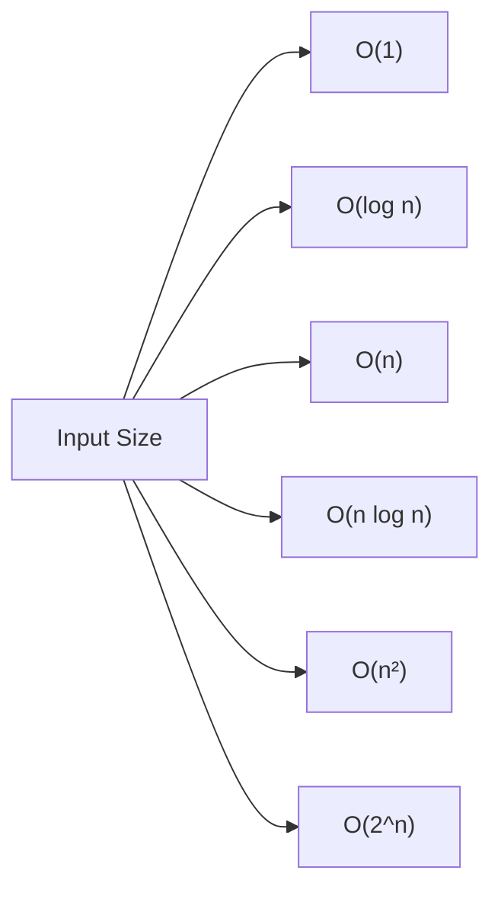

# Algorithm Analysis

## Introduction

When we write programs, we're not just concerned with whether they work correctly—we also care about how efficiently they work. Algorithm analysis is the process of evaluating the efficiency of algorithms in terms of the time they take to run (time complexity) and the memory they require (space complexity).

Understanding algorithm analysis is crucial because:

- It helps you choose the best algorithm for a particular problem
- It allows you to predict how your program will perform with different input sizes
- It provides a language to discuss and compare algorithm efficiency
- It helps identify bottlenecks in your code

In this tutorial, we'll explore how to analyze algorithms systematically using simple, beginner-friendly explanations and examples.

## Why Analyze Algorithms?

Imagine you have two different algorithms to solve the same problem. How do you decide which one is better? Consider these scenarios:

1. One algorithm takes 1 second to process 1,000 items, while another takes 2 seconds.
2. The first algorithm takes 1 second for 1,000 items but 100 seconds for 10,000 items.
3. The second algorithm takes 2 seconds for 1,000 items but only 4 seconds for 10,000 items.

Which would you choose? For small inputs, the first algorithm is faster, but the second one scales much better for larger inputs. Algorithm analysis helps us understand these trade-offs.

## Time Complexity

Time complexity measures how the running time of an algorithm increases as the input size increases. We express it using Big O notation, which describes the upper bound of an algorithm's growth rate.

### Common Time Complexities

Here are the most common time complexities, from fastest to slowest:

| Notation | Name | Description |
|----------|------|-------------|
| O(1) | Constant | Running time doesn't change with input size |
| O(log n) | Logarithmic | Running time increases logarithmically with input size |
| O(n) | Linear | Running time increases linearly with input size |
| O(n log n) | Log-linear | Common in efficient sorting algorithms |
| O(n²) | Quadratic | Running time is proportional to the square of the input size |
| O(2^n) | Exponential | Running time doubles with each additional input element |

Let's visualize how these complexities grow:



### Analyzing Simple Algorithms

Let's analyze some simple algorithms to understand their time complexity:

#### Example 1: Finding the maximum value in an array

```javascript
function findMax(array) {
  let max = array[0];
  
  for (let i = 1; i < array.length; i++) {
    if (array[i] > max) {
      max = array[i];
    }
  }
  
  return max;
}

// Example usage
const numbers = [3, 7, 2, 9, 1, 5];
console.log(findMax(numbers)); // Output: 9
```

**Analysis:**
- We have one loop that iterates through the array once
- The number of operations is directly proportional to the array's length (n)
- Therefore, the time complexity is O(n) - linear time

#### Example 2: Checking if an array contains duplicates with nested loops

```javascript
function hasDuplicates(array) {
  for (let i = 0; i < array.length; i++) {
    for (let j = i + 1; j < array.length; j++) {
      if (array[i] === array[j]) {
        return true;
      }
    }
  }
  return false;
}

// Example usage
const numbers1 = [1, 2, 3, 4, 5];
const numbers2 = [1, 2, 3, 2, 4];
console.log(hasDuplicates(numbers1)); // Output: false
console.log(hasDuplicates(numbers2)); // Output: true
```

**Analysis:**
- We have two nested loops
- For each element in the array (n elements), we compare it with all remaining elements
- The total number of comparisons is approximately n²/2
- Therefore, the time complexity is O(n²) - quadratic time

#### Example 3: Binary search in a sorted array

```javascript
function binarySearch(sortedArray, target) {
  let left = 0;
  let right = sortedArray.length - 1;
  
  while (left <= right) {
    const mid = Math.floor((left + right) / 2);
    
    if (sortedArray[mid] === target) {
      return mid; // Found the target, return its index
    } else if (sortedArray[mid] < target) {
      left = mid + 1; // Target is in the right half
    } else {
      right = mid - 1; // Target is in the left half
    }
  }
  
  return -1; // Target not found
}

// Example usage
const sortedNumbers = [1, 3, 5, 7, 9, 11, 13, 15];
console.log(binarySearch(sortedNumbers, 7)); // Output: 3 (index of 7)
console.log(binarySearch(sortedNumbers, 6)); // Output: -1 (not found)
```

**Analysis:**
- Each iteration of the while loop cuts the search space in half
- The maximum number of iterations is log₂(n) where n is the array length
- Therefore, the time complexity is O(log n) - logarithmic time

## Space Complexity

Space complexity measures how much additional memory an algorithm needs based on the input size. Like time complexity, we express it using Big O notation.

### Analyzing Space Complexity

#### Example 1: Finding the maximum value (revisited)

```javascript
function findMax(array) {
  let max = array[0];
  
  for (let i = 1; i < array.length; i++) {
    if (array[i] > max) {
      max = array[i];
    }
  }
  
  return max;
}
```

**Space Analysis:**
- We only use a fixed amount of extra space (variables `max` and `i`)
- The space needed doesn't grow with the input size
- Therefore, the space complexity is O(1) - constant space

#### Example 2: Creating a duplicate array

```javascript
function duplicateArray(array) {
  const duplicate = [];
  
  for (let i = 0; i < array.length; i++) {
    duplicate.push(array[i]);
  }
  
  return duplicate;
}

// Example usage
const original = [1, 2, 3, 4, 5];
const copy = duplicateArray(original);
console.log(copy); // Output: [1, 2, 3, 4, 5]
```

**Space Analysis:**
- We create a new array that's the same size as the input
- The extra space grows linearly with the input size
- Therefore, the space complexity is O(n) - linear space

## Amortized Analysis

Sometimes, an operation might occasionally take longer but is typically faster. Amortized analysis considers the average performance over many operations.

A classic example is the dynamic array (like JavaScript's Array or Python's list), which occasionally needs to resize but mostly offers constant-time insertions.

```javascript
// Dynamic array example (conceptual JavaScript implementation)
class DynamicArray {
  constructor() {
    this.array = new Array(1); // Start with capacity 1
    this.length = 0;
  }
  
  push(element) {
    // If we're at capacity, resize
    if (this.length === this.array.length) {
      const newArray = new Array(this.array.length * 2);
      // Copy all elements to the new array
      for (let i = 0; i < this.length; i++) {
        newArray[i] = this.array[i];
      }
      this.array = newArray;
    }
    
    // Add the new element
    this.array[this.length] = element;
    this.length++;
  }
  
  get(index) {
    return this.array[index];
  }
}
```

**Analysis:**
- Most `push` operations are O(1) - constant time
- Occasionally, when resizing is needed, it's O(n) - linear time
- The amortized time complexity for `push` is O(1)

## Real-World Applications

### Example 1: Search Algorithms for a Large Database

Imagine you're building a search feature for a database with millions of records:

- Using linear search (O(n)): Searching through 1 million records might take seconds or minutes.
- Using binary search on sorted data (O(log n)): The same search would take just ~20 comparisons.
- Using a hash table (O(1) average): Lookups are nearly instantaneous regardless of size.

This is why database indexes are crucial for performance—they change search operations from linear to logarithmic or constant time.

### Example 2: Social Media Feed Generation

Consider a simplified version of generating a social media feed:

```javascript
function generateFeed(users, posts) {
  const feed = [];
  
  // For each user
  for (const user of users) {
    // Get their friends
    const friends = getFriends(user);
    
    // For each friend
    for (const friend of friends) {
      // Get recent posts
      const recentPosts = getRecentPosts(friend, posts);
      
      // Add posts to feed
      for (const post of recentPosts) {
        feed.push(post);
      }
    }
  }
  
  return feed.sort((a, b) => b.timestamp - a.timestamp); // Sort by newest first
}
```

If we analyze the time complexity:
1. Iterating over users: O(U) where U is the number of users
2. For each user, get friends and iterate: O(F) where F is the average number of friends
3. For each friend, get and process posts: O(P) where P is the average number of posts per friend
4. Sorting the feed: O(N log N) where N is the total number of posts collected

The total complexity is O(U × F × P + N log N), which could be very high for large social networks. This is why real platforms use sophisticated algorithms and caching strategies.

## Best Practices for Algorithm Optimization

1. **Measure before optimizing**: Use profiling tools to identify actual bottlenecks.
2. **Consider the common case**: Optimize for the most frequent operations.
3. **Use appropriate data structures**: Choosing the right data structure can drastically improve efficiency.
4. **Avoid premature optimization**: Don't optimize code that isn't causing performance issues.
5. **Trade memory for speed**: Sometimes using more memory can significantly speed up an algorithm.
6. **Use memoization**: Cache results of expensive function calls to avoid redundant calculations.

## Summary

Algorithm analysis provides a systematic way to evaluate and compare algorithms based on their efficiency. Remember these key points:

- **Big O notation** helps us describe how the time and space requirements grow with input size
- **Time complexity** measures how an algorithm's running time increases with input size
- **Space complexity** measures how an algorithm's memory usage increases with input size
- The goal is usually to find the balance between time and space that best fits your specific requirements
- Real-world scenarios often involve trade-offs between different types of complexity

By understanding algorithm analysis, you can make informed decisions about which algorithms and data structures to use in your projects, ensuring your applications remain performant even as they scale.

## Exercises

1. Analyze the time and space complexity of the following function:
   ```javascript
   function sumArray(arr) {
     let sum = 0;
     for (const num of arr) {
       sum += num;
     }
     return sum;
   }
   ```

2. Write a function to find if a string is a palindrome (reads the same backward as forward) and analyze its time and space complexity.

3. Implement a function that finds the intersection of two arrays (elements that appear in both) and analyze its time and space complexity. Can you think of multiple approaches with different complexities?

4. Consider the following function that computes the nth Fibonacci number recursively. Analyze its time complexity and suggest how to improve it:
   ```javascript
   function fibonacci(n) {
     if (n <= 1) return n;
     return fibonacci(n - 1) + fibonacci(n - 2);
   }
   ```

5. For a sorting algorithm of your choice, analyze how its performance changes with:
   - Already sorted inputs
   - Reverse sorted inputs
   - Randomly ordered inputs

## Additional Resources

- The book "Introduction to Algorithms" by Thomas H. Cormen, Charles E. Leiserson, Ronald L. Rivest, and Clifford Stein (often called "CLRS")
- The book "Algorithms" by Robert Sedgewick and Kevin Wayne
- Online courses on algorithms from platforms like Coursera, edX, and Khan Academy
- The Big O Cheat Sheet: [bigocheatsheet.com](https://www.bigocheatsheet.com/)
- Practice problems on sites like LeetCode, HackerRank, and CodeSignal

Remember, algorithm analysis is a skill that improves with practice. Start by analyzing simple algorithms and gradually work your way up to more complex ones.