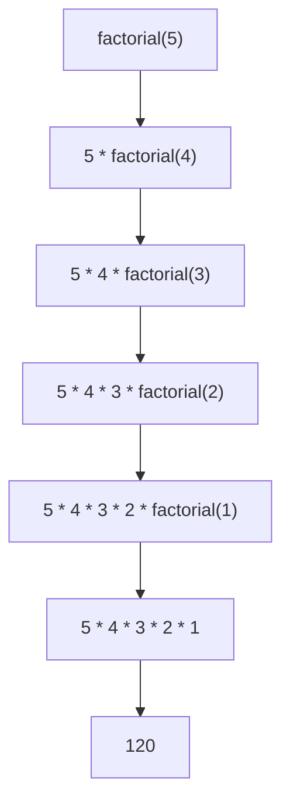

# Recursion Fundamentals

## Introduction

Recursion is a powerful programming technique where a function calls itself to solve a problem. It's like a Russian nesting doll – inside each doll is a smaller version of itself, until you reach the innermost doll. In programming, recursion breaks complex problems into simpler sub-problems of the same type.

Many algorithms and data structures rely on recursion, making it an essential concept for any programmer to master. While it might seem mind-bending at first, understanding recursion will expand your problem-solving toolkit and help you tackle complex problems with elegant solutions.

## The Two Essential Parts of Recursion

Every recursive solution consists of two key components:

1. **Base case(s)**: The condition(s) that stop the recursion
2. **Recursive case(s)**: The part where the function calls itself

Without a proper base case, your function will call itself indefinitely, causing a stack overflow error. This is similar to reading a dictionary where a word's definition includes the word itself – you need somewhere to stop!

## Basic Example: Factorial Calculation

Let's start with a classic example: calculating the factorial of a number.

The factorial of `n` (written as `n!`) is the product of all positive integers less than or equal to `n`.

For example: 
- 5! = 5 × 4 × 3 × 2 × 1 = 120
- 4! = 4 × 3 × 2 × 1 = 24

Mathematically, we can define factorial as:
- 0! = 1 (base case)
- n! = n × (n-1)! (recursive case)

Here's how we implement this in JavaScript:

```javascript
function factorial(n) {
  // Base case: factorial of 0 or 1 is 1
  if (n === 0 || n === 1) {
    return 1;
  }
  
  // Recursive case: n! = n * (n-1)!
  return n * factorial(n - 1);
}

// Example usage:
console.log(factorial(5)); // Output: 120
```

Let's trace this execution step by step for `factorial(5)`:

1. Is 5 equal to 0 or 1? No, so move to the recursive case.
2. Return 5 * factorial(4)
   1. Is 4 equal to 0 or 1? No, so move to the recursive case.
   2. Return 4 * factorial(3)
      1. Is 3 equal to 0 or 1? No, so move to the recursive case.
      2. Return 3 * factorial(2)
         1. Is 2 equal to 0 or 1? No, so move to the recursive case.
         2. Return 2 * factorial(1)
            1. Is 1 equal to 0 or 1? Yes, return 1 (base case reached).
         3. So, factorial(2) = 2 * 1 = 2
      3. So, factorial(3) = 3 * 2 = 6
   3. So, factorial(4) = 4 * 6 = 24
3. So, factorial(5) = 5 * 24 = 120

This flow can be visualized as follows:



## The Call Stack

When executing recursive functions, the computer uses a data structure called the "call stack" to keep track of function calls. Each recursive call adds a new frame to the stack, storing the function's state (variables, parameters, etc.).

When a function completes, its frame is removed from the stack, and execution returns to the previous function call. This is why having a base case is crucial – it ensures that the stack eventually starts unwinding instead of growing indefinitely.

## Another Example: Fibonacci Sequence

The Fibonacci sequence is defined as:
- F(0) = 0 (base case)
- F(1) = 1 (base case)
- F(n) = F(n-1) + F(n-2) for n > 1 (recursive case)

Here's a recursive implementation:

```javascript
function fibonacci(n) {
  // Base cases
  if (n === 0) return 0;
  if (n === 1) return 1;
  
  // Recursive case
  return fibonacci(n - 1) + fibonacci(n - 2);
}

// Example usage:
console.log(fibonacci(6)); // Output: 8
```

For `fibonacci(6)`, we get:

```
fibonacci(6) = fibonacci(5) + fibonacci(4)
             = (fibonacci(4) + fibonacci(3)) + (fibonacci(3) + fibonacci(2))
             = ...and so on until we reach the base cases
             = 8
```

> **Note**: While this example clearly demonstrates recursion, it's not efficient for large inputs due to redundant calculations. We'll address this issue in more advanced lessons with techniques like memoization.

## Practical Example: Directory Size Calculation

Let's look at a real-world application: calculating the total size of a directory including all its subdirectories.

Here's a Node.js implementation:

```javascript
const fs = require('fs');
const path = require('path');

function calculateDirectorySize(directoryPath) {
  let totalSize = 0;
  
  // Get all items in the directory
  const items = fs.readdirSync(directoryPath);
  
  for (const item of items) {
    const itemPath = path.join(directoryPath, item);
    const stats = fs.statSync(itemPath);
    
    if (stats.isFile()) {
      // Base case: If it's a file, add its size
      totalSize += stats.size;
    } else if (stats.isDirectory()) {
      // Recursive case: If it's a directory, calculate its size
      totalSize += calculateDirectorySize(itemPath);
    }
  }
  
  return totalSize;
}

// Example usage:
console.log(`Total size: ${calculateDirectorySize('/path/to/directory')} bytes`);
```

This function:
1. Lists all files and directories in the current directory
2. For each file, adds its size to the total (base case)
3. For each directory, recursively calculates its size and adds it to the total (recursive case)

## Another Practical Example: Binary Search

Binary search is an efficient algorithm that uses recursion to find an element in a sorted array:

```javascript
function binarySearch(arr, target, left = 0, right = arr.length - 1) {
  // Base case: element not found
  if (left > right) return -1;
  
  // Calculate middle index
  const mid = Math.floor((left + right) / 2);
  
  // Base case: element found
  if (arr[mid] === target) return mid;
  
  // Recursive cases
  if (arr[mid] > target) {
    // Search left half
    return binarySearch(arr, target, left, mid - 1);
  } else {
    // Search right half
    return binarySearch(arr, target, mid + 1, right);
  }
}

// Example usage:
const sortedArray = [1, 3, 5, 7, 9, 11, 13, 15];
console.log(binarySearch(sortedArray, 7)); // Output: 3 (index of element 7)
console.log(binarySearch(sortedArray, 6)); // Output: -1 (not found)
```

## Common Recursion Patterns

### 1. Linear Recursion

A function calls itself exactly once in each recursive step (like factorial).

### 2. Binary Recursion

A function calls itself twice in each recursive step (like Fibonacci).

### 3. Tail Recursion

The recursive call is the last operation in the function:

```javascript
function factorialTailRecursive(n, accumulator = 1) {
  // Base case
  if (n <= 1) return accumulator;
  
  // Recursive case (tail call)
  return factorialTailRecursive(n - 1, n * accumulator);
}

console.log(factorialTailRecursive(5)); // Output: 120
```

Tail recursion is important because many modern compilers can optimize it to use constant stack space.

## When to Use Recursion

Recursion is particularly useful for:

1. Problems that can be broken down into similar sub-problems
2. Tree-like data structures (file systems, DOM, abstract syntax trees)
3. Algorithms like divide-and-conquer (merge sort, quicksort)
4. Backtracking problems (generating permutations, solving mazes)

However, recursion isn't always the right choice:
- It can lead to stack overflow errors for deep recursions
- It may be less efficient than iterative solutions due to function call overhead
- It can be harder to debug and understand for complex problems

## Common Pitfalls and How to Avoid Them

1. **Missing base case**: Always define clear stopping conditions
2. **Inefficient implementations**: Be mindful of redundant calculations (like in the Fibonacci example)
3. **Stack overflow**: For deep recursion, consider:
   - Tail recursion (if your language supports optimization)
   - Converting to iteration
   - Increasing stack size (language/environment dependent)

## Summary

Recursion is a fundamental programming technique where a function calls itself to solve smaller versions of the same problem. Every recursive solution requires at least one base case to stop the recursion and at least one recursive case where the function calls itself.

While powerful and elegant for certain problems, recursion must be used carefully to avoid inefficiency and stack overflow errors. As you continue your programming journey, you'll develop an intuition for when recursion is the right tool for the job.

## Exercises

1. Implement a recursive function to calculate the sum of an array of numbers.
2. Write a recursive function to reverse a string.
3. Create a recursive function to find the greatest common divisor (GCD) of two numbers.
4. Implement a recursive solution for the Tower of Hanoi puzzle.
5. Write a function that uses recursion to generate all possible permutations of a string.

## Additional Resources

- [Visualizing Recursion](https://visualgo.net/en/recursion)
- [The Little Schemer](https://mitpress.mit.edu/books/little-schemer-fourth-edition) - A classic book on recursion
- [Thinking Recursively](https://realpython.com/python-thinking-recursively/) - Article with Python examples

Happy coding and recursive thinking!