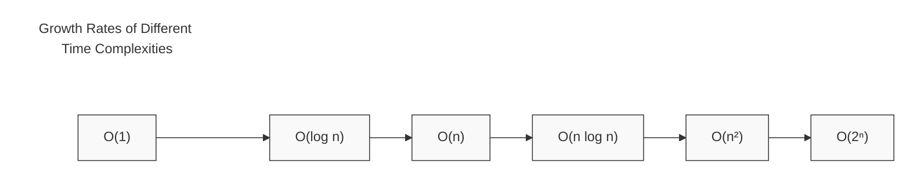

# Time Complexity

## Introduction

When writing programs, especially as they grow larger and handle more data, efficiency becomes crucial. Time complexity is a fundamental concept in computer science that helps us understand how the runtime of an algorithm increases as the input size grows. By understanding time complexity, you'll be able to write more efficient code and make better decisions when choosing algorithms for specific problems.

Time complexity is expressed using **Big O Notation**, which describes the upper bound of an algorithm's runtime in the worst-case scenario. Think of it as a way to classify algorithms according to how their running time grows relative to the input size.

## Why Time Complexity Matters

Imagine you're building an app that needs to search through a list of items:

- With a small list of 10 items, nearly any search algorithm will feel instantaneous
- But what happens when your app becomes popular and needs to search through millions of items?

The algorithm that seemed fast with small inputs might become frustratingly slow with larger inputs. Understanding time complexity helps you predict this behavior and choose appropriate algorithms for your needs.

## Big O Notation

Big O Notation is the language we use to describe time complexity. It's written as O(f(n)), where f(n) is a function of the input size n.

Common time complexities include:

| Notation   | Name             | Description                                        |
|------------|------------------|----------------------------------------------------|
| O(1)       | Constant time    | Runtime doesn't change with input size             |
| O(log n)   | Logarithmic time | Runtime grows logarithmically with input size      |
| O(n)       | Linear time      | Runtime grows linearly with input size             |
| O(n log n) | Log-linear time  | Common for efficient sorting algorithms            |
| O(n²)      | Quadratic time   | Runtime grows with the square of input size        |
| O(2ⁿ)      | Exponential time | Runtime doubles with each additional input element |

Let's visualize how these time complexities compare:



## Analyzing Time Complexity with Examples

Let's explore different time complexities through code examples:

### O(1) - Constant Time

Operations that take the same time regardless of input size.

```javascript
function getFirstElement(array) {
  return array[0]; // Always takes one step, regardless of array size
}

// Input: [1, 2, 3, 4, 5, ...]
// Output: 1
// Time complexity: O(1)
```

### O(log n) - Logarithmic Time

Algorithms that reduce the problem size by a fraction (usually half) in each step.

```javascript
function binarySearch(sortedArray, target) {
  let left = 0;
  let right = sortedArray.length - 1;
  
  while (left <= right) {
    let mid = Math.floor((left + right) / 2);
    
    if (sortedArray[mid] === target) {
      return mid; // Found the target
    } else if (sortedArray[mid] < target) {
      left = mid + 1; // Search in the right half
    } else {
      right = mid - 1; // Search in the left half
    }
  }
  
  return -1; // Target not found
}

// Input: [1, 3, 5, 7, 9, 11, 13, 15], target = 7
// Output: 3 (index where 7 is found)
// Time complexity: O(log n)
```

Binary search is efficient because it eliminates half of the remaining elements in each step. For an array of 1,000,000 elements, it would take at most about 20 steps to find any element.

### O(n) - Linear Time

The runtime increases linearly with input size.

```javascript
function findMaximum(array) {
  let max = array[0];
  
  for (let i = 1; i < array.length; i++) {
    if (array[i] > max) {
      max = array[i];
    }
  }
  
  return max;
}

// Input: [3, 7, 2, 9, 1]
// Output: 9
// Time complexity: O(n)
```

For this function, if the array size doubles, the runtime approximately doubles as well.

### O(n log n) - Log-linear Time

Common in efficient sorting algorithms like mergesort and quicksort.

```javascript
function mergeSort(array) {
  if (array.length <= 1) {
    return array;
  }
  
  const middle = Math.floor(array.length / 2);
  const left = array.slice(0, middle);
  const right = array.slice(middle);
  
  return merge(mergeSort(left), mergeSort(right));
}

function merge(left, right) {
  let result = [];
  let leftIndex = 0;
  let rightIndex = 0;
  
  while (leftIndex < left.length && rightIndex < right.length) {
    if (left[leftIndex] < right[rightIndex]) {
      result.push(left[leftIndex]);
      leftIndex++;
    } else {
      result.push(right[rightIndex]);
      rightIndex++;
    }
  }
  
  return result.concat(left.slice(leftIndex)).concat(right.slice(rightIndex));
}

// Input: [8, 3, 1, 7, 0, 10, 2]
// Output: [0, 1, 2, 3, 7, 8, 10]
// Time complexity: O(n log n)
```

Merge sort divides the array in half each time (log n) and then combines them back together (n), giving us O(n log n).

### O(n²) - Quadratic Time

Often seen in algorithms with nested loops over the data.

```javascript
function bubbleSort(array) {
  for (let i = 0; i < array.length; i++) {
    for (let j = 0; j < array.length - i - 1; j++) {
      if (array[j] > array[j + 1]) {
        // Swap elements
        [array[j], array[j + 1]] = [array[j + 1], array[j]];
      }
    }
  }
  return array;
}

// Input: [5, 3, 8, 4, 2]
// Output: [2, 3, 4, 5, 8]
// Time complexity: O(n²)
```

Bubble sort has nested loops, causing the runtime to grow quadratically with the input size. If the array size doubles, the runtime roughly quadruples.

### O(2ⁿ) - Exponential Time

Seen in algorithms with recursive calls that branch out, like naive recursive solutions to the Fibonacci sequence.

```javascript
function fibonacci(n) {
  if (n <= 1) {
    return n;
  }
  return fibonacci(n - 1) + fibonacci(n - 2);
}

// Input: 6
// Output: 8
// Time complexity: O(2ⁿ)
```

This naive implementation of Fibonacci makes two recursive calls for most values, leading to exponential growth in runtime. For calculating fibonacci(50), this would take trillions of operations!

## Determining Time Complexity

To analyze the time complexity of an algorithm, follow these steps:

1. Identify the input and its size (usually denoted as n)
2. Count the basic operations that are executed
3. Express the count as a function of n
4. Focus on the dominant term as n grows large
5. Drop constant coefficients and lower-order terms

### Example Analysis

Let's analyze this function:

```javascript
function sumAndProduct(array) {
  let sum = 0;                       // O(1)
  for (let i = 0; i < array.length; i++) {
    sum += array[i];                 // O(n)
  }
  
  let product = 1;                   // O(1)
  for (let i = 0; i < array.length; i++) {
    product *= array[i];             // O(n)
  }
  
  return [sum, product];             // O(1)
}
```

Analysis:
- Initial assignments: O(1)
- First loop: O(n)
- Second loop: O(n)
- Return statement: O(1)

Total: O(1) + O(n) + O(n) + O(1) = O(2n + 2) = O(n)

We drop the coefficient 2 and the constant +2 when expressing in Big O notation, giving us O(n).

## Common Pitfalls

### Pitfall 1: Focusing on the Wrong Input

When analyzing algorithms that process multiple inputs, be clear about which input's size matters most:

```javascript
function intersect(arrayA, arrayB) {
  const result = [];
  
  for (let i = 0; i < arrayA.length; i++) {
    for (let j = 0; j < arrayB.length; j++) {
      if (arrayA[i] === arrayB[j]) {
        result.push(arrayA[i]);
        break;
      }
    }
  }
  
  return result;
}
```

This has time complexity O(n × m), where n and m are the lengths of arrayA and arrayB respectively.

### Pitfall 2: Hidden Loops

Sometimes loops are hidden in built-in methods:

```javascript
function containsValue(array, value) {
  return array.includes(value); // includes() method loops through the array
}
```

While this looks simple, `includes()` has a time complexity of O(n), making this function O(n) as well.

## Real-World Applications

### Application 1: Search Algorithms in Databases

When building a search feature for a website with millions of products:

- Linear search (O(n)) might work for a few hundred products
- But for millions of products, you need more efficient algorithms like:
  - Binary search (O(log n)) if data is sorted
  - Hash-based search (O(1) average case) for direct lookups

### Application 2: Social Media Feed Generation

Generating a personalized feed for a user with thousands of connections:

- Naive approach: Check every post from every connection (O(n²))
- Optimized approach: Use filtering and indexing strategies to reduce complexity to O(n log n) or better

### Application 3: Route Finding in Maps

Finding the shortest path between two locations:

- Brute force approach: Check all possible paths (O(n!), factorial time)
- Dijkstra's algorithm: More efficient approach (O((V + E) log V) where V is vertices and E is edges)

## Practical Tips for Writing Efficient Code

1. **Avoid unnecessary nested loops** when possible
2. **Use appropriate data structures**:
   - Arrays for ordered data with integer indices
   - Hash maps for key-based lookups
   - Sets for quick membership testing
3. **Consider space-time tradeoffs** - sometimes using more memory can dramatically improve time complexity
4. **Learn classic algorithms** for common problems like sorting and searching
5. **Profile your code** to identify actual bottlenecks rather than optimizing prematurely

## Summary

Time complexity is a crucial concept for writing efficient code and selecting appropriate algorithms for your tasks. By understanding Big O notation and how to analyze algorithms, you can:

- Predict how your code will perform as inputs grow
- Choose the right algorithm for your specific needs
- Identify bottlenecks and optimization opportunities
- Make informed decisions about trade-offs between different solutions

Remember that the most elegant solution isn't always the most efficient one, and the most efficient solution isn't always necessary for every problem. The key is understanding the requirements of your specific situation and selecting the appropriate algorithm based on expected input sizes and performance needs.

## Practice Exercises

1. **Algorithm Comparison**: Implement both linear search and binary search for finding an element in a sorted array. Compare their performance with arrays of different sizes.

2. **Complexity Analysis**: Determine the time complexity of the following function:
   ```javascript
   function mysteryFunction(n) {
     let result = 0;
     for (let i = 0; i < n; i++) {
       for (let j = i; j < n; j++) {
         result += i * j;
       }
     }
     return result;
   }
   ```

3. **Optimization Challenge**: Rewrite this function to improve its time complexity:
   ```javascript
   function findDuplicates(array) {
     const duplicates = [];
     for (let i = 0; i < array.length; i++) {
       for (let j = i + 1; j < array.length; j++) {
         if (array[i] === array[j] && !duplicates.includes(array[i])) {
           duplicates.push(array[i]);
         }
       }
     }
     return duplicates;
   }
   ```

## Additional Resources

- **Books**:
  - "Introduction to Algorithms" by Cormen, Leiserson, Rivest, and Stein
  - "Grokking Algorithms" by Aditya Bhargava (more beginner-friendly)

- **Online Courses**:
  - Khan Academy's Algorithms course
  - MIT's Introduction to Algorithms course (available on OCW)

- **Practice Platforms**:
  - LeetCode
  - HackerRank
  - CodeSignal

By mastering time complexity analysis, you'll be well on your way to becoming a more effective programmer who can create scalable solutions to complex problems.