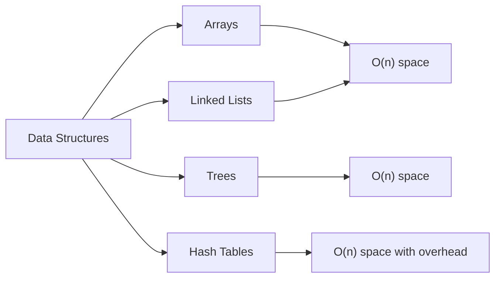

# Space Complexity

## Introduction

When we develop algorithms, we often focus on their speed and efficiency in terms of time. However, another crucial aspect that deserves equal attention is **space complexity** — how much memory an algorithm needs to execute.

Space complexity measures the total amount of memory space an algorithm uses relative to the input size. Understanding space complexity helps you write more efficient code, especially when working with limited memory resources or large datasets.

## What is Space Complexity?

Space complexity refers to the amount of memory space required by an algorithm during its execution as a function of the input size. Similar to time complexity, we use Big O notation to express space complexity.

### Basic Definition

Space complexity = Auxiliary space + Input space

Where:
- **Input space**: Memory needed to store the input data
- **Auxiliary space**: Extra space needed during algorithm execution (variables, recursion stack, etc.)

Often, we focus primarily on the auxiliary space when discussing space complexity.

## Types of Space Complexity

### Constant Space - O(1)

An algorithm has constant space complexity when it uses the same amount of memory regardless of the input size.

```javascript
function findMax(arr) {
  let max = arr[0]; // One variable, constant space
  
  for (let i = 1; i < arr.length; i++) {
    if (arr[i] > max) {
      max = arr[i];
    }
  }
  
  return max;
}

// Example usage:
const numbers = [3, 1, 4, 1, 5, 9, 2, 6];
console.log(findMax(numbers)); // Output: 9
```

In this example, regardless of whether the array has 10 or 10,000 elements, we only need one variable (`max`) to track the maximum value.

### Linear Space - O(n)

An algorithm has linear space complexity when the space required increases linearly with the input size.

```javascript
function createDoubledArray(arr) {
  let result = []; // This will grow proportionally to input
  
  for (let i = 0; i < arr.length; i++) {
    result.push(arr[i] * 2);
  }
  
  return result;
}

// Example usage:
const numbers = [1, 2, 3, 4, 5];
console.log(createDoubledArray(numbers)); // Output: [2, 4, 6, 8, 10]
```

In this function, we create a new array that scales with the input size, resulting in O(n) space complexity.

### Quadratic Space - O(n²)

An algorithm has quadratic space complexity when it requires space proportional to the square of the input size.

```javascript
function createMatrix(n) {
  let matrix = [];
  
  for (let i = 0; i < n; i++) {
    let row = [];
    for (let j = 0; j < n; j++) {
      row.push(i * j);
    }
    matrix.push(row);
  }
  
  return matrix;
}

// Example usage:
console.log(createMatrix(3));
/* Output:
[
  [0, 0, 0],
  [0, 1, 2],
  [0, 2, 4]
]
*/
```

This function creates an n×n matrix, requiring O(n²) space.

### Logarithmic Space - O(log n)

Algorithms with logarithmic space complexity use space proportional to the logarithm of the input size.

```javascript
function binarySearch(arr, target, low = 0, high = arr.length - 1) {
  if (low > high) return -1;
  
  const mid = Math.floor((low + high) / 2);
  
  if (arr[mid] === target) return mid;
  
  if (arr[mid] > target) {
    return binarySearch(arr, target, low, mid - 1);
  } else {
    return binarySearch(arr, target, mid + 1, high);
  }
}

// Example usage:
const sortedArray = [1, 2, 3, 4, 5, 6, 7, 8, 9, 10];
console.log(binarySearch(sortedArray, 7)); // Output: 6 (index of number 7)
```

Even though this is a recursive function, it has O(log n) space complexity because the maximum depth of recursion is logarithmic to the input size.

## Recursion and Space Complexity

Recursive functions deserve special attention when analyzing space complexity because they use the call stack for each recursive call.

```javascript
function factorial(n) {
  // Base case
  if (n <= 1) return 1;
  
  // Recursive case
  return n * factorial(n - 1);
}

// Example usage:
console.log(factorial(5)); // Output: 120
```

This factorial function has O(n) space complexity because it creates n stack frames on the call stack.

### Tail Recursion Optimization

Some languages and compilers optimize tail-recursive functions to use constant space:

```javascript
function factorialOptimized(n, accumulator = 1) {
  if (n <= 1) return accumulator;
  
  return factorialOptimized(n - 1, n * accumulator);
}

// Example usage:
console.log(factorialOptimized(5)); // Output: 120
```

In languages that support tail-call optimization (like some functional programming languages), this version will use O(1) space instead of O(n).

## Space-Time Tradeoffs

Often, you can trade space for time and vice versa. Let's look at an example that demonstrates this concept:

### Example: Computing Fibonacci Numbers

#### Recursive Approach (Time-Efficient, Space-Intensive)

```javascript
function fibMemoized(n, memo = {}) {
  if (n in memo) return memo[n];
  if (n <= 1) return n;
  
  memo[n] = fibMemoized(n - 1, memo) + fibMemoized(n - 2, memo);
  return memo[n];
}

// Example usage:
console.log(fibMemoized(10)); // Output: 55
```

This memoization approach has O(n) space complexity due to storing results in the memo object, but achieves O(n) time complexity.

#### Iterative Approach (Space-Efficient, Less Time-Efficient)

```javascript
function fibIterative(n) {
  if (n <= 1) return n;
  
  let a = 0, b = 1;
  for (let i = 2; i <= n; i++) {
    let temp = a + b;
    a = b;
    b = temp;
  }
  
  return b;
}

// Example usage:
console.log(fibIterative(10)); // Output: 55
```

This iterative approach has O(1) space complexity but still O(n) time complexity.

## Analyzing Space Complexity in Data Structures

Different data structures have different space complexity characteristics:



### Arrays and Linked Lists

Both arrays and linked lists typically have O(n) space complexity for n elements.

However, linked lists have additional overhead:

```javascript
class Node {
  constructor(data) {
    this.data = data;
    this.next = null; // Pointer to next element
  }
}

class LinkedList {
  constructor() {
    this.head = null;
  }
  
  append(data) {
    const newNode = new Node(data);
    
    if (!this.head) {
      this.head = newNode;
      return;
    }
    
    let current = this.head;
    while (current.next) {
      current = current.next;
    }
    current.next = newNode;
  }
}

// Example usage:
const list = new LinkedList();
list.append(1);
list.append(2);
list.append(3);
```

Each linked list node requires extra space for the `next` pointer, making them less space-efficient than arrays for simple data types.

## Practical Examples and Applications

### Example 1: Counting Word Frequencies

```javascript
function wordFrequency(text) {
  const words = text.toLowerCase().match(/\b\w+\b/g) || [];
  const frequency = {};
  
  words.forEach(word => {
    frequency[word] = (frequency[word] || 0) + 1;
  });
  
  return frequency;
}

// Example usage:
const text = "Space complexity is as important as time complexity. Space complexity matters.";
console.log(wordFrequency(text));
/* Output:
{
  "space": 2,
  "complexity": 3,
  "is": 1,
  "as": 2,
  "important": 1,
  "time": 1,
  "matters": 1
}
*/
```

Space complexity: O(k) where k is the number of unique words. In the worst case, all words are unique, making it O(n) where n is the total number of words.

### Example 2: Optimizing a Recursive Algorithm

Let's optimize a recursive depth-first search to use less space:

```javascript
// Graph represented as an adjacency list
const graph = {
  A: ['B', 'C'],
  B: ['A', 'D', 'E'],
  C: ['A', 'F'],
  D: ['B'],
  E: ['B', 'F'],
  F: ['C', 'E']
};

// Space-inefficient DFS (recursive)
function dfsRecursive(graph, startNode) {
  const visited = new Set();
  
  function explore(node) {
    visited.add(node);
    console.log(node);
    
    for (const neighbor of graph[node]) {
      if (!visited.has(neighbor)) {
        explore(neighbor);
      }
    }
  }
  
  explore(startNode);
}

// Space-efficient DFS (iterative)
function dfsIterative(graph, startNode) {
  const visited = new Set();
  const stack = [startNode];
  
  while (stack.length > 0) {
    const current = stack.pop();
    
    if (!visited.has(current)) {
      visited.add(current);
      console.log(current);
      
      // Add neighbors in reverse order to maintain same traversal as recursive
      for (let i = graph[current].length - 1; i >= 0; i--) {
        const neighbor = graph[current][i];
        if (!visited.has(neighbor)) {
          stack.push(neighbor);
        }
      }
    }
  }
}

// Example usage:
console.log("Recursive DFS:");
dfsRecursive(graph, 'A');

console.log("Iterative DFS:");
dfsIterative(graph, 'A');
```

The recursive version has O(V) space complexity due to the function call stack, while the iterative version also has O(V) space complexity but avoids the overhead of function calls.

## Tips for Optimizing Space Complexity

1. **Use in-place algorithms when possible**: Modify data structures directly instead of creating new ones.

2. **Avoid unnecessary data duplication**: Don't copy large data structures if you don't need to.

3. **Consider iterative approaches over recursive ones**: Recursive functions can consume more stack space.

4. **Use data structures appropriate for the task**: Different data structures have different space characteristics.

5. **Release references to objects when they're no longer needed**: In garbage-collected languages, this allows memory to be reclaimed.

## Example: In-place array manipulation

```javascript
// Space-inefficient approach: O(n) extra space
function reverseArrayInefficient(arr) {
  return arr.slice().reverse(); // Creates a new array
}

// Space-efficient approach: O(1) extra space
function reverseArrayInPlace(arr) {
  let left = 0;
  let right = arr.length - 1;
  
  while (left < right) {
    // Swap elements
    const temp = arr[left];
    arr[left] = arr[right];
    arr[right] = temp;
    
    left++;
    right--;
  }
  
  return arr;
}

// Example usage:
const array = [1, 2, 3, 4, 5];
console.log(reverseArrayInPlace([...array])); // Output: [5, 4, 3, 2, 1]
```

## Summary

Space complexity is a critical aspect of algorithm analysis, measuring the amount of memory an algorithm needs relative to its input size. Key points to remember:

- Space complexity is expressed using Big O notation, just like time complexity
- Common space complexities include O(1), O(log n), O(n), and O(n²)
- The space needed by recursive algorithms depends on the maximum depth of recursion
- There's often a tradeoff between time complexity and space complexity
- In-place algorithms modify data structures directly and typically have lower space complexity
- Understanding space complexity helps you write more memory-efficient code

By optimizing space complexity, you can create algorithms that work efficiently even with limited memory resources or large datasets.

## Further Learning Resources

To deepen your understanding of space complexity:

1. Study different algorithmic techniques like dynamic programming and backtracking
2. Analyze the space complexity of various sorting and searching algorithms
3. Learn about memory-efficient data structures like sparse matrices and bloom filters
4. Practice solving problems with space constraints on coding platforms

## Exercises

1. Analyze the space complexity of different sorting algorithms (bubble sort, merge sort, quicksort).
2. Implement a memory-efficient algorithm for finding duplicates in an array.
3. Convert a recursive algorithm to an iterative one to reduce space usage.
4. Design an algorithm to check if a string has all unique characters with minimal space usage.
5. Compare the space complexity of different approaches to solving the same problem, such as different implementations of graph traversal algorithms.