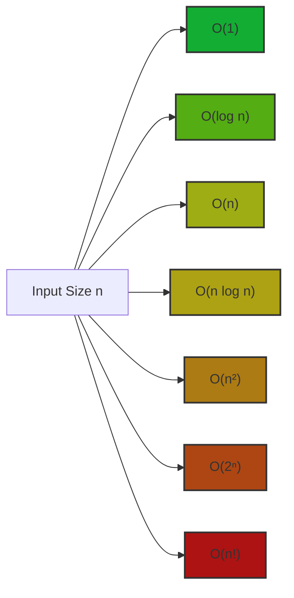

# Big O Notation

## Introduction

When you're learning to program, writing code that works is your first goal. But as you tackle larger problems, you'll discover that code can be *correct* but still too slow or memory-intensive to be practical. This is where **Big O Notation** comes in.

Big O Notation is a mathematical notation that helps us describe the performance or efficiency of algorithms. It answers crucial questions like:

- How long will my code take to run?
- How does the runtime grow as the input size increases?
- How much memory will my algorithm consume?

Think of Big O Notation as a way to classify algorithms based on their growth rate as the input size gets larger. It helps you make informed decisions about which algorithms to use for different scenarios.

## Why Big O Notation Matters

Imagine you have two algorithms that solve the same problem:

1. Algorithm A takes 1 second to process 100 items
2. Algorithm B takes 2 seconds to process 100 items

Which one would you choose? At first glance, Algorithm A seems better. But what if we scale up?

- With 10,000 items, Algorithm A might take 10,000 seconds (almost 3 hours)
- While Algorithm B might only take 20 seconds

This stark difference illustrates why understanding Big O Notation is crucial for writing efficient code, especially when dealing with large datasets.

## The Basics of Big O

Big O notation uses the formula **O(f(n))**, where:
- O stands for "Order of"
- f(n) is a function of n (usually representing the size of your input)
- n is the size of the input

The notation describes the **worst-case scenario** for an algorithm's performance.

### Common Big O Complexities

Here are the most common time complexities, listed from most efficient to least efficient:

| Notation | Name | Description |
|----------|------|-------------|
| O(1) | Constant | Runtime doesn't change with input size |
| O(log n) | Logarithmic | Runtime grows logarithmically with input size |
| O(n) | Linear | Runtime grows linearly with input size |
| O(n log n) | Linearithmic | Common in efficient sorting algorithms |
| O(n²) | Quadratic | Runtime grows quadratically with input size |
| O(2ⁿ) | Exponential | Runtime doubles with each additional input element |
| O(n!) | Factorial | Runtime grows factorially with input size |

Let's visualize how these complexities grow as input size increases:



## Analyzing Time Complexity

Let's examine some simple functions and their Big O notations:

### O(1) - Constant Time

Operations that don't depend on input size take constant time.

```javascript
function getFirstElement(array) {
  return array[0];
}

// Input: [10, 20, 30, 40, 50]
// Output: 10
// No matter how large the array is, we always perform just one operation
```

This function always takes the same amount of time regardless of the array size, so it's O(1).

### O(n) - Linear Time

When the runtime grows proportionally with input size, we have linear time.

```javascript
function sumAllElements(array) {
  let sum = 0;
  for (let i = 0; i < array.length; i++) {
    sum += array[i];
  }
  return sum;
}

// Input: [1, 2, 3, 4, 5]
// Output: 15
// The function processes each element once, so time complexity is O(n)
```

The function processes each element exactly once, so the time it takes is directly proportional to the array length.

### O(n²) - Quadratic Time

Nested iterations often result in quadratic time complexity.

```javascript
function printAllPairs(array) {
  for (let i = 0; i < array.length; i++) {
    for (let j = 0; j < array.length; j++) {
      console.log(array[i], array[j]);
    }
  }
}

// Input: [1, 2, 3]
// Output:
// 1 1
// 1 2
// 1 3
// 2 1
// 2 2
// 2 3
// 3 1
// 3 2
// 3 3
```

This function has two nested loops, each running n times, resulting in n² operations.

### O(log n) - Logarithmic Time

Algorithms that divide the problem in half each time often have logarithmic complexity.

```javascript
function binarySearch(sortedArray, target) {
  let left = 0;
  let right = sortedArray.length - 1;
  
  while (left <= right) {
    const mid = Math.floor((left + right) / 2);
    
    if (sortedArray[mid] === target) {
      return mid;
    }
    
    if (sortedArray[mid] < target) {
      left = mid + 1;
    } else {
      right = mid - 1;
    }
  }
  
  return -1;
}

// Input: ([1, 2, 3, 4, 5, 6, 7, 8, 9, 10], 7)
// Output: 6 (index of element 7)
```

Binary search divides the search space in half with each step, resulting in O(log n) complexity.

## Analyzing Space Complexity

Big O doesn't just describe time—it also describes space (memory) requirements.

```javascript
function createArray(n) {
  const result = [];
  for (let i = 0; i < n; i++) {
    result.push(i);
  }
  return result;
}

// Input: 5
// Output: [0, 1, 2, 3, 4]
// Space complexity is O(n) because we store n elements
```

This function has O(n) space complexity because it creates an array proportional to the input size.

## Simplifying Big O Expressions

When determining Big O, we follow these simplification rules:

1. **Drop constants**: O(2n) becomes O(n)
2. **Drop non-dominant terms**: O(n² + n) becomes O(n²)

For example, consider this function:

```javascript
function complexOperation(array) {
  console.log(array[0]);  // O(1)
  
  // First loop - O(n)
  for (let i = 0; i < array.length; i++) {
    console.log(array[i]);
  }
  
  // Second loop with nested loop - O(n²)
  for (let i = 0; i < array.length; i++) {
    for (let j = 0; j < array.length; j++) {
      console.log(array[i] + array[j]);
    }
  }
}
```

The total complexity is O(1 + n + n²), which simplifies to O(n²).

## Real-World Applications

### Example 1: Finding an Item in Different Data Structures

```javascript
// Finding an element in an array - O(n)
function findInArray(array, target) {
  for (let i = 0; i < array.length; i++) {
    if (array[i] === target) return i;
  }
  return -1;
}

// Finding an element in an object (hash table) - O(1)
function findInObject(object, key) {
  return object[key];
}

// Example usage:
const array = [10, 20, 30, 40, 50];
const object = { a: 10, b: 20, c: 30, d: 40, e: 50 };

console.log(findInArray(array, 30));  // Output: 2
console.log(findInObject(object, 'c'));  // Output: 30
```

This example shows why hash tables (objects in JavaScript) are preferred for lookups over arrays when performance matters.

### Example 2: Sorting Algorithms

Different sorting algorithms have different time complexities:

- Bubble Sort: O(n²)
- Merge Sort: O(n log n)
- Quick Sort: O(n log n) average case, O(n²) worst case

For large datasets, the difference between O(n²) and O(n log n) is enormous. For 1 million items:

- O(n²) = 1,000,000,000,000 operations
- O(n log n) ≈ 20,000,000 operations (50,000 times faster!)

## Common Pitfalls

### 1. Focusing Only on Big O

Big O describes the worst-case scenario. Sometimes the average case is more relevant for real-world applications.

### 2. Assuming O(1) is Always Better

Operations with O(1) complexity might have a high constant cost that makes them slower than O(n) for small inputs.

### 3. Ignoring Space Complexity

An algorithm might be time-efficient but memory-inefficient. Always consider both aspects.

## Summary

Big O Notation helps us:

1. Analyze and compare algorithm efficiency
2. Understand how algorithms scale with input size
3. Make informed decisions about algorithm selection
4. Predict performance bottlenecks before they occur

Remember these key complexities:
- O(1): Constant time (ideal)
- O(log n): Logarithmic time (very good)
- O(n): Linear time (good)
- O(n log n): Linearithmic time (decent)
- O(n²), O(2ⁿ), O(n!): Increasingly problematic as n grows

By understanding Big O Notation, you can write more efficient code, especially when working with large datasets.

## Exercises

1. Determine the time complexity of the following function:
   ```javascript
   function mystery(n) {
     let result = 0;
     for (let i = 0; i < n; i++) {
       result += i;
     }
     for (let i = 0; i < n; i++) {
       for (let j = 0; j < n; j++) {
         result += i * j;
       }
     }
     return result;
   }
   ```

2. Write a function to find the maximum element in an array. What is its time complexity?

3. Refactor this O(n²) function to achieve O(n) complexity:
   ```javascript
   function containsDuplicate(array) {
     for (let i = 0; i < array.length; i++) {
       for (let j = 0; j < array.length; j++) {
         if (i !== j && array[i] === array[j]) {
           return true;
         }
       }
     }
     return false;
   }
   ```

## Additional Resources

- MIT's Introduction to Algorithms course covers Big O in depth
- "Cracking the Coding Interview" by Gayle Laakmann McDowell has excellent chapters on algorithm complexity
- Interactive visualizations of sorting algorithms can help you see complexity differences in action
- Practice platforms like LeetCode and HackerRank provide problems where understanding Big O is crucial

Understanding Big O Notation is a fundamental step toward becoming a better programmer. It helps you write more efficient code and make better algorithmic choices in your day-to-day programming tasks.