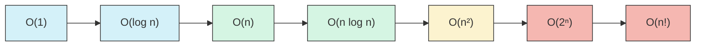

# Asymptotic Notation

## Introduction

When discussing algorithms, one of the most important aspects to consider is their efficiency. As programmers, we need ways to analyze and compare how algorithms perform as their input sizes grow. This is where **asymptotic notation** comes into play.

Asymptotic notation provides a standardized way to describe the time and space complexity of algorithms, allowing us to:

- Compare efficiency between different algorithms
- Predict how an algorithm will perform with large inputs
- Make informed decisions about which algorithm to use for a particular problem

In this tutorial, we'll explore the three most common types of asymptotic notation: Big O, Omega, and Theta, and learn how to apply them to real-world programming scenarios.

## Understanding Algorithm Efficiency

Before diving into notation, let's understand why we need to measure algorithm efficiency:

1. **Resource constraints**: Computers have finite memory and processing power
2. **Large datasets**: Modern applications often process enormous amounts of data
3. **User experience**: Slow algorithms lead to unresponsive applications
4. **Cost efficiency**: Faster algorithms mean less computational resources required

## Types of Asymptotic Notation

There are three main types of asymptotic notation:

### 1. Big O Notation (O)

Big O notation represents the **upper bound** of an algorithm's growth rate. It describes the worst-case scenario of how the runtime or space requirements grow as the input size increases.

**Formal Definition**: For a function f(n), O(f(n)) is the set of functions g(n) such that there exist positive constants c and n₀ where 0 ≤ g(n) ≤ c·f(n) for all n ≥ n₀.

In simpler terms, Big O tells us that our algorithm won't grow faster than a certain rate.

### 2. Omega Notation (Ω)

Omega notation represents the **lower bound** of an algorithm's growth rate. It describes the best-case scenario of how the runtime or space requirements grow as the input size increases.

**Formal Definition**: For a function f(n), Ω(f(n)) is the set of functions g(n) such that there exist positive constants c and n₀ where 0 ≤ c·f(n) ≤ g(n) for all n ≥ n₀.

In simpler terms, Omega tells us that our algorithm won't grow slower than a certain rate.

### 3. Theta Notation (Θ)

Theta notation represents the **tight bound** of an algorithm's growth rate. It describes both the lower and upper bounds of the growth rate.

**Formal Definition**: For a function f(n), Θ(f(n)) is the set of functions g(n) such that there exist positive constants c₁, c₂, and n₀ where 0 ≤ c₁·f(n) ≤ g(n) ≤ c₂·f(n) for all n ≥ n₀.

In simpler terms, Theta gives us the exact growth rate of an algorithm, within constant factors.

## Common Time Complexities

Here are the most common time complexities you'll encounter, ordered from most efficient to least efficient:



Let's examine each of these with examples:

### O(1) - Constant Time

An algorithm that takes the same amount of time regardless of input size.

**Example**: Accessing an element in an array by index.

```javascript
function getFirstElement(array) {
  return array[0]; // Always one operation regardless of array size
}
```

### O(log n) - Logarithmic Time

The algorithm's runtime grows logarithmically as input size increases.

**Example**: Binary search algorithm.

```javascript
function binarySearch(sortedArray, target) {
  let left = 0;
  let right = sortedArray.length - 1;
  
  while (left <= right) {
    const mid = Math.floor((left + right) / 2);
    
    if (sortedArray[mid] === target) {
      return mid; // Found the target
    }
    
    if (sortedArray[mid] < target) {
      left = mid + 1; // Search right half
    } else {
      right = mid - 1; // Search left half
    }
  }
  
  return -1; // Target not found
}

// Example usage:
const array = [1, 3, 5, 7, 9, 11, 13, 15, 17];
console.log(binarySearch(array, 7)); // Output: 3 (index of value 7)
console.log(binarySearch(array, 6)); // Output: -1 (not found)
```

### O(n) - Linear Time

The runtime grows linearly with input size.

**Example**: Finding the maximum value in an unsorted array.

```javascript
function findMax(array) {
  let max = array[0];
  
  for (let i = 1; i < array.length; i++) {
    if (array[i] > max) {
      max = array[i];
    }
  }
  
  return max;
}

// Example usage:
console.log(findMax([3, 1, 4, 1, 5, 9, 2, 6])); // Output: 9
```

### O(n log n) - Linearithmic Time

This complexity often appears in efficient sorting algorithms.

**Example**: Merge Sort algorithm.

```javascript
function mergeSort(array) {
  if (array.length <= 1) {
    return array;
  }
  
  // Split array in half
  const middle = Math.floor(array.length / 2);
  const left = array.slice(0, middle);
  const right = array.slice(middle);
  
  // Recursively sort both halves
  return merge(mergeSort(left), mergeSort(right));
}

function merge(left, right) {
  let result = [];
  let leftIndex = 0;
  let rightIndex = 0;
  
  // Compare elements from both arrays and merge them in sorted order
  while (leftIndex < left.length && rightIndex < right.length) {
    if (left[leftIndex] < right[rightIndex]) {
      result.push(left[leftIndex]);
      leftIndex++;
    } else {
      result.push(right[rightIndex]);
      rightIndex++;
    }
  }
  
  // Add remaining elements
  return result.concat(left.slice(leftIndex)).concat(right.slice(rightIndex));
}

// Example usage:
console.log(mergeSort([38, 27, 43, 3, 9, 82, 10])); 
// Output: [3, 9, 10, 27, 38, 43, 82]
```

### O(n²) - Quadratic Time

Algorithms with nested iterations over the input typically have quadratic time complexity.

**Example**: Bubble Sort algorithm.

```javascript
function bubbleSort(array) {
  const n = array.length;
  
  for (let i = 0; i < n; i++) {
    for (let j = 0; j < n - i - 1; j++) {
      if (array[j] > array[j + 1]) {
        // Swap elements
        const temp = array[j];
        array[j] = array[j + 1];
        array[j + 1] = temp;
      }
    }
  }
  
  return array;
}

// Example usage:
console.log(bubbleSort([5, 3, 8, 4, 2]));
// Output: [2, 3, 4, 5, 8]
```

### O(2ⁿ) - Exponential Time

The runtime doubles with each addition to the input size. Often seen in recursive algorithms that solve problems of size n by solving two smaller problems of size n-1.

**Example**: Recursive calculation of Fibonacci numbers.

```javascript
function fibonacci(n) {
  if (n <= 1) {
    return n;
  }
  return fibonacci(n - 1) + fibonacci(n - 2);
}

// Example usage:
console.log(fibonacci(10)); // Output: 55
// Note: This is inefficient for large values of n
```

### O(n!) - Factorial Time

The runtime grows factorially with input size. These algorithms are typically impractical except for very small inputs.

**Example**: Brute force solution to the Traveling Salesman Problem.

```javascript
function tspBruteForce(distances) {
  const n = distances.length;
  const cities = Array.from({ length: n }, (_, i) => i);
  let minDistance = Infinity;
  
  // Generate all permutations of city order
  function permute(arr, start = 0) {
    if (start === arr.length - 1) {
      // Calculate total distance for this permutation
      let totalDistance = 0;
      for (let i = 0; i < n - 1; i++) {
        totalDistance += distances[arr[i]][arr[i + 1]];
      }
      // Add distance back to starting city
      totalDistance += distances[arr[n - 1]][arr[0]];
      
      minDistance = Math.min(minDistance, totalDistance);
      return;
    }
    
    for (let i = start; i < arr.length; i++) {
      // Swap elements
      [arr[start], arr[i]] = [arr[i], arr[start]];
      // Recurse on the rest
      permute(arr, start + 1);
      // Backtrack
      [arr[start], arr[i]] = [arr[i], arr[start]];
    }
  }
  
  permute(cities);
  return minDistance;
}

// Example usage (distance matrix between 4 cities):
const distances = [
  [0, 10, 15, 20],
  [10, 0, 35, 25],
  [15, 35, 0, 30],
  [20, 25, 30, 0]
];
console.log(tspBruteForce(distances)); // Output: 80
```

## Space Complexity

Just as time complexity measures how runtime scales with input size, space complexity measures how memory usage scales.

**Example**: Analyzing space complexity of a recursive function.

```javascript
function factorial(n) {
  // Base case
  if (n <= 1) {
    return 1;
  }
  // Recursive case
  return n * factorial(n - 1);
}

// This has O(n) space complexity due to the call stack size
```

## Practical Applications

Understanding asymptotic notation has several practical applications:

### 1. Choosing the Right Data Structure

Different data structures have different time complexities for operations like insertion, deletion, and lookup:

| Data Structure | Access | Search | Insertion | Deletion |
|---------------|--------|--------|-----------|----------|
| Array         | O(1)   | O(n)   | O(n)      | O(n)     |
| Linked List   | O(n)   | O(n)   | O(1)      | O(1)     |
| Hash Table    | N/A    | O(1)*  | O(1)*     | O(1)*    |
| Binary Search Tree | O(log n)* | O(log n)* | O(log n)* | O(log n)* |

*Average case. Worst case may differ.

### 2. API Design

When designing APIs that may need to handle large amounts of data, understanding time complexity helps you create scalable solutions:

```javascript
// Bad design for large datasets - O(n²)
function findDuplicates(array) {
  const duplicates = [];
  
  for (let i = 0; i < array.length; i++) {
    for (let j = i + 1; j < array.length; j++) {
      if (array[i] === array[j] && !duplicates.includes(array[i])) {
        duplicates.push(array[i]);
      }
    }
  }
  
  return duplicates;
}

// Better design - O(n)
function findDuplicatesEfficient(array) {
  const seen = new Set();
  const duplicates = new Set();
  
  for (const item of array) {
    if (seen.has(item)) {
      duplicates.add(item);
    } else {
      seen.add(item);
    }
  }
  
  return Array.from(duplicates);
}
```

### 3. Database Query Optimization

Understanding asymptotic notation helps in optimizing database queries:

```sql
-- Inefficient query without indexing (may result in O(n) scan)
SELECT * FROM users WHERE email = 'user@example.com';

-- After adding an index, lookups become O(log n) or better
CREATE INDEX idx_email ON users(email);
SELECT * FROM users WHERE email = 'user@example.com';
```

### 4. Handling Scale

As your application grows, algorithms that seemed fast enough may become bottlenecks:

```javascript
// This might work fine for 100 users
function generateRecommendations(users) {
  const recommendations = [];
  
  for (const user of users) {
    for (const otherUser of users) {
      // O(n²) complexity comparing every user with every other user
      if (user !== otherUser && haveSimilarInterests(user, otherUser)) {
        recommendations.push({
          user: user.id,
          recommendedUser: otherUser.id
        });
      }
    }
  }
  
  return recommendations;
}

// This approach might be needed for 1,000,000+ users
function generateRecommendationsScalable(users) {
  // Use more efficient algorithms like collaborative filtering
  // or locality-sensitive hashing to avoid O(n²) complexity
}
```

## Common Mistakes and Misconceptions

### 1. Ignoring constants

While asymptotic notation ignores constants, they can still matter in practice. An O(n) algorithm with a large constant can be slower than an O(n²) algorithm for small inputs.

### 2. Focusing only on worst-case

Sometimes average-case complexity is more relevant than worst-case. For example, quicksort is popular despite having a worst-case of O(n²) because its average-case is O(n log n) and performs well in practice.

### 3. Not considering space complexity

Time isn't the only resource! Memory usage can be just as important, especially on devices with limited RAM.

## Summary

Asymptotic notation gives us a standardized way to describe and compare algorithm efficiency:

- **Big O (O)**: Upper bound (worst-case)
- **Omega (Ω)**: Lower bound (best-case)
- **Theta (Θ)**: Tight bound (average-case)

Common time complexities from most to least efficient:
- O(1): Constant time
- O(log n): Logarithmic time
- O(n): Linear time
- O(n log n): Linearithmic time
- O(n²): Quadratic time
- O(2ⁿ): Exponential time
- O(n!): Factorial time

Understanding asymptotic notation is crucial for:
- Choosing appropriate algorithms and data structures
- Designing scalable systems
- Optimizing performance bottlenecks
- Technical interviews at top tech companies

## Practice Exercises

1. Determine the time complexity of the following function:
   ```javascript
   function mystery(n) {
     let result = 0;
     for (let i = 0; i < n; i++) {
       for (let j = 0; j < i; j++) {
         result += 1;
       }
     }
     return result;
   }
   ```

2. Compare the time complexity of linear search vs. binary search and explain when you would use each.

3. Implement two solutions to find the sum of all pairs in an array that equal a target value - one with O(n²) and one with O(n) time complexity.

4. Analyze the space and time complexity of a recursive function to compute the nth Fibonacci number. Then implement an optimized version with improved complexity.

## Further Reading

- "Introduction to Algorithms" by Thomas H. Cormen, Charles E. Leiserson, Ronald L. Rivest, and Clifford Stein
- "Grokking Algorithms" by Aditya Bhargava
- "The Algorithm Design Manual" by Steven Skiena
- Stanford University's Algorithm Specialization on Coursera
- MIT's Introduction to Algorithms course on OCW

Understanding asymptotic notation is a fundamental skill for any programmer. With practice, you'll become better at analyzing algorithms and making informed decisions about which ones to use in different situations.