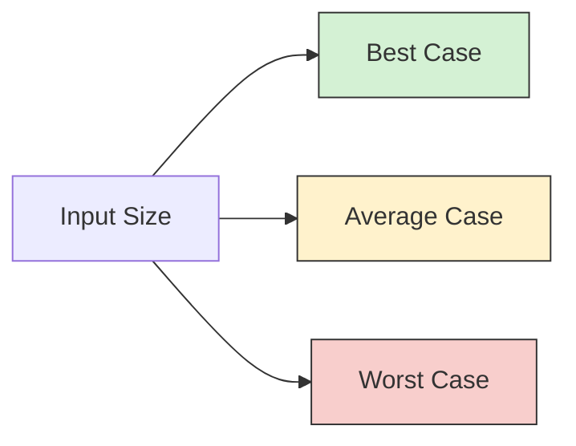
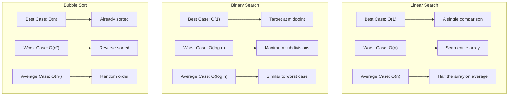

# Best, Worst, and Average Case

When we analyze algorithms, we need to understand how they perform under different conditions. This is where the concepts of best-case, worst-case, and average-case analysis come into play. These performance measures help us predict how an algorithm will behave in different situations and make informed decisions about which algorithms to use for specific problems.

## What Are Case Analyses?

Algorithm analysis involves measuring the efficiency of an algorithm in terms of:
- Running time (time complexity)
- Memory usage (space complexity)

Each of these can vary depending on the input. Let's focus on the three main scenarios:

### 1. Best Case

The best-case scenario represents the **minimum** time or space required by an algorithm. This occurs with the most favorable input data.

### 2. Worst Case

The worst-case scenario represents the **maximum** time or space required. This occurs with the most unfavorable input data.

### 3. Average Case

The average-case scenario represents the **expected** time or space required when using random input data.

## Why Do These Cases Matter?

Understanding these different cases helps us:
- Predict algorithm performance across various input types
- Plan for resource allocation in applications
- Choose the right algorithm for specific situations
- Avoid unexpected slowdowns in critical systems

## Analysis Examples

Let's examine these cases through some common algorithms:

### Linear Search Example

Linear search checks each element in a list one by one until the target is found.

```javascript
function linearSearch(arr, target) {
  for (let i = 0; i < arr.length; i++) {
    if (arr[i] === target) {
      return i; // Found the target at index i
    }
  }
  return -1; // Target not found
}
```

**Case Analysis:**
- **Best Case**: O(1) - Target is the first element
- **Worst Case**: O(n) - Target is the last element or not present
- **Average Case**: O(n/2) ≈ O(n) - Target is at the middle position on average

**Example:**
```javascript
const numbers = [10, 24, 36, 42, 55, 67, 78];

// Best case - element at the beginning
console.log(linearSearch(numbers, 10));  // Output: 0 (1 comparison)

// Worst case - element at the end
console.log(linearSearch(numbers, 78));  // Output: 6 (7 comparisons)

// Element not in array (also worst case)
console.log(linearSearch(numbers, 100)); // Output: -1 (7 comparisons)
```

### Binary Search Example

Binary search requires a sorted array and repeatedly divides the search space in half.

```javascript
function binarySearch(arr, target) {
  let left = 0;
  let right = arr.length - 1;
  
  while (left <= right) {
    const mid = Math.floor((left + right) / 2);
    
    if (arr[mid] === target) {
      return mid;
    } else if (arr[mid] < target) {
      left = mid + 1;
    } else {
      right = mid - 1;
    }
  }
  
  return -1;
}
```

**Case Analysis:**
- **Best Case**: O(1) - Target is at the middle of the array
- **Worst Case**: O(log n) - Target is at the end of the last subdivision or not present
- **Average Case**: O(log n) - Similar to worst case

**Example:**
```javascript
const sortedNumbers = [10, 20, 30, 40, 50, 60, 70, 80, 90, 100];

// Best case - element at the middle
console.log(binarySearch(sortedNumbers, 50));  // Output: 4

// Worst case - element requiring maximum subdivisions
console.log(binarySearch(sortedNumbers, 10));  // Output: 0

// Element not in array (also worst case)
console.log(binarySearch(sortedNumbers, 55));  // Output: -1
```

### Bubble Sort Example

Bubble sort repeatedly compares adjacent elements and swaps them if they're in the wrong order.

```javascript
function bubbleSort(arr) {
  const n = arr.length;
  let swapped;
  
  for (let i = 0; i < n; i++) {
    swapped = false;
    
    for (let j = 0; j < n - i - 1; j++) {
      if (arr[j] > arr[j + 1]) {
        // Swap elements
        [arr[j], arr[j + 1]] = [arr[j + 1], arr[j]];
        swapped = true;
      }
    }
    
    // If no swapping occurred in this pass, array is sorted
    if (!swapped) {
      break;
    }
  }
  
  return arr;
}
```

**Case Analysis:**
- **Best Case**: O(n) - Array is already sorted (with optimization)
- **Worst Case**: O(n²) - Array is sorted in reverse order
- **Average Case**: O(n²) - Randomly ordered array

**Example:**
```javascript
// Best case - already sorted array
const sortedArray = [1, 2, 3, 4, 5];
console.log(bubbleSort([...sortedArray]));  // Output: [1, 2, 3, 4, 5]

// Worst case - reverse sorted array
const reverseArray = [5, 4, 3, 2, 1];
console.log(bubbleSort([...reverseArray]));  // Output: [1, 2, 3, 4, 5]

// Average case - randomly ordered array
const randomArray = [3, 1, 5, 2, 4];
console.log(bubbleSort([...randomArray]));  // Output: [1, 2, 3, 4, 5]
```

## Visualization of Different Cases

To better understand these concepts, let's visualize the performance differences:



For specific algorithms, the growth rates might look like:



## Real-World Applications

Understanding these different cases has practical implications:

### 1. Database Query Optimization

When designing database indices:
- **Best case**: Querying for an indexed field with a unique value
- **Worst case**: Full table scan when no suitable index exists
- **Average case**: Querying with selective filters that use some indices

### 2. Web Service Response Times

For a web API handling user requests:
- **Best case**: Cached response with no database queries
- **Worst case**: Complex query requiring multiple joins and calculations
- **Average case**: Typical user request with moderate processing

### 3. Navigation Systems

For path-finding algorithms in GPS systems:
- **Best case**: Direct route with no obstacles
- **Worst case**: Heavily congested area with many road closures
- **Average case**: Typical city navigation with some traffic

## How to Approach Algorithm Analysis

When analyzing your own algorithms, follow these steps:

1. **Identify input factors** that affect performance (size, order, distribution)
2. **Determine the best case** - What's the most favorable input?
3. **Determine the worst case** - What's the most challenging input?
4. **Calculate the average case** - What happens with random inputs?
5. **Express the complexity** using Big O notation
6. **Validate empirically** by testing with different inputs

## Making Design Decisions

When choosing between algorithms:

- If your application needs **consistent performance**, focus on worst-case analysis to avoid unexpected slowdowns
- If **average performance** matters most, optimize for the average case
- If you can **guarantee favorable inputs**, you might select algorithms with better best-case performance
- For **critical systems**, always plan for the worst-case scenario

## Summary

Algorithm analysis through best, worst, and average cases provides a comprehensive understanding of performance:

- **Best case** shows performance under optimal conditions
- **Worst case** reveals performance limits under challenging inputs
- **Average case** indicates typical expected performance

These analyses help developers make informed decisions about which algorithms to use based on specific requirements and constraints.

## Exercises

1. Analyze the best, worst, and average cases for the following algorithms:
   - Insertion sort
   - Merge sort
   - Quick sort

2. For a given problem, design an algorithm with:
   - Better best-case performance than the standard solution
   - Better worst-case performance than the standard solution

3. Profile a simple search algorithm on different input distributions and compare the actual running times with theoretical predictions.

## Additional Resources

- "Introduction to Algorithms" by Cormen, Leiserson, Rivest, and Stein
- "Algorithms" by Robert Sedgewick and Kevin Wayne
- "The Algorithm Design Manual" by Steven Skiena

Understanding these fundamental concepts of algorithm analysis will help you make better decisions when designing and implementing solutions to computational problems.