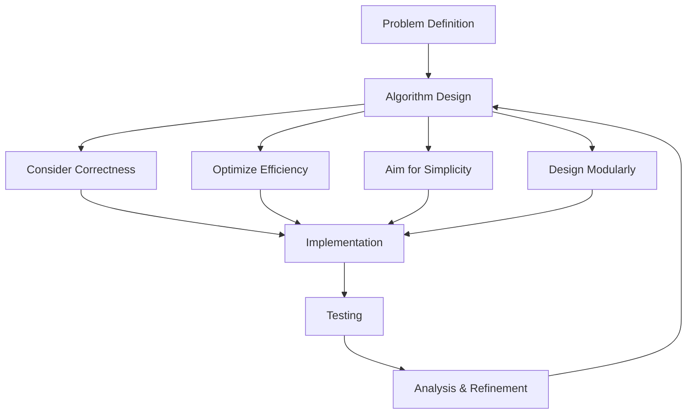

# Algorithm Design Principles

## Introduction

Algorithm design is the process of creating step-by-step instructions to solve computational problems. Good algorithm design isn't just about finding a solution—it's about finding an efficient, reliable, and maintainable solution. 

In this tutorial, we'll explore the core principles that guide effective algorithm design. Whether you're solving simple programming exercises or tackling complex real-world problems, these principles will help you create better algorithms.

## Why Algorithm Design Matters

Before diving into the principles, let's understand why algorithm design is crucial:

- **Performance**: A well-designed algorithm can solve problems with minimal resources (time and memory).
- **Scalability**: Good algorithms continue to perform well as input sizes grow.
- **Reliability**: Proper design ensures consistent and correct results across all valid inputs.
- **Maintainability**: Well-structured algorithms are easier to understand, debug, and enhance.

## Core Algorithm Design Principles

### 1. Correctness

The most fundamental requirement for any algorithm is correctness—it must produce the right output for all valid inputs.

#### Key aspects of correctness:

- **Handle all valid inputs**: Your algorithm should work for all inputs within the defined problem constraints.
- **Handle edge cases**: Consider boundary conditions, empty inputs, minimum/maximum values, etc.
- **Verify with test cases**: Use diverse test cases to confirm your algorithm's correctness.

#### Example: Finding the maximum number in an array

Let's look at an algorithm to find the maximum element in an array:

```javascript
function findMaximum(arr) {
  if (arr.length === 0) {
    throw new Error("Array cannot be empty");
  }
  
  let max = arr[0];
  for (let i = 1; i < arr.length; i++) {
    if (arr[i] > max) {
      max = arr[i];
    }
  }
  return max;
}

// Example usage:
const numbers = [3, 7, 2, 9, 1];
console.log(findMaximum(numbers)); // Output: 9
```

Notice how this algorithm handles the edge case of an empty array and properly initializes `max` to the first element rather than a potentially smaller value like zero.

### 2. Efficiency

An efficient algorithm uses minimal resources (time and memory) to solve a problem.

#### Time efficiency:

Time efficiency is typically measured using Big O notation, which describes how the runtime scales with input size.

Common time complexities (in increasing order of efficiency):
- O(n!): Factorial time (factorial algorithms)
- O(2^n): Exponential time (brute force algorithms)
- O(n^2): Quadratic time (nested loops)
- O(n log n): Linearithmic time (efficient sorting algorithms)
- O(n): Linear time (single pass through data)
- O(log n): Logarithmic time (binary search)
- O(1): Constant time (direct access)

#### Space efficiency:

Space complexity measures how much memory an algorithm requires.

#### Example: Two approaches to sum an array

**Approach 1**: Using a loop (efficient)

```javascript
function sumArray(arr) {
  let sum = 0;
  for (let i = 0; i < arr.length; i++) {
    sum += arr[i];
  }
  return sum;
}

// Time complexity: O(n)
// Space complexity: O(1)
```

**Approach 2**: Using recursion (less efficient for space)

```javascript
function sumArrayRecursive(arr, index = 0) {
  // Base case
  if (index === arr.length) {
    return 0;
  }
  
  // Recursive case
  return arr[index] + sumArrayRecursive(arr, index + 1);
}

// Time complexity: O(n)
// Space complexity: O(n) due to call stack
```

Both algorithms have O(n) time complexity, but the iterative approach uses constant space O(1), while the recursive approach uses O(n) space due to the call stack.

### 3. Simplicity

Simple algorithms are easier to understand, implement, and debug.

#### Guidelines for simplicity:

- Choose straightforward approaches when possible
- Avoid premature optimization
- Use descriptive variable and function names
- Break complex operations into simpler steps

#### Example: Finding if a number is prime

**Complex approach:**

```javascript
function isPrime(n) {
  if (n <= 1) return false;
  if (n <= 3) return true;
  if (n % 2 === 0 || n % 3 === 0) return false;
  
  let i = 5;
  while (i * i <= n) {
    if (n % i === 0 || n % (i + 2) === 0) return false;
    i += 6;
  }
  return true;
}
```

**Simpler approach (though less efficient):**

```javascript
function isPrimeSimple(n) {
  if (n <= 1) return false;
  
  for (let i = 2; i < n; i++) {
    if (n % i === 0) return false;
  }
  return true;
}
```

The simpler approach is more readable and easier to understand, though it's less efficient. Often, you should start with a simple approach and optimize only when necessary.

### 4. Modularity

Breaking algorithms into independent, reusable components makes them easier to understand, test, and maintain.

#### Benefits of modular design:

- Reusable components
- Easier debugging
- Improved readability
- Better testing capabilities

#### Example: Sorting and searching

```javascript
// A modular approach to finding the median of an array

// Component 1: Sorting function
function sortArray(arr) {
  return [...arr].sort((a, b) => a - b);
}

// Component 2: Find median function
function findMedian(arr) {
  const sortedArr = sortArray(arr);
  const middle = Math.floor(sortedArr.length / 2);
  
  if (sortedArr.length % 2 === 0) {
    return (sortedArr[middle - 1] + sortedArr[middle]) / 2;
  } else {
    return sortedArr[middle];
  }
}

// Example usage
const data = [5, 2, 9, 1, 7];
console.log(findMedian(data)); // Output: 5
```

By separating the sorting and median-finding logic, we've created modular components that can be reused, tested, and maintained independently.

### 5. Adaptability

Good algorithms should be adaptable to changing requirements and environments.

#### Strategies for adaptability:

- Use parameters to control behavior
- Design for extensibility
- Implement interfaces for interchangeable components
- Avoid hard-coding values

#### Example: Flexible sorting algorithm

```javascript
function sortItems(items, comparator = null) {
  // Default comparator for numbers
  const defaultComparator = (a, b) => a - b;
  
  // Use provided comparator or default
  const compareFunction = comparator || defaultComparator;
  
  return [...items].sort(compareFunction);
}

// Example usage
const numbers = [5, 2, 9, 1, 7];

// Default sorting (ascending)
console.log(sortItems(numbers)); 
// Output: [1, 2, 5, 7, 9]

// Custom sorting (descending)
console.log(sortItems(numbers, (a, b) => b - a)); 
// Output: [9, 7, 5, 2, 1]

// Sorting strings by length
const words = ["apple", "cat", "elephant", "dog"];
console.log(sortItems(words, (a, b) => a.length - b.length));
// Output: ["cat", "dog", "apple", "elephant"]
```

This algorithm is adaptable through the use of a custom comparator function, allowing it to be used in various scenarios.

## Real-World Application: Building a Task Scheduler

Let's apply these principles to design a simple task scheduler that prioritizes tasks based on urgency and importance.

```javascript
class Task {
  constructor(id, name, urgency, importance) {
    this.id = id;
    this.name = name;
    this.urgency = urgency; // 1-10
    this.importance = importance; // 1-10
  }
  
  getPriority() {
    return this.urgency * this.importance;
  }
}

class TaskScheduler {
  constructor() {
    this.tasks = [];
  }
  
  addTask(task) {
    this.tasks.push(task);
  }
  
  removeTasks(taskId) {
    this.tasks = this.tasks.filter(task => task.id !== taskId);
  }
  
  getNextTask() {
    if (this.tasks.length === 0) {
      return null;
    }
    
    // Sort by priority (importance * urgency)
    this.tasks.sort((a, b) => b.getPriority() - a.getPriority());
    
    return this.tasks[0];
  }
  
  getTopNTasks(n) {
    // Make a copy to avoid modifying the original array
    const sortedTasks = [...this.tasks].sort(
      (a, b) => b.getPriority() - a.getPriority()
    );
    
    return sortedTasks.slice(0, n);
  }
}

// Example usage
const scheduler = new TaskScheduler();

scheduler.addTask(new Task(1, "Finish project", 8, 9));
scheduler.addTask(new Task(2, "Answer emails", 5, 3));
scheduler.addTask(new Task(3, "Prepare presentation", 7, 7));
scheduler.addTask(new Task(4, "Update website", 4, 6));

const nextTask = scheduler.getNextTask();
console.log("Next task to work on:", nextTask.name);
// Output: Next task to work on: Finish project

const top3Tasks = scheduler.getTopNTasks(3);
console.log("Top 3 priority tasks:");
top3Tasks.forEach(task => {
  console.log(`- ${task.name} (Priority: ${task.getPriority()})`);
});
// Output:
// Top 3 priority tasks:
// - Finish project (Priority: 72)
// - Prepare presentation (Priority: 49)
// - Update website (Priority: 24)
```

In this example, we've applied several algorithm design principles:

1. **Correctness**: The scheduler handles tasks correctly, even when there are no tasks.
2. **Efficiency**: We use efficient sorting algorithms to prioritize tasks.
3. **Simplicity**: The code is straightforward and easy to understand.
4. **Modularity**: We've separated Task and TaskScheduler classes with clear responsibilities.
5. **Adaptability**: The scheduler can adapt to different prioritization schemes by modifying the getPriority method.

## Visualizing Algorithm Design Process



## Common Algorithm Design Patterns

Here are some useful patterns to consider when designing algorithms:

1. **Divide and Conquer**: Break problems into smaller subproblems, solve each subproblem, and combine results.
   - Examples: Merge sort, quicksort, binary search

2. **Greedy Approach**: Make locally optimal choices at each step.
   - Examples: Dijkstra's algorithm, Huffman coding

3. **Dynamic Programming**: Break problems into overlapping subproblems and store results of subproblems.
   - Examples: Fibonacci calculation, longest common subsequence

4. **Backtracking**: Build solutions incrementally, abandoning a path when it's determined to be invalid.
   - Examples: N-Queens problem, sudoku solver

5. **Branch and Bound**: Explore branches of solution space, pruning branches that can't lead to optimal solutions.
   - Examples: Traveling salesman problem, knapsack problem

## Summary

Effective algorithm design follows key principles that ensure your solutions are not just functional, but optimal:

1. **Correctness**: Ensure your algorithm works for all valid inputs
2. **Efficiency**: Optimize time and space complexity
3. **Simplicity**: Make your algorithm easy to understand
4. **Modularity**: Break complex algorithms into manageable components
5. **Adaptability**: Design for changing requirements

By applying these principles consistently, you'll develop more robust, efficient, and maintainable algorithms that can scale to solve increasingly complex problems.

## Exercises

1. Analyze the time and space complexity of a simple algorithm you've previously written.
2. Take an existing algorithm and improve its efficiency without sacrificing correctness.
3. Design a modular solution for sorting a list of custom objects based on multiple criteria.
4. Identify three edge cases for a binary search algorithm and explain how your implementation would handle them.
5. Compare and contrast two different algorithms for solving the same problem using the principles discussed.

## Additional Resources

- **Books**:
  - "Introduction to Algorithms" by Cormen, Leiserson, Rivest, and Stein
  - "Algorithm Design Manual" by Steven Skiena
  
- **Online Courses**:
  - Coursera: Algorithms Specialization by Stanford University
  - Udemy: Master the Coding Interview: Data Structures + Algorithms
  
- **Practice Platforms**:
  - LeetCode
  - HackerRank
  - CodeSignal

Remember, becoming proficient at algorithm design requires practice. Start with simple problems, analyze your solutions based on these principles, and gradually tackle more complex challenges. Happy coding!