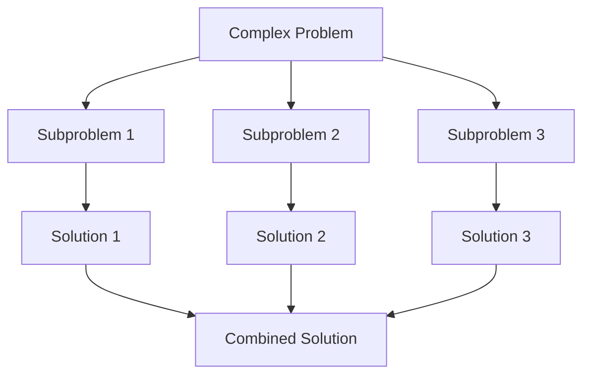

# Problem Solving Strategies

## Introduction

Problem solving is the core of programming and algorithm development. Even the most complex software systems are built by solving a series of smaller problems. As a beginner programmer, developing a structured approach to problem solving will help you tackle increasingly difficult challenges with confidence.

This guide will introduce you to key problem-solving strategies that form the foundation of algorithmic thinking. You'll learn how to analyze problems, break them down into manageable components, and develop solutions systematically.

## Understanding the Problem

Before writing a single line of code, it's essential to fully understand the problem you're trying to solve.

### Strategy: Read-Understand-Restate

1. **Read the problem carefully** - Read through the entire problem statement.
2. **Identify key information** - Note constraints, input formats, and expected outputs.
3. **Restate the problem** - Try explaining the problem in your own words.

### Example

**Original Problem:**
> Write a function that takes an array of integers and returns the two numbers that add up to a target sum.

**Restated Problem:**
> I need to find two numbers in an array that when added together equal a specific target value. I'll need to return these two numbers.

### Clarifying Questions

When faced with a problem, ask yourself:

- What are the inputs?
- What are the expected outputs?
- What constraints exist?
- Can I come up with test cases?

## Breaking Down the Problem

Large problems can be intimidating. The art of problem solving often involves breaking down complex problems into smaller, more manageable subproblems.

### Strategy: Divide and Conquer

Divide the problem into smaller subproblems, solve each subproblem independently, and then combine their solutions.



### Example: Computing Fibonacci Numbers

Instead of directly computing the nth Fibonacci number, break it down:

```javascript
function fibonacci(n) {
  // Base cases
  if (n <= 0) return 0;
  if (n === 1) return 1;
  
  // Break down into subproblems: fib(n) = fib(n-1) + fib(n-2)
  return fibonacci(n - 1) + fibonacci(n - 2);
}

// Example usage
console.log(fibonacci(6)); // Output: 8
```

## Working with Examples

Examples help clarify your understanding of the problem and can lead to insights about potential solutions.

### Strategy: Use Test Cases

1. **Start with simple cases** - Try the most basic inputs
2. **Progress to edge cases** - Test boundary conditions
3. **Create complex cases** - Ensure your solution works generally

### Example: Finding the Maximum Element

```javascript
function findMax(arr) {
  // Handle edge case
  if (arr.length === 0) return null;
  
  let max = arr[0];
  
  for (let i = 1; i < arr.length; i++) {
    if (arr[i] > max) {
      max = arr[i];
    }
  }
  
  return max;
}

// Test cases
console.log(findMax([1, 3, 5, 2, 4]));    // Output: 5
console.log(findMax([-10, -5, -2, -20])); // Output: -2
console.log(findMax([]));                 // Output: null
```

## Pattern Recognition

Many problems follow common patterns. Learning to recognize these patterns helps you apply solutions you already know to new problems.

### Common Patterns

1. **Iteration** - Processing items one by one
2. **Recursion** - Breaking a problem into similar subproblems
3. **Divide and Conquer** - Breaking a problem into independent subproblems
4. **Dynamic Programming** - Breaking a problem into overlapping subproblems
5. **Greedy Algorithms** - Making locally optimal choices

### Example: Recognizing a Summation Pattern

```javascript
// Problem: Sum all numbers from 1 to n

// Iterative approach
function sumIterative(n) {
  let sum = 0;
  for (let i = 1; i <= n; i++) {
    sum += i;
  }
  return sum;
}

// Mathematical pattern recognition: sum = n * (n + 1) / 2
function sumMathematical(n) {
  return n * (n + 1) / 2;
}

// Compare results
console.log(sumIterative(100));      // Output: 5050
console.log(sumMathematical(100));   // Output: 5050
```

## Incremental Development

Build your solution step by step, testing each component along the way.

### Strategy: Start Simple and Refine

1. **Solve a simplified version** - Solve a simpler case first
2. **Add complexity gradually** - Enhance your solution incrementally
3. **Test as you go** - Verify each step works correctly

### Example: Building a Palindrome Checker

```javascript
// Step 1: Handle the basic case (single word)
function isPalindromeBasic(str) {
  const reversed = str.split('').reverse().join('');
  return str === reversed;
}

// Step 2: Handle case sensitivity
function isPalindromeCaseInsensitive(str) {
  const normalized = str.toLowerCase();
  const reversed = normalized.split('').reverse().join('');
  return normalized === reversed;
}

// Step 3: Handle non-alphanumeric characters
function isPalindrome(str) {
  const normalized = str.toLowerCase().replace(/[^a-z0-9]/g, '');
  const reversed = normalized.split('').reverse().join('');
  return normalized === reversed;
}

// Testing the incremental development
console.log(isPalindromeBasic("radar"));                  // Output: true
console.log(isPalindromeCaseInsensitive("Radar"));        // Output: true
console.log(isPalindrome("A man, a plan, a canal: Panama")); // Output: true
```

## Working Backward

Sometimes, starting with the desired output and working backward to the input can be an effective approach.

### Strategy: Reverse Engineering

1. **Start with the desired outcome**
2. **Determine what would produce that outcome**
3. **Continue working backward until reaching the initial state**

### Example: Finding the Square Root

```javascript
function findSquareRoot(n, tolerance = 0.0001) {
  // Start with a guess
  let guess = n / 2;
  
  // Work backward: if guess is correct, guess * guess should equal n
  while (Math.abs(guess * guess - n) > tolerance) {
    // Newton's method: improve the guess
    guess = (guess + n / guess) / 2;
  }
  
  return guess;
}

console.log(findSquareRoot(16));  // Output: ~4
console.log(findSquareRoot(2));   // Output: ~1.414
```

## Algorithmic Thinking

Developing an algorithmic mindset means thinking in terms of clear, repeatable steps to solve problems.

### Strategy: Step-by-Step Planning

1. **Define the inputs and outputs clearly**
2. **Outline the steps in plain language first**
3. **Translate the steps into code**
4. **Optimize and refine**

### Example: Sorting an Array (Bubble Sort)

First, let's plan the algorithm:

1. Compare adjacent elements
2. Swap them if they're in the wrong order
3. Repeat until the array is sorted

Now, let's implement it:

```javascript
function bubbleSort(arr) {
  const n = arr.length;
  
  // Algorithm plan:
  // 1. Iterate through the array multiple times
  // 2. Each pass, compare adjacent elements and swap if needed
  // 3. Continue until no swaps are needed (array is sorted)
  
  for (let i = 0; i < n; i++) {
    let swapped = false;
    
    // Compare adjacent elements
    for (let j = 0; j < n - i - 1; j++) {
      if (arr[j] > arr[j + 1]) {
        // Swap elements
        [arr[j], arr[j + 1]] = [arr[j + 1], arr[j]];
        swapped = true;
      }
    }
    
    // If no swapping occurred, array is sorted
    if (!swapped) break;
  }
  
  return arr;
}

// Test the algorithm
const array = [64, 34, 25, 12, 22, 11, 90];
console.log("Original array:", array);
console.log("Sorted array:", bubbleSort([...array]));
// Output: Sorted array: [11, 12, 22, 25, 34, 64, 90]
```

## Time and Space Complexity Analysis

Understanding how your solution performs is a critical aspect of problem solving.

### Key Concepts

- **Time Complexity**: How execution time scales with input size
- **Space Complexity**: How memory usage scales with input size
- **Big O Notation**: Mathematical notation to describe complexity

### Example: Analyzing Two Solutions

```javascript
// Solution 1: Finding a duplicate in an array using nested loops
function findDuplicateNested(arr) {
  // Time Complexity: O(n²)
  // Space Complexity: O(1)
  for (let i = 0; i < arr.length; i++) {
    for (let j = i + 1; j < arr.length; j++) {
      if (arr[i] === arr[j]) return arr[i];
    }
  }
  return null;
}

// Solution 2: Finding a duplicate using a Set
function findDuplicateSet(arr) {
  // Time Complexity: O(n)
  // Space Complexity: O(n)
  const seen = new Set();
  
  for (const item of arr) {
    if (seen.has(item)) return item;
    seen.add(item);
  }
  
  return null;
}

// Testing both solutions
const testArray = [1, 2, 3, 4, 2, 5];
console.log(findDuplicateNested(testArray)); // Output: 2
console.log(findDuplicateSet(testArray));    // Output: 2
```

## Real-World Application: Building a To-Do List Manager

Let's apply these problem-solving strategies to create a simple to-do list manager.

### Step 1: Understanding the Problem

We need to build a to-do list manager that can:
- Add new tasks
- Mark tasks as complete
- Remove tasks
- Display the current list of tasks

### Step 2: Breaking Down the Problem

We can break this down into:
- Data structure to store tasks
- Functions for each operation
- User interface (simplified for this example)

### Step 3: Solution

```javascript
class TodoList {
  constructor() {
    this.tasks = [];
  }
  
  // Add a new task
  addTask(description) {
    const newTask = {
      id: Date.now(), // Simple unique ID
      description,
      completed: false
    };
    this.tasks.push(newTask);
    return newTask;
  }
  
  // Toggle completion status
  toggleComplete(taskId) {
    const task = this.tasks.find(task => task.id === taskId);
    if (task) {
      task.completed = !task.completed;
      return true;
    }
    return false;
  }
  
  // Remove a task
  removeTask(taskId) {
    const initialLength = this.tasks.length;
    this.tasks = this.tasks.filter(task => task.id !== taskId);
    return this.tasks.length !== initialLength;
  }
  
  // List all tasks
  listTasks(showCompleted = true) {
    return showCompleted 
      ? this.tasks 
      : this.tasks.filter(task => !task.completed);
  }
}

// Example usage
const myTodoList = new TodoList();

// Add some tasks
const task1 = myTodoList.addTask("Learn problem solving");
const task2 = myTodoList.addTask("Practice algorithms");
const task3 = myTodoList.addTask("Build a project");

console.log("Initial list:", myTodoList.listTasks());

// Mark a task as complete
myTodoList.toggleComplete(task1.id);
console.log("After completing a task:", myTodoList.listTasks());

// Show only incomplete tasks
console.log("Incomplete tasks:", myTodoList.listTasks(false));

// Remove a task
myTodoList.removeTask(task2.id);
console.log("After removing a task:", myTodoList.listTasks());
```

## Summary

Effective problem solving in programming involves a systematic approach:

1. **Understand the problem** thoroughly before attempting a solution
2. **Break down complex problems** into manageable pieces
3. **Work with examples** to clarify your understanding
4. **Recognize patterns** that relate to solutions you already know
5. **Develop solutions incrementally**, testing as you go
6. **Consider working backward** from the desired result
7. **Think algorithmically** with clear, repeatable steps
8. **Analyze the efficiency** of your solutions

Remember that problem-solving skills improve with practice. Every problem you solve builds your toolkit for tackling future challenges.

## Additional Resources and Practice

To further develop your problem-solving skills:

1. **Practice Platforms**:
   - LeetCode
   - HackerRank
   - CodeWars

2. **Books**:
   - "Think Like a Programmer" by V. Anton Spraul
   - "How to Solve It" by George Pólya
   - "Cracking the Coding Interview" by Gayle Laakmann McDowell

3. **Practice Exercises**:
   - Write a function that checks if a string is an anagram of another string
   - Implement a function that reverses a linked list
   - Create an algorithm to find the missing number in an array of 1 to n
   - Develop a function that detects if a binary tree is balanced

Remember that becoming proficient at problem solving takes time and consistent practice. Start with simpler problems, and gradually tackle more complex ones as you build confidence.