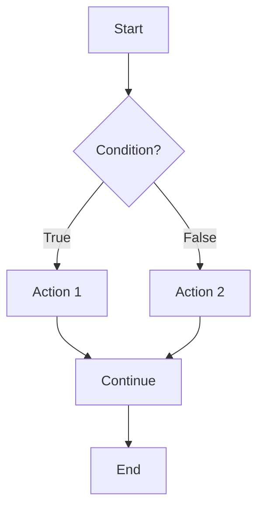

# Pseudocode Basics

## Introduction

Pseudocode is a simple, language-independent way of describing algorithms and procedures without adhering to the syntax of any specific programming language. It serves as a bridge between human language and actual programming code, allowing you to focus on solving the problem at hand rather than worrying about syntax details.

Think of pseudocode as a blueprint or rough sketch of your program that outlines the logic and steps required to solve a problem. It's particularly useful for planning complex algorithms before implementing them in a specific programming language.

## Why Use Pseudocode?

Pseudocode offers several advantages for both beginner and experienced programmers:

1. **Language-independence**: Write once, implement in any programming language
2. **Focus on logic**: Concentrate on problem-solving rather than syntax
3. **Communication**: Easily share and discuss algorithms with other developers
4. **Planning**: Map out your solution before coding to avoid logical errors
5. **Documentation**: Provides clear documentation of how an algorithm works

## Pseudocode Basic Structure

While pseudocode doesn't have strict rules, it typically follows a structure that makes it easy to translate into actual code later.

### Common Elements

- **Input/Output operations**: Reading data and displaying results
- **Variable assignments**: Storing and manipulating data
- **Conditional statements**: Making decisions based on conditions
- **Loops**: Repeating blocks of code
- **Functions/Procedures**: Reusable blocks of code

## Pseudocode Conventions

Here are some common conventions used in pseudocode:

### Variable Assignment

```
SET variable = value
```

### Input and Output

```
READ variable
DISPLAY message
```

### Conditional Statements

```
IF condition THEN
    actions
ELSE IF another_condition THEN
    other actions
ELSE
    default actions
END IF
```

### Loops

```
WHILE condition DO
    actions
END WHILE

FOR variable = start_value TO end_value STEP step_value
    actions
END FOR
```

### Functions/Procedures

```
FUNCTION function_name(parameter1, parameter2)
    actions
    RETURN value
END FUNCTION

PROCEDURE procedure_name(parameter1, parameter2)
    actions
END PROCEDURE
```

## Practical Examples

### Example 1: Finding the Maximum Number

Let's write pseudocode to find the maximum number in a list:

```
PROCEDURE FindMaximum(numbers)
    IF length of numbers = 0 THEN
        RETURN "List is empty"
    END IF
    
    SET max = numbers[0]
    
    FOR i = 1 TO length of numbers - 1
        IF numbers[i] > max THEN
            SET max = numbers[i]
        END IF
    END FOR
    
    RETURN max
END PROCEDURE
```

**Input**: `[5, 9, 3, 12, 7]`  
**Output**: `12`

### Example 2: Calculating Factorial

Here's pseudocode for calculating the factorial of a number:

```
FUNCTION Factorial(n)
    IF n < 0 THEN
        RETURN "Error: Negative number"
    ELSE IF n = 0 OR n = 1 THEN
        RETURN 1
    ELSE
        SET result = 1
        FOR i = 2 TO n
            SET result = result * i
        END FOR
        RETURN result
    END IF
END FUNCTION
```

**Input**: `5`  
**Output**: `120` (5! = 5 × 4 × 3 × 2 × 1 = 120)

### Example 3: Binary Search Algorithm

This algorithm efficiently finds an element in a sorted array:

```
FUNCTION BinarySearch(array, target)
    SET left = 0
    SET right = length of array - 1
    
    WHILE left <= right DO
        SET middle = (left + right) / 2
        
        IF array[middle] = target THEN
            RETURN middle
        ELSE IF array[middle] < target THEN
            SET left = middle + 1
        ELSE
            SET right = middle - 1
        END IF
    END WHILE
    
    RETURN -1  // Element not found
END FUNCTION
```

**Input**: Array `[2, 5, 8, 12, 16, 23, 38, 56, 72, 91]`, Target `23`  
**Output**: `5` (index of 23 in the array)

## Real-World Applications

### Application 1: Login System

```
PROCEDURE Login()
    DISPLAY "Enter username: "
    READ username
    DISPLAY "Enter password: "
    READ password
    
    IF AuthenticateUser(username, password) THEN
        DISPLAY "Login successful"
        SET session_active = TRUE
        LoadUserDashboard()
    ELSE
        DISPLAY "Invalid username or password"
        SET login_attempts = login_attempts + 1
        IF login_attempts >= 3 THEN
            LockAccount()
            DISPLAY "Account locked due to multiple failed attempts"
        END IF
    END IF
END PROCEDURE
```

### Application 2: E-commerce Checkout Process

```
PROCEDURE CheckoutProcess(cart)
    IF cart is empty THEN
        DISPLAY "Your cart is empty"
        RETURN
    END IF
    
    SET total = 0
    
    FOR EACH item IN cart
        SET total = total + (item.price * item.quantity)
    END FOR
    
    DISPLAY "Total before tax: $" + total
    
    SET tax = total * 0.08  // 8% tax rate
    SET total_with_tax = total + tax
    
    DISPLAY "Tax: $" + tax
    DISPLAY "Total amount: $" + total_with_tax
    
    DISPLAY "Select payment method:"
    READ payment_method
    
    IF ProcessPayment(payment_method, total_with_tax) THEN
        GenerateInvoice(cart, total_with_tax)
        EmptyCart()
        DISPLAY "Thank you for your purchase!"
    ELSE
        DISPLAY "Payment failed. Please try again."
    END IF
END PROCEDURE
```

## Common Flow Control Visualization

Here's a visualization of basic control flow structures in pseudocode:



## Best Practices for Writing Pseudocode

1. **Be clear and concise**: Use simple language that is easy to understand
2. **Maintain consistent indentation**: Makes the structure easier to follow
3. **Use descriptive variable names**: Self-documenting code is easier to understand
4. **Avoid ambiguity**: Make sure your logic is clear and unambiguous
5. **Include comments**: For complex logic, add explanations
6. **Balance detail**: Include enough detail to understand the algorithm without getting too low-level

## From Pseudocode to Code

Let's see how our factorial pseudocode translates to actual programming languages:

### JavaScript

```javascript
function factorial(n) {
    if (n < 0) {
        return "Error: Negative number";
    } else if (n === 0 || n === 1) {
        return 1;
    } else {
        let result = 1;
        for (let i = 2; i <= n; i++) {
            result *= i;
        }
        return result;
    }
}
```

### Python

```python
def factorial(n):
    if n < 0:
        return "Error: Negative number"
    elif n == 0 or n == 1:
        return 1
    else:
        result = 1
        for i in range(2, n + 1):
            result *= i
        return result
```

## Summary

Pseudocode is a powerful tool for algorithm design that helps you focus on problem-solving logic without getting caught up in programming language syntax. By using pseudocode:

- You can plan and structure your algorithms before writing actual code
- You can communicate your ideas clearly to other developers
- You can debug logical errors before implementation
- You can more easily translate your solutions to any programming language

The key to effective pseudocode is clarity and simplicity. Keep your descriptions straightforward, use consistent formatting, and focus on the logical steps needed to solve the problem.

## Additional Resources and Exercises

### Exercises

1. **Calculator**: Write pseudocode for a simple calculator that can perform addition, subtraction, multiplication, and division.

2. **Palindrome Checker**: Create pseudocode to determine if a given string is a palindrome (reads the same backwards as forwards).

3. **Grade Calculator**: Write pseudocode that takes a student's score and returns a letter grade (A, B, C, D, F) based on standard grading scales.

4. **Shopping List**: Create pseudocode for adding, removing, and displaying items in a shopping list.

5. **Bubble Sort**: Write pseudocode for the bubble sort algorithm to sort an array of numbers.

### Advanced Challenge

Try converting the pseudocode for binary search into your favorite programming language and test it with different inputs. Compare your implementation with standard library functions if available.