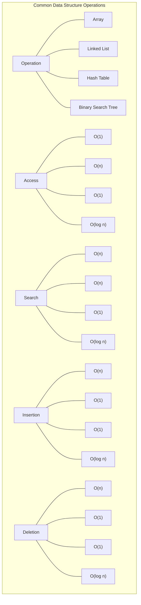

# Data Structures Introduction

## What Are Data Structures?

Data structures are specialized formats for organizing, processing, retrieving, and storing data. They provide a way to manage data efficiently for various uses and help solve complex programming problems with optimized solutions.

Think of data structures as different types of containers—each designed to hold items in specific ways that make certain operations faster or more convenient.

## Why Data Structures Matter

As a beginning programmer, you might wonder why you need to learn about data structures when programming languages already provide basic data types like integers, strings, and booleans.

Here's why data structures are crucial:

1. **Efficiency**: The right data structure can dramatically improve your program's speed and memory usage.
2. **Organization**: Complex applications need systematic ways to organize data.
3. **Problem-solving**: Many programming challenges have standard solutions based on specific data structures.
4. **Industry standard**: Understanding data structures is expected of professional developers.

## Basic Types of Data Structures

Let's explore the fundamental data structures you'll encounter:

### 1. Arrays

Arrays are the simplest data structure—a collection of elements stored at contiguous memory locations, identified by indices.

```javascript
// Creating an array in JavaScript
const fruits = ["apple", "banana", "orange", "mango"];
console.log(fruits[0]); // Output: apple

// Adding an element to the end
fruits.push("grape");
console.log(fruits); // Output: ["apple", "banana", "orange", "mango", "grape"]
```

### 2. Linked Lists

A linked list consists of nodes where each node contains data and a reference (link) to the next node in the sequence.

```javascript
// Simple linked list implementation in JavaScript
class Node {
  constructor(data) {
    this.data = data;
    this.next = null;
  }
}

class LinkedList {
  constructor() {
    this.head = null;
  }
  
  // Add a new node to the end
  append(data) {
    const newNode = new Node(data);
    
    if (!this.head) {
      this.head = newNode;
      return;
    }
    
    let current = this.head;
    while (current.next) {
      current = current.next;
    }
    current.next = newNode;
  }
  
  // Print the list
  printList() {
    let current = this.head;
    const elements = [];
    while (current) {
      elements.push(current.data);
      current = current.next;
    }
    console.log(elements.join(' -> '));
  }
}

// Usage
const myList = new LinkedList();
myList.append(10);
myList.append(20);
myList.append(30);
myList.printList(); // Output: 10 -> 20 -> 30
```

### 3. Stacks

A stack follows the Last In, First Out (LIFO) principle. Think of it like a stack of plates—you can only take the top plate off.

```javascript
// Stack implementation using array in JavaScript
class Stack {
  constructor() {
    this.items = [];
  }
  
  // Add element to the stack
  push(element) {
    this.items.push(element);
  }
  
  // Remove element from the stack
  pop() {
    if (this.isEmpty()) return "Stack is empty";
    return this.items.pop();
  }
  
  // View the top element
  peek() {
    if (this.isEmpty()) return "Stack is empty";
    return this.items[this.items.length - 1];
  }
  
  // Check if stack is empty
  isEmpty() {
    return this.items.length === 0;
  }
  
  // Get the size of stack
  size() {
    return this.items.length;
  }
  
  // Print the stack
  printStack() {
    console.log(this.items.toString());
  }
}

// Usage
const stack = new Stack();
stack.push(10);
stack.push(20);
stack.push(30);
console.log("Stack: ");
stack.printStack(); // Output: 10,20,30
console.log("Top element: " + stack.peek()); // Output: Top element: 30
console.log("Removed element: " + stack.pop()); // Output: Removed element: 30
console.log("After popping: ");
stack.printStack(); // Output: 10,20
```

### 4. Queues

A queue follows the First In, First Out (FIFO) principle. Think of it like a line of people waiting—the first person who joins is the first person served.

```javascript
// Queue implementation using array in JavaScript
class Queue {
  constructor() {
    this.items = [];
  }
  
  // Add element to the queue
  enqueue(element) {
    this.items.push(element);
  }
  
  // Remove element from the queue
  dequeue() {
    if (this.isEmpty()) return "Queue is empty";
    return this.items.shift();
  }
  
  // View the front element
  front() {
    if (this.isEmpty()) return "Queue is empty";
    return this.items[0];
  }
  
  // Check if queue is empty
  isEmpty() {
    return this.items.length === 0;
  }
  
  // Get the size of queue
  size() {
    return this.items.length;
  }
  
  // Print the queue
  printQueue() {
    console.log(this.items.toString());
  }
}

// Usage
const queue = new Queue();
queue.enqueue("John");
queue.enqueue("Jane");
queue.enqueue("Bob");
console.log("Queue: ");
queue.printQueue(); // Output: John,Jane,Bob
console.log("Front person: " + queue.front()); // Output: Front person: John
console.log("Served: " + queue.dequeue()); // Output: Served: John
console.log("New queue: ");
queue.printQueue(); // Output: Jane,Bob
```

### 5. Trees

Trees are hierarchical data structures with a root node and child nodes. They're used for representing hierarchical relationships.

```javascript
// Simple binary tree implementation
class TreeNode {
  constructor(data) {
    this.data = data;
    this.left = null;
    this.right = null;
  }
}

// Creating a simple binary tree
const root = new TreeNode(1);
root.left = new TreeNode(2);
root.right = new TreeNode(3);
root.left.left = new TreeNode(4);
root.left.right = new TreeNode(5);

// Function to print tree in-order (left, root, right)
function inOrderTraversal(node) {
  if (node !== null) {
    inOrderTraversal(node.left);
    console.log(node.data);
    inOrderTraversal(node.right);
  }
}

console.log("In-order traversal:");
inOrderTraversal(root); // Output: 4, 2, 5, 1, 3
```

### 6. Hash Tables (or Maps)

Hash tables store key-value pairs and use a hash function to compute an index for efficient data retrieval.

```javascript
// In JavaScript, Map is a built-in hash table implementation
const userScores = new Map();

// Adding key-value pairs
userScores.set("John", 85);
userScores.set("Jane", 92);
userScores.set("Bob", 78);

// Retrieving values
console.log(userScores.get("Jane")); // Output: 92

// Checking if a key exists
console.log(userScores.has("Alice")); // Output: false

// Deleting a key-value pair
userScores.delete("Bob");

// Size of the map
console.log(userScores.size); // Output: 2

// Iterating through the map
userScores.forEach((score, name) => {
  console.log(`${name}: ${score}`);
});
// Output:
// John: 85
// Jane: 92
```

## Comparing Data Structures

To help visualize when to use each data structure, here's a comparison of operations by their time complexity:



## Real-World Applications

To understand the practical importance of data structures, let's look at some real-world applications:

1. **Arrays**: Used in image processing to store pixel values, managing multiple values of the same type.

2. **Linked Lists**: Implementing features like "undo" functionality in applications where you need to track a sequence of actions.

3. **Stacks**: Browser's back button uses a stack to keep track of previously visited pages.

```javascript
class BrowserHistory {
  constructor() {
    this.history = [];
    this.currentIndex = -1;
  }
  
  visit(url) {
    // When we visit a new page, clear any forward history
    this.history = this.history.slice(0, this.currentIndex + 1);
    this.history.push(url);
    this.currentIndex++;
    console.log(`Visited: ${url}`);
  }
  
  back() {
    if (this.currentIndex > 0) {
      this.currentIndex--;
      console.log(`Went back to: ${this.history[this.currentIndex]}`);
      return this.history[this.currentIndex];
    } else {
      console.log("No more history to go back");
      return null;
    }
  }
  
  forward() {
    if (this.currentIndex < this.history.length - 1) {
      this.currentIndex++;
      console.log(`Went forward to: ${this.history[this.currentIndex]}`);
      return this.history[this.currentIndex];
    } else {
      console.log("No forward history available");
      return null;
    }
  }
}

// Usage
const browser = new BrowserHistory();
browser.visit("google.com");
browser.visit("youtube.com");
browser.visit("github.com");
browser.back(); // Output: Went back to: youtube.com
browser.back(); // Output: Went back to: google.com
browser.forward(); // Output: Went forward to: youtube.com
browser.visit("stackoverflow.com"); // Output: Visited: stackoverflow.com
browser.forward(); // Output: No forward history available
```

4. **Queues**: Printer spooling systems use queues to process print jobs in the order they are received.

5. **Trees**: File systems in computers use tree structures to organize files and directories.

6. **Hash Tables**: Used in database indexing, caching, and implementing dictionaries.

## Choosing the Right Data Structure

When solving programming problems, choosing the right data structure is crucial. Consider these factors:

1. **What operations will be performed most frequently?** (insertion, deletion, search, traversal)
2. **How much data will you be working with?**
3. **What memory constraints do you have?**
4. **Is speed a critical factor?**

## Summary

Data structures are fundamental building blocks in computer science and software development. In this introduction, we've covered:

- The definition and importance of data structures
- Basic types: arrays, linked lists, stacks, queues, trees, and hash tables
- Time complexity comparisons between different structures
- Real-world applications
- Factors to consider when choosing a data structure

As you continue your programming journey, understanding these concepts will help you write more efficient, organized, and maintainable code. Each data structure has its strengths and weaknesses, making them suitable for different scenarios.

## Practice Exercises

1. Create an array of your favorite books and perform basic operations like adding, removing, and finding elements.
2. Implement a stack and use it to check if a string has balanced parentheses.
3. Create a queue to simulate a simple task scheduling system.
4. Build a simple binary search tree and implement methods to insert and search for values.
5. Use a Map or Object to count the frequency of words in a paragraph.

## Additional Resources

- **Online Platforms**:
  - LeetCode, HackerRank, and CodeSignal offer practice problems focused on data structures
  - Visualgo.net provides visualizations of data structures and algorithms

- **Books**:
  - "Grokking Algorithms" by Aditya Bhargava (beginner-friendly)
  - "Introduction to Algorithms" by Cormen, Leiserson, Rivest, and Stein (more advanced)

- **Next Topics to Explore**:
  - Advanced data structures (Heaps, Graphs, Tries)
  - Algorithm analysis
  - Space and time complexity in depth

Remember, mastering data structures takes practice. Start with simple implementations and gradually tackle more complex problems as your understanding grows.