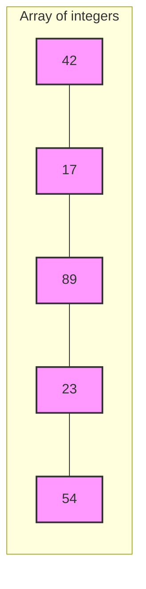
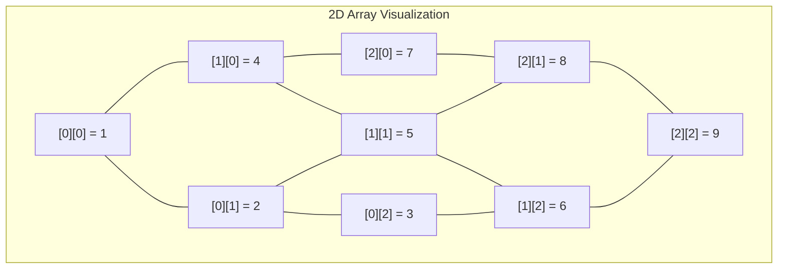

# Arrays

Arrays are one of the most fundamental and widely-used data structures in programming. They provide an efficient way to store and access multiple values of the same type under a single variable name.

## Introduction to Arrays

An array is a collection of elements, all of the same type, stored at contiguous memory locations. Think of an array as a row of boxes, each containing a value, where each box has a unique numerical index (position) starting from 0.



### Key Characteristics of Arrays

- **Fixed Size**: In most languages, arrays have a fixed size that is defined when the array is created.
- **Homogeneous Elements**: All elements in an array must be of the same data type.
- **Random Access**: Elements can be accessed directly using their index, allowing for O(1) time complexity.
- **Contiguous Memory**: Array elements are stored in adjacent memory locations.

## Array Declaration and Initialization

Different programming languages have different syntax for array declaration and initialization. Let's look at examples in a few popular languages:

### JavaScript

```javascript
// Declaration and initialization in one step
const numbers = [10, 20, 30, 40, 50];

// Declaration with new keyword
const fruits = new Array("Apple", "Banana", "Orange");

// Empty array declaration then adding elements
const colors = [];
colors.push("Red");
colors.push("Green");
colors.push("Blue");

console.log(numbers); // Output: [10, 20, 30, 40, 50]
console.log(fruits);  // Output: ["Apple", "Banana", "Orange"]
console.log(colors);  // Output: ["Red", "Green", "Blue"]
```

### Python

```python
# Declaration and initialization
numbers = [10, 20, 30, 40, 50]

# Empty array (list) declaration then adding elements
fruits = []
fruits.append("Apple")
fruits.append("Banana")
fruits.append("Orange")

print(numbers)  # Output: [10, 20, 30, 40, 50]
print(fruits)   # Output: ['Apple', 'Banana', 'Orange']
```

### Java

```java
// Declaration and initialization in one step
int[] numbers = {10, 20, 30, 40, 50};

// Declaration with size, then assigning values
String[] fruits = new String[3];
fruits[0] = "Apple";
fruits[1] = "Banana";
fruits[2] = "Orange";

// Printing arrays in Java requires Arrays.toString() or a loop
System.out.println(Arrays.toString(numbers)); // Output: [10, 20, 30, 40, 50]
System.out.println(Arrays.toString(fruits));  // Output: [Apple, Banana, Orange]
```

## Accessing Array Elements

Array elements are accessed using their index, which typically starts at 0 in most programming languages.

```javascript
const colors = ["Red", "Green", "Blue", "Yellow", "Purple"];

console.log(colors[0]); // Output: Red (first element)
console.log(colors[2]); // Output: Blue (third element)
console.log(colors[4]); // Output: Purple (fifth element)

// Modifying an element
colors[1] = "Emerald";
console.log(colors); // Output: ["Red", "Emerald", "Blue", "Yellow", "Purple"]
```

### Out of Bounds Access

Attempting to access an array element with an index outside the array's valid range can lead to different behaviors depending on the programming language:

- In languages like C/C++, it can cause unpredictable behavior or crashes
- In JavaScript, it returns `undefined`
- In Python, it raises an `IndexError`
- In Java, it throws an `ArrayIndexOutOfBoundsException`

```javascript
const arr = [1, 2, 3];
console.log(arr[5]); // Output: undefined
```

```python
arr = [1, 2, 3]
try:
    print(arr[5])  # Raises IndexError
except IndexError:
    print("Index out of range")  # Output: Index out of range
```

## Common Array Operations

### Traversing an Array

Traversing means visiting each element of the array to perform some operation.

```javascript
const numbers = [10, 20, 30, 40, 50];

// Using for loop
for (let i = 0; i < numbers.length; i++) {
    console.log(`Element at index ${i} is ${numbers[i]}`);
}

// Using forEach method (JavaScript specific)
numbers.forEach((number, index) => {
    console.log(`Element at index ${index} is ${number}`);
});

// Using for...of loop (modern JavaScript)
for (const number of numbers) {
    console.log(number);
}
```

### Searching an Array

Searching for a specific value in an array:

```javascript
const fruits = ["Apple", "Banana", "Orange", "Mango", "Grapes"];

// Linear search
function linearSearch(arr, target) {
    for (let i = 0; i < arr.length; i++) {
        if (arr[i] === target) {
            return i; // Return the index where the element is found
        }
    }
    return -1; // Return -1 if element not found
}

console.log(linearSearch(fruits, "Mango")); // Output: 3
console.log(linearSearch(fruits, "Pineapple")); // Output: -1

// Using built-in methods (JavaScript specific)
console.log(fruits.indexOf("Orange")); // Output: 2
console.log(fruits.includes("Banana")); // Output: true
```

### Inserting and Deleting Elements

Different languages provide different methods for modifying arrays:

```javascript
const colors = ["Red", "Green", "Blue"];

// Adding elements
colors.push("Yellow"); // Adds at the end
console.log(colors); // Output: ["Red", "Green", "Blue", "Yellow"]

colors.unshift("Purple"); // Adds at the beginning
console.log(colors); // Output: ["Purple", "Red", "Green", "Blue", "Yellow"]

colors.splice(2, 0, "Orange"); // Inserts at index 2
console.log(colors); // Output: ["Purple", "Red", "Orange", "Green", "Blue", "Yellow"]

// Removing elements
colors.pop(); // Removes the last element
console.log(colors); // Output: ["Purple", "Red", "Orange", "Green", "Blue"]

colors.shift(); // Removes the first element
console.log(colors); // Output: ["Red", "Orange", "Green", "Blue"]

colors.splice(1, 1); // Removes 1 element at index 1
console.log(colors); // Output: ["Red", "Green", "Blue"]
```

## Multidimensional Arrays

Arrays can have multiple dimensions, creating structures like tables (2D arrays) or cubes (3D arrays).

### 2D Arrays

A 2D array is essentially an "array of arrays" - think of it as a table with rows and columns.

```javascript
// Declaring and initializing a 2D array
const matrix = [
    [1, 2, 3],
    [4, 5, 6],
    [7, 8, 9]
];

// Accessing elements
console.log(matrix[0][0]); // Output: 1 (first row, first column)
console.log(matrix[1][2]); // Output: 6 (second row, third column)

// Traversing a 2D array
for (let i = 0; i < matrix.length; i++) {
    for (let j = 0; j < matrix[i].length; j++) {
        console.log(`Element at position [${i}][${j}] is ${matrix[i][j]}`);
    }
}
```



## Time and Space Complexity

Understanding the efficiency of array operations is crucial for writing performant code:

| Operation | Time Complexity | Explanation |
|-----------|----------------|------------|
| Access    | O(1)           | Direct access using index |
| Search    | O(n)           | May need to check every element |
| Insertion (at end) | O(1) or O(n) | O(1) for dynamic arrays with space, O(n) if resizing needed |
| Insertion (at position) | O(n) | May need to shift elements |
| Deletion (at end) | O(1) | Simply adjust the length |
| Deletion (at position) | O(n) | May need to shift elements |

Space complexity is O(n) where n is the number of elements in the array.

## Practical Applications of Arrays

Arrays are ubiquitous in programming and are used in countless applications:

### Example 1: Simple Todo List

```javascript
// A simple todo list implementation using arrays
const todoList = [];

function addTask(task) {
    todoList.push(task);
    console.log(`Task "${task}" added!`);
}

function removeTask(index) {
    if (index >= 0 && index < todoList.length) {
        const removed = todoList.splice(index, 1);
        console.log(`Task "${removed[0]}" removed!`);
    } else {
        console.log("Invalid task index!");
    }
}

function displayTasks() {
    if (todoList.length === 0) {
        console.log("No tasks to display");
    } else {
        console.log("Tasks:");
        todoList.forEach((task, index) => {
            console.log(`${index + 1}. ${task}`);
        });
    }
}

// Example usage
addTask("Complete array lesson"); // Output: Task "Complete array lesson" added!
addTask("Practice coding problems"); // Output: Task "Practice coding problems" added!
addTask("Prepare for interview"); // Output: Task "Prepare for interview" added!

displayTasks();
// Output:
// Tasks:
// 1. Complete array lesson
// 2. Practice coding problems
// 3. Prepare for interview

removeTask(1); // Output: Task "Practice coding problems" removed!

displayTasks();
// Output:
// Tasks:
// 1. Complete array lesson
// 2. Prepare for interview
```

### Example 2: Image Manipulation

In image processing, images are often represented as 2D or 3D arrays:

```javascript
// Simple grayscale image represented as a 2D array (0-255 values)
const image = [
    [145, 150, 132, 120],
    [178, 200, 176, 160],
    [122, 145, 139, 150],
    [130, 155, 162, 148]
];

// Increase brightness by adding a value to each pixel
function increaseBrightness(imageData, value) {
    const result = [];
    
    for (let i = 0; i < imageData.length; i++) {
        result[i] = [];
        for (let j = 0; j < imageData[i].length; j++) {
            // Ensure values stay within valid range (0-255)
            result[i][j] = Math.min(255, imageData[i][j] + value);
        }
    }
    
    return result;
}

const brighterImage = increaseBrightness(image, 50);
console.log("Original Image:");
console.log(image);
console.log("Brightened Image:");
console.log(brighterImage);
```

### Example 3: Moving Average Calculation

Arrays are excellent for statistical calculations like moving averages:

```javascript
function calculateMovingAverage(data, windowSize) {
    if (windowSize > data.length) {
        return "Window size exceeds data length";
    }
    
    const result = [];
    
    for (let i = 0; i <= data.length - windowSize; i++) {
        let sum = 0;
        for (let j = 0; j < windowSize; j++) {
            sum += data[i + j];
        }
        result.push(sum / windowSize);
    }
    
    return result;
}

const stockPrices = [45.5, 46.2, 46.6, 47.8, 47.2, 46.9, 48.1, 48.8];
const movingAvg3Day = calculateMovingAverage(stockPrices, 3);

console.log("Stock Prices:", stockPrices);
console.log("3-Day Moving Average:", movingAvg3Day);
// Output: [46.1, 46.86, 47.2, 47.3, 47.4, 47.93]
```

## Common Pitfalls and Best Practices

### Pitfalls to Avoid

1. **Off-by-one errors**: Forgetting that array indices start at 0, not 1
2. **Confusing length and last index**: The last index is always `length - 1`
3. **Array bounds checking**: Always validate indices before accessing elements
4. **Modifying arrays during iteration**: Can lead to unexpected behavior
5. **Shallow vs. deep copying**: Be aware that simple assignment creates references, not copies

### Best Practices

1. **Use appropriate methods**: Leverage built-in array methods for cleaner code
2. **Avoid resizing frequently**: Preset capacity if final size is known
3. **Consider alternative data structures**: Sometimes linked lists, sets, or maps might be better options
4. **Understand memory impact**: Be cautious with very large arrays
5. **Test edge cases**: Empty arrays, single elements, etc.

## Summary

Arrays are versatile and essential data structures in programming:

- They store collections of elements of the same type in contiguous memory locations
- Elements are accessed using numeric indices, typically starting from 0
- Operations like insertion and deletion may require shifting elements
- Arrays can be multidimensional, allowing storage of complex data
- They offer O(1) time complexity for direct access but may require O(n) for search, insert, and delete operations

Understanding arrays thoroughly is crucial as they form the foundation for many other data structures and algorithms.

## Exercises

To practice your understanding of arrays, try the following exercises:

1. Implement a function that reverses an array without using built-in reverse methods
2. Create a function to find the second largest element in an array
3. Write a program to rotate an array's elements to the left by a specific number of positions
4. Implement a function that merges two sorted arrays into a single sorted array
5. Write a function to remove duplicate elements from an array

## Additional Resources

- [MDN Web Docs: JavaScript Arrays](https://developer.mozilla.org/en-US/docs/Web/JavaScript/Reference/Global_Objects/Array)
- [Python Documentation: Lists](https://docs.python.org/3/tutorial/datastructures.html#more-on-lists)
- [GeeksforGeeks: Arrays Data Structure](https://www.geeksforgeeks.org/array-data-structure/)
- [Visualgo: Array Visualization](https://visualgo.net/en/list)
- [LeetCode: Array Problems](https://leetcode.com/tag/array/)

Arrays are just the beginning of your data structures journey. As you become more comfortable with them, you'll discover their applications in nearly every program you write!