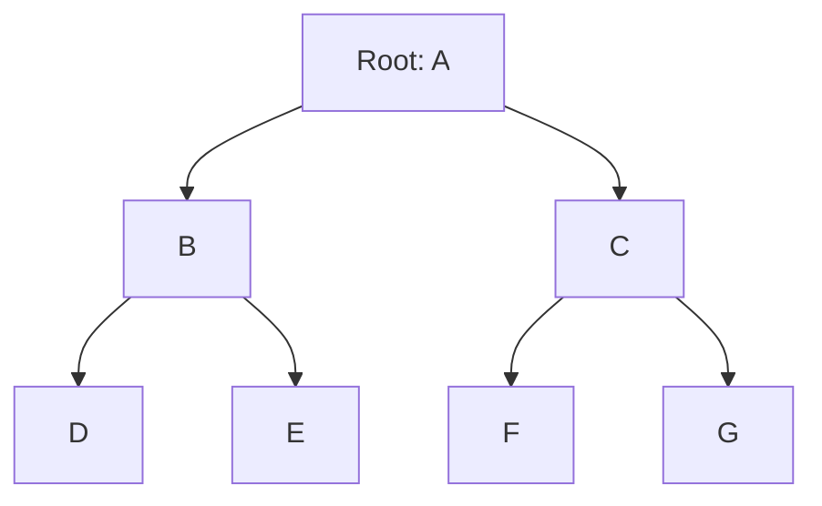
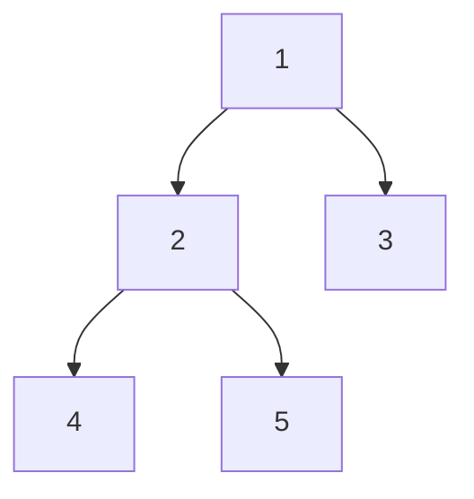
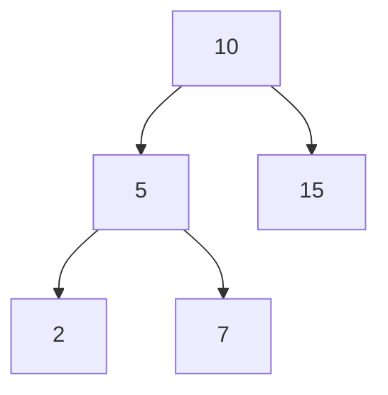
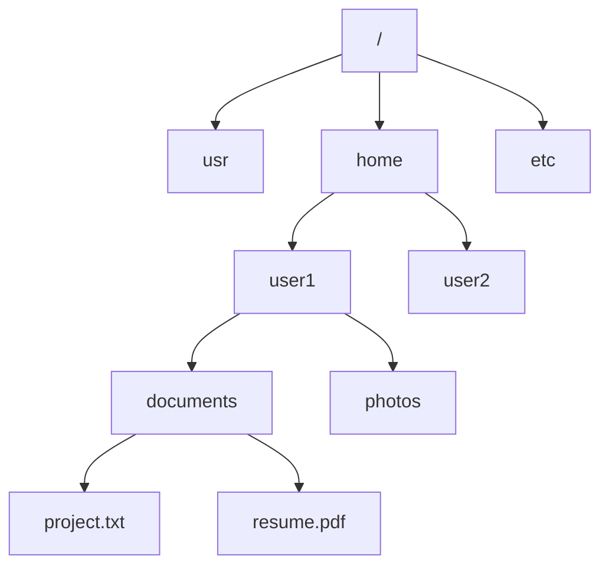
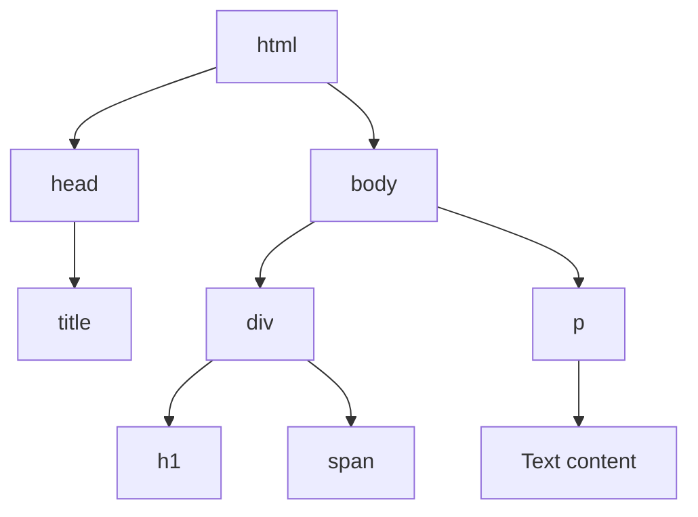
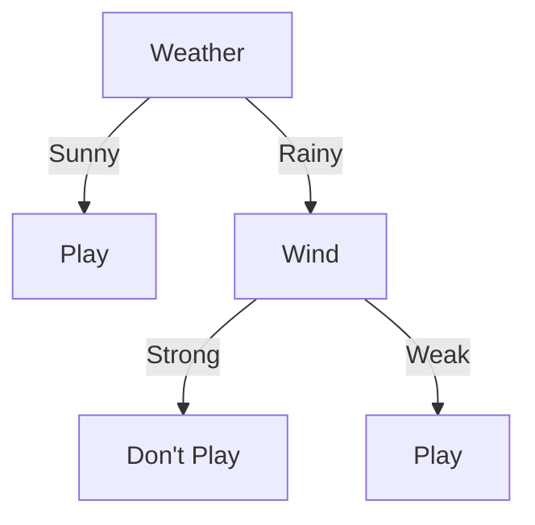

# Trees Introduction

## What is a Tree?

A tree is a hierarchical data structure that consists of nodes connected by edges. Unlike linear data structures such as arrays, linked lists, stacks, and queues, trees represent hierarchical relationships between elements.

Think of a tree as an upside-down tree from nature - it has a root at the top and branches that extend downward. This structure is extensively used in various applications due to its ability to represent hierarchical data efficiently.

## Tree Terminology

Before diving deeper, let's understand the basic terminology used when discussing trees:

- **Node**: A fundamental element of a tree that contains data and references to other nodes.
- **Root**: The topmost node of a tree, which has no parent.
- **Parent**: A node that has one or more child nodes.
- **Child**: A node directly connected to another node when moving away from the root.
- **Siblings**: Nodes that share the same parent.
- **Leaf**: A node without any children.
- **Edge**: The connection between two nodes.
- **Path**: A sequence of nodes and edges from one node to another.
- **Depth of a node**: The number of edges from the root to that node.
- **Height of a node**: The number of edges in the longest path from that node to a leaf.
- **Height of the tree**: The height of the root node, or the maximum depth of any node in the tree.

Let's visualize these concepts:



In this tree:
- A is the root
- B and C are children of A (and siblings to each other)
- D and E are children of B
- F and G are children of C
- D, E, F, and G are leaf nodes

## Basic Types of Trees

While there are many specialized tree structures, here are some of the most common types:

### 1. Binary Tree

A binary tree is a tree in which each node has at most two children, referred to as the left child and the right child.

```javascript
// Definition of a binary tree node
class TreeNode {
    constructor(value) {
        this.value = value;
        this.left = null;
        this.right = null;
    }
}

// Creating a simple binary tree
const root = new TreeNode(1);
root.left = new TreeNode(2);
root.right = new TreeNode(3);
root.left.left = new TreeNode(4);
root.left.right = new TreeNode(5);
```

This creates the following binary tree:



### 2. Binary Search Tree (BST)

A binary search tree is a binary tree with the property that for each node, all values in its left subtree are less than the node's value, and all values in its right subtree are greater than the node's value.

```javascript
class BSTNode {
    constructor(value) {
        this.value = value;
        this.left = null;
        this.right = null;
    }
}

class BinarySearchTree {
    constructor() {
        this.root = null;
    }
    
    insert(value) {
        const newNode = new BSTNode(value);
        
        if (this.root === null) {
            this.root = newNode;
            return this;
        }
        
        let current = this.root;
        
        while (true) {
            if (value === current.value) return undefined; // Duplicate value
            
            if (value < current.value) {
                if (current.left === null) {
                    current.left = newNode;
                    return this;
                }
                current = current.left;
            } else {
                if (current.right === null) {
                    current.right = newNode;
                    return this;
                }
                current = current.right;
            }
        }
    }
}

// Example usage
const bst = new BinarySearchTree();
bst.insert(10);
bst.insert(5);
bst.insert(15);
bst.insert(2);
bst.insert(7);
```

The resulting BST would look like:



### 3. AVL Tree and Red-Black Tree

These are self-balancing binary search trees that maintain a balanced height, ensuring operations like search, insert, and delete take O(log n) time. We'll cover these in more advanced sections.

### 4. N-ary Tree

An N-ary tree is a tree where each node can have at most N children.

```javascript
class NaryTreeNode {
    constructor(value) {
        this.value = value;
        this.children = []; // Array of child nodes
    }
}

// Example of a 3-ary tree (each node has at most 3 children)
const root = new NaryTreeNode(1);
root.children.push(new NaryTreeNode(2));
root.children.push(new NaryTreeNode(3));
root.children.push(new NaryTreeNode(4));
root.children[0].children.push(new NaryTreeNode(5));
root.children[0].children.push(new NaryTreeNode(6));
```

## Tree Traversal

Tree traversal refers to the process of visiting each node in a tree exactly once. There are several ways to traverse a tree:

### 1. Depth-First Traversal

In depth-first traversal, we explore as far as possible along each branch before backtracking.

#### Pre-order Traversal (Root, Left, Right)

```javascript
function preOrderTraversal(node) {
    if (node === null) return;
    
    console.log(node.value); // Process the root first
    preOrderTraversal(node.left); // Then left subtree
    preOrderTraversal(node.right); // Then right subtree
}
```

For the BST example above (10, 5, 15, 2, 7), the pre-order traversal would output: `10, 5, 2, 7, 15`

#### In-order Traversal (Left, Root, Right)

```javascript
function inOrderTraversal(node) {
    if (node === null) return;
    
    inOrderTraversal(node.left); // Process left subtree first
    console.log(node.value); // Then the root
    inOrderTraversal(node.right); // Then right subtree
}
```

For the BST example, the in-order traversal would output: `2, 5, 7, 10, 15`

#### Post-order Traversal (Left, Right, Root)

```javascript
function postOrderTraversal(node) {
    if (node === null) return;
    
    postOrderTraversal(node.left); // Process left subtree first
    postOrderTraversal(node.right); // Then right subtree
    console.log(node.value); // Then the root
}
```

For the BST example, the post-order traversal would output: `2, 7, 5, 15, 10`

### 2. Breadth-First Traversal (Level Order)

In breadth-first traversal, we visit all the nodes at the same level before moving to the next level.

```javascript
function levelOrderTraversal(root) {
    if (root === null) return;
    
    const queue = [root];
    
    while (queue.length > 0) {
        const current = queue.shift();
        console.log(current.value);
        
        if (current.left) queue.push(current.left);
        if (current.right) queue.push(current.right);
    }
}
```

For our BST example, the level-order traversal would output: `10, 5, 15, 2, 7`

## Real-World Applications of Trees

Trees are used extensively in various applications:

### 1. File Systems

Your computer's file system is organized as a tree structure, with directories (folders) as internal nodes and files as leaves.



### 2. HTML DOM

Web browsers represent HTML documents as a tree structure called the Document Object Model (DOM).



### 3. Database Indexing

B-trees and B+ trees are used in database systems for efficient indexing and fast data retrieval.

### 4. Decision Trees in Machine Learning

Decision trees are used to make predictions or decisions based on input features.



### 5. Syntax Trees in Compilers

Programming language compilers use syntax trees to represent and process the structure of code.

## Performance of Tree Operations

The efficiency of tree operations depends on the type of tree and its balance:

| Operation | Balanced Binary Search Tree | Unbalanced Binary Search Tree |
|-----------|----------------------------|------------------------------|
| Search    | O(log n)                  | O(n) worst case              |
| Insert    | O(log n)                  | O(n) worst case              |
| Delete    | O(log n)                  | O(n) worst case              |

This is why balanced trees like AVL trees and Red-Black trees are important for maintaining efficient operations.

## Implementing a Simple Tree

Let's implement a basic tree structure that can have any number of children:

```javascript
class TreeNode {
    constructor(value) {
        this.value = value;
        this.children = [];
    }
    
    addChild(childNode) {
        this.children.push(childNode);
    }
}

// Creating a sample tree
const tree = new TreeNode('CEO');
const cto = new TreeNode('CTO');
const cfo = new TreeNode('CFO');
const cmo = new TreeNode('CMO');

tree.addChild(cto);
tree.addChild(cfo);
tree.addChild(cmo);

cto.addChild(new TreeNode('Development Manager'));
cto.addChild(new TreeNode('QA Manager'));

cfo.addChild(new TreeNode('Accounting Manager'));

// Function to print the tree structure
function printTree(node, indent = '') {
    console.log(indent + node.value);
    node.children.forEach(child => {
        printTree(child, indent + '  ');
    });
}

// Output the tree structure
printTree(tree);
```

Output:
```
CEO
  CTO
    Development Manager
    QA Manager
  CFO
    Accounting Manager
  CMO
```

## Summary

Trees are versatile hierarchical data structures with many applications. In this introduction, we've covered:

- Basic tree terminology and concepts
- Different types of trees (binary, BST, N-ary)
- Tree traversal methods (depth-first and breadth-first)
- Real-world applications of trees
- Performance characteristics
- A simple tree implementation

As you continue learning data structures, you'll encounter more specialized tree structures designed for specific purposes, such as AVL trees, Red-Black trees, B-trees, Heaps, Tries, and more.

## Exercises

1. Implement a binary search tree with methods for inserting and searching values.
2. Write a function to find the height of a binary tree.
3. Implement all three depth-first traversal methods for a binary tree.
4. Create a function that counts the number of leaf nodes in a binary tree.
5. Implement a function to check if a binary tree is a valid binary search tree.

## Additional Resources

- "Introduction to Algorithms" by Cormen, Leiserson, Rivest, and Stein
- "Data Structures and Algorithms in JavaScript" by Loiane Groner
- "JavaScript Data Structures and Algorithms" by Sammie Bae

Keep exploring trees and their operations to deepen your understanding of these fundamental data structures!