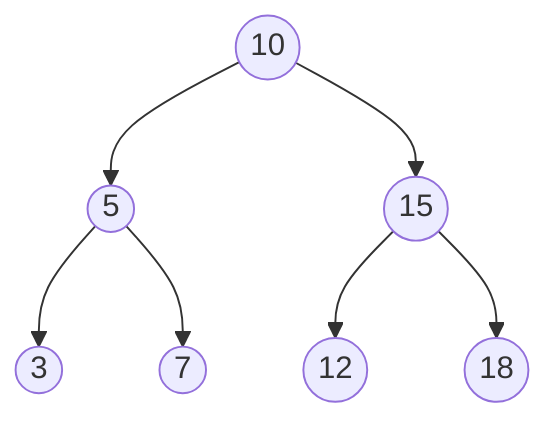
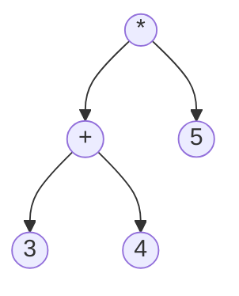

# Binary Trees

## Introduction

Binary trees are fundamental data structures in computer science that form the basis for many more complex data structures and algorithms. Unlike linear data structures like arrays or linked lists where elements are arranged sequentially, binary trees organize data in a hierarchical structure.

A binary tree is a tree data structure where each node has at most two children, referred to as the left child and the right child. This simple constraint makes binary trees particularly useful for representing hierarchical relationships and enables efficient search, insertion, and deletion operations.



## Basic Terminology

Before diving deeper, let's understand some essential terminology associated with binary trees:

- **Node**: The fundamental unit of a binary tree containing data and references to its children.
- **Root**: The topmost node in a tree, with no parent.
- **Parent**: A node that has child nodes.
- **Child**: Nodes that are next level down from a given node.
- **Leaf**: A node with no children.
- **Internal Node**: A node with at least one child.
- **Height**: The length of the longest path from the root to a leaf.
- **Depth**: The distance of a node from the root.
- **Subtree**: A tree formed by a node and its descendants.

## Types of Binary Trees

There are several specialized types of binary trees:

1. **Full Binary Tree**: A binary tree where every node has either 0 or 2 children.
2. **Complete Binary Tree**: A binary tree where all levels, except possibly the last, are completely filled, and all nodes are as left as possible.
3. **Perfect Binary Tree**: A binary tree where all internal nodes have two children, and all leaf nodes are at the same level.
4. **Balanced Binary Tree**: A binary tree where the height of the left and right subtrees of any node differ by at most one.
5. **Binary Search Tree (BST)**: A binary tree where for each node, all elements in the left subtree are less than the node, and all elements in the right subtree are greater.

## Implementing a Binary Tree in Code

Let's implement a simple binary tree in JavaScript:

```javascript
// Define the Node class
class Node {
  constructor(value) {
    this.value = value;
    this.left = null;
    this.right = null;
  }
}

// Define the Binary Tree class
class BinaryTree {
  constructor() {
    this.root = null;
  }
  
  // Insert a value into the binary tree
  insert(value) {
    const newNode = new Node(value);
    
    if (this.root === null) {
      this.root = newNode;
      return this;
    }
    
    // Helper function for recursive insertion
    const insertNode = (node, newNode) => {
      // Decide to go left or right (this implementation creates a somewhat balanced tree)
      if (Math.random() > 0.5) {
        if (node.left === null) {
          node.left = newNode;
        } else {
          insertNode(node.left, newNode);
        }
      } else {
        if (node.right === null) {
          node.right = newNode;
        } else {
          insertNode(node.right, newNode);
        }
      }
    };
    
    insertNode(this.root, newNode);
    return this;
  }
}

// Example usage
const tree = new BinaryTree();
tree.insert(10).insert(5).insert(15).insert(3).insert(7).insert(12).insert(18);
console.log(tree);
```

## Tree Traversal

Traversing a binary tree means visiting each node exactly once. There are three common ways to traverse a binary tree:

### 1. In-Order Traversal

In-order traversal visits the left subtree, then the root, then the right subtree.

```javascript
inOrderTraversal(node = this.root, result = []) {
  if (node !== null) {
    // Visit left subtree
    this.inOrderTraversal(node.left, result);
    // Visit node
    result.push(node.value);
    // Visit right subtree
    this.inOrderTraversal(node.right, result);
  }
  return result;
}
```

For a binary search tree, in-order traversal yields the elements in sorted order.

**Input:** A binary search tree with values [10, 5, 15, 3, 7, 12, 18]  
**Output:** [3, 5, 7, 10, 12, 15, 18]

### 2. Pre-Order Traversal

Pre-order traversal visits the root, then the left subtree, then the right subtree.

```javascript
preOrderTraversal(node = this.root, result = []) {
  if (node !== null) {
    // Visit node
    result.push(node.value);
    // Visit left subtree
    this.preOrderTraversal(node.left, result);
    // Visit right subtree
    this.preOrderTraversal(node.right, result);
  }
  return result;
}
```

Pre-order traversal is useful for creating a copy of the tree or generating a prefix expression from an expression tree.

**Input:** A binary tree with values [10, 5, 15, 3, 7, 12, 18]  
**Output:** [10, 5, 3, 7, 15, 12, 18]

### 3. Post-Order Traversal

Post-order traversal visits the left subtree, then the right subtree, then the root.

```javascript
postOrderTraversal(node = this.root, result = []) {
  if (node !== null) {
    // Visit left subtree
    this.postOrderTraversal(node.left, result);
    // Visit right subtree
    this.postOrderTraversal(node.right, result);
    // Visit node
    result.push(node.value);
  }
  return result;
}
```

Post-order traversal is used when deleting a tree (to delete children before the parent) or generating a postfix expression from an expression tree.

**Input:** A binary tree with values [10, 5, 15, 3, 7, 12, 18]  
**Output:** [3, 7, 5, 12, 18, 15, 10]

### 4. Level-Order Traversal (Breadth-First Search)

Level-order traversal visits nodes level by level, from left to right.

```javascript
levelOrderTraversal() {
  if (this.root === null) return [];
  
  const result = [];
  const queue = [this.root];
  
  while (queue.length) {
    const currentNode = queue.shift();
    result.push(currentNode.value);
    
    if (currentNode.left !== null) {
      queue.push(currentNode.left);
    }
    
    if (currentNode.right !== null) {
      queue.push(currentNode.right);
    }
  }
  
  return result;
}
```

Level-order traversal is useful for operations like printing the tree by levels.

**Input:** A binary tree with values [10, 5, 15, 3, 7, 12, 18]  
**Output:** [10, 5, 15, 3, 7, 12, 18]

## Binary Search Trees (BST)

A Binary Search Tree is a special type of binary tree that maintains the following property:

- The value of each node in the left subtree is less than the node's value.
- The value of each node in the right subtree is greater than the node's value.

This property makes BSTs excellent for searching, insertion, and deletion operations, all of which can be performed in O(log n) time on average (where n is the number of nodes).

Here's how we'd implement a BST in JavaScript:

```javascript
class BSTNode {
  constructor(value) {
    this.value = value;
    this.left = null;
    this.right = null;
  }
}

class BinarySearchTree {
  constructor() {
    this.root = null;
  }
  
  // Insert a value into the BST
  insert(value) {
    const newNode = new BSTNode(value);
    
    if (this.root === null) {
      this.root = newNode;
      return this;
    }
    
    let current = this.root;
    
    while (true) {
      // Handle duplicate values
      if (value === current.value) return this;
      
      if (value < current.value) {
        if (current.left === null) {
          current.left = newNode;
          return this;
        }
        current = current.left;
      } else {
        if (current.right === null) {
          current.right = newNode;
          return this;
        }
        current = current.right;
      }
    }
  }
  
  // Search for a value in the BST
  search(value) {
    if (this.root === null) return false;
    
    let current = this.root;
    let found = false;
    
    while (current && !found) {
      if (value < current.value) {
        current = current.left;
      } else if (value > current.value) {
        current = current.right;
      } else {
        found = true;
      }
    }
    
    return found;
  }
}

// Example usage
const bst = new BinarySearchTree();
bst.insert(10).insert(5).insert(15).insert(3).insert(7).insert(12).insert(18);
console.log(bst.search(7));  // true
console.log(bst.search(9));  // false
```

## Practical Applications of Binary Trees

Binary trees find applications in numerous real-world scenarios:

1. **File Systems:** Directories and files are organized in a hierarchical structure similar to a tree.

2. **Decision Trees:** In machine learning, decision trees use a tree-like model of decisions.

3. **Database Indexing:** B-trees and their variants are used for efficient database indexing.

4. **Compression Algorithms:** Huffman coding uses binary trees for data compression.

5. **Expression Trees:** Binary trees represent arithmetic expressions where operators are internal nodes and operands are leaf nodes.

6. **Network Routing:** Routing algorithms use tree-based data structures to find the shortest path.

### Example: Expression Tree

Let's create an expression tree for the arithmetic expression: `(3 + 4) * 5`:



```javascript
const expressionTree = new BinaryTree();
expressionTree.root = new Node('*');
expressionTree.root.left = new Node('+');
expressionTree.root.right = new Node('5');
expressionTree.root.left.left = new Node('3');
expressionTree.root.left.right = new Node('4');

// Function to evaluate expression tree
function evaluateExpressionTree(node) {
  if (!node) return 0;
  
  // Leaf node (operand)
  if (!node.left && !node.right) {
    return parseInt(node.value);
  }
  
  // Evaluate left and right subtrees
  const leftValue = evaluateExpressionTree(node.left);
  const rightValue = evaluateExpressionTree(node.right);
  
  // Apply operator
  switch(node.value) {
    case '+': return leftValue + rightValue;
    case '-': return leftValue - rightValue;
    case '*': return leftValue * rightValue;
    case '/': return leftValue / rightValue;
    default: return 0;
  }
}

console.log(evaluateExpressionTree(expressionTree.root)); // Output: 35
```

## Time Complexity Analysis

Understanding the time complexity of binary tree operations helps us appreciate their efficiency:

| Operation | Average Case (BST) | Worst Case (BST) |
|-----------|-------------------|------------------|
| Search    | O(log n)          | O(n)             |
| Insert    | O(log n)          | O(n)             |
| Delete    | O(log n)          | O(n)             |
| Traverse  | O(n)              | O(n)             |

The worst-case scenario for BST operations occurs when the tree is completely unbalanced (essentially a linked list). Self-balancing binary search trees like AVL trees and Red-Black trees maintain O(log n) performance even in the worst case.

## Common Problems and Solutions

### Problem 1: Finding the Height of a Tree

```javascript
findHeight(node = this.root) {
  if (node === null) return -1;
  
  const leftHeight = this.findHeight(node.left);
  const rightHeight = this.findHeight(node.right);
  
  return Math.max(leftHeight, rightHeight) + 1;
}
```

### Problem 2: Checking if a Binary Tree is Balanced

```javascript
isBalanced(node = this.root) {
  if (node === null) return true;
  
  const leftHeight = this.findHeight(node.left);
  const rightHeight = this.findHeight(node.right);
  
  if (Math.abs(leftHeight - rightHeight) <= 1 &&
      this.isBalanced(node.left) &&
      this.isBalanced(node.right)) {
    return true;
  }
  
  return false;
}
```

### Problem 3: Finding the Lowest Common Ancestor (LCA)

```javascript
findLCA(root, n1, n2) {
  // Base case
  if (root === null) return null;
  
  // If either n1 or n2 matches with root's value, report
  if (root.value === n1 || root.value === n2) return root;
  
  // Look for keys in left and right subtrees
  const leftLCA = this.findLCA(root.left, n1, n2);
  const rightLCA = this.findLCA(root.right, n1, n2);
  
  // If both of the above calls return non-NULL nodes,
  // then one key is present in one subtree and the other is
  // present in the other subtree. So this node is the LCA.
  if (leftLCA && rightLCA) return root;
  
  // Otherwise check if left subtree or right subtree is LCA
  return leftLCA ? leftLCA : rightLCA;
}
```

## Summary

Binary trees are powerful hierarchical data structures that form the foundation for many more complex data structures and algorithms. They enable efficient storage, retrieval, and manipulation of data in a variety of applications.

Key takeaways:

1. A binary tree has nodes with at most two children (left and right).
2. Different types of binary trees (full, complete, perfect, balanced, and BST) have specific properties and use cases.
3. Tree traversal algorithms (in-order, pre-order, post-order, and level-order) visit nodes in different sequences.
4. Binary Search Trees (BSTs) maintain an ordering property that enables efficient search, insertion, and deletion.
5. Binary trees have numerous practical applications, including file systems, decision trees, and expression evaluation.

## Exercises

1. Implement a function to count the total number of nodes in a binary tree.
2. Write a function that determines if a given binary tree is a Binary Search Tree.
3. Implement a function to find the minimum and maximum values in a binary tree.
4. Create a function that prints all paths from root to leaf nodes in a binary tree.
5. Implement a function to delete a node from a Binary Search Tree.
6. Write a function to convert a sorted array to a balanced BST.

## Additional Resources

- [Binary Tree Visualizations](https://visualgo.net/en/bst)
- "Introduction to Algorithms" by Cormen, Leiserson, Rivest, and Stein
- "Data Structures and Algorithms in JavaScript" by Michael McMillan
- [MIT OpenCourseWare: Binary Trees](https://ocw.mit.edu/courses/electrical-engineering-and-computer-science/6-006-introduction-to-algorithms-fall-2011/lecture-notes/MIT6_006F11_lec05.pdf)

Remember, mastering binary trees takes practice. Start with simple operations and gradually tackle more complex problems to build your understanding.