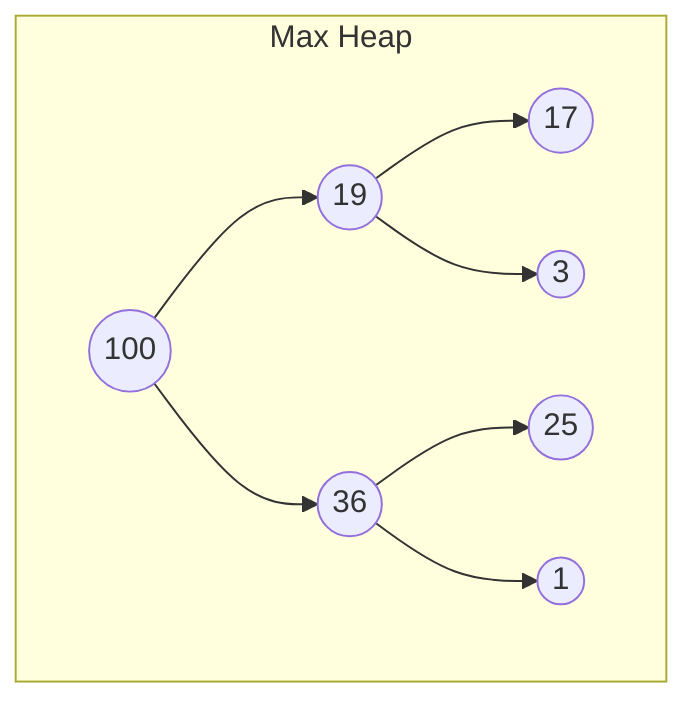
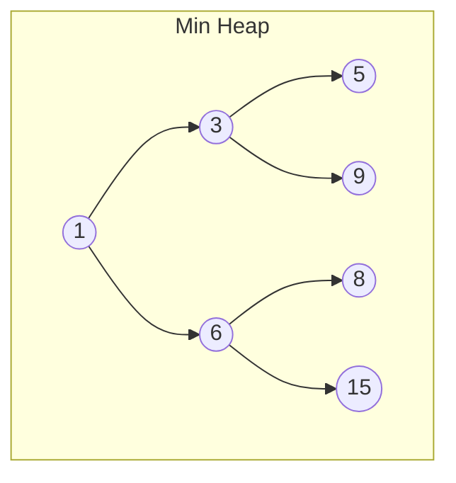

# Heaps

## Introduction

A heap is a specialized tree-based data structure that satisfies the **heap property**. Heaps are commonly used to implement priority queues, which are essential in many algorithms like Dijkstra's shortest path, Huffman coding, and efficient sorting techniques like Heap Sort.

The heap data structure is particularly useful when you need to repeatedly find or remove the minimum or maximum element from a collection of elements.

## What is a Heap?

A heap is a complete binary tree where each node satisfies a specific ordering property relative to its children:

- In a **max heap**: Each parent node is greater than or equal to its children
- In a **min heap**: Each parent node is less than or equal to its children

Additionally, a heap is a **complete binary tree**, which means:
- All levels of the tree are fully filled except possibly the last level
- The last level is filled from left to right

Let's visualize both types of heaps:





## Heap Operations

Let's explore the fundamental operations on heaps:

### 1. Insertion

To insert a value into a heap:
1. Add the new element at the next available position (maintaining completeness)
2. "Bubble up" or "heapify up" the element by swapping it with its parent until the heap property is restored

Let's see this with an example of inserting 35 into a max heap:

```javascript
function insert(heap, value) {
  // Add the new value at the end
  heap.push(value);
  
  // Get the index of the newly added element
  let index = heap.length - 1;
  
  // Bubble up: compare with parent and swap if needed
  while (index > 0) {
    const parentIndex = Math.floor((index - 1) / 2);
    
    if (heap[parentIndex] >= heap[index]) {
      // Heap property is satisfied
      break;
    }
    
    // Swap with parent
    [heap[parentIndex], heap[index]] = [heap[index], heap[parentIndex]];
    index = parentIndex;
  }
  
  return heap;
}

// Example usage
const maxHeap = [100, 19, 36, 17, 3, 25, 1];
console.log("Before insertion:", maxHeap);
insert(maxHeap, 35);
console.log("After insertion:", maxHeap);

// Output:
// Before insertion: [100, 19, 36, 17, 3, 25, 1]
// After insertion: [100, 19, 36, 17, 3, 25, 1, 35]
// After heapify-up: [100, 35, 36, 19, 3, 25, 1, 17]
```

### 2. Extract Max/Min

Extracting the maximum (from max heap) or minimum (from min heap) element:
1. Save the root value (which is the max/min)
2. Move the last element to the root
3. "Bubble down" or "heapify down" the root element by swapping it with its larger (max heap) or smaller (min heap) child until the heap property is restored

```javascript
function extractMax(heap) {
  if (heap.length === 0) return null;
  
  const max = heap[0];
  const lastElement = heap.pop();
  
  if (heap.length > 0) {
    // Move the last element to the root
    heap[0] = lastElement;
    
    // Heapify down
    let index = 0;
    const length = heap.length;
    
    while (true) {
      let largest = index;
      const leftChildIndex = 2 * index + 1;
      const rightChildIndex = 2 * index + 2;
      
      // Compare with left child
      if (leftChildIndex < length && heap[leftChildIndex] > heap[largest]) {
        largest = leftChildIndex;
      }
      
      // Compare with right child
      if (rightChildIndex < length && heap[rightChildIndex] > heap[largest]) {
        largest = rightChildIndex;
      }
      
      // If the largest is still the current index, we're done
      if (largest === index) break;
      
      // Swap with the larger child
      [heap[index], heap[largest]] = [heap[largest], heap[index]];
      index = largest;
    }
  }
  
  return max;
}

// Example usage
const maxHeap = [100, 35, 36, 19, 3, 25, 1, 17];
console.log("Before extraction:", maxHeap);
const max = extractMax(maxHeap);
console.log("Extracted max:", max);
console.log("After extraction:", maxHeap);

// Output:
// Before extraction: [100, 35, 36, 19, 3, 25, 1, 17]
// Extracted max: 100
// After extraction: [36, 35, 25, 19, 3, 17, 1]
```

### 3. Building a Heap from an Array

To build a heap from an unordered array, we can use the "heapify" operation:

```javascript
function buildMaxHeap(array) {
  // Start from the first non-leaf node and heapify each subtree
  for (let i = Math.floor(array.length / 2) - 1; i >= 0; i--) {
    heapifyDown(array, i, array.length);
  }
  return array;
}

function heapifyDown(heap, index, heapSize) {
  let largest = index;
  const left = 2 * index + 1;
  const right = 2 * index + 2;
  
  // Compare with left child
  if (left < heapSize && heap[left] > heap[largest]) {
    largest = left;
  }
  
  // Compare with right child
  if (right < heapSize && heap[right] > heap[largest]) {
    largest = right;
  }
  
  // If largest is not the current index, swap and continue heapifying
  if (largest !== index) {
    [heap[index], heap[largest]] = [heap[largest], heap[index]];
    heapifyDown(heap, largest, heapSize);
  }
}

// Example usage
const array = [4, 10, 3, 5, 1, 8, 2];
console.log("Original array:", array);
buildMaxHeap(array);
console.log("Max heap:", array);

// Output:
// Original array: [4, 10, 3, 5, 1, 8, 2]
// Max heap: [10, 5, 8, 4, 1, 3, 2]
```

## Heap Implementation

We can implement a heap using an array. For a node at index `i`:
- Its left child is at index `2*i + 1`
- Its right child is at index `2*i + 2`
- Its parent is at index `Math.floor((i-1) / 2)`

Here's a complete implementation of a min heap in JavaScript:

```javascript
class MinHeap {
  constructor() {
    this.heap = [];
  }
  
  getParentIndex(i) {
    return Math.floor((i - 1) / 2);
  }
  
  getLeftChildIndex(i) {
    return 2 * i + 1;
  }
  
  getRightChildIndex(i) {
    return 2 * i + 2;
  }
  
  swap(i, j) {
    [this.heap[i], this.heap[j]] = [this.heap[j], this.heap[i]];
  }
  
  insert(value) {
    this.heap.push(value);
    this.heapifyUp(this.heap.length - 1);
  }
  
  heapifyUp(index) {
    if (index === 0) return;
    
    const parentIndex = this.getParentIndex(index);
    if (this.heap[parentIndex] > this.heap[index]) {
      this.swap(parentIndex, index);
      this.heapifyUp(parentIndex);
    }
  }
  
  extractMin() {
    if (this.heap.length === 0) return null;
    
    const min = this.heap[0];
    const lastElement = this.heap.pop();
    
    if (this.heap.length > 0) {
      this.heap[0] = lastElement;
      this.heapifyDown(0);
    }
    
    return min;
  }
  
  heapifyDown(index) {
    const leftChildIndex = this.getLeftChildIndex(index);
    const rightChildIndex = this.getRightChildIndex(index);
    let smallest = index;
    
    if (leftChildIndex < this.heap.length && this.heap[leftChildIndex] < this.heap[smallest]) {
      smallest = leftChildIndex;
    }
    
    if (rightChildIndex < this.heap.length && this.heap[rightChildIndex] < this.heap[smallest]) {
      smallest = rightChildIndex;
    }
    
    if (smallest !== index) {
      this.swap(index, smallest);
      this.heapifyDown(smallest);
    }
  }
  
  peek() {
    return this.heap.length > 0 ? this.heap[0] : null;
  }
  
  size() {
    return this.heap.length;
  }
  
  isEmpty() {
    return this.heap.length === 0;
  }
}

// Example usage
const minHeap = new MinHeap();
minHeap.insert(5);
minHeap.insert(3);
minHeap.insert(8);
minHeap.insert(1);
minHeap.insert(10);

console.log("Min heap:", minHeap.heap);
console.log("Min value:", minHeap.peek());
console.log("Extract min:", minHeap.extractMin());
console.log("Heap after extraction:", minHeap.heap);

// Output:
// Min heap: [1, 3, 8, 5, 10]
// Min value: 1
// Extract min: 1
// Heap after extraction: [3, 5, 8, 10]
```

## Applications of Heaps

Heaps are used in many practical applications:

### 1. Priority Queues

A priority queue is an abstract data type where each element has a priority. Elements with higher priority are served before elements with lower priority. Heaps are an ideal data structure for implementing priority queues.

```javascript
// Using our MinHeap as a priority queue
class PriorityQueue {
  constructor() {
    this.heap = new MinHeap();
  }
  
  enqueue(value, priority) {
    this.heap.insert({ value, priority });
  }
  
  dequeue() {
    const min = this.heap.extractMin();
    return min ? min.value : null;
  }
  
  front() {
    const min = this.heap.peek();
    return min ? min.value : null;
  }
  
  isEmpty() {
    return this.heap.isEmpty();
  }
  
  size() {
    return this.heap.size();
  }
}

// Example: Managing tasks based on priority
const taskQueue = new PriorityQueue();
taskQueue.enqueue("Send email", 3);
taskQueue.enqueue("Fix critical bug", 1);
taskQueue.enqueue("Call client", 2);
taskQueue.enqueue("Deploy application", 1);

console.log("Next task:", taskQueue.dequeue()); // Fix critical bug
console.log("Next task:", taskQueue.dequeue()); // Deploy application
```

### 2. Heap Sort Algorithm

Heap sort is a comparison-based sorting algorithm that uses a heap to first arrange elements and then systematically extracts them in order:

```javascript
function heapSort(array) {
  // Build a max heap
  buildMaxHeap(array);
  
  // Extract elements one by one
  for (let i = array.length - 1; i > 0; i--) {
    // Move the root (maximum) to the end
    [array[0], array[i]] = [array[i], array[0]];
    
    // Call heapify on the reduced heap
    heapifyDown(array, 0, i);
  }
  
  return array;
}

// Example usage
const unsortedArray = [12, 11, 13, 5, 6, 7];
console.log("Unsorted array:", unsortedArray);
heapSort(unsortedArray);
console.log("Sorted array:", unsortedArray);

// Output:
// Unsorted array: [12, 11, 13, 5, 6, 7]
// Sorted array: [5, 6, 7, 11, 12, 13]
```

### 3. Finding k Largest/Smallest Elements

Heaps are efficient for finding the k largest or smallest elements in a collection:

```javascript
function findKLargest(array, k) {
  const minHeap = new MinHeap();
  
  // Process the first k elements
  for (let i = 0; i < k; i++) {
    if (i < array.length) {
      minHeap.insert(array[i]);
    }
  }
  
  // For the rest of the elements
  for (let i = k; i < array.length; i++) {
    if (array[i] > minHeap.peek()) {
      minHeap.extractMin(); // Remove the smallest
      minHeap.insert(array[i]); // Add the new larger element
    }
  }
  
  // Extract all elements from the heap
  const result = [];
  while (!minHeap.isEmpty()) {
    result.push(minHeap.extractMin());
  }
  
  return result;
}

// Example usage
const numbers = [3, 1, 10, 8, 7, 12, 4, 20, 15];
console.log("Original array:", numbers);
console.log("3 largest elements:", findKLargest(numbers, 3));

// Output:
// Original array: [3, 1, 10, 8, 7, 12, 4, 20, 15]
// 3 largest elements: [12, 15, 20]
```

### 4. Dijkstra's Algorithm

Dijkstra's algorithm for finding the shortest path in a graph uses a priority queue, efficiently implemented with a heap:

```javascript
function dijkstra(graph, startVertex) {
  const distances = {};
  const priorityQueue = new PriorityQueue();
  
  // Initialize distances
  for (let vertex in graph) {
    distances[vertex] = vertex === startVertex ? 0 : Infinity;
  }
  
  priorityQueue.enqueue(startVertex, 0);
  
  while (!priorityQueue.isEmpty()) {
    const currentVertex = priorityQueue.dequeue();
    
    for (let neighbor in graph[currentVertex]) {
      const distance = distances[currentVertex] + graph[currentVertex][neighbor];
      
      if (distance < distances[neighbor]) {
        distances[neighbor] = distance;
        priorityQueue.enqueue(neighbor, distance);
      }
    }
  }
  
  return distances;
}

// Example usage with a simple graph
const graph = {
  'A': { 'B': 3, 'C': 1 },
  'B': { 'A': 3, 'C': 7, 'D': 5 },
  'C': { 'A': 1, 'B': 7, 'D': 2 },
  'D': { 'B': 5, 'C': 2 }
};

console.log("Shortest distances from A:", dijkstra(graph, 'A'));
```

## Heap Properties and Complexities

### Time Complexities

| Operation | Time Complexity |
|-----------|----------------|
| Insert    | O(log n)       |
| Extract Min/Max | O(log n) |
| Peek      | O(1)          |
| Build Heap| O(n)          |
| Heapify   | O(log n)      |

### Space Complexity

A binary heap requires O(n) space for storing n elements.

### Common Heap Variations

1. **Binomial Heap**: A collection of binomial trees that support efficient merging operations
2. **Fibonacci Heap**: Provides better amortized running time for several operations
3. **Leftist Heap**: A self-adjusting binary heap variant optimized for merging
4. **Skew Heap**: A self-adjusting version of leftist heaps with simpler implementation

## Summary

Heaps are powerful and versatile data structures that provide efficient implementations for various algorithmic problems:

- They're specialized tree-based structures that maintain a specific ordering property
- They come in two main types: max heaps and min heaps
- Key operations include insertion, extraction, and heapify, all with logarithmic time complexity
- They're most commonly used to implement priority queues, efficient sorting algorithms, and as components in graph algorithms

Understanding heaps is essential for any programmer interested in efficient algorithms and data structures, as they provide optimal solutions to many common computational problems.

## Practice Exercises

1. Implement a max heap class similar to the min heap we explored
2. Write a function to convert a min heap to a max heap
3. Implement a function that checks if an array represents a valid min heap
4. Create a function that merges two existing heaps into a single heap
5. Implement the "delete arbitrary element" operation for a binary heap

## Additional Resources

- Data Structures and Algorithms textbooks for more in-depth coverage
- Online platforms with interactive heap visualizations
- Competitive programming websites for practice problems involving heaps
- Advanced courses on priority queues and specialized heap variants

Happy coding with heaps! They may seem complex at first, but their elegance in solving difficult problems will make them a valuable addition to your programming toolkit.