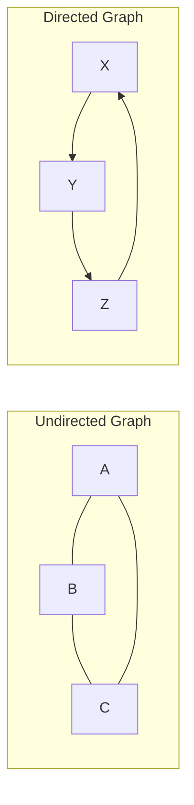
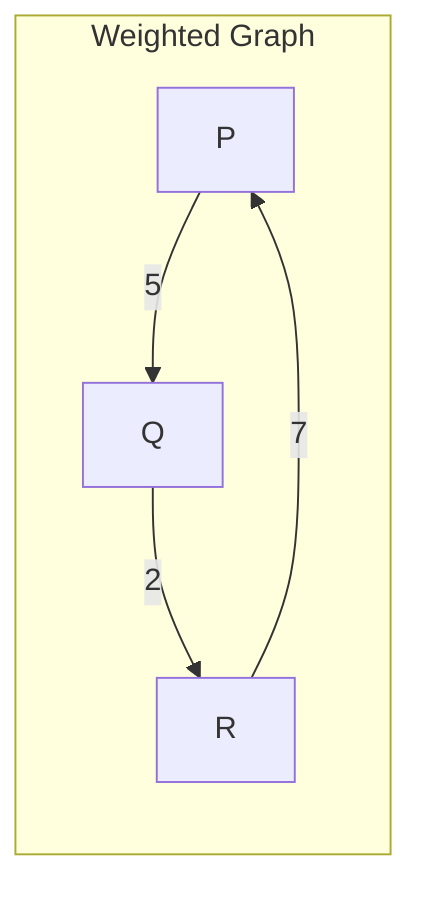

# Graphs Introduction

## What is a Graph?

A graph is a non-linear data structure that consists of a finite set of **nodes** (or **vertices**) and a set of **edges** that connect these nodes. Unlike linear data structures like arrays or linked lists, graphs can express complex relationships between objects.

Think of a graph as a network of connections - much like a social network where people (nodes) are connected through friendships (edges).

## Basic Terminology

Before diving deeper, let's understand some fundamental terms:

- **Node/Vertex**: A fundamental unit in a graph that represents an entity (like a person, city, or any object).
- **Edge**: A connection between two nodes that represents a relationship.
- **Adjacent Nodes**: Two nodes that are connected by an edge.
- **Path**: A sequence of edges that connects two nodes.
- **Cycle**: A path that starts and ends at the same node.
- **Degree**: The number of edges connected to a node.

## Types of Graphs

Graphs come in several varieties:

### 1. Directed vs Undirected Graphs

- **Undirected Graph**: Edges have no direction. If there's an edge between nodes A and B, you can traverse from A to B and from B to A.
- **Directed Graph (Digraph)**: Edges have direction. An edge from A to B allows traversal from A to B but not necessarily from B to A.



### 2. Weighted vs Unweighted Graphs

- **Unweighted Graph**: All edges have the same weight or importance.
- **Weighted Graph**: Edges have associated weights or costs, representing distances, time, etc.



### 3. Cyclic vs Acyclic Graphs

- **Cyclic Graph**: Contains at least one cycle.
- **Acyclic Graph**: Contains no cycles.

### 4. Connected vs Disconnected Graphs

- **Connected Graph**: There's a path between every pair of nodes.
- **Disconnected Graph**: Some nodes cannot be reached from others.

## Graph Representations

There are two common ways to represent a graph in code:

### 1. Adjacency Matrix

A 2D array where `matrix[i][j]` indicates if there's an edge between nodes `i` and `j`. For weighted graphs, the value can represent the weight.

```python
# Adjacency matrix for an undirected graph with 4 nodes
graph = [
    [0, 1, 0, 1],  # Node 0 is connected to nodes 1 and 3
    [1, 0, 1, 0],  # Node 1 is connected to nodes 0 and 2
    [0, 1, 0, 1],  # Node 2 is connected to nodes 1 and 3
    [1, 0, 1, 0]   # Node 3 is connected to nodes 0 and 2
]
```

**Pros**:
- Simple to implement and understand
- Edge lookup is O(1)
- Easy to add or remove edges

**Cons**:
- Requires O(V²) space (V = number of vertices)
- Inefficient for sparse graphs (with few edges)

### 2. Adjacency List

A collection of lists or arrays where each list represents the neighbors of a particular node.

```python
# Adjacency list for the same undirected graph
graph = {
    0: [1, 3],  # Node 0 is connected to nodes 1 and 3
    1: [0, 2],  # Node 1 is connected to nodes 0 and 2
    2: [1, 3],  # Node 2 is connected to nodes 1 and 3
    3: [0, 2]   # Node 3 is connected to nodes 0 and 2
}
```

**Pros**:
- Space-efficient for sparse graphs: O(V + E)
- Iterating over neighbors is efficient

**Cons**:
- Edge lookup can be O(V) in the worst case
- Adding or removing edges can be more complex

## Basic Graph Operations

### Creating a Simple Graph

Let's implement a basic undirected graph using an adjacency list:

```python
class Graph:
    def __init__(self):
        self.adjacency_list = {}
    
    def add_vertex(self, vertex):
        if vertex not in self.adjacency_list:
            self.adjacency_list[vertex] = []
    
    def add_edge(self, vertex1, vertex2):
        # Add edge in both directions for undirected graph
        if vertex1 in self.adjacency_list and vertex2 in self.adjacency_list:
            self.adjacency_list[vertex1].append(vertex2)
            self.adjacency_list[vertex2].append(vertex1)
    
    def remove_edge(self, vertex1, vertex2):
        if vertex1 in self.adjacency_list and vertex2 in self.adjacency_list:
            self.adjacency_list[vertex1].remove(vertex2)
            self.adjacency_list[vertex2].remove(vertex1)
    
    def remove_vertex(self, vertex):
        if vertex in self.adjacency_list:
            # Remove all edges connected to this vertex
            for connected_vertex in self.adjacency_list[vertex]:
                self.adjacency_list[connected_vertex].remove(vertex)
            # Remove the vertex itself
            del self.adjacency_list[vertex]
    
    def display(self):
        for vertex, neighbors in self.adjacency_list.items():
            print(f"{vertex} -> {neighbors}")

# Example usage
g = Graph()
g.add_vertex("A")
g.add_vertex("B")
g.add_vertex("C")
g.add_vertex("D")

g.add_edge("A", "B")
g.add_edge("A", "C")
g.add_edge("B", "D")
g.add_edge("C", "D")

g.display()

# Output:
# A -> ['B', 'C']
# B -> ['A', 'D']
# C -> ['A', 'D']
# D -> ['B', 'C']
```

## Real-World Applications of Graphs

Graphs are incredibly versatile and are used in numerous applications:

### 1. Social Networks

Platforms like Facebook, LinkedIn, and Twitter use graphs to represent relationships between users. Each user is a node, and connections (friendships, follows) are edges.

Example: Recommending new friends based on mutual connections.

### 2. Maps and Navigation Systems

Geographic locations are represented as nodes, and roads/paths connecting them are edges. Weights can represent distances or travel times.

Example: Finding the shortest route between two locations on Google Maps.

```python
# Simplified representation of a road network as a weighted graph
roads = {
    'Home': [('Supermarket', 5), ('Office', 8)],
    'Supermarket': [('Home', 5), ('Park', 3), ('Mall', 6)],
    'Office': [('Home', 8), ('Park', 4)],
    'Park': [('Supermarket', 3), ('Office', 4), ('Mall', 2)],
    'Mall': [('Supermarket', 6), ('Park', 2)]
}
```

### 3. Web Page Ranking

Search engines like Google use graphs to represent the web, with pages as nodes and hyperlinks as edges. Algorithms like PageRank analyze this structure to determine webpage importance.

### 4. Computer Networks

Routers and switches are nodes, and connections between them are edges. Graph algorithms help find optimal routes for data packets.

### 5. Recommendation Systems

Products or content are nodes, and user interactions or similarities are edges. Graph-based analysis helps recommend items similar to what users have liked.

```python
# A simple movie recommendation system based on user ratings
user_ratings = {
    'Alice': {'Inception': 5, 'Interstellar': 4, 'Matrix': 5},
    'Bob': {'Inception': 3, 'Matrix': 4, 'Avatar': 5},
    'Charlie': {'Interstellar': 5, 'Avatar': 3, 'Star Wars': 4},
    'Dave': {'Matrix': 4, 'Star Wars': 5}
}

# We could build a graph where movies are connected if they're liked by the same user
```

## Summary

Graphs are a powerful and flexible data structure that can model a wide variety of real-world scenarios. Key points to remember:

- Graphs consist of nodes (vertices) and edges
- They come in various types: directed/undirected, weighted/unweighted, cyclic/acyclic, connected/disconnected
- Graphs can be represented using adjacency matrices or adjacency lists
- They're used in countless applications from social networks to navigation systems

Understanding graphs is essential for solving complex problems in computer science and software development. As you continue your journey, you'll encounter many algorithms specifically designed for graph traversal and analysis.

## Practice Exercises

1. Implement a directed graph class and add methods for traversals (BFS and DFS)
2. Create a weighted graph to represent distances between cities and find the shortest path
3. Model a small social network as a graph and write an algorithm to suggest new friends
4. Implement a cycle detection algorithm for a directed graph
5. Use a graph to solve a maze problem, where rooms are nodes and doors are edges

## Additional Resources

- Books
  - "Introduction to Algorithms" by Cormen, Leiserson, Rivest, and Stein
  - "Algorithms" by Robert Sedgewick and Kevin Wayne

- Online Resources
  - Khan Academy's Graph Theory tutorials
  - Visualgo.net for graph algorithm visualizations
  - LeetCode's graph problem collection for practice

Graph algorithms are a vast and fascinating field. As you get more comfortable with the basics, you'll discover powerful algorithms like Dijkstra's, Bellman-Ford, Kruskal's, and many more that solve important problems using graph structures.