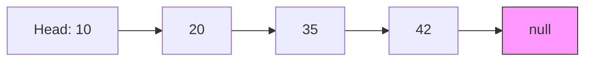
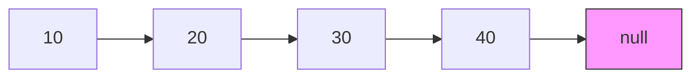
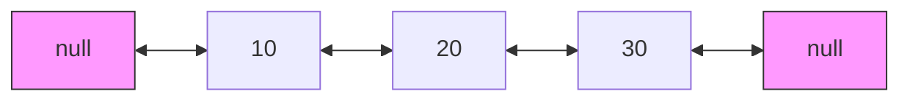
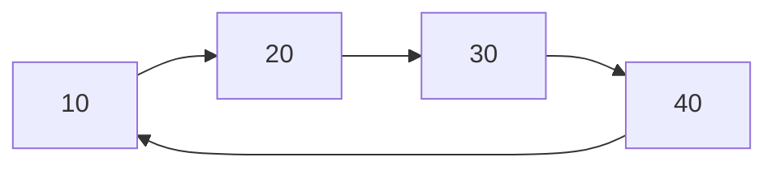

# Linked Lists

## Introduction

A linked list is a linear data structure where elements are stored in nodes that point to the next node in the sequence. Unlike arrays, linked lists don't store elements in contiguous memory locations but instead use pointers to connect elements together.

Each node in a linked list typically contains two components:
1. **Data**: The value or information to be stored
2. **Next pointer**: A reference to the next node in the sequence

The first node of a linked list is called the **head**, and the last node typically points to `null` to indicate the end of the list.



## Why Use Linked Lists?

Linked lists offer several advantages over other data structures:

- **Dynamic Size**: Unlike arrays, linked lists can grow or shrink during execution without requiring reallocation of memory
- **Efficient Insertions/Deletions**: Adding or removing elements from certain positions can be more efficient than with arrays
- **Memory Utilization**: Linked lists allocate memory as needed, without wasting space for unused elements
- **Implementation Flexibility**: Linked lists can be easily modified to implement other data structures like stacks, queues, or graphs

## Types of Linked Lists

There are several variations of linked lists, each with unique characteristics:

### 1. Singly Linked List

In a singly linked list, each node points only to the next node in the sequence.



### 2. Doubly Linked List

A doubly linked list contains nodes with pointers to both the next and previous nodes.



### 3. Circular Linked List

In a circular linked list, the last node points back to the first node (head) instead of null.



## Implementing a Singly Linked List

Let's implement a basic singly linked list in JavaScript:

```javascript
// Node class represents an element in the linked list
class Node {
  constructor(data) {
    this.data = data;    // The value stored in this node
    this.next = null;    // Pointer to the next node (null by default)
  }
}

// LinkedList class to manage the list
class LinkedList {
  constructor() {
    this.head = null;    // Head points to the first node (null for empty list)
    this.size = 0;       // Keep track of the list size
  }
  
  // Add a new node to the end of the list
  append(data) {
    const newNode = new Node(data);
    
    // If the list is empty, the new node becomes the head
    if (!this.head) {
      this.head = newNode;
      this.size++;
      return;
    }
    
    // Otherwise, find the last node and append the new node
    let current = this.head;
    while (current.next) {
      current = current.next;
    }
    
    current.next = newNode;
    this.size++;
  }
  
  // Print the list elements
  printList() {
    let current = this.head;
    const values = [];
    
    while (current) {
      values.push(current.data);
      current = current.next;
    }
    
    return values.join(' → ');
  }
}

// Example usage:
const list = new LinkedList();
list.append(10);
list.append(20);
list.append(30);

console.log("Linked List: " + list.printList());
// Output: Linked List: 10 → 20 → 30
```

## Basic Operations on Linked Lists

Let's extend our LinkedList class to include more common operations:

```javascript
class LinkedList {
  // ... previous code
  
  // Insert at the beginning of the list
  prepend(data) {
    const newNode = new Node(data);
    newNode.next = this.head;
    this.head = newNode;
    this.size++;
  }
  
  // Insert at a specific position
  insertAt(data, position) {
    // Check if position is valid
    if (position < 0 || position > this.size) {
      console.error("Invalid position");
      return;
    }
    
    // Insert at the beginning
    if (position === 0) {
      this.prepend(data);
      return;
    }
    
    const newNode = new Node(data);
    let current = this.head;
    let previous = null;
    let index = 0;
    
    // Traverse to the position
    while (index < position) {
      previous = current;
      current = current.next;
      index++;
    }
    
    // Insert the new node
    newNode.next = current;
    previous.next = newNode;
    this.size++;
  }
  
  // Remove a node with specific value
  remove(data) {
    if (!this.head) return;
    
    // If head needs to be removed
    if (this.head.data === data) {
      this.head = this.head.next;
      this.size--;
      return;
    }
    
    let current = this.head;
    let previous = null;
    
    // Find the node to remove
    while (current && current.data !== data) {
      previous = current;
      current = current.next;
    }
    
    // If data was not found
    if (!current) return;
    
    // Remove the node
    previous.next = current.next;
    this.size--;
  }
  
  // Get the size of the list
  getSize() {
    return this.size;
  }
  
  // Check if the list is empty
  isEmpty() {
    return this.size === 0;
  }
}
```

### Example of using these operations:

```javascript
const list = new LinkedList();

// Add elements
list.append(10);
list.append(30);
list.prepend(5);
list.insertAt(20, 2);

console.log("List: " + list.printList());
// Output: List: 5 → 10 → 20 → 30

// Remove an element
list.remove(10);
console.log("After removing 10: " + list.printList());
// Output: After removing 10: 5 → 20 → 30

console.log("Size: " + list.getSize());
// Output: Size: 3
```

## Time Complexity of Linked List Operations

Understanding the time complexity helps assess when to use linked lists:

| Operation | Singly Linked List | Doubly Linked List | Array |
|-----------|-------------------|-------------------|-------|
| Access    | O(n)              | O(n)              | O(1)  |
| Search    | O(n)              | O(n)              | O(n)  |
| Insertion at beginning | O(1) | O(1)              | O(n)  |
| Insertion at end | O(n) or O(1)* | O(1)          | O(n) or O(1)** |
| Deletion at beginning | O(1) | O(1)              | O(n)  |
| Deletion at end | O(n) | O(1)                    | O(1)  |

\* O(1) if we maintain a tail pointer  
\** O(1) amortized for dynamic arrays

## Implementing a Doubly Linked List

Let's also implement a doubly linked list for comparison:

```javascript
class DoublyNode {
  constructor(data) {
    this.data = data;
    this.next = null;
    this.prev = null;
  }
}

class DoublyLinkedList {
  constructor() {
    this.head = null;
    this.tail = null;
    this.size = 0;
  }
  
  // Add to the end
  append(data) {
    const newNode = new DoublyNode(data);
    
    if (!this.head) {
      this.head = newNode;
      this.tail = newNode;
    } else {
      newNode.prev = this.tail;
      this.tail.next = newNode;
      this.tail = newNode;
    }
    
    this.size++;
  }
  
  // Add to the beginning
  prepend(data) {
    const newNode = new DoublyNode(data);
    
    if (!this.head) {
      this.head = newNode;
      this.tail = newNode;
    } else {
      newNode.next = this.head;
      this.head.prev = newNode;
      this.head = newNode;
    }
    
    this.size++;
  }
  
  // Print forward
  printForward() {
    let current = this.head;
    const values = [];
    
    while (current) {
      values.push(current.data);
      current = current.next;
    }
    
    return values.join(' ⟷ ');
  }
  
  // Print backward
  printBackward() {
    let current = this.tail;
    const values = [];
    
    while (current) {
      values.push(current.data);
      current = current.prev;
    }
    
    return values.join(' ⟷ ');
  }
}

// Example:
const dlist = new DoublyLinkedList();
dlist.append(10);
dlist.append(20);
dlist.prepend(5);

console.log("Forward: " + dlist.printForward());
// Output: Forward: 5 ⟷ 10 ⟷ 20
console.log("Backward: " + dlist.printBackward());
// Output: Backward: 20 ⟷ 10 ⟷ 5
```

## Real-world Applications

Linked lists are used in numerous real-world applications:

### 1. Navigation Systems

Browser history navigation uses a linked list structure to move backward and forward between web pages.

```javascript
class BrowserHistory {
  constructor(homepage) {
    this.current = new DoublyNode(homepage);
    this.head = this.current;
    this.tail = this.current;
  }
  
  visit(url) {
    // Create new node for the URL
    const newPage = new DoublyNode(url);
    
    // Connect the new page
    this.current.next = newPage;
    newPage.prev = this.current;
    
    // Update current and tail
    this.current = newPage;
    this.tail = newPage;
  }
  
  back(steps) {
    // Move back some number of steps
    while (steps > 0 && this.current.prev) {
      this.current = this.current.prev;
      steps--;
    }
    return this.current.data;
  }
  
  forward(steps) {
    // Move forward some number of steps
    while (steps > 0 && this.current.next) {
      this.current = this.current.next;
      steps--;
    }
    return this.current.data;
  }
}

// Example usage
const browser = new BrowserHistory("google.com");
browser.visit("youtube.com");
browser.visit("facebook.com");

console.log(browser.back(1));  // Output: youtube.com
console.log(browser.forward(1));  // Output: facebook.com
```

### 2. Music Playlists

Music players often use linked lists to manage playlists, allowing for easy addition, removal, and navigation between songs.

### 3. Memory Management

Operating systems use linked lists to track allocated and free memory blocks.

### 4. Symbol Tables in Compiler Design

Compilers use linked lists to implement symbol tables that keep track of variables and their scopes.

## Common Linked List Problems and Solutions

### Problem 1: Finding the middle of a linked list

This can be solved efficiently using the "slow and fast pointer" technique:

```javascript
function findMiddle(linkedList) {
  if (!linkedList.head) return null;
  
  let slow = linkedList.head;
  let fast = linkedList.head;
  
  while (fast && fast.next) {
    slow = slow.next;
    fast = fast.next.next;
  }
  
  return slow.data;
}

// Example
const list = new LinkedList();
list.append(1);
list.append(2);
list.append(3);
list.append(4);
list.append(5);
console.log("Middle element: " + findMiddle(list)); // Output: 3
```

### Problem 2: Detecting a cycle in a linked list

This can also be solved using the "slow and fast pointer" technique:

```javascript
function hasCycle(linkedList) {
  if (!linkedList.head) return false;
  
  let slow = linkedList.head;
  let fast = linkedList.head;
  
  while (fast && fast.next) {
    slow = slow.next;
    fast = fast.next.next;
    
    // If they meet, there's a cycle
    if (slow === fast) return true;
  }
  
  return false;
}
```

### Problem 3: Reversing a linked list

Reversing a linked list is a common interview question:

```javascript
function reverseList(linkedList) {
  let previous = null;
  let current = linkedList.head;
  let next = null;
  
  while (current) {
    // Save next
    next = current.next;
    
    // Reverse the pointer
    current.next = previous;
    
    // Move pointers forward
    previous = current;
    current = next;
  }
  
  // Update head to the new start (which was the end)
  linkedList.head = previous;
  
  return linkedList;
}

// Example
const list = new LinkedList();
list.append(1);
list.append(2);
list.append(3);
console.log("Original: " + list.printList()); // Output: 1 → 2 → 3
reverseList(list);
console.log("Reversed: " + list.printList()); // Output: 3 → 2 → 1
```

## Summary

Linked lists are versatile data structures that provide efficient insertions and deletions. We've explored:

- The structure and types of linked lists (singly, doubly, and circular)
- Basic operations and their implementations
- Time complexity comparisons with arrays
- Real-world applications
- Common linked list problems and their solutions

While linked lists offer advantages such as dynamic size and efficient insertions, they have drawbacks too, such as slower access times compared to arrays and additional memory overhead for storing pointers.

Understanding when to use linked lists versus other data structures is a crucial skill in software development.

## Practice Exercises

1. **Implement a circular linked list** where the last node points back to the first node.
2. **Create a method** to detect and remove loops in a linked list.
3. **Merge two sorted linked lists** into a single sorted linked list.
4. **Implement a doubly linked list** with a `delete(position)` method that removes a node at a specific position.
5. **Create a linked list** that maintains both head and tail pointers and offers O(1) operations for adding/removing from both ends.
6. **Rotate a linked list** to the right by k places.

## Additional Resources

- [Data Structures: Linked Lists on Coursera](https://www.coursera.org/learn/data-structures)
- [GeeksforGeeks Linked List Tutorial](https://www.geeksforgeeks.org/data-structures/linked-list/)
- [Visualizing Linked Lists](https://visualgo.net/en/list)

By understanding and practicing linked list implementations, you'll develop a stronger foundation for more complex data structures and algorithms.