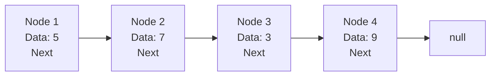

# Singly Linked Lists

## Introduction

A singly linked list is one of the most fundamental data structures in computer programming. Unlike arrays, which store elements in contiguous memory locations, linked lists store elements in nodes that are connected through pointers. Each node contains two components: the data value and a reference (or pointer) to the next node in the sequence.

Singly linked lists are called "singly" because each node only points to the next node in the sequence, creating a one-directional chain of elements.



## Basic Structure of a Singly Linked List

The building block of a linked list is a Node. Let's create a simple node structure in several programming languages:

### In JavaScript:

```javascript
class Node {
  constructor(data) {
    this.data = data;
    this.next = null;
  }
}
```

### In Python:

```python
class Node:
    def __init__(self, data):
        self.data = data
        self.next = None
```

### In Java:

```java
class Node {
    int data;
    Node next;
    
    Node(int data) {
        this.data = data;
        this.next = null;
    }
}
```

### In C++:

```cpp
struct Node {
    int data;
    Node* next;
    
    Node(int value) : data(value), next(nullptr) {}
};
```

Now that we have our Node structure, we can implement the linked list itself:

## Implementing a Singly Linked List

Let's implement a basic singly linked list class in JavaScript:

```javascript
class SinglyLinkedList {
  constructor() {
    this.head = null;
    this.size = 0;
  }

  // Add a node to the end of the list
  append(data) {
    const newNode = new Node(data);
    
    // If the list is empty
    if (!this.head) {
      this.head = newNode;
    } else {
      // Traverse to the end of the list
      let current = this.head;
      while (current.next) {
        current = current.next;
      }
      current.next = newNode;
    }
    
    this.size++;
  }

  // Add a node to the beginning of the list
  prepend(data) {
    const newNode = new Node(data);
    newNode.next = this.head;
    this.head = newNode;
    this.size++;
  }

  // Get the size of the list
  getSize() {
    return this.size;
  }

  // Print the list
  print() {
    let current = this.head;
    let result = '';
    
    while (current) {
      result += current.data + (current.next ? ' -> ' : '');
      current = current.next;
    }
    
    console.log(result || 'Empty list');
  }
}
```

## Basic Operations on a Singly Linked List

Now let's explore the common operations we can perform on a singly linked list:

### 1. Insertion

We can insert elements in three ways:
- At the beginning (prepend)
- At the end (append)
- At a specific position

Let's add a method to insert at a specific position:

```javascript
// Insert at a specific position
insertAt(data, position) {
  // If position is out of range
  if (position < 0 || position > this.size) {
    console.error('Invalid position');
    return;
  }

  // If position is 0, use prepend
  if (position === 0) {
    this.prepend(data);
    return;
  }

  const newNode = new Node(data);
  let current = this.head;
  let previous = null;
  let index = 0;

  // Traverse to the position
  while (index < position) {
    previous = current;
    current = current.next;
    index++;
  }

  // Insert the new node
  newNode.next = current;
  previous.next = newNode;
  this.size++;
}
```

### 2. Deletion

We can delete elements in three ways:
- From the beginning
- From the end
- From a specific position

Let's implement these methods:

```javascript
// Remove from the beginning
removeFirst() {
  if (!this.head) {
    return null;
  }

  const removedNode = this.head;
  this.head = this.head.next;
  this.size--;
  return removedNode.data;
}

// Remove from the end
removeLast() {
  if (!this.head) {
    return null;
  }

  // If only one node
  if (!this.head.next) {
    const removedNode = this.head;
    this.head = null;
    this.size--;
    return removedNode.data;
  }

  let current = this.head;
  let previous = null;

  // Traverse to the end
  while (current.next) {
    previous = current;
    current = current.next;
  }

  previous.next = null;
  this.size--;
  return current.data;
}

// Remove from a specific position
removeAt(position) {
  // If position is out of range
  if (position < 0 || position >= this.size) {
    console.error('Invalid position');
    return null;
  }

  // If position is 0, use removeFirst
  if (position === 0) {
    return this.removeFirst();
  }

  let current = this.head;
  let previous = null;
  let index = 0;

  // Traverse to the position
  while (index < position) {
    previous = current;
    current = current.next;
    index++;
  }

  previous.next = current.next;
  this.size--;
  return current.data;
}
```

### 3. Searching

To find an element in the list:

```javascript
// Find an element in the list
find(data) {
  if (!this.head) {
    return -1;
  }

  let current = this.head;
  let index = 0;

  while (current) {
    if (current.data === data) {
      return index;
    }
    current = current.next;
    index++;
  }

  return -1; // Element not found
}
```

## Code Examples with Input and Output

Let's see how to use our linked list in practice:

```javascript
// Create a new linked list
const list = new SinglyLinkedList();

// Append elements
list.append(10);
list.append(20);
list.append(30);
list.print(); // Output: 10 -> 20 -> 30

// Prepend an element
list.prepend(5);
list.print(); // Output: 5 -> 10 -> 20 -> 30

// Insert at a specific position
list.insertAt(15, 2);
list.print(); // Output: 5 -> 10 -> 15 -> 20 -> 30

// Remove from the beginning
console.log("Removed:", list.removeFirst()); // Output: Removed: 5
list.print(); // Output: 10 -> 15 -> 20 -> 30

// Remove from the end
console.log("Removed:", list.removeLast()); // Output: Removed: 30
list.print(); // Output: 10 -> 15 -> 20

// Remove from a specific position
console.log("Removed:", list.removeAt(1)); // Output: Removed: 15
list.print(); // Output: 10 -> 20

// Find an element
console.log("Position of 20:", list.find(20)); // Output: Position of 20: 1
console.log("Position of 15:", list.find(15)); // Output: Position of 15: -1
```

## Time Complexity Analysis

Understanding the time complexity of linked list operations is essential:

| Operation | Time Complexity | Explanation |
|-----------|----------------|-------------|
| Access    | O(n)           | To access an element, we need to traverse from the head |
| Insertion (at beginning) | O(1) | Just update the head pointer |
| Insertion (at end) | O(n) | Need to traverse to the end of the list |
| Insertion (at position) | O(n) | Need to traverse to find the position |
| Deletion (at beginning) | O(1) | Just update the head pointer |
| Deletion (at end) | O(n) | Need to traverse to find the second-to-last node |
| Deletion (at position) | O(n) | Need to traverse to find the node |
| Search | O(n) | May need to traverse the entire list |

## Advantages and Disadvantages

### Advantages:
- Dynamic size: Can grow and shrink during runtime
- Efficient insertions/deletions at the beginning
- No need for contiguous memory allocation
- Memory efficient (only allocates needed memory)

### Disadvantages:
- No random access (must traverse from the beginning)
- Extra memory for pointers
- Not cache-friendly (elements not stored in contiguous memory)
- Difficult to reverse traversal (need to keep track of previous node)

## Real-world Applications of Linked Lists

Linked lists are used in many real-world applications:

1. **Implementation of Stacks and Queues**: Linked lists provide an efficient way to implement these abstract data types.

2. **Symbol Tables in Compilers**: Compilers use linked lists to keep track of variables and their information.

3. **Dynamic Memory Allocation**: The memory available for dynamic allocation can be tracked using linked lists.

4. **Image Viewer Applications**: Photo viewers that allow you to navigate forward and backward through images use linked lists.

5. **Music Player Playlists**: Applications like music players use linked lists to manage playlists where songs can be added or removed easily.

6. **Browser History**: Web browsers use linked lists to implement the back and forward buttons.

### Example: Building a Simple Music Playlist

```javascript
class Song {
  constructor(title, artist) {
    this.title = title;
    this.artist = artist;
    this.next = null;
  }
}

class Playlist {
  constructor() {
    this.head = null;
    this.current = null;
    this.size = 0;
  }

  addSong(title, artist) {
    const newSong = new Song(title, artist);
    
    if (!this.head) {
      this.head = newSong;
      this.current = newSong;
    } else {
      let last = this.head;
      while (last.next) {
        last = last.next;
      }
      last.next = newSong;
    }
    
    this.size++;
  }

  playCurrentSong() {
    if (!this.current) {
      return "No songs in the playlist";
    }
    
    return `Now playing: "${this.current.title}" by ${this.current.artist}`;
  }

  nextSong() {
    if (!this.current || !this.current.next) {
      return "No next song available";
    }
    
    this.current = this.current.next;
    return this.playCurrentSong();
  }

  showPlaylist() {
    let result = "Playlist:\n";
    let song = this.head;
    let index = 1;
    
    while (song) {
      result += `${index}. "${song.title}" by ${song.artist}\n`;
      song = song.next;
      index++;
    }
    
    return result;
  }
}

// Usage example
const myPlaylist = new Playlist();
myPlaylist.addSong("Bohemian Rhapsody", "Queen");
myPlaylist.addSong("Stairway to Heaven", "Led Zeppelin");
myPlaylist.addSong("Imagine", "John Lennon");

console.log(myPlaylist.showPlaylist());
console.log(myPlaylist.playCurrentSong());
console.log(myPlaylist.nextSong());
console.log(myPlaylist.nextSong());
```

Output:
```
Playlist:
1. "Bohemian Rhapsody" by Queen
2. "Stairway to Heaven" by Led Zeppelin
3. "Imagine" by John Lennon

Now playing: "Bohemian Rhapsody" by Queen
Now playing: "Stairway to Heaven" by Led Zeppelin
Now playing: "Imagine" by John Lennon
```

## Advanced Topics

### 1. Detecting Cycles in a Linked List

A cycle in a linked list occurs when a node's next pointer points back to a previously visited node. Floyd's Cycle-Finding Algorithm (also known as the "tortoise and hare" algorithm) can detect cycles:

```javascript
hasCycle() {
  if (!this.head || !this.head.next) {
    return false;
  }
  
  let slow = this.head; // Tortoise
  let fast = this.head; // Hare
  
  while (fast && fast.next) {
    slow = slow.next; // Move one step
    fast = fast.next.next; // Move two steps
    
    if (slow === fast) {
      return true; // Cycle detected
    }
  }
  
  return false;
}
```

### 2. Reversing a Linked List

Reversing a singly linked list is a common interview question:

```javascript
reverse() {
  let current = this.head;
  let previous = null;
  let next = null;
  
  while (current) {
    // Store the next node
    next = current.next;
    
    // Reverse the link
    current.next = previous;
    
    // Move pointers forward
    previous = current;
    current = next;
  }
  
  // Update the head
  this.head = previous;
}
```

## Summary

Singly linked lists are fundamental data structures that consist of nodes containing data and a reference to the next node. Key points to remember:

- Each node contains data and a pointer to the next node
- The list begins with a head pointer
- The last node points to null
- Operations include insertion, deletion, and traversal
- Time complexity for insertion/deletion at beginning is O(1)
- Time complexity for access, insertion/deletion elsewhere is O(n)
- Linked lists are useful when you need dynamic memory allocation and frequent insertions/deletions

Understanding singly linked lists provides a foundation for more complex data structures like doubly linked lists, circular linked lists, and skip lists.

## Exercises

1. Implement a method to find the middle element of a linked list in one pass.
2. Write a function to detect if a linked list is a palindrome.
3. Implement a method to remove duplicate values from an unsorted linked list.
4. Create a function that returns the nth node from the end of the list in one pass.
5. Implement a method to merge two sorted linked lists into a single sorted linked list.

## Additional Resources

- [Visualizing Linked Lists](https://visualgo.net/en/list)
- "Cracking the Coding Interview" by Gayle Laakmann McDowell has excellent linked list problems
- MIT OpenCourseware's [Introduction to Algorithms](https://ocw.mit.edu/courses/electrical-engineering-and-computer-science/6-006-introduction-to-algorithms-fall-2011/)
- [GeeksforGeeks Linked List Data Structure](https://www.geeksforgeeks.org/data-structures/linked-list/)

Happy coding with singly linked lists!