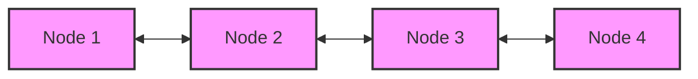

# Doubly Linked Lists

## Introduction

A doubly linked list is a type of linked data structure that consists of a set of sequentially linked records called nodes. Unlike singly linked lists, each node in a doubly linked list contains two references (or links): one to the next node and another to the previous node in the sequence. This bidirectional linking gives doubly linked lists more flexibility but comes with additional memory cost.



## Structure of a Doubly Linked List

Each node in a doubly linked list typically contains three components:

1. **Data**: The actual value or payload the node carries
2. **Next pointer**: A reference to the next node in the sequence
3. **Previous pointer**: A reference to the previous node in the sequence

The first node's previous pointer and the last node's next pointer typically point to `null`, indicating the beginning and end of the list.

Let's define a basic node structure in JavaScript:

```javascript
class Node {
    constructor(data) {
        this.data = data;
        this.next = null;
        this.prev = null;
    }
}
```

## Implementing a Doubly Linked List

Let's create a complete implementation of a doubly linked list in JavaScript:

```javascript
class DoublyLinkedList {
    constructor() {
        this.head = null;
        this.tail = null;
        this.length = 0;
    }
    
    // Add to the end of the list
    append(data) {
        const newNode = new Node(data);
        
        if (!this.head) {
            this.head = newNode;
            this.tail = newNode;
        } else {
            newNode.prev = this.tail;
            this.tail.next = newNode;
            this.tail = newNode;
        }
        
        this.length++;
        return this;
    }
    
    // Add to the beginning of the list
    prepend(data) {
        const newNode = new Node(data);
        
        if (!this.head) {
            this.head = newNode;
            this.tail = newNode;
        } else {
            newNode.next = this.head;
            this.head.prev = newNode;
            this.head = newNode;
        }
        
        this.length++;
        return this;
    }
    
    // Insert at a specific position
    insert(position, data) {
        // If position is out of range
        if (position < 0 || position > this.length) {
            return false;
        }
        
        // If position is 0, prepend
        if (position === 0) {
            return this.prepend(data);
        }
        
        // If position is at the end, append
        if (position === this.length) {
            return this.append(data);
        }
        
        // Create a new node
        const newNode = new Node(data);
        
        // Find the node at position
        let current = this.head;
        let index = 0;
        
        while (index < position) {
            current = current.next;
            index++;
        }
        
        // Update pointers
        newNode.prev = current.prev;
        newNode.next = current;
        current.prev.next = newNode;
        current.prev = newNode;
        
        this.length++;
        return true;
    }
    
    // Remove a node at a specific position
    removeAt(position) {
        // If list is empty or position is out of range
        if (!this.head || position < 0 || position >= this.length) {
            return null;
        }
        
        let current = this.head;
        
        // If removing the first element
        if (position === 0) {
            this.head = current.next;
            
            // If there's only one element
            if (this.length === 1) {
                this.tail = null;
            } else {
                this.head.prev = null;
            }
        } 
        // If removing the last element
        else if (position === this.length - 1) {
            current = this.tail;
            this.tail = current.prev;
            this.tail.next = null;
        } 
        // If removing a middle element
        else {
            let index = 0;
            
            while (index < position) {
                current = current.next;
                index++;
            }
            
            current.prev.next = current.next;
            current.next.prev = current.prev;
        }
        
        this.length--;
        return current.data;
    }
    
    // Display the list as an array
    toArray() {
        const array = [];
        let current = this.head;
        
        while (current) {
            array.push(current.data);
            current = current.next;
        }
        
        return array;
    }
    
    // Display the list in reverse as an array
    toArrayReverse() {
        const array = [];
        let current = this.tail;
        
        while (current) {
            array.push(current.data);
            current = current.prev;
        }
        
        return array;
    }
}
```

## Using the Doubly Linked List

Let's see our implementation in action:

```javascript
// Create a new doubly linked list
const list = new DoublyLinkedList();

// Add elements
list.append(10);
list.append(20);
list.append(30);
list.prepend(5);

console.log("List after adding elements:", list.toArray());
// Output: List after adding elements: [5, 10, 20, 30]

// Insert at position 2
list.insert(2, 15);
console.log("List after inserting 15 at position 2:", list.toArray());
// Output: List after inserting 15 at position 2: [5, 10, 15, 20, 30]

// Remove element at position 1
console.log("Removed element:", list.removeAt(1));
// Output: Removed element: 10
console.log("List after removing element at position 1:", list.toArray());
// Output: List after removing element at position 1: [5, 15, 20, 30]

// Display the list in reverse
console.log("List in reverse:", list.toArrayReverse());
// Output: List in reverse: [30, 20, 15, 5]
```

## Advantages and Disadvantages

### Advantages:

1. **Bidirectional Traversal**: Can be traversed in both directions
2. **Delete Operation**: More efficient deletion as we don't need to track the previous node
3. **Insertion/Deletion at Ends**: O(1) operations for inserting/deleting at both ends when we maintain both head and tail pointers

### Disadvantages:

1. **Memory Overhead**: Additional memory required for previous pointers
2. **Complexity**: More complex implementation than singly linked list
3. **Potential Errors**: More pointers to manage increases the likelihood of errors

## Common Operations and Time Complexity

| Operation | Time Complexity | Description |
|-----------|----------------|-------------|
| Access    | O(n)           | Finding an element by value requires traversing the list |
| Search    | O(n)           | Similar to access, requires traversal |
| Insertion | O(1) to O(n)   | O(1) at ends, O(n) in middle (need to find position) |
| Deletion  | O(1) to O(n)   | O(1) when node is known, O(n) when searching first |

## Real-World Applications

### 1. Browser History Navigation

Web browsers use a doubly linked list to implement the back and forward buttons. Each web page is a node in the list, allowing easy navigation in both directions.

```javascript
class BrowserHistory {
    constructor(homepage) {
        this.current = new Node(homepage);
        this.head = this.current;
        this.tail = this.current;
    }
    
    visit(url) {
        const newPage = new Node(url);
        this.current.next = newPage;
        newPage.prev = this.current;
        this.current = newPage;
        this.tail = this.current;  // Update tail
    }
    
    back(steps) {
        while (steps > 0 && this.current.prev) {
            this.current = this.current.prev;
            steps--;
        }
        return this.current.data;
    }
    
    forward(steps) {
        while (steps > 0 && this.current.next) {
            this.current = this.current.next;
            steps--;
        }
        return this.current.data;
    }
}

// Usage:
const browser = new BrowserHistory("google.com");
browser.visit("facebook.com");
browser.visit("youtube.com");
console.log(browser.back(1)); // Output: facebook.com
console.log(browser.forward(1)); // Output: youtube.com
```

### 2. Music Player Playlist

Music players can use doubly linked lists to navigate through songs, allowing users to go to the next or previous song.

```javascript
class MusicPlaylist {
    constructor() {
        this.playlist = new DoublyLinkedList();
        this.currentSong = null;
    }
    
    addSong(title) {
        this.playlist.append(title);
        if (!this.currentSong) {
            this.currentSong = this.playlist.head;
        }
    }
    
    nextSong() {
        if (this.currentSong && this.currentSong.next) {
            this.currentSong = this.currentSong.next;
            return this.currentSong.data;
        }
        return "End of playlist";
    }
    
    previousSong() {
        if (this.currentSong && this.currentSong.prev) {
            this.currentSong = this.currentSong.prev;
            return this.currentSong.data;
        }
        return "Beginning of playlist";
    }
    
    currentlyPlaying() {
        return this.currentSong ? this.currentSong.data : "No song playing";
    }
}
```

### 3. Undo/Redo Functionality

Text editors implement undo/redo functionality using doubly linked lists, where each state change is a node in the list.

```javascript
class TextEditor {
    constructor(initialText = "") {
        this.history = new DoublyLinkedList();
        this.history.append(initialText);
        this.current = this.history.head;
    }
    
    type(text) {
        // Create new state by appending to current text
        const newText = this.current.data + text;
        
        // Remove any future states if we've gone back
        if (this.current !== this.history.tail) {
            let temp = this.current.next;
            this.current.next = null;
            this.history.tail = this.current;
            
            // Update length accordingly
            while (temp) {
                this.history.length--;
                temp = temp.next;
            }
        }
        
        // Add the new state
        this.history.append(newText);
        this.current = this.history.tail;
        return this.current.data;
    }
    
    undo() {
        if (this.current.prev) {
            this.current = this.current.prev;
            return this.current.data;
        }
        return this.current.data;
    }
    
    redo() {
        if (this.current.next) {
            this.current = this.current.next;
            return this.current.data;
        }
        return this.current.data;
    }
}

// Usage:
const editor = new TextEditor();
console.log(editor.type("Hello")); // Output: Hello
console.log(editor.type(" World")); // Output: Hello World
console.log(editor.undo()); // Output: Hello
console.log(editor.redo()); // Output: Hello World
```

## Summary

Doubly linked lists are a powerful data structure that builds on the concept of singly linked lists by adding bidirectional traversal capabilities. While they require more memory to store the additional pointers, they provide faster operations in certain scenarios and enable elegant solutions for problems requiring backward navigation.

Key points to remember:

1. Each node has references to both the next and previous node
2. Insertion and deletion operations are more efficient than in singly linked lists
3. They require more memory due to the additional pointers
4. They're useful for applications that require bidirectional traversal
5. Common applications include browser history, music players, and undo/redo functionality

## Exercises

1. Implement a `reverse()` method for the DoublyLinkedList class that reverses the list in-place.
2. Add a `sort()` method to sort the elements in the list (you can assume numeric values).
3. Implement a circular doubly linked list where the last node points to the first node and vice versa.
4. Create a method that detects if the doubly linked list has any cycles.
5. Implement a cache with a limited size using a doubly linked list, where the most recently accessed items stay at the front (this is essentially an LRU cache).

## Additional Resources

- [GeeksforGeeks: Doubly Linked List](https://www.geeksforgeeks.org/doubly-linked-list/)
- [Visualizing Data Structures and Algorithms with Interactive Animations](https://visualgo.net/en/list)
- [Introduction to Algorithms by Cormen, Leiserson, Rivest, and Stein](https://mitpress.mit.edu/books/introduction-algorithms-third-edition) - Contains detailed explanations of linked lists and their operations

Happy coding with doubly linked lists! This versatile data structure is an important tool in any programmer's toolkit.