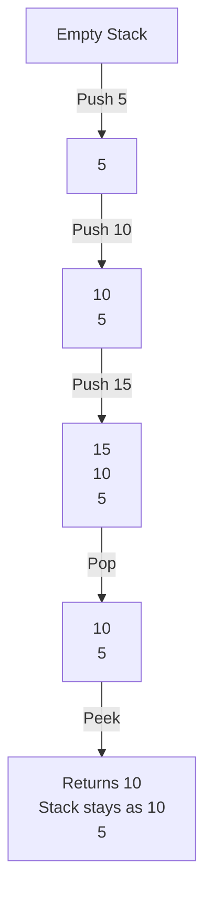
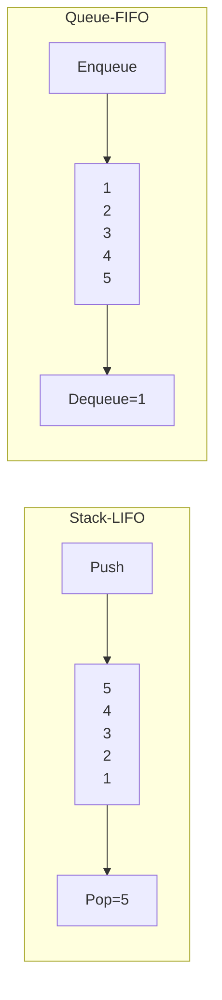

# Stacks

## Introduction

A stack is one of the most fundamental data structures in computer science. Think of it like a stack of plates in a cafeteria - you can only add or remove plates from the top of the stack. This simple principle forms the basis of the Stack data structure, which follows the **Last-In-First-Out (LIFO)** ordering principle.

In a LIFO structure:
- The last element added is the first one to be removed
- New elements are added to the "top" of the stack
- Elements are removed from the "top" of the stack

This concept is simple but incredibly powerful and appears in numerous programming scenarios.

## Basic Operations

A stack supports the following key operations:

1. **Push** - Add an element to the top of the stack
2. **Pop** - Remove the top element from the stack
3. **Peek/Top** - View the top element without removing it
4. **isEmpty** - Check if the stack is empty

Let's visualize these operations:



## Implementing a Stack

Let's explore how to implement a stack in different programming languages:

### Stack Implementation in JavaScript

```javascript
class Stack {
  constructor() {
    this.items = [];
  }
  
  // Add element to the top of the stack
  push(element) {
    this.items.push(element);
  }
  
  // Remove and return the top element
  pop() {
    if (this.isEmpty()) {
      return "Underflow - Stack is empty";
    }
    return this.items.pop();
  }
  
  // Return the top element without removing it
  peek() {
    if (this.isEmpty()) {
      return "Stack is empty";
    }
    return this.items[this.items.length - 1];
  }
  
  // Check if stack is empty
  isEmpty() {
    return this.items.length === 0;
  }
  
  // Return the size of the stack
  size() {
    return this.items.length;
  }
  
  // Clear the stack
  clear() {
    this.items = [];
  }
}

// Example usage:
const stack = new Stack();
console.log(stack.isEmpty()); // Output: true

stack.push(10);
stack.push(20);
stack.push(30);

console.log(stack.peek()); // Output: 30
console.log(stack.size()); // Output: 3

console.log(stack.pop()); // Output: 30
console.log(stack.pop()); // Output: 20
console.log(stack.size()); // Output: 1
```

### Stack Implementation in Python

```python
class Stack:
    def __init__(self):
        self.items = []
        
    def push(self, item):
        self.items.append(item)
        
    def pop(self):
        if self.is_empty():
            return "Stack is empty"
        return self.items.pop()
        
    def peek(self):
        if self.is_empty():
            return "Stack is empty"
        return self.items[-1]
        
    def is_empty(self):
        return len(self.items) == 0
        
    def size(self):
        return len(self.items)
    
    def clear(self):
        self.items = []

# Example usage:
stack = Stack()
print(stack.is_empty())  # Output: True

stack.push(10)
stack.push(20)
stack.push(30)

print(stack.peek())  # Output: 30
print(stack.size())  # Output: 3

print(stack.pop())  # Output: 30
print(stack.pop())  # Output: 20
print(stack.size())  # Output: 1
```

## Stack Complexity Analysis

Understanding the time complexity of stack operations is important:

| Operation | Time Complexity |
|-----------|----------------|
| Push      | O(1)           |
| Pop       | O(1)           |
| Peek      | O(1)           |
| isEmpty   | O(1)           |
| Size      | O(1)           |

This makes stacks very efficient for their intended use cases. Memory complexity is O(n), where n is the number of elements in the stack.

## Stack Variations

### 1. Array-based Stack

The examples above used arrays to implement stacks. This is the most common implementation and works well for most applications.

### 2. Linked List-based Stack

We can also use a linked list to implement a stack:

```javascript
class Node {
  constructor(data) {
    this.data = data;
    this.next = null;
  }
}

class LinkedListStack {
  constructor() {
    this.top = null;
    this.size = 0;
  }
  
  push(element) {
    const newNode = new Node(element);
    newNode.next = this.top;
    this.top = newNode;
    this.size++;
  }
  
  pop() {
    if (this.isEmpty()) {
      return "Stack is empty";
    }
    const data = this.top.data;
    this.top = this.top.next;
    this.size--;
    return data;
  }
  
  peek() {
    if (this.isEmpty()) {
      return "Stack is empty";
    }
    return this.top.data;
  }
  
  isEmpty() {
    return this.top === null;
  }
  
  getSize() {
    return this.size;
  }
}
```

## Real-World Applications of Stacks

Stacks are everywhere in computing! Here are some real-world applications:

### 1. Function Call Management

When you call a function in your code, the computer uses a stack to keep track of where to return after the function completes. This is called the "call stack."

```javascript
function firstFunction() {
  console.log("Inside first function");
  secondFunction();
  console.log("Back to first function");
}

function secondFunction() {
  console.log("Inside second function");
}

firstFunction();

// Output:
// Inside first function
// Inside second function
// Back to first function
```

### 2. Expression Evaluation

Stacks are used to evaluate expressions, particularly those with nested parentheses:

```javascript
function evaluatePostfix(expression) {
  const stack = [];
  
  for (let i = 0; i < expression.length; i++) {
    const char = expression[i];
    
    // If character is operand (number), push to stack
    if (!isNaN(char)) {
      stack.push(parseInt(char));
    } else {
      // If character is operator, pop two elements and perform operation
      const val1 = stack.pop();
      const val2 = stack.pop();
      
      switch (char) {
        case '+': stack.push(val2 + val1); break;
        case '-': stack.push(val2 - val1); break;
        case '*': stack.push(val2 * val1); break;
        case '/': stack.push(val2 / val1); break;
      }
    }
  }
  
  return stack.pop();
}

const postfixExpression = "23+5*";
console.log(evaluatePostfix(postfixExpression)); // Output: 25 (because (2+3)*5 = 25)
```

### 3. Undo Functionality

The undo mechanism in text editors and software applications typically uses a stack to keep track of operations:

```javascript
class TextEditor {
  constructor() {
    this.text = "";
    this.history = [];
  }
  
  addText(newText) {
    this.history.push(this.text);
    this.text += newText;
    console.log("Current text:", this.text);
  }
  
  undo() {
    if (this.history.length === 0) {
      console.log("Nothing to undo");
      return;
    }
    
    this.text = this.history.pop();
    console.log("After undo:", this.text);
  }
}

const editor = new TextEditor();
editor.addText("Hello"); // Current text: Hello
editor.addText(" world"); // Current text: Hello world
editor.addText("!"); // Current text: Hello world!
editor.undo(); // After undo: Hello world
editor.undo(); // After undo: Hello
```

### 4. Balanced Parentheses Check

A classic problem that uses stacks is checking for balanced parentheses in an expression:

```javascript
function areParenthesesBalanced(expr) {
  const stack = [];
  
  for (let i = 0; i < expr.length; i++) {
    const char = expr[i];
    
    if (char === '(' || char === '[' || char === '{') {
      // Push opening bracket to stack
      stack.push(char);
      continue;
    }
    
    // If current character is not opening bracket, it must be closing
    // Stack cannot be empty at this point
    if (stack.length === 0) return false;
    
    let check;
    switch (char) {
      case ')':
        check = stack.pop();
        if (check !== '(') return false;
        break;
      
      case '}':
        check = stack.pop();
        if (check !== '{') return false;
        break;
      
      case ']':
        check = stack.pop();
        if (check !== '[') return false;
        break;
    }
  }
  
  // Check if stack is empty at the end
  return stack.length === 0;
}

console.log(areParenthesesBalanced("({[]})")); // Output: true
console.log(areParenthesesBalanced("({[})")); // Output: false
```

### 5. Browser History

Web browsers use stacks to manage navigation history:

```javascript
class BrowserHistory {
  constructor() {
    this.history = [];
    this.forwardStack = [];
    this.currentPage = null;
  }
  
  visit(url) {
    if (this.currentPage !== null) {
      this.history.push(this.currentPage);
    }
    this.currentPage = url;
    // Clear forward history when visiting a new page
    this.forwardStack = [];
    console.log("Current page:", url);
  }
  
  back() {
    if (this.history.length === 0) {
      console.log("Cannot go back, history is empty");
      return;
    }
    
    this.forwardStack.push(this.currentPage);
    this.currentPage = this.history.pop();
    console.log("Navigated back to:", this.currentPage);
  }
  
  forward() {
    if (this.forwardStack.length === 0) {
      console.log("Cannot go forward, no forward history");
      return;
    }
    
    this.history.push(this.currentPage);
    this.currentPage = this.forwardStack.pop();
    console.log("Navigated forward to:", this.currentPage);
  }
}

const browser = new BrowserHistory();
browser.visit("google.com");
browser.visit("youtube.com");
browser.visit("github.com");
browser.back(); // Navigated back to: youtube.com
browser.back(); // Navigated back to: google.com
browser.forward(); // Navigated forward to: youtube.com
browser.visit("leetcode.com"); // Current page: leetcode.com
browser.forward(); // Cannot go forward, no forward history
```

## Stack vs. Other Data Structures

### Stack vs. Queue

While stacks follow the LIFO principle, queues follow the FIFO (First-In-First-Out) principle.



### Stack vs. Array

While you can implement a stack using an array, a stack restricts operations to only one end (the top), whereas arrays allow access to elements at any position.

## Common Stack Pitfalls

1. **Stack Overflow**: Occurs when more elements are pushed onto a stack than it can hold.
2. **Stack Underflow**: Occurs when you try to pop an element from an empty stack.
3. **Memory Leaks**: In manual memory management languages, not freeing memory when elements are popped.

## Summary

Stacks are one of the most fundamental and useful data structures in computer science. Their LIFO behavior makes them perfect for solving problems that involve processing elements in reverse order or tracking nested operations. We've seen how stacks can be implemented using arrays or linked lists, and explored various real-world applications including function calls, expression evaluation, undo mechanisms, and browser history.

Understanding stacks is crucial for any programmer as they form the foundation for many algorithms and system processes. They're also relatively simple to grasp, making them an excellent starting point for learning about data structures.

## Exercises

1. Implement a stack that keeps track of its minimum element in O(1) time.
2. Convert an infix expression (e.g., "A+B*C") to a postfix expression (e.g., "ABC*+") using a stack.
3. Implement a stack that can be initialized with a maximum size and throws an error if it overflows.
4. Use a stack to reverse a string.
5. Implement two stacks using a single array with minimum wasted space.

## Additional Resources

- Explore built-in stack implementations in your language of choice
- Learn about stack-based memory allocation in programming languages
- Study how stacks are used in compilers and interpreters
- Investigate how recursive functions utilize the call stack

Remember, the best way to master stacks is through practice. Try implementing the examples and exercises provided here to solidify your understanding.