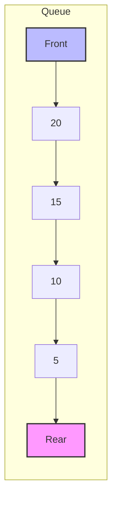
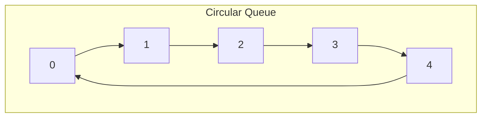

# Queues

## Introduction

A queue is a fundamental data structure that follows the **First In, First Out (FIFO)** principle. Think of it like a line of people waiting at a movie theater - the first person to join the line is the first one to enter the theater. This ordering principle makes queues ideal for many real-world scenarios and computing problems where processing must happen in the exact order items arrive.

Unlike arrays or linked lists which allow access to any element, queues restrict operations to:
- Adding elements at one end (called "enqueue" or "push")
- Removing elements from the other end (called "dequeue" or "pop")

This controlled access pattern makes queues perfect for scenarios where order matters, such as task scheduling, print job management, and handling requests in web servers.

## Basic Queue Operations

A queue supports these fundamental operations:

1. **Enqueue**: Add an element to the end of the queue
2. **Dequeue**: Remove and return the element from the front of the queue
3. **Peek/Front**: View the element at the front without removing it
4. **IsEmpty**: Check if the queue contains no elements
5. **Size**: Return the number of elements in the queue

Let's visualize a queue with a simple diagram:



## Implementing a Queue

Let's look at how to implement a simple queue in various programming languages:

### Queue Implementation in JavaScript

```javascript
class Queue {
    constructor() {
        this.items = [];
    }
    
    // Add element to the queue
    enqueue(element) {
        this.items.push(element);
    }
    
    // Remove element from the queue
    dequeue() {
        if(this.isEmpty()) {
            return "Underflow";
        }
        return this.items.shift();
    }
    
    // View the front element
    front() {
        if(this.isEmpty()) {
            return "Queue is empty";
        }
        return this.items[0];
    }
    
    // Check if queue is empty
    isEmpty() {
        return this.items.length === 0;
    }
    
    // Return the size of queue
    size() {
        return this.items.length;
    }
    
    // Print the queue
    printQueue() {
        let str = "";
        for(let i = 0; i < this.items.length; i++) {
            str += this.items[i] + " ";
        }
        return str;
    }
}
```

### Example Usage

```javascript
// Create a new queue
const queue = new Queue();

// Add elements to queue
queue.enqueue(10);
queue.enqueue(20);
queue.enqueue(30);
queue.enqueue(40);

console.log("Queue: " + queue.printQueue());
// Output: Queue: 10 20 30 40

// Remove element from queue
console.log("Dequeued element: " + queue.dequeue());
// Output: Dequeued element: 10

console.log("Front element: " + queue.front());
// Output: Front element: 20

console.log("Queue size: " + queue.size());
// Output: Queue size: 3

console.log("Queue: " + queue.printQueue());
// Output: Queue: 20 30 40
```

### Queue Implementation in Python

```python
class Queue:
    def __init__(self):
        self.items = []
        
    def is_empty(self):
        return len(self.items) == 0
        
    def enqueue(self, item):
        self.items.append(item)
        
    def dequeue(self):
        if not self.is_empty():
            return self.items.pop(0)
        return "Queue is empty"
        
    def peek(self):
        if not self.is_empty():
            return self.items[0]
        return "Queue is empty"
        
    def size(self):
        return len(self.items)
        
    def __str__(self):
        return str(self.items)
```

## Queue Variations

### 1. Circular Queue

A circular queue is a linear data structure in which operations are performed based on FIFO principle, and the last position is connected to the first position to make a circle. It efficiently uses memory when elements are frequently added and removed.



### 2. Priority Queue

A priority queue is a special type of queue where elements are assigned priorities. Elements with higher priorities are processed before elements with lower priorities, regardless of their order in the queue.

### 3. Double-ended Queue (Deque)

A deque (pronounced "deck") allows insertion and removal of elements from both ends. This provides more flexibility than a standard queue.

## Queue Implementation Techniques

### 1. Array-based Implementation

Pros:
- Simple to implement
- Fast random access

Cons:
- Fixed size (in most languages)
- Enqueue/dequeue operations can be inefficient due to shifting elements

### 2. Linked List-based Implementation

Pros:
- Dynamic size
- Efficient enqueue/dequeue operations

Cons:
- Extra memory overhead for pointers
- No random access

Here's a linked list implementation of a queue in JavaScript:

```javascript
class Node {
    constructor(data) {
        this.data = data;
        this.next = null;
    }
}

class LinkedListQueue {
    constructor() {
        this.front = null;
        this.rear = null;
        this.size = 0;
    }
    
    // Check if queue is empty
    isEmpty() {
        return this.front === null;
    }
    
    // Add element to the queue
    enqueue(element) {
        const newNode = new Node(element);
        
        // If queue is empty, set front and rear to new node
        if (this.isEmpty()) {
            this.front = newNode;
            this.rear = newNode;
        } else {
            // Add new node at the end and update rear
            this.rear.next = newNode;
            this.rear = newNode;
        }
        
        this.size++;
    }
    
    // Remove element from the queue
    dequeue() {
        if (this.isEmpty()) {
            return "Queue is empty";
        }
        
        const value = this.front.data;
        this.front = this.front.next;
        
        // If front becomes null, set rear to null as well
        if (this.front === null) {
            this.rear = null;
        }
        
        this.size--;
        return value;
    }
    
    // Get front element
    peek() {
        if (this.isEmpty()) {
            return "Queue is empty";
        }
        return this.front.data;
    }
    
    // Get queue size
    getSize() {
        return this.size;
    }
    
    // Print the queue
    printQueue() {
        if (this.isEmpty()) {
            return "Queue is empty";
        }
        
        let current = this.front;
        let result = "";
        
        while (current) {
            result += current.data + " ";
            current = current.next;
        }
        
        return result.trim();
    }
}
```

## Time Complexity

Let's analyze the time complexity of queue operations:

| Operation | Array-Based | Linked List-Based |
|-----------|-------------|-------------------|
| Enqueue   | O(1) or O(n)* | O(1)             |
| Dequeue   | O(n)        | O(1)              |
| Peek      | O(1)        | O(1)              |
| IsEmpty   | O(1)        | O(1)              |
| Size      | O(1)        | O(1)              |

*O(1) for array.push(), but if we use array.shift() for dequeue, subsequent enqueue operations might require resizing the array.

## Real-world Applications

Queues are used in numerous real-world scenarios:

### 1. CPU Task Scheduling
Operating systems use queues to manage processes waiting for CPU time.

```javascript
class TaskScheduler {
    constructor() {
        this.taskQueue = new Queue();
    }
    
    addTask(task) {
        this.taskQueue.enqueue(task);
        console.log(`Task '${task.name}' added to the queue`);
    }
    
    executeNext() {
        if (this.taskQueue.isEmpty()) {
            console.log("No tasks to execute");
            return null;
        }
        
        const task = this.taskQueue.dequeue();
        console.log(`Executing task: ${task.name}`);
        // Simulate task execution
        task.execute();
        return task;
    }
    
    pendingTasks() {
        return this.taskQueue.size();
    }
}

// Example usage
const scheduler = new TaskScheduler();

// Define some tasks
const task1 = {
    name: "Process payroll",
    execute: () => console.log("Payroll processed")
};

const task2 = {
    name: "Generate report",
    execute: () => console.log("Report generated")
};

const task3 = {
    name: "Backup database",
    execute: () => console.log("Database backed up")
};

scheduler.addTask(task1);
scheduler.addTask(task2);
scheduler.addTask(task3);

console.log(`Pending tasks: ${scheduler.pendingTasks()}`);

scheduler.executeNext();
scheduler.executeNext();
scheduler.executeNext();

console.log(`Pending tasks: ${scheduler.pendingTasks()}`);
```

### 2. Print Queue
Printer spoolers use queues to manage documents waiting to be printed.

### 3. Customer Service Systems
Call centers use queues to handle customer calls in the order they are received.

### 4. Breadth-First Search Algorithm
In graph algorithms, queues are used to implement breadth-first traversal.

```javascript
function breadthFirstSearch(graph, startNode) {
    // Create a queue for BFS
    const queue = new Queue();
    
    // Set to keep track of visited nodes
    const visited = new Set();
    
    // Start with the given node
    queue.enqueue(startNode);
    visited.add(startNode);
    
    // BFS traversal
    while (!queue.isEmpty()) {
        // Dequeue a vertex from queue
        const currentNode = queue.dequeue();
        console.log(`Visited node: ${currentNode}`);
        
        // Get all adjacent vertices of the dequeued vertex
        // If an adjacent vertex has not been visited, mark it as visited and enqueue it
        const neighbors = graph[currentNode] || [];
        for (const neighbor of neighbors) {
            if (!visited.has(neighbor)) {
                visited.add(neighbor);
                queue.enqueue(neighbor);
            }
        }
    }
}

// Example graph represented as an adjacency list
const graph = {
    'A': ['B', 'C'],
    'B': ['A', 'D', 'E'],
    'C': ['A', 'F'],
    'D': ['B'],
    'E': ['B', 'F'],
    'F': ['C', 'E']
};

breadthFirstSearch(graph, 'A');
// Output:
// Visited node: A
// Visited node: B
// Visited node: C
// Visited node: D
// Visited node: E
// Visited node: F
```

### 5. Web Servers
Handling request queues in web servers to process requests in the order they arrive.

## Summary

Queues are versatile data structures that excel at managing data in a First In, First Out (FIFO) manner. They provide controlled access to data and are crucial for scenarios where processing order matters.

Key points to remember:
- Queues follow the FIFO principle
- Main operations include enqueue (add), dequeue (remove), peek (view), isEmpty, and size
- Implementation can use arrays or linked lists, each with pros and cons
- Variations include circular queues, priority queues, and double-ended queues
- Real-world applications include task scheduling, print queues, customer service systems, and graph algorithms

## Exercises

1. Implement a queue that can handle a maximum of N elements. When the queue is full, attempting to enqueue another element should return an error.

2. Implement a queue using two stacks. (Hint: Use one stack for enqueue operations and another for dequeue operations.)

3. Write a function that reverses the first K elements of a queue, leaving the rest in the same order.

4. Implement a simulation of a print queue that handles documents with different priority levels.

5. Create a function that checks if a given string of parentheses is balanced using a queue. For example: "(())" is balanced, "(()" is not.

## Additional Resources

- [GeeksforGeeks: Queue Data Structure](https://www.geeksforgeeks.org/queue-data-structure/)
- [Visualgo: Visualization of Queue Operations](https://visualgo.net/en/list)
- [MDN Web Docs: Array methods for implementing queues](https://developer.mozilla.org/en-US/docs/Web/JavaScript/Reference/Global_Objects/Array)

Happy coding with queues! Remember that mastering this fundamental data structure will help you solve many complex programming problems efficiently.