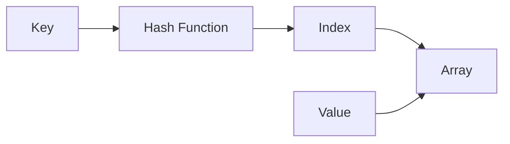

# Hash Tables

## Introduction

Hash tables (also known as hash maps) are powerful data structures that store key-value pairs, allowing for efficient insertion, deletion, and lookup operations. Unlike arrays where elements are accessed by indices, hash tables let you access values using unique keys.

Think of a hash table like a dictionary - you look up a word (key) to find its definition (value). The magic of hash tables is that these operations typically run in O(1) time complexity, making them extremely fast even for large datasets.

In this tutorial, we'll explore how hash tables work, how to implement them, and where they're commonly used in real-world applications.

## How Hash Tables Work

Hash tables work through a process called **hashing**. Here's the basic workflow:

1. You provide a key-value pair to store
2. The key is passed through a hash function, which converts it to a numeric value
3. This numeric value is used as an index in an underlying array
4. The value is stored at this calculated position



Let's break down these components:

### Hash Function

A hash function takes your key and transforms it into an array index. A good hash function has these properties:

- **Deterministic**: The same key should always produce the same hash value
- **Fast**: Computation should be quick
- **Uniform distribution**: It should distribute keys evenly across the array
- **Low collision rate**: Different keys should rarely produce the same hash value

Here's a simple hash function for strings in JavaScript:

```javascript
function simpleHash(key, arraySize) {
  let hashCode = 0;
  
  for (let i = 0; i < key.length; i++) {
    hashCode += key.charCodeAt(i);
  }
  
  return hashCode % arraySize;
}

// Example
const index = simpleHash("apple", 10);
console.log(index); // Outputs a number between 0-9
```

### Collision Handling

A collision occurs when two different keys hash to the same array index. There are two main strategies for handling collisions:

1. **Chaining**: Store multiple key-value pairs at the same index by using a linked list or another data structure
2. **Open Addressing**: Find another empty slot in the array using techniques like linear probing, quadratic probing, or double hashing

#### Chaining Example

```javascript
class HashTable {
  constructor(size = 53) {
    this.table = new Array(size);
  }

  hash(key) {
    let total = 0;
    const PRIME = 31;
    for (let i = 0; i < Math.min(key.length, 100); i++) {
      const char = key[i];
      const value = char.charCodeAt(0) - 96;
      total = (total * PRIME + value) % this.table.length;
    }
    return total;
  }

  set(key, value) {
    const index = this.hash(key);
    if (!this.table[index]) {
      this.table[index] = [];
    }
    
    // Check if key already exists to update
    for (let i = 0; i < this.table[index].length; i++) {
      if (this.table[index][i][0] === key) {
        this.table[index][i][1] = value;
        return;
      }
    }
    
    // Add new key-value pair
    this.table[index].push([key, value]);
  }

  get(key) {
    const index = this.hash(key);
    if (!this.table[index]) return undefined;
    
    for (let i = 0; i < this.table[index].length; i++) {
      if (this.table[index][i][0] === key) {
        return this.table[index][i][1];
      }
    }
    
    return undefined;
  }
}

// Example usage
const userTable = new HashTable();
userTable.set("john", { email: "john@example.com", age: 30 });
userTable.set("mary", { email: "mary@example.com", age: 25 });

console.log(userTable.get("john")); // { email: "john@example.com", age: 30 }
console.log(userTable.get("mary")); // { email: "mary@example.com", age: 25 }
```

## Common Operations

Hash tables support the following key operations:

### 1. Insertion

Adding a new key-value pair to the hash table:

```javascript
hashTable.set("username", "johndoe");
```

Time complexity: O(1) average case, O(n) worst case

### 2. Lookup/Retrieval

Finding a value by its key:

```javascript
const username = hashTable.get("username"); // Returns "johndoe"
```

Time complexity: O(1) average case, O(n) worst case

### 3. Deletion

Removing a key-value pair:

```javascript
hashTable.delete("username");
```

Time complexity: O(1) average case, O(n) worst case

### 4. Check if a key exists

```javascript
const hasKey = hashTable.has("username");
```

Time complexity: O(1) average case, O(n) worst case

## Hash Table Implementation from Scratch

Let's build a more comprehensive hash table implementation in JavaScript:

```javascript
class HashTable {
  constructor(size = 53) {
    this.table = new Array(size);
    this.size = 0;
  }

  _hash(key) {
    let hash = 0;
    const PRIME = 31;
    
    for (let i = 0; i < key.length; i++) {
      hash = (hash * PRIME + key.charCodeAt(i)) % this.table.length;
    }
    
    return hash;
  }
  
  set(key, value) {
    const index = this._hash(key);
    
    if (!this.table[index]) {
      this.table[index] = [];
    }
    
    // Check if key exists to update
    for (let i = 0; i < this.table[index].length; i++) {
      if (this.table[index][i][0] === key) {
        this.table[index][i][1] = value;
        return;
      }
    }
    
    // Add new key-value pair
    this.table[index].push([key, value]);
    this.size++;
  }
  
  get(key) {
    const index = this._hash(key);
    
    if (!this.table[index]) return undefined;
    
    for (let i = 0; i < this.table[index].length; i++) {
      if (this.table[index][i][0] === key) {
        return this.table[index][i][1];
      }
    }
    
    return undefined;
  }
  
  delete(key) {
    const index = this._hash(key);
    
    if (!this.table[index]) return false;
    
    for (let i = 0; i < this.table[index].length; i++) {
      if (this.table[index][i][0] === key) {
        this.table[index].splice(i, 1);
        this.size--;
        return true;
      }
    }
    
    return false;
  }
  
  has(key) {
    return this.get(key) !== undefined;
  }
  
  getSize() {
    return this.size;
  }
  
  keys() {
    const keysArray = [];
    
    for (let i = 0; i < this.table.length; i++) {
      if (this.table[i]) {
        for (let j = 0; j < this.table[i].length; j++) {
          keysArray.push(this.table[i][j][0]);
        }
      }
    }
    
    return keysArray;
  }
  
  values() {
    const valuesArray = [];
    
    for (let i = 0; i < this.table.length; i++) {
      if (this.table[i]) {
        for (let j = 0; j < this.table[i].length; j++) {
          valuesArray.push(this.table[i][j][1]);
        }
      }
    }
    
    return valuesArray;
  }
}
```

### Example Usage

```javascript
// Create a new hash table
const productCatalog = new HashTable();

// Add products
productCatalog.set("laptop", { name: "MacBook Pro", price: 1299.99 });
productCatalog.set("phone", { name: "iPhone 13", price: 799.99 });
productCatalog.set("tablet", { name: "iPad Air", price: 599.99 });

// Get a product
console.log(productCatalog.get("laptop"));
// Output: { name: "MacBook Pro", price: 1299.99 }

// Check if product exists
console.log(productCatalog.has("desktop")); // false
console.log(productCatalog.has("phone")); // true

// Get all product keys
console.log(productCatalog.keys()); 
// Output: ["laptop", "phone", "tablet"]

// Delete a product
productCatalog.delete("tablet");
console.log(productCatalog.keys());
// Output: ["laptop", "phone"]
```

## Hash Tables in Built-in Language Features

Many programming languages provide built-in hash table implementations:

- **JavaScript**: `Object` and `Map`
- **Python**: `dict`
- **Java**: `HashMap` and `Hashtable`
- **C++**: `unordered_map`
- **C#**: `Dictionary<TKey, TValue>`
- **Ruby**: `Hash`

Here's an example using JavaScript's `Map`:

```javascript
// Creating a Map
const userMap = new Map();

// Adding entries
userMap.set('user123', { name: 'John', role: 'admin' });
userMap.set('user456', { name: 'Sara', role: 'editor' });

// Retrieving values
console.log(userMap.get('user123')); // { name: 'John', role: 'admin' }

// Checking if a key exists
console.log(userMap.has('user789')); // false

// Deleting an entry
userMap.delete('user456');

// Checking the size
console.log(userMap.size); // 1

// Iterating through entries
for (const [key, value] of userMap) {
  console.log(`${key}: ${value.name}`);
}
```

## Real-World Applications

Hash tables are extremely versatile and widely used in various software applications:

### 1. Database Indexing

Database systems use hash tables to create indexes for faster data retrieval. When you query a database with a WHERE clause on an indexed column, the database engine can use hash tables to quickly locate matching records.

### 2. Caching Systems

Web browsers cache resources using hash tables where URLs are keys and web resources are values:

```javascript
class SimpleCache {
  constructor(capacity = 100) {
    this.cache = new Map();
    this.capacity = capacity;
  }

  get(key) {
    if (!this.cache.has(key)) return null;
    return this.cache.get(key);
  }

  put(key, value) {
    // Evict oldest item if at capacity
    if (this.cache.size >= this.capacity) {
      const firstKey = this.cache.keys().next().value;
      this.cache.delete(firstKey);
    }
    this.cache.set(key, value);
  }
}

// Example: Browser cache
const browserCache = new SimpleCache(5);
browserCache.put('https://example.com/logo.png', 'BINARY_DATA_HERE');
browserCache.put('https://example.com/styles.css', 'CSS_CONTENT_HERE');

// Later, retrieve from cache
const logoData = browserCache.get('https://example.com/logo.png');
```

### 3. Language Compilers and Interpreters

Symbol tables in compilers and interpreters use hash tables to keep track of variables, functions, and their scopes:

```javascript
class SymbolTable {
  constructor() {
    this.symbols = new Map();
    this.parent = null;
  }

  define(name, type, value) {
    this.symbols.set(name, { type, value });
  }

  lookup(name) {
    if (this.symbols.has(name)) {
      return this.symbols.get(name);
    }
    if (this.parent) {
      return this.parent.lookup(name);
    }
    return null;
  }

  createChildScope() {
    const childScope = new SymbolTable();
    childScope.parent = this;
    return childScope;
  }
}

// Example: JavaScript-like interpreter
const globalScope = new SymbolTable();
globalScope.define('PI', 'constant', 3.14159);

// Function scope
const functionScope = globalScope.createChildScope();
functionScope.define('result', 'variable', 0);

// Check variable in scope chain
console.log(functionScope.lookup('PI')); // { type: 'constant', value: 3.14159 }
console.log(globalScope.lookup('result')); // null (not defined in global scope)
```

### 4. Spell Checkers

Spell checking programs use hash tables to store dictionary words for efficient lookup:

```javascript
class SpellChecker {
  constructor(dictionary) {
    this.words = new Set(dictionary);
  }

  isCorrect(word) {
    return this.words.has(word.toLowerCase());
  }

  suggestCorrections(word) {
    const suggestions = [];
    const wordLower = word.toLowerCase();
    
    // Check for single-character modifications
    for (let i = 0; i < wordLower.length; i++) {
      // Deletion
      const deletion = wordLower.slice(0, i) + wordLower.slice(i + 1);
      if (this.words.has(deletion)) suggestions.push(deletion);
      
      // For brevity, other modifications (substitution, insertion, etc.)
      // would be implemented similarly
    }
    
    return suggestions;
  }
}

// Example
const dictionary = ['apple', 'banana', 'orange', 'grape', 'apples'];
const spellChecker = new SpellChecker(dictionary);

console.log(spellChecker.isCorrect('apple')); // true
console.log(spellChecker.isCorrect('aple')); // false
console.log(spellChecker.suggestCorrections('aple')); // ['apple']
```

## Time and Space Complexity

Let's analyze the performance of hash tables:

| Operation | Average Case | Worst Case |
|-----------|--------------|------------|
| Insertion | O(1)         | O(n)       |
| Deletion  | O(1)         | O(n)       |
| Search    | O(1)         | O(n)       |
| Space     | O(n)         | O(n)       |

The worst-case scenarios occur when there are many collisions, which could happen with a poor hash function or when the hash table is nearly full.

## Advantages and Disadvantages

### Advantages:
- Fast lookups, insertions, and deletions (average case O(1))
- Flexible keys (can use strings, numbers, or custom objects as keys)
- Useful for counting, caching, and memorizing data

### Disadvantages:
- Unordered data structure (no inherent ordering)
- Possible collisions require resolution strategies
- Can have poor performance if the hash function isn't well-designed
- May require resizing as the table fills up

## Best Practices

1. **Choose an appropriate hash function** that distributes keys uniformly
2. **Select an initial capacity** that accommodates your expected data size
3. **Implement load factor monitoring** to resize the table when it gets too full
4. **Handle collisions effectively** using chaining or open addressing
5. **Use immutable keys** or be careful modifying objects used as keys

## Summary

Hash tables are powerful data structures that provide fast key-value lookup through the use of a hash function. They're widely used across many applications due to their efficiency and flexibility.

Key takeaways:
- Hash tables store key-value pairs using a hash function
- They provide O(1) average time complexity for insertions, deletions, and searches
- Collisions can be handled through chaining (linked lists) or open addressing
- Most programming languages provide built-in hash table implementations
- They're used in caching systems, databases, compilers, and many other applications

## Practice Exercises

1. Implement a hash table that automatically resizes when the load factor exceeds 0.7
2. Create a function that finds the first non-repeating character in a string using a hash table
3. Implement a simple LRU (Least Recently Used) cache using a hash table and a linked list
4. Write a function that checks if two strings are anagrams using a hash table
5. Implement a hash table that uses linear probing instead of chaining for collision resolution

## Further Resources

- [Hash Tables on Visualgo](https://visualgo.net/en/hashtable)
- JavaScript Map Documentation 
- Data Structures and Algorithms in JavaScript (Book)
- Introduction to Algorithms by Cormen, Leiserson, Rivest, and Stein (CLRS)

Happy coding!