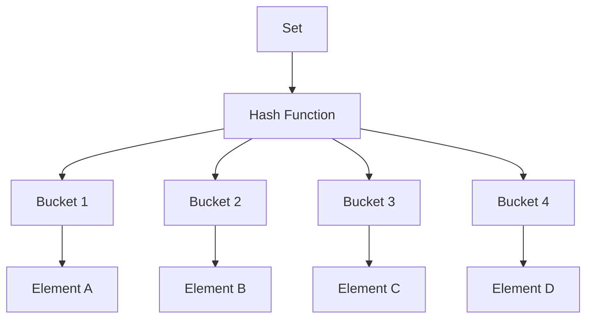

# Sets

## Introduction

A set is a fundamental data structure that represents an unordered collection of **unique** elements. Unlike arrays or lists where elements can appear multiple times and order matters, sets enforce uniqueness and don't maintain any specific order of elements.

Sets are incredibly useful when you need to:
- Store unique values
- Test membership efficiently
- Remove duplicates from a collection
- Perform mathematical set operations like union, intersection, and difference

In this tutorial, we'll explore how sets work, their implementation across various programming languages, and practical applications.

## Set Basics

### Key Characteristics

Sets have several distinct properties that differentiate them from other data structures:

1. **Uniqueness**: Each element can appear only once in a set
2. **Unordered**: Elements have no specific position or index
3. **Mutable**: Most implementations allow adding/removing elements (though immutable variants exist)
4. **Heterogeneous**: Can contain elements of different data types (language-dependent)

### Set Operations

Sets support mathematical operations that make them powerful for certain problems:

- **Union**: Combines elements from two sets
- **Intersection**: Finds common elements between sets
- **Difference**: Subtracts elements of one set from another
- **Symmetric Difference**: Elements in either set but not in their intersection
- **Subset/Superset**: Checks if one set contains all elements of another

## Implementing Sets in Different Languages

### Python

Python has built-in support for sets using the `set` type:

```python
# Creating sets
fruits = {"apple", "banana", "cherry"}
colors = set(["red", "green", "blue"])
empty_set = set()  # Note: {} creates an empty dictionary, not a set

# Adding elements
fruits.add("orange")

# Removing elements
fruits.remove("banana")  # Raises KeyError if element doesn't exist
fruits.discard("grape")  # No error if element doesn't exist

# Checking membership - very efficient O(1) operation
if "apple" in fruits:
    print("Apple is in the set!")

# Set operations
veggies = {"carrot", "spinach", "broccoli"}
food = fruits.union(veggies)  # or fruits | veggies
common = fruits.intersection(colors)  # or fruits & colors
difference = fruits.difference(colors)  # or fruits - colors
sym_diff = fruits.symmetric_difference(colors)  # or fruits ^ colors

print(fruits)  # Output: {'apple', 'cherry', 'orange'}
print(food)    # Output: {'apple', 'cherry', 'orange', 'carrot', 'spinach', 'broccoli'}
```

### JavaScript

JavaScript implements sets using the `Set` object:

```javascript
// Creating sets
const fruits = new Set(["apple", "banana", "cherry"]);
const colors = new Set();
colors.add("red");
colors.add("green");
colors.add("blue");

// Adding duplicate (will be ignored)
fruits.add("apple");

// Removing elements
fruits.delete("banana");

// Checking membership - O(1) operation
if (fruits.has("apple")) {
  console.log("Apple is in the set!");
}

// Size of set
console.log(fruits.size);  // Output: 2

// Iterating through sets
for (const fruit of fruits) {
  console.log(fruit);
}

// Converting sets to arrays
const fruitArray = [...fruits];
console.log(fruitArray);  // Output: ["apple", "cherry"]

// Set operations (using helper functions)
function union(setA, setB) {
  const result = new Set(setA);
  for (const elem of setB) {
    result.add(elem);
  }
  return result;
}

function intersection(setA, setB) {
  const result = new Set();
  for (const elem of setA) {
    if (setB.has(elem)) {
      result.add(elem);
    }
  }
  return result;
}

const veggies = new Set(["carrot", "spinach", "broccoli"]);
const food = union(fruits, veggies);
console.log([...food]);  // Output: ["apple", "cherry", "carrot", "spinach", "broccoli"]
```

## Internal Implementation

Most modern set implementations use hash tables under the hood, which is why:

1. Membership testing is extremely fast (O(1) on average)
2. Elements need to be hashable (immutable in most languages)
3. Order is not preserved

Let's visualize how sets might be implemented internally:



## Time Complexity

Sets provide efficient operations with the following time complexities:

| Operation | Average Case | Worst Case |
|-----------|--------------|------------|
| Add       | O(1)         | O(n)       |
| Remove    | O(1)         | O(n)       |
| Contains  | O(1)         | O(n)       |
| Size      | O(1)         | O(1)       |
| Iteration | O(n)         | O(n)       |

This makes sets an excellent choice when you need fast lookups and uniqueness guarantees.

## Practical Applications

### 1. Removing Duplicates

One of the most common uses for sets is to remove duplicates from a collection:

```python
# Remove duplicates from a list
numbers = [1, 2, 2, 3, 4, 4, 5]
unique_numbers = list(set(numbers))
print(unique_numbers)  # Output: [1, 2, 3, 4, 5]
```

### 2. Efficient Membership Testing

Sets provide O(1) lookups which is much faster than searching in lists/arrays:

```python
# Compare lookup times
import time

# Using a list
large_list = list(range(1000000))
start = time.time()
999999 in large_list  # O(n) search
list_time = time.time() - start

# Using a set
large_set = set(range(1000000))
start = time.time()
999999 in large_set  # O(1) search
set_time = time.time() - start

print(f"List lookup time: {list_time:.6f} seconds")
print(f"Set lookup time: {set_time:.6f} seconds")
# Output will show set is dramatically faster
```

### 3. Finding Common/Different Elements

Sets make it easy to find common or different elements between collections:

```python
# Students who take both math and physics
math_students = {"Alice", "Bob", "Charlie", "David"}
physics_students = {"Bob", "Dave", "Eve", "Charlie"}

students_in_both = math_students.intersection(physics_students)
print(students_in_both)  # Output: {'Bob', 'Charlie'}

# Students in math but not physics
math_only = math_students.difference(physics_students)
print(math_only)  # Output: {'Alice', 'David'}
```

### 4. Tracking Visited Items

Sets are perfect for tracking visited elements in algorithms:

```python
def has_duplicates(items):
    seen = set()
    for item in items:
        if item in seen:
            return True
        seen.add(item)
    return False

print(has_duplicates([1, 2, 3, 4]))     # Output: False
print(has_duplicates([1, 2, 3, 1, 4]))  # Output: True
```

## Common Pitfalls and Limitations

1. **Elements must be hashable** - In most languages, set elements must be immutable or at least hashable. For example, in Python, you can't add lists or dictionaries to sets, but you can add tuples.

```python
valid_set = {1, "hello", (1, 2)}  # Works fine
# invalid_set = {1, [2, 3]}  # TypeError: unhashable type: 'list'
```

2. **No indexing** - Since sets are unordered, you can't access elements by index.

```python
my_set = {"a", "b", "c"}
# print(my_set[0])  # TypeError: 'set' object is not subscriptable
```

3. **No duplicates** - This is a feature but sometimes can be confusing for beginners:

```python
my_set = {1, 2, 3, 2, 1}
print(my_set)  # Output: {1, 2, 3} - duplicates are automatically removed
```

## Multisets (Bags)

If you need a set-like structure that allows duplicates, you might want to use a multiset (also called a bag). Python's `collections.Counter` is an example:

```python
from collections import Counter

# Creating a multiset
inventory = Counter(["apple", "banana", "apple", "orange", "apple"])
print(inventory)  # Output: Counter({'apple': 3, 'banana': 1, 'orange': 1})

# Adding elements
inventory["grape"] = 2

# Counting occurrences
print(inventory["apple"])  # Output: 3

# Total elements
print(sum(inventory.values()))  # Output: 7
```

## Summary

Sets are powerful data structures that provide:

- Uniqueness guarantee for elements
- Fast membership testing
- Efficient mathematical set operations
- Unordered collection of elements

They're particularly useful when you need to:
- Remove duplicates from data
- Track visited elements
- Test for membership efficiently
- Perform set operations like union, intersection, and difference

The tradeoff is that sets don't preserve order and typically require elements to be hashable.

## Exercises

1. Write a function that returns the number of unique elements in a list
2. Implement a function that finds common elements from three different lists
3. Create a spell checker using sets
4. Implement a function that returns `True` if one string is an anagram of another using sets
5. Use sets to find all pairs of elements from a list that sum to a given target

## Additional Resources

- [Python Set Documentation](https://docs.python.org/3/library/stdtypes.html#set-types-set-frozenset)
- [JavaScript Set Documentation](https://developer.mozilla.org/en-US/docs/Web/JavaScript/Reference/Global_Objects/Set)
- [Set Theory in Mathematics](https://en.wikipedia.org/wiki/Set_theory)
- [Hash Tables and Hashing Functions](https://en.wikipedia.org/wiki/Hash_table)

Happy coding with sets!