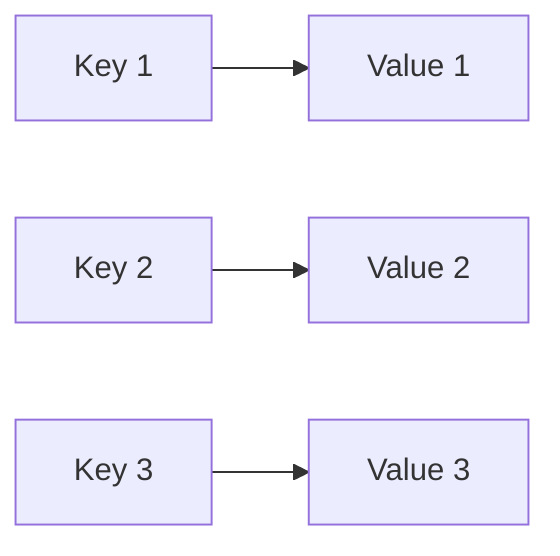
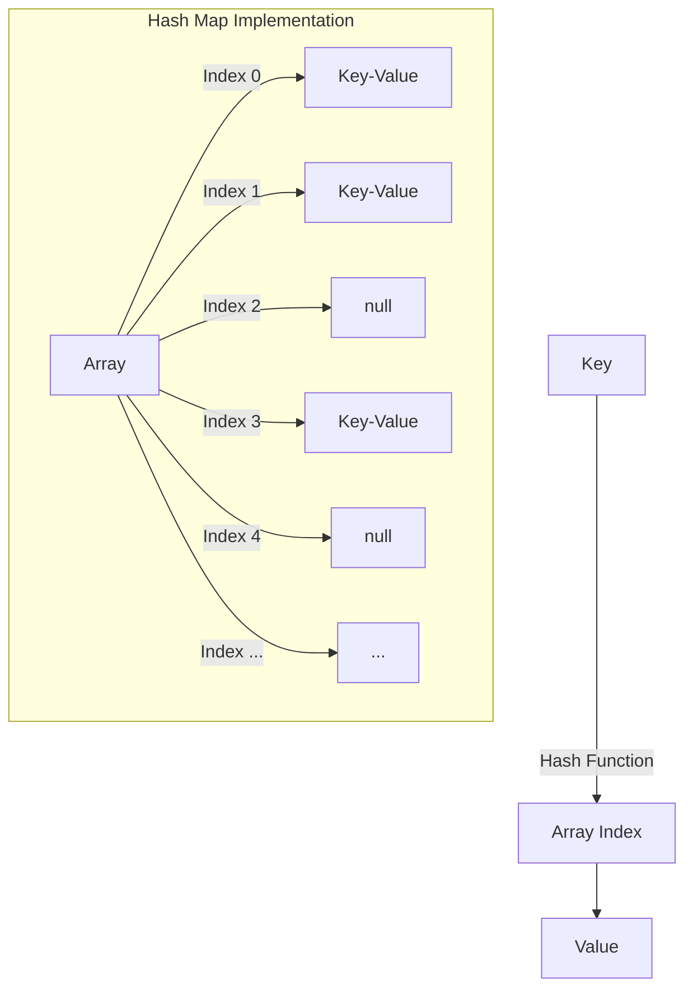

# Maps

## Introduction

A Map (also known as a dictionary, hash map, or associative array) is a data structure that stores a collection of key-value pairs. Unlike arrays or lists where elements are accessed by their position, Maps allow you to access values using unique keys. This makes them exceptionally useful when you need to look up data quickly based on a specific identifier.

Maps are fundamental in many programming applications because they provide:

- Fast lookups (often O(1) time complexity)
- Dynamic key-value associations
- Efficient data organization

In this guide, we'll explore how Maps work, their implementations in different languages, and practical use cases that demonstrate their power.

## Understanding Maps

### What is a Map?

At its core, a Map is a collection where each element consists of a key and its associated value:



The key characteristics of a Map include:

- Keys must be unique within the Map
- Each key maps to exactly one value
- Values can be duplicated across different keys
- Keys are typically immutable (unchangeable) objects

### Map Operations

Maps support several fundamental operations:

1. **Insert**: Add a new key-value pair
2. **Retrieve**: Get a value based on its key
3. **Update**: Change the value associated with a key
4. **Delete**: Remove a key-value pair
5. **Check existence**: Determine if a key exists

## Map Implementations

Let's look at how Maps are implemented in common programming languages:

### JavaScript Maps

JavaScript offers a built-in `Map` object:

```javascript
// Creating a Map
const userRoles = new Map();

// Adding entries
userRoles.set('john', 'admin');
userRoles.set('sarah', 'editor');
userRoles.set('mike', 'user');

// Retrieving values
console.log(userRoles.get('john')); // Output: admin

// Checking if a key exists
console.log(userRoles.has('sarah')); // Output: true

// Getting the size
console.log(userRoles.size); // Output: 3

// Deleting an entry
userRoles.delete('mike');
console.log(userRoles.has('mike')); // Output: false

// Iterating over a Map
for (const [user, role] of userRoles) {
  console.log(`${user} is a ${role}`);
}
// Output:
// john is a admin
// sarah is a editor
```

JavaScript also has object literals which are commonly used as simple maps:

```javascript
const userRoles = {
  john: 'admin',
  sarah: 'editor',
  mike: 'user'
};

console.log(userRoles.john); // Output: admin
// or
console.log(userRoles['john']); // Output: admin
```

### Python Dictionaries

In Python, Maps are implemented as dictionaries:

```python
# Creating a dictionary
user_roles = {
    "john": "admin",
    "sarah": "editor",
    "mike": "user"
}

# Retrieving values
print(user_roles["john"])  # Output: admin

# Adding or updating entries
user_roles["david"] = "analyst"
user_roles["sarah"] = "senior editor"

# Checking if a key exists
if "mike" in user_roles:
    print("Mike has a role")  # This will print

# Getting dictionary size
print(len(user_roles))  # Output: 4

# Removing an entry
del user_roles["mike"]
# or
removed_value = user_roles.pop("david")
print(removed_value)  # Output: analyst

# Iterating over a dictionary
for user, role in user_roles.items():
    print(f"{user} is a {role}")
```

### Java HashMap

Java implements Maps through interfaces like `Map` with concrete implementations such as `HashMap`:

```java
import java.util.HashMap;
import java.util.Map;

public class MapExample {
    public static void main(String[] args) {
        // Creating a HashMap
        Map<String, String> userRoles = new HashMap<>();
        
        // Adding entries
        userRoles.put("john", "admin");
        userRoles.put("sarah", "editor");
        userRoles.put("mike", "user");
        
        // Retrieving values
        System.out.println(userRoles.get("john"));  // Output: admin
        
        // Checking if a key exists
        System.out.println(userRoles.containsKey("sarah"));  // Output: true
        
        // Getting the size
        System.out.println(userRoles.size());  // Output: 3
        
        // Removing an entry
        userRoles.remove("mike");
        
        // Iterating over entries
        for (Map.Entry<String, String> entry : userRoles.entrySet()) {
            System.out.println(entry.getKey() + " is a " + entry.getValue());
        }
    }
}
```

## How Maps Work: Under the Hood

Most Map implementations use a hash-based approach:

1. A hash function converts the key into an array index
2. The value is stored at that index
3. To retrieve a value, the same hash function is applied to the key to find the storage location

This explains why Map operations are typically O(1) - the hash function directly computes the location without needing to search sequentially.



### Hash Collisions

Sometimes two different keys may produce the same hash value (index). This is called a collision, and Map implementations handle this through techniques like:

1. **Chaining**: Storing multiple key-value pairs in a linked list at the same index
2. **Open Addressing**: Finding the next available slot when a collision occurs

## Time Complexity

Maps offer significant performance benefits:

| Operation | Average Case | Worst Case |
|-----------|--------------|------------|
| Insert    | O(1)         | O(n)       |
| Retrieve  | O(1)         | O(n)       |
| Delete    | O(1)         | O(n)       |
| Search    | O(1)         | O(n)       |

The worst-case O(n) occurs when many collisions happen, but this is rare in properly implemented Maps with good hash functions.

## Practical Examples

### Example 1: Word Frequency Counter

A common use of Maps is counting occurrences:

```javascript
function countWordFrequency(text) {
  const words = text.toLowerCase().match(/\b\w+\b/g) || [];
  const frequencyMap = new Map();
  
  for (const word of words) {
    // Get current count (or 0 if word isn't in the map yet)
    const currentCount = frequencyMap.get(word) || 0;
    // Increment count by 1
    frequencyMap.set(word, currentCount + 1);
  }
  
  return frequencyMap;
}

const text = "The quick brown fox jumps over the lazy dog. The dog barks.";
const wordFrequency = countWordFrequency(text);

// Display results
for (const [word, count] of wordFrequency) {
  console.log(`${word}: ${count}`);
}

/* Output:
the: 3
quick: 1
brown: 1
fox: 1
jumps: 1
over: 1
lazy: 1
dog: 2
barks: 1
*/
```

### Example 2: Cache Implementation

Maps are excellent for caching results of expensive operations:

```python
def fibonacci_with_cache(n, cache=None):
    if cache is None:
        cache = {}
    
    # If we've already calculated this value, return it from cache
    if n in cache:
        return cache[n]
    
    # Base cases
    if n <= 1:
        return n
    
    # Calculate result and store in cache before returning
    result = fibonacci_with_cache(n-1, cache) + fibonacci_with_cache(n-2, cache)
    cache[n] = result
    return result

# Calculate fibonacci(35) - would be very slow without caching
print(fibonacci_with_cache(35))  # Output: 9227465
```

### Example 3: Group Objects by Property

Maps are useful for organizing data:

```javascript
function groupPeopleByAge(people) {
  const ageGroups = new Map();
  
  for (const person of people) {
    if (!ageGroups.has(person.age)) {
      ageGroups.set(person.age, []);
    }
    ageGroups.get(person.age).push(person.name);
  }
  
  return ageGroups;
}

const people = [
  { name: "Alice", age: 25 },
  { name: "Bob", age: 30 },
  { name: "Charlie", age: 25 },
  { name: "David", age: 40 },
  { name: "Emma", age: 30 }
];

const groupedByAge = groupPeopleByAge(people);

for (const [age, names] of groupedByAge) {
  console.log(`${age} years old: ${names.join(', ')}`);
}

/* Output:
25 years old: Alice, Charlie
30 years old: Bob, Emma
40 years old: David
*/
```

## When to Use Maps

Maps are ideal when you need to:

- Look up values based on a unique identifier
- Count occurrences (frequencies)
- Create a cache for expensive operations
- Store and retrieve configuration settings
- Implement a symbol table
- Create relationships between objects
- De-duplicate data

## Variations of Maps

### Ordered Map

Some implementations maintain insertion order:
- JavaScript `Map` preserves insertion order
- Python 3.7+ dictionaries maintain insertion order
- Java's `LinkedHashMap` preserves insertion order

### Sorted Map

Some implementations keep keys sorted:
- Java's `TreeMap` 
- C++'s `std::map`
- Python's `OrderedDict` (now less needed since regular dicts are ordered)

### Multi-Map

A variation that allows multiple values per key:
- Java's `Multimap` (in Guava library)
- C++'s `std::multimap`

## Common Pitfalls and Best Practices

### Choosing Appropriate Keys

Keys should typically be:
- Immutable (unchangeable)
- Have a well-defined equality comparison
- Have a well-distributed hash function

For example, in Java, modifying an object after using it as a key in a HashMap can make it unfindable.

### Memory Usage

Maps generally have higher memory overhead than arrays. Consider this tradeoff when working with very large data sets.

### Key Existence Check

Always check if a key exists before trying to access it (unless your language handles this gracefully):

```javascript
// JavaScript
if (map.has(key)) {
  // Safe to access
  const value = map.get(key);
}
```

```python
# Python
if key in my_dict:
    # Safe to access
    value = my_dict[key]
```

## Summary

Maps are versatile data structures that provide fast key-based value lookup. They work by using a hash function to convert keys into array indices, enabling efficient data access. With their O(1) average time complexity for most operations, Maps are essential tools for many programming tasks:

- Organizing data with meaningful identifiers
- Creating efficient lookup tables
- Building caches
- Counting frequencies
- De-duplicating elements

While we've explored implementations in JavaScript, Python, and Java, the fundamental concepts apply across most programming languages. Understanding Maps is crucial for writing efficient code and designing optimal data storage solutions.

## Exercises

1. Implement a function that determines if two strings are anagrams of each other using a Map to count character frequencies.
2. Create a cache for a recursive function (like factorial or Fibonacci) using a Map.
3. Write a function that finds the first non-repeating character in a string using a Map.
4. Implement a simple phone book application that allows adding, removing, and looking up contacts using a Map.
5. Create a function that groups an array of objects by a specified property using a Map.

## Additional Resources

- [MDN Web Docs: JavaScript Map](https://developer.mozilla.org/en-US/docs/Web/JavaScript/Reference/Global_Objects/Map)
- [Python Documentation: Dictionaries](https://docs.python.org/3/tutorial/datastructures.html#dictionaries)
- [Java HashMap Documentation](https://docs.oracle.com/javase/8/docs/api/java/util/HashMap.html)
- [Big O Cheat Sheet](https://www.bigocheatsheet.com/)
- [Visualizing Data Structures and Algorithms](https://visualgo.net/en/hashtable)

Maps are one of the most useful data structures in programming. By mastering them, you'll have a powerful tool for organizing and accessing data efficiently in your applications.