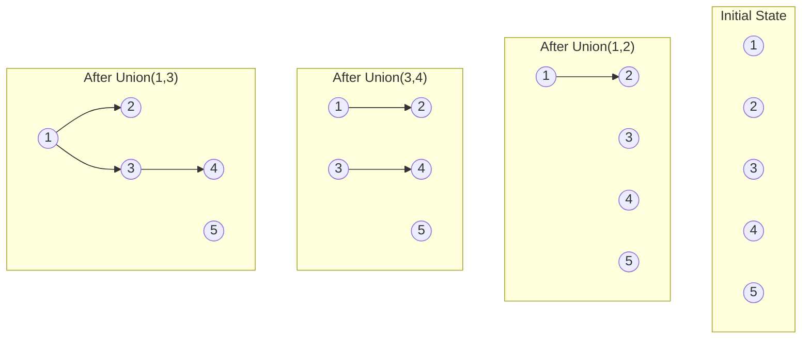

# Disjoint Set Union

## Introduction

Disjoint Set Union (DSU), also known as Union-Find or Merge-Find, is a powerful data structure that maintains a collection of disjoint (non-overlapping) sets. It efficiently supports two key operations:

1. **Find**: Determine which set an element belongs to
2. **Union**: Merge two sets together

This data structure is remarkably useful for solving problems related to connected components in graphs, detecting cycles, building minimum spanning trees, and more. Despite its conceptual simplicity, DSU offers near-constant time operations when implemented with path compression and union by rank optimizations.

## Basic Concept

Imagine we have a collection of elements, each initially in their own separate set. The DSU data structure helps us:

- Keep track of which elements are in which sets
- Combine sets together
- Quickly determine if two elements belong to the same set

DSU represents sets as trees, where each element points to its parent. The root of each tree serves as the representative of the set.

## Core Operations

### 1. MakeSet

The `MakeSet` operation creates a new set containing a single element.

```python
def make_set(parent, rank, x):
    parent[x] = x
    rank[x] = 0
```

### 2. Find

The `Find` operation returns the representative (root) of the set containing a given element. We use path compression to flatten the tree during lookups.

```python
def find(parent, x):
    if parent[x] != x:
        parent[x] = find(parent, parent[x])  # Path compression
    return parent[x]
```

### 3. Union

The `Union` operation merges two sets. For efficiency, we use union by rank to keep trees balanced.

```python
def union(parent, rank, x, y):
    root_x = find(parent, x)
    root_y = find(parent, y)
    
    if root_x == root_y:
        return
    
    # Union by rank
    if rank[root_x] < rank[root_y]:
        parent[root_x] = root_y
    elif rank[root_x] > rank[root_y]:
        parent[root_y] = root_x
    else:
        parent[root_y] = root_x
        rank[root_x] += 1
```

## Optimizations

DSU becomes especially powerful with two key optimizations:

### Path Compression

When finding the representative of an element, we update the parent pointers of all traversed nodes to point directly to the root. This flattens the tree over time.

### Union by Rank

By keeping track of the "rank" (an upper bound on the height) of each tree, we can ensure that the shorter tree is attached to the taller tree during unions. This keeps the overall height of trees logarithmic.

## Complete Implementation

Here's a complete implementation of the Disjoint Set Union data structure:

```python
class DisjointSet:
    def __init__(self, n):
        self.parent = list(range(n))
        self.rank = [0] * n
        self.count = n  # Number of components
    
    def find(self, x):
        if self.parent[x] != x:
            self.parent[x] = self.find(self.parent[x])  # Path compression
        return self.parent[x]
    
    def union(self, x, y):
        root_x = self.find(x)
        root_y = self.find(y)
        
        if root_x == root_y:
            return False  # Already in the same set
        
        # Union by rank
        if self.rank[root_x] < self.rank[root_y]:
            self.parent[root_x] = root_y
        elif self.rank[root_x] > self.rank[root_y]:
            self.parent[root_y] = root_x
        else:
            self.parent[root_y] = root_x
            self.rank[root_x] += 1
        
        self.count -= 1  # Decrease component count
        return True  # Union successful
    
    def connected(self, x, y):
        return self.find(x) == self.find(y)
    
    def get_count(self):
        return self.count
```

## Time Complexity

With path compression and union by rank optimizations:

- **Make-Set**: O(1)
- **Find**: O(α(n)) (amortized), where α is the inverse Ackermann function, which grows extremely slowly
- **Union**: O(α(n)) (amortized)

For all practical purposes, these operations are nearly constant time.

## Visual Representation

Let's visualize how DSU works when we perform a series of union operations:



## Practical Applications

### 1. Detecting Cycles in an Undirected Graph

We can use DSU to detect cycles in an undirected graph by iterating through all edges. If both endpoints of an edge belong to the same set, we've found a cycle.

```python
def has_cycle(edges, n):
    dsu = DisjointSet(n)
    
    for u, v in edges:
        # If both vertices are already in the same set, we found a cycle
        if dsu.find(u) == dsu.find(v):
            return True
        dsu.union(u, v)
    
    return False
```

### 2. Kruskal's Algorithm for Minimum Spanning Tree

DSU is a key component of Kruskal's algorithm, which finds the minimum spanning tree of a connected weighted graph.

```python
def kruskal_mst(edges, n):
    # Sort edges by weight
    edges.sort(key=lambda x: x[2])
    
    dsu = DisjointSet(n)
    mst = []
    
    for u, v, weight in edges:
        if dsu.find(u) != dsu.find(v):  # If including this edge doesn't form a cycle
            dsu.union(u, v)
            mst.append((u, v, weight))
    
    return mst
```

### 3. Network Connectivity

Given a list of connections between computers, determine if all computers can communicate with each other.

```python
def is_network_connected(connections, n):
    dsu = DisjointSet(n)
    
    for u, v in connections:
        dsu.union(u, v)
    
    # If there's only one component, the network is connected
    return dsu.get_count() == 1
```

### 4. Dynamic Connected Components

DSU enables efficiently tracking connected components as edges are added to a graph:

```python
def track_components(edges, n):
    dsu = DisjointSet(n)
    results = [n]  # Start with n components
    
    for u, v in edges:
        dsu.union(u, v)
        results.append(dsu.get_count())
    
    return results
```

## Example Problem: Number of Provinces

Let's solve a classic problem using DSU: determining the number of provinces (connected components) in a graph.

**Problem:** You are given an n x n matrix `isConnected` where `isConnected[i][j] = 1` if the i-th city and the j-th city are directly connected, and `isConnected[i][j] = 0` otherwise. Return the total number of provinces.

```python
def find_provinces(is_connected):
    n = len(is_connected)
    dsu = DisjointSet(n)
    
    # Process connections
    for i in range(n):
        for j in range(i+1, n):
            if is_connected[i][j] == 1:
                dsu.union(i, j)
    
    # Count unique components
    return dsu.get_count()

# Example usage:
graph = [
    [1, 1, 0],
    [1, 1, 0],
    [0, 0, 1]
]
print(find_provinces(graph))  # Output: 2
```

In this example, cities 0 and 1 form one province, while city 2 forms another province.

## Common Variants and Extensions

### 1. Size-Based Union

Instead of using ranks, we can also use the size of trees to decide which tree to attach to which:

```python
def union_by_size(self, x, y):
    root_x = self.find(x)
    root_y = self.find(y)
    
    if root_x == root_y:
        return
    
    if self.size[root_x] < self.size[root_y]:
        self.parent[root_x] = root_y
        self.size[root_y] += self.size[root_x]
    else:
        self.parent[root_y] = root_x
        self.size[root_x] += self.size[root_y]
```

### 2. Persistent DSU

For problems that require backtracking or querying the state at different times, you can implement a persistent version of DSU using additional data structures.

### 3. DSU with Extra Information

You can augment the DSU structure to store additional information about sets, such as the sum of elements in each set.

## Summary

Disjoint Set Union is a remarkably efficient data structure that excels at managing partitions of data and answering connectivity queries. Its near-constant time operations, achieved through path compression and union by rank, make it invaluable for solving graph problems involving connected components.

Key points to remember:

- DSU represents sets as trees, with each tree root representing the set
- Find operation determines which set an element belongs to
- Union operation merges two sets
- Path compression and union by rank make operations nearly constant time
- Common applications include cycle detection, minimum spanning trees, and connectivity problems

## Exercises

1. Implement DSU to detect if an undirected graph has a cycle.
2. Use DSU to find the number of islands in a 2D grid (where '1' represents land and '0' represents water).
3. Implement Kruskal's algorithm using DSU to find a minimum spanning tree.
4. Extend the DSU implementation to keep track of the size of each set.
5. Solve the "Accounts Merge" problem: Given a list of accounts where each element is a list of strings with the first element being the name and the rest being emails, merge accounts with the same name if they share any email.

## Additional Resources

- [Disjoint Set Data Structure on GeeksforGeeks](https://www.geeksforgeeks.org/disjoint-set-data-structures/)
- [Union-Find Algorithm on Algorithms, 4th Edition by Robert Sedgewick](https://algs4.cs.princeton.edu/15uf/)
- [CP-Algorithms: Disjoint Set Union](https://cp-algorithms.com/data_structures/disjoint_set_union.html)

By mastering Disjoint Set Union, you've added a powerful tool to your algorithmic toolkit that can elegantly solve complex connectivity problems with remarkable efficiency.