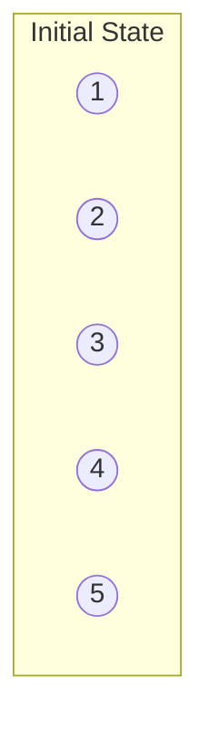
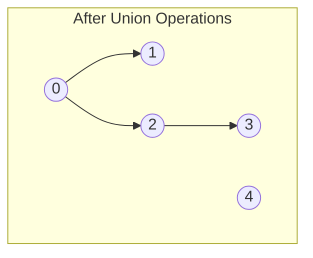

# Union Find

## Introduction

Union Find, also known as Disjoint Set Union (DSU) or Disjoint Set data structure, is an efficient data structure for managing a collection of disjoint (non-overlapping) sets. It provides two primary operations:

1. **Find**: Determine which set an element belongs to.
2. **Union**: Merge two sets into a single set.

This data structure is remarkably simple to implement yet powerful for solving complex problems involving partitioning elements into distinct groups.

Union Find excels at tracking connected components in a graph, detecting cycles, and solving various connectivity-related problems with near-constant time operations after optimization.

## Basic Concepts

### Sets and Elements

In Union Find, we maintain a collection of disjoint sets. Each set contains elements, and each element belongs to exactly one set. Initially, every element is in its own singleton set.

Let's visualize a simple example:



In this initial state, we have five separate sets, each containing one element.

### Core Operations

1. **MakeSet(x)** - Creates a new set containing only element x
2. **Find(x)** - Returns the representative (or root) of the set containing element x
3. **Union(x, y)** - Merges the sets containing elements x and y

## Implementation Approaches

### Basic Implementation: Parent Array

The simplest way to implement Union Find is using an array to track the parent of each element:

```python
class UnionFind:
    def __init__(self, n):
        # Initially, each element is its own parent
        self.parent = list(range(n))
    
    def find(self, x):
        # Find the root of the set containing x
        if self.parent[x] != x:
            return self.find(self.parent[x])
        return x
    
    def union(self, x, y):
        # Merge the sets containing x and y
        root_x = self.find(x)
        root_y = self.find(y)
        if root_x != root_y:
            self.parent[root_y] = root_x
```

Let's see this in action:

```python
# Initialize Union Find with 5 elements (0-4)
uf = UnionFind(5)

# Perform some union operations
uf.union(0, 1)  # Merge sets containing 0 and 1
uf.union(2, 3)  # Merge sets containing 2 and 3
uf.union(0, 3)  # Merge sets containing 0 and 3

# Check if elements are in the same set
print(uf.find(1) == uf.find(3))  # True - they're in the same set
print(uf.find(0) == uf.find(4))  # False - they're in different sets
```

**Output:**
```
True
False
```

After these operations, our sets would look like this:



## Optimization Techniques

The basic implementation works but has poor performance for deep trees. Here are two critical optimizations:

### 1. Path Compression

When we perform a find operation, we can make all nodes in the path point directly to the root, flattening the tree structure:

```python
def find(self, x):
    if self.parent[x] != x:
        self.parent[x] = self.find(self.parent[x])  # Path compression
    return self.parent[x]
```

### 2. Union by Rank/Size

Rather than arbitrarily making one tree a child of another during union, we can:
- Track the size or rank (approximate height) of each tree
- Make the smaller tree a subtree of the larger one

Here's an implementation with both optimizations:

```python
class OptimizedUnionFind:
    def __init__(self, n):
        self.parent = list(range(n))
        self.rank = [0] * n  # Track the approximate height of each tree
    
    def find(self, x):
        # Find with path compression
        if self.parent[x] != x:
            self.parent[x] = self.find(self.parent[x])
        return self.parent[x]
    
    def union(self, x, y):
        # Union by rank
        root_x = self.find(x)
        root_y = self.find(y)
        
        if root_x == root_y:
            return
        
        if self.rank[root_x] < self.rank[root_y]:
            # Make root_y the parent
            self.parent[root_x] = root_y
        elif self.rank[root_x] > self.rank[root_y]:
            # Make root_x the parent
            self.parent[root_y] = root_x
        else:
            # Same rank, so make one the parent and increment its rank
            self.parent[root_y] = root_x
            self.rank[root_x] += 1
```

With these optimizations, operations approach constant time amortized complexity, making Union Find extremely efficient.

## Time Complexity Analysis

| Operation | Basic Implementation | With Optimizations |
|-----------|---------------------|--------------------|
| MakeSet   | O(1)                | O(1)               |
| Find      | O(n) worst case     | O(α(n)) ≈ O(1)*    |
| Union     | O(n) worst case     | O(α(n)) ≈ O(1)*    |

*α(n) is the extremely slow-growing inverse Ackermann function, which is less than 5 for any practical value of n.

## Real-World Applications

### 1. Network Connectivity

Union Find is perfect for determining if two computers are connected in a network.

```python
def are_computers_connected(connections, computer1, computer2, n):
    """
    Determine if two computers are connected in a network
    
    Args:
        connections: List of pairs [a, b] representing connections between computers
        computer1, computer2: The two computers to check
        n: Total number of computers (0 to n-1)
    
    Returns:
        Boolean indicating whether the computers are connected
    """
    uf = OptimizedUnionFind(n)
    
    # Process all connections
    for a, b in connections:
        uf.union(a, b)
    
    # Check if the computers are in the same connected component
    return uf.find(computer1) == uf.find(computer2)

# Example usage
connections = [[0, 1], [1, 2], [3, 4]]
print(are_computers_connected(connections, 0, 2, 5))  # True
print(are_computers_connected(connections, 0, 4, 5))  # False
```

### 2. Detecting Cycles in Undirected Graphs

A cycle exists in an undirected graph if we try to union two vertices that are already in the same set:

```python
def has_cycle(edges, n):
    """
    Determine if an undirected graph has a cycle
    
    Args:
        edges: List of pairs [u, v] representing edges
        n: Number of vertices (0 to n-1)
    
    Returns:
        Boolean indicating whether the graph has a cycle
    """
    uf = OptimizedUnionFind(n)
    
    for u, v in edges:
        # If u and v are already in the same set, we found a cycle
        if uf.find(u) == uf.find(v):
            return True
        uf.union(u, v)
    
    return False

# Example usage
edges = [[0, 1], [1, 2], [2, 0]]
print(has_cycle(edges, 3))  # True

edges = [[0, 1], [1, 2], [2, 3]]
print(has_cycle(edges, 4))  # False
```

### 3. Kruskal's Minimum Spanning Tree Algorithm

Union Find is a key component in Kruskal's algorithm, which finds a minimum spanning tree of a graph:

```python
def kruskal_mst(edges, n):
    """
    Find the minimum spanning tree using Kruskal's algorithm
    
    Args:
        edges: List of tuples (weight, u, v) representing weighted edges
        n: Number of vertices (0 to n-1)
    
    Returns:
        List of edges in the minimum spanning tree
    """
    # Sort edges by weight
    edges.sort()
    
    uf = OptimizedUnionFind(n)
    mst = []
    
    for weight, u, v in edges:
        if uf.find(u) != uf.find(v):
            uf.union(u, v)
            mst.append((u, v, weight))
            
            # Once we have n-1 edges, we have a complete MST
            if len(mst) == n - 1:
                break
    
    return mst

# Example usage
weighted_edges = [(1, 0, 1), (5, 0, 2), (3, 1, 2), (6, 1, 3), (2, 2, 3)]
print(kruskal_mst(weighted_edges, 4))
# Output: [(0, 1, 1), (2, 3, 2), (1, 2, 3)]
```

### 4. Dynamic Connected Components

Union Find can efficiently maintain connected components as edges are added to a graph:

```python
class DynamicConnectivity:
    def __init__(self, n):
        self.uf = OptimizedUnionFind(n)
        self.components = n  # Initially, each node is its own component
    
    def connect(self, a, b):
        # Connect two components
        if self.uf.find(a) != self.uf.find(b):
            self.uf.union(a, b)
            self.components -= 1  # One less component after merging
    
    def is_connected(self, a, b):
        # Check if two nodes are connected
        return self.uf.find(a) == self.uf.find(b)
    
    def count_components(self):
        # Return the number of connected components
        return self.components

# Example usage
dc = DynamicConnectivity(5)
print(dc.count_components())  # 5

dc.connect(0, 1)
dc.connect(2, 3)
print(dc.count_components())  # 3

print(dc.is_connected(0, 1))  # True
print(dc.is_connected(0, 2))  # False

dc.connect(0, 2)
print(dc.is_connected(0, 3))  # True
print(dc.count_components())  # 2
```

## Extended Functionality: Weighted Union Find

Sometimes we need to maintain additional information about elements in our sets. Here's an example where we track the size of each component:

```python
class WeightedUnionFind:
    def __init__(self, n):
        self.parent = list(range(n))
        self.rank = [0] * n
        self.size = [1] * n  # Size of each component
    
    def find(self, x):
        if self.parent[x] != x:
            self.parent[x] = self.find(self.parent[x])
        return self.parent[x]
    
    def union(self, x, y):
        root_x = self.find(x)
        root_y = self.find(y)
        
        if root_x == root_y:
            return
        
        if self.rank[root_x] < self.rank[root_y]:
            self.parent[root_x] = root_y
            self.size[root_y] += self.size[root_x]
        elif self.rank[root_x] > self.rank[root_y]:
            self.parent[root_y] = root_x
            self.size[root_x] += self.size[root_y]
        else:
            self.parent[root_y] = root_x
            self.rank[root_x] += 1
            self.size[root_x] += self.size[root_y]
    
    def component_size(self, x):
        return self.size[self.find(x)]
```

## Summary

Union Find is a powerful data structure that efficiently manages disjoint sets with near-constant time operations. Key points to remember:

1. The basic operations are **Find** (determine which set an element belongs to) and **Union** (merge two sets)
2. Key optimizations include **path compression** and **union by rank/size**
3. With these optimizations, operations have effectively constant time complexity for practical purposes
4. Common applications include network connectivity, cycle detection, minimum spanning trees, and dynamic connectivity

Union Find shines when you need to efficiently group elements and query their relationships, especially in problems involving graphs and connectivity.

## Practice Exercises

1. **Number of Islands II**: You are given an m×n 2D grid initialized with water. We can convert some water cells to land through an operation. Find the number of islands after each operation.

2. **Redundant Connection**: In a graph with n vertices and n edges, find an edge that can be removed to make the graph a tree.

3. **Accounts Merge**: Given a list of accounts where each element is a list of strings, with the first element being a name and the rest being emails, merge accounts that belong to the same person.

4. **Regions Cut By Slashes**: Given a grid of slashes (/, \, or blank space), count the number of regions the slashes divide the grid into.

## Further Reading

- Tarjan, R. E., & van Leeuwen, J. (1984). "Worst-case analysis of set union algorithms"
- Cormen, T. H., Leiserson, C. E., Rivest, R. L., & Stein, C. (2009). "Introduction to Algorithms" (3rd ed.)
- Sedgewick, R., & Wayne, K. (2011). "Algorithms" (4th ed.)

Union Find demonstrates how a seemingly simple data structure with the right optimizations can solve complex problems efficiently. It's an essential tool in every programmer's toolkit, particularly for problems involving grouping and connectivity.