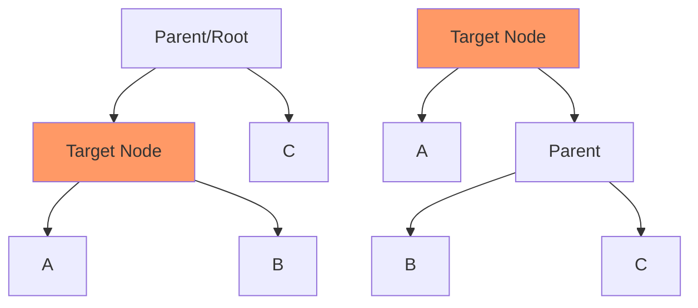
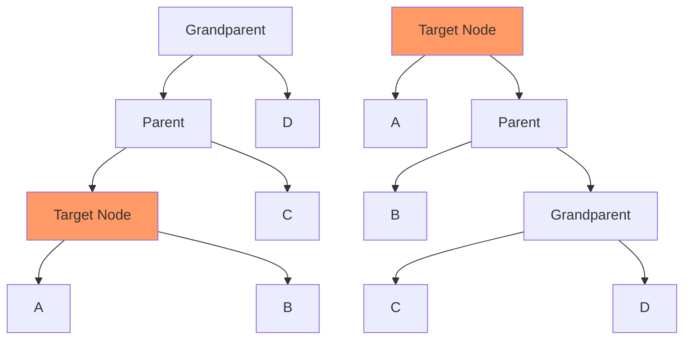
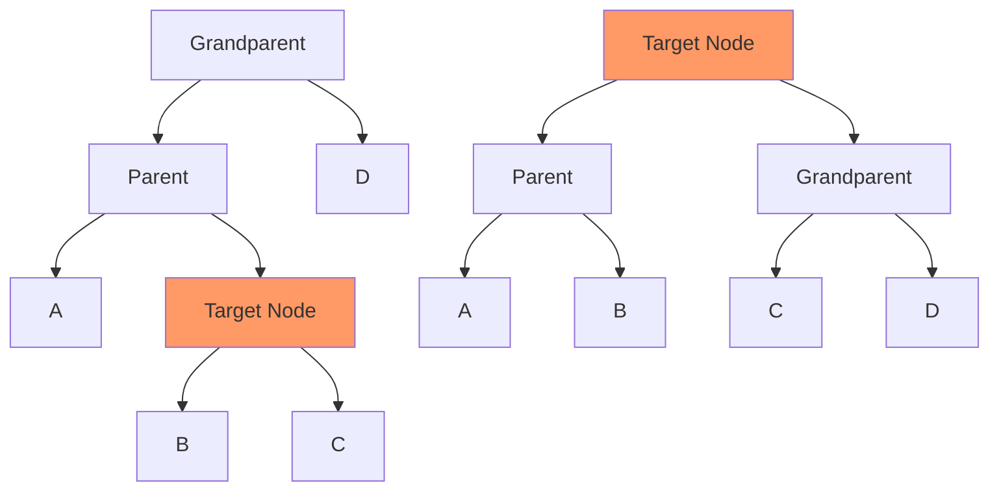

# Splay Trees

## Introduction

A Splay Tree is a self-adjusting binary search tree that automatically moves frequently accessed elements closer to the root. While a single operation might take O(n) time in the worst case, the amortized cost is only O(log n), making splay trees efficient for applications where recently accessed elements are likely to be accessed again soon.

Unlike other self-balancing trees like AVL or Red-Black trees, splay trees don't maintain explicit balance factors or coloring schemes. Instead, they restructure themselves through a process called "splaying" that brings a recently accessed node to the root position.

## Key Characteristics

- **Self-adjusting**: Automatically organizes frequently used elements near the root
- **No explicit balancing factors**: Unlike AVL or Red-Black trees
- **Amortized O(log n) performance**: For all operations
- **Cache-friendly**: Recently accessed elements remain easily accessible
- **Simple implementation**: Compared to other self-balancing trees

## The Splaying Operation

Splaying is the fundamental operation that distinguishes splay trees. When we access, insert, or delete a node, we move that node to the root using a sequence of tree rotations.

Let's understand the three basic cases of splaying:

### 1. Zig Case (Node's Parent is Root)

When the node's parent is the root, we perform a single rotation.



### 2. Zig-Zig Case (Node and Parent on Same Side)

When the node and its parent are both left children or both right children, we perform two rotations.



### 3. Zig-Zag Case (Node and Parent on Opposite Sides)

When one is a left child and the other is a right child, we perform a different sequence of rotations.



## Implementation

Let's implement a splay tree in JavaScript:

```javascript
class Node {
  constructor(key) {
    this.key = key;
    this.left = null;
    this.right = null;
  }
}

class SplayTree {
  constructor() {
    this.root = null;
  }
  
  // Right rotation
  rightRotate(x) {
    const y = x.left;
    x.left = y.right;
    y.right = x;
    return y;
  }
  
  // Left rotation
  leftRotate(x) {
    const y = x.right;
    x.right = y.left;
    y.left = x;
    return y;
  }
  
  // This function splays the given key
  splay(key, root) {
    if (root === null || root.key === key) {
      return root;
    }
    
    // Key is in left subtree
    if (key < root.key) {
      // Key not in tree
      if (root.left === null) {
        return root;
      }
      
      // Zig-Zig (Left Left)
      if (root.left.left !== null && key < root.left.key) {
        // First recursively splay the key to root.left.left
        root.left.left = this.splay(key, root.left.left);
        
        // First rotation for root, second rotation is done after else
        root = this.rightRotate(root);
      }
      // Zig-Zag (Left Right)
      else if (root.left.right !== null && key > root.left.key) {
        // Bring the key to root.left.right
        root.left.right = this.splay(key, root.left.right);
        
        // Do first rotation for root.left
        if (root.left.right !== null) {
          root.left = this.leftRotate(root.left);
        }
      }
      
      // Do second rotation for root
      return (root.left === null) ? root : this.rightRotate(root);
    }
    // Key is in right subtree
    else {
      // Key not in tree
      if (root.right === null) {
        return root;
      }
      
      // Zig-Zig (Right Right)
      if (root.right.right !== null && key > root.right.key) {
        // First recursively splay the key to root.right.right
        root.right.right = this.splay(key, root.right.right);
        
        // First rotation for root, second rotation is done after else
        root = this.leftRotate(root);
      }
      // Zig-Zag (Right Left)
      else if (root.right.left !== null && key < root.right.key) {
        // Bring the key to root.right.left
        root.right.left = this.splay(key, root.right.left);
        
        // Do first rotation for root.right
        if (root.right.left !== null) {
          root.right = this.rightRotate(root.right);
        }
      }
      
      // Do second rotation for root
      return (root.right === null) ? root : this.leftRotate(root);
    }
  }
  
  // Function to search a key in the tree
  search(key) {
    this.root = this.splay(key, this.root);
    return this.root !== null && this.root.key === key;
  }
  
  // Function to insert a key into the tree
  insert(key) {
    // If tree is empty
    if (this.root === null) {
      this.root = new Node(key);
      return;
    }
    
    // Splay the key
    this.root = this.splay(key, this.root);
    
    // If key is already present
    if (this.root.key === key) return;
    
    // Otherwise create a new root
    const newNode = new Node(key);
    
    // If root's key is greater, make root as right child
    if (key < this.root.key) {
      newNode.right = this.root;
      newNode.left = this.root.left;
      this.root.left = null;
    }
    // If root's key is smaller, make root as left child
    else {
      newNode.left = this.root;
      newNode.right = this.root.right;
      this.root.right = null;
    }
    
    this.root = newNode;
  }
  
  // Function to delete a key from the tree
  delete(key) {
    if (this.root === null) return;
    
    // Splay the key
    this.root = this.splay(key, this.root);
    
    // If key not found
    if (this.root.key !== key) return;
    
    let temp;
    
    // No left child
    if (this.root.left === null) {
      temp = this.root;
      this.root = this.root.right;
    }
    // Has left child
    else {
      temp = this.root;
      
      // Make the maximum of left subtree as root
      this.root = this.splay(key, this.root.left);
      this.root.right = temp.right;
    }
  }
  
  // Utility function to print inorder traversal
  inorder(root = this.root) {
    if (root !== null) {
      this.inorder(root.left);
      console.log(root.key);
      this.inorder(root.right);
    }
  }
}
```

## Example Usage

Let's see our splay tree in action with a simple example:

```javascript
// Create a new splay tree
const tree = new SplayTree();

// Insert some values
tree.insert(10);
tree.insert(5);
tree.insert(15);
tree.insert(3);
tree.insert(7);
tree.insert(12);
tree.insert(18);

console.log("Inorder traversal of the constructed tree:");
tree.inorder();

// Search for a value
console.log("\nSearching for 7:");
console.log(tree.search(7) ? "Found!" : "Not Found!");
console.log("Root after search:", tree.root.key);

// Delete a value
console.log("\nDeleting 15:");
tree.delete(15);
console.log("Inorder traversal after deletion:");
tree.inorder();
```

Output:
```
Inorder traversal of the constructed tree:
3
5
7
10
12
15
18

Searching for 7:
Found!
Root after search: 7

Deleting 15:
Inorder traversal after deletion:
3
5
7
10
12
18
```

## Time Complexity Analysis

While individual operations might take O(n) time in the worst case, the amortized analysis (averaging over sequences of operations) shows that splay trees perform well:

| Operation | Average Case    | Worst Case |
|-----------|----------------|------------|
| Search    | O(log n) amortized | O(n)       |
| Insert    | O(log n) amortized | O(n)       |
| Delete    | O(log n) amortized | O(n)       |

## Real-World Applications

Splay trees are particularly useful in scenarios where:

1. **Caching Systems**: Recently accessed data is likely to be accessed again soon. Splay trees automatically bring frequently accessed elements to the top.

2. **Garbage Collection**: Memory allocators can use splay trees to efficiently track allocated and free blocks.

3. **Network Routers**: For managing flow tables and routing information where some destinations are accessed more frequently.

4. **Text Editors**: For implementing undo functionality, where recent operations are more likely to be undone.

### Example: Simple Cache Implementation

```javascript
class SplayTreeCache {
  constructor(capacity) {
    this.tree = new SplayTree();
    this.capacity = capacity;
    this.size = 0;
    this.data = new Map(); // To store actual data
  }
  
  get(key) {
    if (!this.data.has(key)) return null;
    
    // This will bring the recently accessed key to the root
    this.tree.search(key);
    return this.data.get(key);
  }
  
  put(key, value) {
    if (this.data.has(key)) {
      // Update existing value
      this.data.set(key, value);
      this.tree.search(key); // Bring to top
      return;
    }
    
    // If cache is full, remove the least recently used (deepest node)
    if (this.size >= this.capacity) {
      // Finding the deepest node would require additional tracking, 
      // but for simplicity let's just remove the smallest key
      const lruKey = this.findLRUKey();
      this.data.delete(lruKey);
      this.tree.delete(lruKey);
      this.size--;
    }
    
    // Add new key-value
    this.data.set(key, value);
    this.tree.insert(key);
    this.size++;
  }
  
  findLRUKey() {
    // In a real implementation, you'd need a more sophisticated way to track LRU
    // This is just a placeholder that finds the smallest key
    let current = this.tree.root;
    while (current.left !== null) {
      current = current.left;
    }
    return current.key;
  }
}
```

## Advantages and Disadvantages

### Advantages:
- Self-optimizing structure that adapts to access patterns
- Simple implementation compared to other self-balancing trees
- No need for storing balance factors or color information
- Excellent performance for frequently accessed elements

### Disadvantages:
- Individual operations can take O(n) time in worst case
- More rotations than other self-balancing trees, leading to potentially more pointer changes
- Not optimal for applications with uniform access patterns
- Not thread-safe without additional synchronization

## Summary

Splay trees are self-adjusting binary search trees that move recently accessed nodes closer to the root. While they don't guarantee O(log n) performance for individual operations, they achieve an amortized O(log n) time complexity, making them well-suited for applications where recently accessed elements are likely to be accessed again.

Key points to remember:
- Splaying is the fundamental operation that restructures the tree
- Three cases for splaying: Zig, Zig-Zig, and Zig-Zag
- Splay trees excel in scenarios with locality of reference
- No explicit balance factors are maintained
- Simple implementation compared to other self-balancing trees

## Further Exercises

1. Implement a function to find the kth smallest element in a splay tree.
2. Modify the splay tree implementation to keep track of subtree sizes and implement rank operations.
3. Implement a function to join two splay trees where all keys in the first tree are smaller than all keys in the second tree.
4. Create a visualization of how a splay tree changes during a sequence of operations.
5. Compare the performance of splay trees with AVL trees and Red-Black trees for different access patterns.

## Additional Resources

- [Original Splay Tree Paper by Sleator and Tarjan](https://www.cs.cmu.edu/~sleator/papers/self-adjusting.pdf)
- [MIT Open Courseware - Advanced Data Structures](https://ocw.mit.edu/courses/electrical-engineering-and-computer-science/6-851-advanced-data-structures-spring-2012/index.htm)
- Book: "Advanced Data Structures" by Peter Brass

Happy splaying!