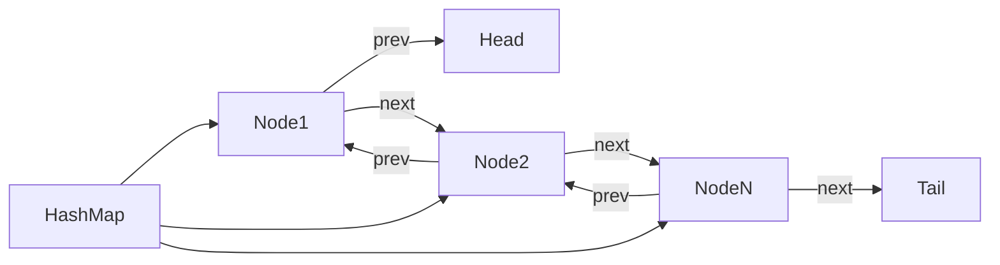

# LRU Cache Implementation

## Introduction

A **Least Recently Used (LRU) Cache** is an efficient caching system that removes the least recently used items when the cache reaches its capacity limit. This data structure is widely used in operating systems, database management systems, and web applications to optimize memory usage and access times.

LRU Cache works on the principle that recently accessed items are more likely to be accessed again in the near future. By keeping track of the usage patterns, the cache can make intelligent decisions about which items to retain and which to evict when space is needed.

In this tutorial, we'll learn:
- What an LRU Cache is and how it works
- The key operations of an LRU Cache
- How to implement an LRU Cache using a combination of a hash map and a doubly linked list
- Real-world applications of LRU Cache
- Time and space complexity analysis

## Understanding LRU Cache

### Basic Concept

An LRU Cache maintains items in order of their usage recency. When we access an item, it becomes the "most recently used" and is moved to the front of the cache. When the cache is full and a new item needs to be added, the "least recently used" item (the one at the back of the cache) is removed.

### Key Operations

1. **Get(key)**: Retrieve an item from the cache by its key
2. **Put(key, value)**: Add or update an item in the cache
3. **Eviction**: Remove the least recently used item when the cache is full

### Desired Time Complexity

For an efficient LRU Cache, we need all operations to have O(1) time complexity (constant time).

## Implementation Approach

To achieve O(1) time complexity for all operations, we'll combine two data structures:

1. **Hash Map (Dictionary)**: Provides O(1) lookup by key
2. **Doubly Linked List**: Allows O(1) insertion/removal of nodes and tracking usage order

Here's the overall design:



## Implementing LRU Cache

Let's implement an LRU Cache in Python:

```python
class DLinkedNode:
    def __init__(self, key=0, value=0):
        self.key = key
        self.value = value
        self.prev = None
        self.next = None

class LRUCache:
    def __init__(self, capacity: int):
        self.cache = {}  # Hash map for O(1) lookup
        self.size = 0
        self.capacity = capacity
        
        # Initialize doubly linked list with dummy head and tail
        self.head = DLinkedNode()
        self.tail = DLinkedNode()
        self.head.next = self.tail
        self.tail.prev = self.head
    
    # Helper method to add a node right after the head
    def _add_node(self, node):
        node.prev = self.head
        node.next = self.head.next
        
        self.head.next.prev = node
        self.head.next = node
    
    # Helper method to remove an existing node from the linked list
    def _remove_node(self, node):
        prev = node.prev
        new = node.next
        
        prev.next = new
        new.prev = prev
    
    # Helper method to move a node to the front (mark as recently used)
    def _move_to_head(self, node):
        self._remove_node(node)
        self._add_node(node)
    
    # Helper method to pop the least recently used item (tail)
    def _pop_tail(self):
        res = self.tail.prev
        self._remove_node(res)
        return res
    
    def get(self, key: int) -> int:
        node = self.cache.get(key)
        
        # If key doesn't exist
        if not node:
            return -1
        
        # Move the accessed node to the front
        self._move_to_head(node)
        
        return node.value
    
    def put(self, key: int, value: int) -> None:
        node = self.cache.get(key)
        
        # If key doesn't exist
        if not node:
            newNode = DLinkedNode(key, value)
            
            # Add to the cache
            self.cache[key] = newNode
            
            # Add to the doubly linked list
            self._add_node(newNode)
            
            self.size += 1
            
            # Check if over capacity
            if self.size > self.capacity:
                # Remove the least recently used item
                tail = self._pop_tail()
                del self.cache[tail.key]
                self.size -= 1
        else:
            # Update existing node's value
            node.value = value
            self._move_to_head(node)
```

## Step-by-Step Explanation

### 1. The Node Structure

```python
class DLinkedNode:
    def __init__(self, key=0, value=0):
        self.key = key
        self.value = value
        self.prev = None
        self.next = None
```

We define a doubly linked list node that stores:
- `key`: The lookup key for the cache entry
- `value`: The actual data being cached
- `prev` and `next`: Pointers to adjacent nodes

### 2. LRU Cache Initialization

```python
def __init__(self, capacity: int):
    self.cache = {}  # Hash map for O(1) lookup
    self.size = 0
    self.capacity = capacity
    
    # Initialize doubly linked list with dummy head and tail
    self.head = DLinkedNode()
    self.tail = DLinkedNode()
    self.head.next = self.tail
    self.tail.prev = self.head
```

We initialize:
- A hash map for quick lookup
- A size counter and capacity limit
- A doubly linked list with dummy head and tail nodes (simplifies edge cases)

### 3. Helper Methods

We implement several helper methods to manage the linked list:
- `_add_node`: Adds a node right after the head (most recently used)
- `_remove_node`: Removes a node from the linked list
- `_move_to_head`: Marks a node as recently used by moving it to the front
- `_pop_tail`: Removes and returns the least recently used node

### 4. Main Operations

#### Get Operation

```python
def get(self, key: int) -> int:
    node = self.cache.get(key)
    
    # If key doesn't exist
    if not node:
        return -1
    
    # Move the accessed node to the front
    self._move_to_head(node)
    
    return node.value
```

1. Look up the key in our hash map
2. If not found, return -1
3. If found, mark it as recently used by moving to the head
4. Return the value

#### Put Operation

```python
def put(self, key: int, value: int) -> None:
    node = self.cache.get(key)
    
    # If key doesn't exist
    if not node:
        newNode = DLinkedNode(key, value)
        
        # Add to the cache
        self.cache[key] = newNode
        
        # Add to the doubly linked list
        self._add_node(newNode)
        
        self.size += 1
        
        # Check if over capacity
        if self.size > self.capacity:
            # Remove the least recently used item
            tail = self._pop_tail()
            del self.cache[tail.key]
            self.size -= 1
    else:
        # Update existing node's value
        node.value = value
        self._move_to_head(node)
```

1. Check if key already exists in cache
2. If not:
   - Create a new node
   - Add to hash map and linked list
   - Increment size
   - If over capacity, evict the least recently used item
3. If key exists:
   - Update the value
   - Mark as recently used by moving to the head

## Time and Space Complexity

- **Time Complexity**: 
  - `get()`: O(1) - Hash map lookup and linked list operations are all constant time
  - `put()`: O(1) - Hash map insertion and linked list operations are all constant time

- **Space Complexity**: O(capacity) - We store at most `capacity` number of items in both the hash map and linked list

## Example Usage

Let's see a simple example of using our LRU Cache:

```python
# Create a cache with capacity of 2
cache = LRUCache(2)

# Add some items
cache.put(1, 1)  # cache is {1=1}
cache.put(2, 2)  # cache is {1=1, 2=2}

# Access an item
print(cache.get(1))  # returns 1, cache becomes {2=2, 1=1} (1 is now most recently used)

# Add a new item, which causes eviction
cache.put(3, 3)  # LRU key was 2, cache becomes {1=1, 3=3}

# Try to access the evicted item
print(cache.get(2))  # returns -1 (not found)

# Add a new item, causing another eviction
cache.put(4, 4)  # LRU key was 1, cache becomes {3=3, 4=4}

# Try to access evicted and existing items
print(cache.get(1))  # returns -1 (not found)
print(cache.get(3))  # returns 3
print(cache.get(4))  # returns 4
```

### Output:
```
1
-1
-1
3
4
```

## Real-World Applications

LRU Cache is extensively used in various systems:

### 1. Web Browsers

Browsers use LRU Cache for storing recently visited web pages. When you click the back button, the browser can quickly load the page from cache instead of downloading it again.

```python
class BrowserCache(LRUCache):
    def visit_page(self, url, page_content):
        self.put(url, page_content)
    
    def back_to_page(self, url):
        return self.get(url)

# Example usage
browser_cache = BrowserCache(100)  # Store last 100 pages
browser_cache.visit_page("https://example.com", "<html>Example content</html>")
```

### 2. Database Query Result Cache

Databases often cache query results to avoid expensive repeated computations:

```python
class QueryCache(LRUCache):
    def execute_query(self, query_string):
        # Check if result is cached
        result = self.get(query_string)
        if result == -1:  # Not in cache
            result = self._run_database_query(query_string)  # Expensive operation
            self.put(query_string, result)
        return result
    
    def _run_database_query(self, query):
        # Simulate database query execution
        return f"Result for {query}"
```

### 3. Operating Systems

Operating systems use LRU algorithms for page replacement in virtual memory management:

```python
class PageTable(LRUCache):
    def access_page(self, page_id):
        page_data = self.get(page_id)
        if page_data == -1:  # Page fault
            page_data = self._load_from_disk(page_id)
            self.put(page_id, page_data)
        return page_data
    
    def _load_from_disk(self, page_id):
        # Simulate loading page from disk
        return f"Data from page {page_id}"
```

## Implementation Variants

### 1. Thread-Safe LRU Cache

For multi-threaded environments, we can add thread safety:

```python
import threading

class ThreadSafeLRUCache(LRUCache):
    def __init__(self, capacity):
        super().__init__(capacity)
        self.lock = threading.Lock()
    
    def get(self, key):
        with self.lock:
            return super().get(key)
    
    def put(self, key, value):
        with self.lock:
            super().put(key, value)
```

### 2. Time-Based LRU Cache

We can extend the LRU Cache to also consider item expiration:

```python
import time

class TimeAwareLRUCache(LRUCache):
    def __init__(self, capacity, default_ttl=60):  # TTL in seconds
        super().__init__(capacity)
        self.expiry = {}  # Map keys to expiration timestamps
        self.default_ttl = default_ttl
    
    def get(self, key):
        if key in self.expiry and time.time() > self.expiry[key]:
            # Item has expired
            self._remove_item(key)
            return -1
        return super().get(key)
    
    def put(self, key, value, ttl=None):
        if ttl is None:
            ttl = self.default_ttl
            
        self.expiry[key] = time.time() + ttl
        super().put(key, value)
    
    def _remove_item(self, key):
        if key in self.cache:
            node = self.cache[key]
            self._remove_node(node)
            del self.cache[key]
            del self.expiry[key]
            self.size -= 1
```

## Summary

LRU Cache is a powerful data structure that provides efficient caching with O(1) time complexity for all operations. The key insights to implement it effectively are:

1. Combine a hash map (dictionary) with a doubly linked list
2. The hash map provides O(1) lookups
3. The doubly linked list tracks usage order and enables O(1) insertions/removals
4. Recently used items are kept at the front of the list
5. When eviction is needed, remove the item at the back of the list (least recently used)

This implementation pattern is widely used in systems design and is a common interview question due to its practical relevance and the elegance of combining multiple data structures to achieve optimal performance.

## Practice Exercises

1. **Basic Implementation**: Implement an LRU Cache from scratch without looking at the solution
2. **Size-Limited Cache**: Modify the LRU Cache to have a maximum size in bytes instead of a count of items
3. **Statistics Tracking**: Add functionality to track cache hits and misses
4. **Write-Through Cache**: Extend the LRU cache to automatically sync changes to a backing store
5. **LFU Variant**: Implement a Least Frequently Used (LFU) cache and compare its performance with LRU

## Further Reading

- Distributed LRU Cache implementations
- Concurrency patterns for high-performance caching
- Memory-efficient cache implementations for large datasets
- Advanced eviction policies beyond LRU (e.g., LFU, 2Q, LIRS)
- Comparison of caching algorithms and their performance characteristics

Happy caching!