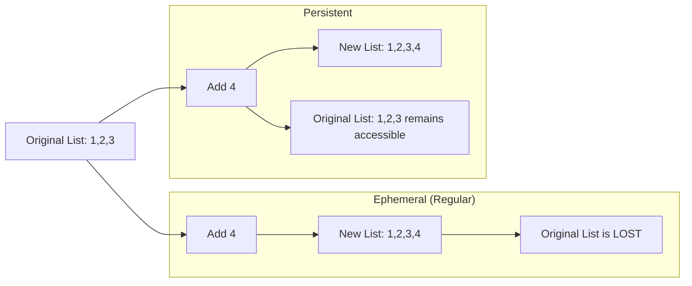
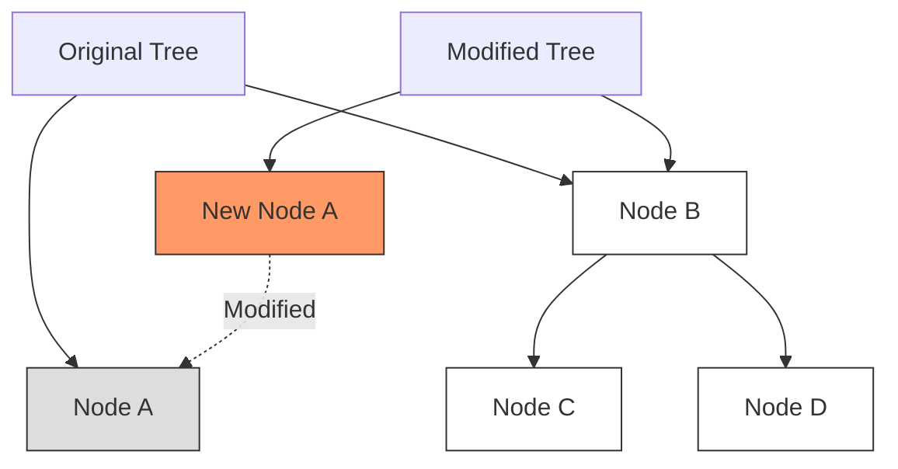

# Persistent Data Structures

## Introduction

When you modify a regular data structure, such as adding an element to an array, the original structure is altered and its previous state is lost. But what if you want to keep track of the previous state? This is where **persistent data structures** come into play.

Persistent data structures are a special class of data structures that preserve previous versions of themselves when modified. Instead of overwriting the existing data, they create a new version while keeping the old one intact. This property makes them particularly valuable in functional programming, version control systems, and any application where historical data access is important.

## Understanding Persistence

### What is Persistence?

In the context of data structures, persistence refers to the ability to access previous versions of a data structure after it has been modified. This is different from simply storing data persistently on disk; it's about maintaining multiple versions of the same data structure in memory.

There are several levels of persistence:

1. **Partial Persistence**: Allows access to all past versions but only allows modifications to the newest version
2. **Full persistence**: Allows both access and modifications to any version
3. **Confluent persistence**: Allows versions to be merged in addition to modification and access
4. **Functional persistence**: Always preserves the previous version when the structure is modified

Let's visualize the difference between ephemeral (regular) and persistent data structures:



## Implementation Techniques

Let's explore how to implement persistent data structures.

### Path Copying

Path copying is a straightforward technique where we create a new copy of the nodes that are affected by an update operation, along with all nodes that reference them directly or indirectly.

Here's a simple example with a persistent linked list:

```javascript
class PersistentNode {
  constructor(value, next = null) {
    this.value = value;
    this.next = next;
  }
}

class PersistentList {
  constructor(head = null) {
    this.head = head;
  }
  
  // Add element to the front - returns a new list
  cons(value) {
    return new PersistentList(new PersistentNode(value, this.head));
  }
  
  // Return the first element
  head() {
    if (!this.head) throw new Error("Empty list");
    return this.head.value;
  }
  
  // Return list without the first element - returns a new list
  tail() {
    if (!this.head) throw new Error("Empty list");
    return new PersistentList(this.head.next);
  }
  
  // Convert to array for display
  toArray() {
    const result = [];
    let current = this.head;
    while (current) {
      result.push(current.value);
      current = current.next;
    }
    return result;
  }
}

// Usage example
const emptyList = new PersistentList();
const list1 = emptyList.cons(1);  // list1: [1]
const list2 = list1.cons(2);      // list2: [2, 1]
const list3 = list2.cons(3);      // list3: [3, 2, 1]

console.log(list1.toArray());  // Output: [1]
console.log(list2.toArray());  // Output: [2, 1]
console.log(list3.toArray());  // Output: [3, 2, 1]
```

In this example, each time we add a new element with `cons()`, we create a new list with its own head, rather than modifying the original. The original list remains unchanged and accessible.

### Structural Sharing

Creating complete copies can be inefficient. Structural sharing is an optimization technique where unmodified parts of the data structure are reused in the new version.



The diagram above shows how only the modified nodes (and their path to the root) are copied, while unmodified subtrees are shared between versions.

### Fat Nodes

Another approach is to use "fat nodes" that store multiple values corresponding to different versions of the data structure:

```javascript
class FatNode {
  constructor(initialValue) {
    this.versions = new Map();
    this.versions.set(0, {
      value: initialValue,
      next: null
    });
    this.latestVersion = 0;
  }
  
  getVersion(version) {
    return this.versions.get(version);
  }
  
  addVersion(version, value, next) {
    this.versions.set(version, { value, next });
    this.latestVersion = version;
  }
}
```

## Practical Examples

### Example 1: Persistent Array

Let's implement a simple persistent array using path copying:

```javascript
class PersistentArray {
  constructor(data = []) {
    this.data = [...data]; // Create a copy of the array
  }
  
  get(index) {
    if (index < 0 || index >= this.data.length) {
      throw new Error("Index out of bounds");
    }
    return this.data[index];
  }
  
  set(index, value) {
    if (index < 0 || index >= this.data.length) {
      throw new Error("Index out of bounds");
    }
    
    // Create a new array with the updated value
    const newData = [...this.data];
    newData[index] = value;
    
    // Return a new persistent array
    return new PersistentArray(newData);
  }
  
  push(value) {
    const newData = [...this.data, value];
    return new PersistentArray(newData);
  }
  
  length() {
    return this.data.length;
  }
}

// Usage
const arr1 = new PersistentArray([1, 2, 3]);
const arr2 = arr1.set(1, 99);     // Update index 1
const arr3 = arr2.push(4);        // Add new element

console.log(arr1.data);  // Output: [1, 2, 3]
console.log(arr2.data);  // Output: [1, 99, 3]
console.log(arr3.data);  // Output: [1, 99, 3, 4]
```

### Example 2: Persistent Stack

A stack is naturally suited for a persistent implementation:

```javascript
class PersistentStack {
  constructor(items = []) {
    this.items = items;
  }
  
  push(item) {
    return new PersistentStack([item, ...this.items]);
  }
  
  pop() {
    if (this.isEmpty()) {
      throw new Error("Cannot pop from empty stack");
    }
    return new PersistentStack(this.items.slice(1));
  }
  
  peek() {
    if (this.isEmpty()) {
      throw new Error("Cannot peek at empty stack");
    }
    return this.items[0];
  }
  
  isEmpty() {
    return this.items.length === 0;
  }
  
  size() {
    return this.items.length;
  }
}

// Usage
const stack1 = new PersistentStack();
const stack2 = stack1.push("A");
const stack3 = stack2.push("B");
const stack4 = stack3.pop();

console.log(stack2.peek());  // Output: "A"
console.log(stack3.peek());  // Output: "B"
console.log(stack4.peek());  // Output: "A" (after popping "B")
```

## Real-World Applications

### 1. Undo/Redo Functionality

Persistent data structures are ideal for implementing undo/redo functionality in applications:

```javascript
class TextEditor {
  constructor(text = "") {
    this.currentText = text;
    this.history = [text];
    this.currentIndex = 0;
  }
  
  edit(newText) {
    this.currentText = newText;
    // Remove any forward history
    this.history = this.history.slice(0, this.currentIndex + 1);
    this.history.push(newText);
    this.currentIndex = this.history.length - 1;
  }
  
  undo() {
    if (this.currentIndex > 0) {
      this.currentIndex--;
      this.currentText = this.history[this.currentIndex];
    }
    return this.currentText;
  }
  
  redo() {
    if (this.currentIndex < this.history.length - 1) {
      this.currentIndex++;
      this.currentText = this.history[this.currentIndex];
    }
    return this.currentText;
  }
}

// Usage
const editor = new TextEditor("Hello");
editor.edit("Hello World");
editor.edit("Hello World!");

console.log(editor.currentText);  // Output: "Hello World!"
console.log(editor.undo());       // Output: "Hello World"
console.log(editor.undo());       // Output: "Hello"
console.log(editor.redo());       // Output: "Hello World"
```

### 2. State Management in Web Applications

Libraries like Redux in React utilize principles of immutability and persistence to manage application state:

```javascript
// Simplified Redux-like implementation
function reducer(state = { count: 0 }, action) {
  switch (action.type) {
    case 'INCREMENT':
      return { ...state, count: state.count + 1 };
    case 'DECREMENT':
      return { ...state, count: state.count - 1 };
    default:
      return state;
  }
}

// Usage
let state1 = reducer(undefined, { type: 'INIT' });       // { count: 0 }
let state2 = reducer(state1, { type: 'INCREMENT' });     // { count: 1 }
let state3 = reducer(state2, { type: 'INCREMENT' });     // { count: 2 }

console.log(state1);  // Still { count: 0 }
console.log(state2);  // { count: 1 }
console.log(state3);  // { count: 2 }
```

### 3. Version Control Systems

Git and other version control systems use persistent data structures to efficiently store different versions of files:

```javascript
// Simplified representation of a Git-like storage
class Repository {
  constructor() {
    this.commits = new Map();
    this.HEAD = null;
  }
  
  commit(id, files, parentId = null) {
    this.commits.set(id, {
      files: new Map(files),
      parent: parentId
    });
    this.HEAD = id;
  }
  
  getFilesAt(commitId) {
    return this.commits.get(commitId).files;
  }
}

// Usage
const repo = new Repository();

// Initial commit
repo.commit("commit1", [
  ["file1.txt", "Initial content"]
]);

// Second commit
repo.commit("commit2", [
  ["file1.txt", "Updated content"], 
  ["file2.txt", "New file"]
], "commit1");

console.log(repo.getFilesAt("commit1").get("file1.txt"));  // "Initial content"
console.log(repo.getFilesAt("commit2").get("file1.txt"));  // "Updated content"
```

## Performance Considerations

Persistent data structures come with some trade-offs:

1. **Space Efficiency**: Due to structural sharing, persistent structures often use less memory than naive copy-on-write approaches, but more memory than mutable structures.

2. **Time Efficiency**: Operations on persistent data structures generally have logarithmic complexity O(log n) compared to constant time O(1) for many operations on mutable structures.

3. **Complexity**: Implementation is often more complex, requiring careful design to maintain persistence and efficiency.

Here's a simple comparison:

| Operation | Array (Mutable) | Persistent Array |
|-----------|----------------|------------------|
| Access    | O(1)           | O(log n)         |
| Update    | O(1)           | O(log n)         |
| Insert    | O(n)           | O(log n)         |
| Delete    | O(n)           | O(log n)         |

## Popular Persistent Data Structure Libraries

Several libraries provide ready-to-use persistent data structures:

- **Immutable.js** (JavaScript): Provides many persistent data structures
- **Immer** (JavaScript): Creates immutable state by writing mutable code
- **Vavr** (Java): Functional library with persistent data structures
- **Clojure's data structures**: Built with persistence in mind

## Summary

Persistent data structures offer a powerful approach to handling data that needs to maintain its history. By preserving previous versions when modifications occur, they enable:

- Efficient undo/redo operations
- Safe concurrent access without locks
- Simplified reasoning about state changes
- Better debugging and time-travel capabilities

While they may introduce some overhead compared to mutable structures, the benefits often outweigh the costs in many applications, particularly those dealing with complex state management or historical data access.

## Exercises

1. Implement a persistent binary search tree that maintains its previous state when nodes are inserted or deleted.

2. Extend the persistent array example to include methods for `insert` and `delete` that preserve the original array.

3. Create a persistent hash map that can store key-value pairs and maintains previous versions when entries are added, updated, or removed.

4. Implement a text editor that uses a persistent data structure to store the document and support undo/redo operations efficiently.

5. Research and compare the performance characteristics of your own implementations versus established libraries like Immutable.js.

## Additional Resources

- **Books**:
  - "Purely Functional Data Structures" by Chris Okasaki
  - "Functional Programming in JavaScript" by Luis Atencio

- **Online Courses**:
  - Functional Programming Principles (Coursera)
  - Advanced Data Structures (MIT OpenCourseWare)

- **Libraries**:
  - [Immutable.js](https://immutable-js.com/)
  - [Immer.js](https://immerjs.github.io/immer/)

By mastering persistent data structures, you'll be better equipped to handle complex state management in your applications, whether you're working in functional programming paradigms or simply need to track changes to your data over time.