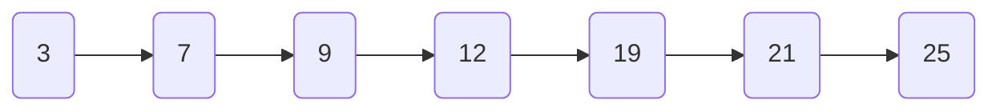
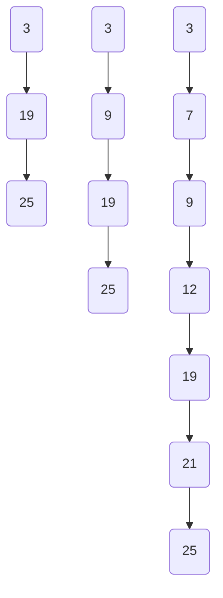

# Skip Lists

## Introduction

Skip lists are an elegant data structure that provides an alternative to balanced trees such as AVL or Red-Black trees. Invented by William Pugh in 1989, skip lists use probability to build a hierarchy of linked lists that allows for fast search, insertion, and deletion operations, typically achieving O(log n) time complexity.

What makes skip lists special is their simplicity compared to balanced tree implementations while still providing comparable performance. They combine the best aspects of arrays (fast access) and linked lists (easy insertion and deletion) in a probabilistic way.

## Understanding Skip Lists

### The Problem with Regular Linked Lists

Before diving into skip lists, let's understand why we need them. Consider a sorted linked list:



To find an element in this list, we must traverse it from the beginning, resulting in O(n) search time. This is inefficient for large datasets compared to binary search trees which offer O(log n) searches.

### The Skip List Solution

A skip list adds multiple "express lanes" above the original list, creating a hierarchy where each level skips more elements than the one below it.



In this structure:
- The bottom layer contains all elements
- Each higher layer acts as an "express lane" containing fewer elements
- Elements in higher layers create shortcuts, allowing us to skip portions of the list during searches

## Structure of a Skip List

A skip list consists of multiple levels of linked lists. Each node in a skip list contains:

1. A value (or key)
2. An array of pointers to the next nodes at different levels
3. Sometimes a pointer to the previous node at each level (for bidirectional skip lists)

Let's define a basic skip list node in Java:

```java
class SkipListNode<T extends Comparable<T>> {
    T value;
    SkipListNode<T>[] forward;
    
    @SuppressWarnings("unchecked")
    public SkipListNode(T value, int level) {
        this.value = value;
        // Array of forward pointers with size level+1
        this.forward = new SkipListNode[level + 1];
    }
}
```

## Skip List Operations

### Search Operation

The search operation in a skip list is quite efficient:

1. Start at the highest level of the head node
2. While traversing each level:
   - Move forward as long as the next node's value is less than the target
   - When you can't move forward anymore, move down one level
3. At the bottom level, either you find the element or determine it's not in the list

Here's a Java implementation:

```java
public boolean search(T target) {
    SkipListNode<T> current = head;
    
    // Start from the highest level
    for (int i = level; i >= 0; i--) {
        // Move forward while the next node's value is less than target
        while (current.forward[i] != null && current.forward[i].value.compareTo(target) < 0) {
            current = current.forward[i];
        }
    }
    
    // Move to the next node (potential match)
    current = current.forward[0];
    
    // Check if we found the target
    return current != null && current.value.compareTo(target) == 0;
}
```

### Insert Operation

Insertion into a skip list involves:

1. Finding the appropriate position (similar to search)
2. Randomly determining the level of the new node using a probabilistic function
3. Updating pointers at each level to include the new node

Here's a simplified insertion implementation:

```java
public void insert(T value) {
    int newNodeLevel = randomLevel();
    SkipListNode<T> newNode = new SkipListNode<>(value, newNodeLevel);
    
    // Update level if needed
    if (newNodeLevel > level) {
        level = newNodeLevel;
    }
    
    SkipListNode<T> current = head;
    
    // Array to store nodes where we change direction
    SkipListNode<T>[] update = new SkipListNode[level + 1];
    
    // Find position for new node
    for (int i = level; i >= 0; i--) {
        while (current.forward[i] != null && current.forward[i].value.compareTo(value) < 0) {
            current = current.forward[i];
        }
        update[i] = current;
    }
    
    // Insert the node at each level
    for (int i = 0; i <= newNodeLevel; i++) {
        newNode.forward[i] = update[i].forward[i];
        update[i].forward[i] = newNode;
    }
    
    size++;
}

// Randomly determine the level with decreasing probability
private int randomLevel() {
    int level = 0;
    while (Math.random() < 0.5 && level < MAX_LEVEL) {
        level++;
    }
    return level;
}
```

### Delete Operation

Deletion works similarly to insertion:

1. Find the node to delete
2. Update pointers to bypass the node
3. Free the memory allocated for the node

```java
public void delete(T value) {
    SkipListNode<T> current = head;
    SkipListNode<T>[] update = new SkipListNode[level + 1];
    
    // Find the node
    for (int i = level; i >= 0; i--) {
        while (current.forward[i] != null && current.forward[i].value.compareTo(value) < 0) {
            current = current.forward[i];
        }
        update[i] = current;
    }
    
    current = current.forward[0];
    
    // If the node exists, remove it
    if (current != null && current.value.compareTo(value) == 0) {
        for (int i = 0; i <= level; i++) {
            if (update[i].forward[i] != current) {
                break;
            }
            update[i].forward[i] = current.forward[i];
        }
        
        // Update level if needed
        while (level > 0 && head.forward[level] == null) {
            level--;
        }
        
        size--;
    }
}
```

## Complete Skip List Implementation

Here's a more complete implementation of a Skip List in Java:

```java
import java.util.Random;

public class SkipList<T extends Comparable<T>> {
    private static final int MAX_LEVEL = 16; // Maximum possible level
    private int level = 0; // Current highest level
    private SkipListNode<T> head; // Head (sentinel) node
    private Random random; // For random level generation
    private int size; // Number of elements
    
    // Node class
    private static class SkipListNode<T extends Comparable<T>> {
        T value;
        SkipListNode<T>[] forward;
        
        @SuppressWarnings("unchecked")
        public SkipListNode(T value, int level) {
            this.value = value;
            this.forward = new SkipListNode[level + 1];
        }
    }
    
    public SkipList() {
        this.head = new SkipListNode<>(null, MAX_LEVEL);
        this.random = new Random();
        this.size = 0;
    }
    
    // Generate random level with probability p = 1/2
    private int randomLevel() {
        int lvl = 0;
        while (random.nextDouble() < 0.5 && lvl < MAX_LEVEL) {
            lvl++;
        }
        return lvl;
    }
    
    // Search for a value
    public boolean search(T target) {
        SkipListNode<T> current = head;
        
        for (int i = level; i >= 0; i--) {
            while (current.forward[i] != null && current.forward[i].value.compareTo(target) < 0) {
                current = current.forward[i];
            }
        }
        
        current = current.forward[0];
        
        return current != null && current.value.compareTo(target) == 0;
    }
    
    // Insert a new value
    public void insert(T value) {
        SkipListNode<T> current = head;
        SkipListNode<T>[] update = new SkipListNode[MAX_LEVEL + 1];
        
        for (int i = level; i >= 0; i--) {
            while (current.forward[i] != null && current.forward[i].value.compareTo(value) < 0) {
                current = current.forward[i];
            }
            update[i] = current;
        }
        
        // Don't insert duplicates
        if (current.forward[0] != null && current.forward[0].value.compareTo(value) == 0) {
            return;
        }
        
        int newLevel = randomLevel();
        
        if (newLevel > level) {
            for (int i = level + 1; i <= newLevel; i++) {
                update[i] = head;
            }
            level = newLevel;
        }
        
        SkipListNode<T> newNode = new SkipListNode<>(value, newLevel);
        
        for (int i = 0; i <= newLevel; i++) {
            newNode.forward[i] = update[i].forward[i];
            update[i].forward[i] = newNode;
        }
        
        size++;
    }
    
    // Delete a value
    public void delete(T value) {
        SkipListNode<T> current = head;
        SkipListNode<T>[] update = new SkipListNode[MAX_LEVEL + 1];
        
        for (int i = level; i >= 0; i--) {
            while (current.forward[i] != null && current.forward[i].value.compareTo(value) < 0) {
                current = current.forward[i];
            }
            update[i] = current;
        }
        
        current = current.forward[0];
        
        if (current != null && current.value.compareTo(value) == 0) {
            for (int i = 0; i <= level; i++) {
                if (update[i].forward[i] != current) {
                    break;
                }
                update[i].forward[i] = current.forward[i];
            }
            
            while (level > 0 && head.forward[level] == null) {
                level--;
            }
            
            size--;
        }
    }
    
    public int size() {
        return size;
    }
    
    public boolean isEmpty() {
        return size == 0;
    }
    
    @Override
    public String toString() {
        StringBuilder sb = new StringBuilder();
        sb.append("Skip List (size ").append(size).append("):\n");
        
        for (int i = level; i >= 0; i--) {
            sb.append("Level ").append(i).append(": ");
            SkipListNode<T> node = head.forward[i];
            while (node != null) {
                sb.append(node.value).append(" → ");
                node = node.forward[i];
            }
            sb.append("null\n");
        }
        
        return sb.toString();
    }
}
```

## Usage Example

Here's how to use the skip list implementation:

```java
public class SkipListDemo {
    public static void main(String[] args) {
        SkipList<Integer> skipList = new SkipList<>();
        
        // Insert elements
        skipList.insert(3);
        skipList.insert(7);
        skipList.insert(9);
        skipList.insert(12);
        skipList.insert(19);
        skipList.insert(21);
        skipList.insert(25);
        
        System.out.println(skipList);
        
        // Search for elements
        System.out.println("Search for 12: " + skipList.search(12));  // true
        System.out.println("Search for 20: " + skipList.search(20));  // false
        
        // Delete an element
        skipList.delete(12);
        System.out.println("\nAfter deleting 12:");
        System.out.println(skipList);
        
        System.out.println("Search for 12: " + skipList.search(12));  // false
    }
}
```

**Output:**
```
Skip List (size 7):
Level 2: 3 → 19 → null
Level 1: 3 → 9 → 19 → 25 → null
Level 0: 3 → 7 → 9 → 12 → 19 → 21 → 25 → null

Search for 12: true
Search for 20: false

After deleting 12:
Skip List (size 6):
Level 2: 3 → 19 → null
Level 1: 3 → 9 → 19 → 25 → null
Level 0: 3 → 7 → 9 → 19 → 21 → 25 → null

Search for 12: false
```

## Time and Space Complexity

Skip lists provide efficient operations with the following complexities:

- **Search**: O(log n) average case
- **Insert**: O(log n) average case
- **Delete**: O(log n) average case
- **Space**: O(n) for storage of n elements (plus some overhead for the express lanes)

The probabilistic nature of skip lists means that these times are expected averages rather than worst-case guarantees. However, the probability of encountering a poorly structured skip list is exceedingly small.

## Practical Applications

Skip lists find applications in various scenarios:

1. **In-memory databases**: Redis, a popular in-memory database, uses skip lists for its sorted sets implementation.

2. **Priority queues**: Skip lists can be used to implement efficient priority queues.

3. **File systems**: Some file systems use skip lists for efficient directory traversal.

4. **Memory allocation systems**: Skip lists help manage free memory blocks efficiently.

5. **Text editors**: Used for efficient line indexing and movement operations.

## Skip Lists vs. Balanced Trees

Compared to balanced trees like AVL or Red-Black trees, skip lists offer:

**Advantages:**
- Simpler implementation with fewer lines of code
- Easier to implement concurrent operations (multiple threads)
- More memory-efficient in some cases
- Dynamic structure that adapts without explicit rebalancing

**Disadvantages:**
- Probabilistic guarantees rather than worst-case guarantees
- Slightly higher constant factors in practice
- Higher memory overhead per element

## Summary

Skip lists are an elegant probabilistic data structure that provide efficient search, insertion, and deletion operations with expected logarithmic time complexity. They offer a simpler alternative to balanced search trees while maintaining comparable performance in practice.

The key insights of skip lists are:
1. Using probability to build a hierarchy of express lanes
2. Allowing fast traversal by skipping elements at higher levels
3. Maintaining balance through randomization rather than explicit rebalancing

Skip lists demonstrate how probabilistic techniques can lead to efficient algorithms with simpler implementations than their deterministic counterparts.

## Exercises

1. Implement a bidirectional skip list that allows traversal in both directions.
2. Add a method to the skip list that finds the k-th smallest element in O(log n) time.
3. Modify the skip list to support range queries (finding all elements between two values).
4. Implement a multi-dimensional skip list for spatial data.
5. Create a concurrent skip list that allows multiple threads to operate on it simultaneously.

## Additional Resources

- The original paper: "Skip Lists: A Probabilistic Alternative to Balanced Trees" by William Pugh
- "Introduction to Algorithms" by Cormen, Leiserson, Rivest, and Stein (CLRS)
- "Algorithms" by Robert Sedgewick and Kevin Wayne
- "The Art of Computer Programming, Vol. 3: Sorting and Searching" by Donald Knuth

Skip lists represent one of those beautiful ideas in computer science where simplicity meets efficiency, making them an important addition to any programmer's data structure toolkit.