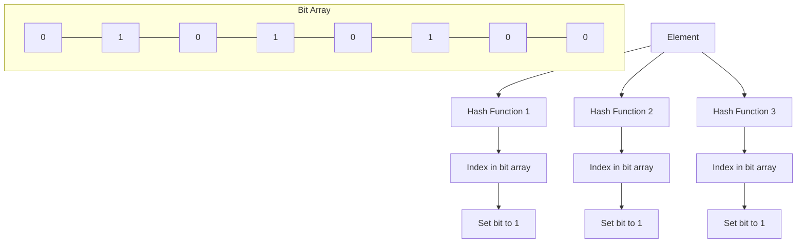

# Bloom Filters

## Introduction

Have you ever needed to quickly check if an element might be in a large set without actually storing the entire set? That's where Bloom Filters shine. A Bloom Filter is a space-efficient probabilistic data structure designed to answer a simple question: "Is this element in the set?" with either "possibly yes" or "definitely no."

What makes Bloom Filters special is their ability to use minimal memory while providing fast lookups. However, there's a tradeoff—they can occasionally give false positives (indicating an element is in the set when it actually isn't), but they never give false negatives (if they say an element is not in the set, it definitely isn't).

In this tutorial, we'll explore how Bloom Filters work, implement one from scratch, and look at real-world applications.

## How Bloom Filters Work

A Bloom Filter consists of:

1. A bit array of `m` bits, all initially set to 0
2. `k` different hash functions, each of which maps an element to one of the `m` positions in the bit array

### The Two Basic Operations

1. **Adding an element**: When adding an element, the filter computes `k` hash values for the element, and sets the bits at these positions to 1.

2. **Checking if an element exists**: To check if an element is in the set, the filter computes `k` hash values and checks if all corresponding bits are set to 1. If any bit is 0, the element definitely isn't in the set. If all bits are 1, the element might be in the set.

Let's visualize this with a simple diagram:



## Implementing a Simple Bloom Filter

Let's implement a basic Bloom Filter in Python:

```python
import hashlib

class BloomFilter:
    def __init__(self, size, hash_count):
        """Initialize a Bloom Filter with a given bit array size and number of hash functions."""
        self.size = size
        self.hash_count = hash_count
        self.bit_array = [0] * size
    
    def _get_hash_values(self, item):
        """Generate hash_count different hash values for an item."""
        hash_values = []
        for i in range(self.hash_count):
            # Use different seeds for each hash function
            hash_obj = hashlib.md5(f"{item}_{i}".encode())
            # Convert hash to an integer and take modulo to fit in bit array
            hash_value = int(hash_obj.hexdigest(), 16) % self.size
            hash_values.append(hash_value)
        return hash_values
    
    def add(self, item):
        """Add an item to the Bloom Filter."""
        for hash_value in self._get_hash_values(item):
            self.bit_array[hash_value] = 1
    
    def might_contain(self, item):
        """Check if an item might be in the Bloom Filter.
        Returns True if the item might be present, False if definitely not present.
        """
        for hash_value in self._get_hash_values(item):
            if self.bit_array[hash_value] == 0:
                return False
        return True
```

Now let's see our Bloom Filter in action:

```python
# Create a Bloom Filter with bit array of size 20 and 3 hash functions
bloom_filter = BloomFilter(20, 3)

# Add some elements
words_to_add = ["apple", "banana", "orange"]
for word in words_to_add:
    bloom_filter.add(word)

# Test membership
test_words = ["apple", "banana", "grape", "kiwi", "orange"]
for word in test_words:
    if bloom_filter.might_contain(word):
        print(f"'{word}' might be in the filter")
    else:
        print(f"'{word}' is definitely not in the filter")
```

Example output:
```
'apple' might be in the filter
'banana' might be in the filter
'grape' might be in the filter    # This could be a false positive!
'kiwi' is definitely not in the filter
'orange' might be in the filter
```

Notice that 'grape' might show as a possible match even though we never added it—this is an example of a false positive.

## Understanding False Positives

The probability of false positives depends on three key factors:

1. The size of the bit array (`m`)
2. The number of hash functions (`k`)
3. The number of elements already in the filter (`n`)

The false positive probability can be approximated as:

$$ P(false\ positive) \approx (1 - e^{-kn/m})^k $$

This means:
- Larger bit arrays (higher `m`) reduce false positives
- The optimal number of hash functions depends on how full the filter is

## Choosing Optimal Parameters

For a desired false positive rate `p` and expected number of elements `n`, optimal parameters can be calculated as:

- Optimal bit array size: `m = -n * ln(p) / (ln(2)²)`
- Optimal number of hash functions: `k = (m/n) * ln(2)`

Let's implement a function to calculate these:

```python
import math

def get_optimal_bloom_filter_params(expected_elements, false_positive_rate):
    """Calculate optimal Bloom Filter parameters."""
    m = -expected_elements * math.log(false_positive_rate) / (math.log(2) ** 2)
    k = (m / expected_elements) * math.log(2)
    
    return {
        "bit_array_size": int(math.ceil(m)),
        "hash_functions": int(math.ceil(k))
    }

# Example: For 1000 elements with 1% false positive rate
params = get_optimal_bloom_filter_params(1000, 0.01)
print(f"Optimal bit array size: {params['bit_array_size']} bits")
print(f"Optimal hash function count: {params['hash_functions']}")
```

Example output:
```
Optimal bit array size: 9586 bits
Optimal hash function count: 7
```

## Real-World Applications

Bloom Filters are used in many scenarios where space efficiency is crucial:

### 1. Web Browsers

Browsers use Bloom Filters to check if URLs are malicious. Google Chrome maintains a local Bloom Filter of dangerous websites. When you visit a URL, Chrome first checks the Bloom Filter:
- If the filter says "definitely not in the list," Chrome knows the site is safe
- If the filter says "might be in the list," Chrome makes a full check against a remote database

This approach saves bandwidth by avoiding unnecessary server queries.

### 2. Databases

Many databases use Bloom Filters to avoid disk lookups:

```python
def query_database(key):
    # Check Bloom Filter first
    if not bloom_filter.might_contain(key):
        return "Key definitely doesn't exist"
    
    # Only if the key might exist, perform the expensive disk lookup
    return db_lookup_from_disk(key)
```

### 3. Spell Checkers

Bloom Filters can efficiently store entire dictionaries:

```python
# Create a spell checker using a Bloom Filter
spell_checker = BloomFilter(100000, 5)

# Add all words from a dictionary
with open('dictionary.txt', 'r') as file:
    for word in file:
        spell_checker.add(word.strip())

# Check if a word might be spelled correctly
def check_spelling(word):
    if spell_checker.might_contain(word):
        return "Potentially correctly spelled"
    else:
        return "Definitely misspelled"
```

### 4. Network Routers

Routers use Bloom Filters to track packet signatures and detect potential duplicate packets or loops.

## Variations of Bloom Filters

Several variations extend the basic Bloom Filter concept:

1. **Counting Bloom Filters**: Allow for element deletion by using counters instead of bits
2. **Scalable Bloom Filters**: Can grow dynamically as more elements are added
3. **Cuckoo Filters**: Provide better performance and support for deletion

## Implementing a Counting Bloom Filter

Here's a simple implementation of a Counting Bloom Filter that supports both additions and deletions:

```python
class CountingBloomFilter:
    def __init__(self, size, hash_count):
        self.size = size
        self.hash_count = hash_count
        self.counters = [0] * size
    
    def _get_hash_values(self, item):
        hash_values = []
        for i in range(self.hash_count):
            hash_obj = hashlib.md5(f"{item}_{i}".encode())
            hash_value = int(hash_obj.hexdigest(), 16) % self.size
            hash_values.append(hash_value)
        return hash_values
    
    def add(self, item):
        """Add an item, incrementing counters."""
        for hash_value in self._get_hash_values(item):
            self.counters[hash_value] += 1
    
    def remove(self, item):
        """Remove an item, decrementing counters."""
        # First check if the item might be in the filter
        if not self.might_contain(item):
            return False
        
        for hash_value in self._get_hash_values(item):
            if self.counters[hash_value] > 0:
                self.counters[hash_value] -= 1
        return True
    
    def might_contain(self, item):
        """Check if an item might be present."""
        for hash_value in self._get_hash_values(item):
            if self.counters[hash_value] == 0:
                return False
        return True
```

Usage example:

```python
# Create a Counting Bloom Filter
cbf = CountingBloomFilter(50, 3)

# Add elements
cbf.add("apple")
cbf.add("banana")
cbf.add("orange")

print(f"Contains 'apple': {cbf.might_contain('apple')}")
print(f"Contains 'grape': {cbf.might_contain('grape')}")

# Remove an element
cbf.remove("apple")
print(f"After removal, contains 'apple': {cbf.might_contain('apple')}")
```

## Summary

Bloom Filters are an elegant solution for membership testing with minimal memory requirements. They provide these key benefits:

- **Space efficiency**: Use significantly less memory than storing the complete set
- **Constant-time operations**: Both insertions and lookups are O(k) where k is the number of hash functions
- **No false negatives**: If the filter says an element is not in the set, it definitely isn't

The main limitation is the possibility of false positives, but this probability can be controlled by properly sizing the filter.

Bloom Filters demonstrate an important concept in computer science: sometimes, accepting a small probability of error can lead to substantial efficiency gains. This trade-off makes them invaluable in many real-world applications.

## Exercises

1. Modify the basic Bloom Filter implementation to use better hash functions.
2. Create a Bloom Filter to check if a username is already taken in a system.
3. Implement a Scalable Bloom Filter that can grow as more elements are added.
4. Analyze how different bit array sizes affect the false positive rate with a fixed number of elements.
5. Design a caching system that uses a Bloom Filter to avoid unnecessary cache lookups.

## Additional Resources

- "Bloom Filters - the math" by Michael Nielsen
- "Bloom Filters by Example" by Vadim Zaliva
- The original paper: "Space/Time Trade-offs in Hash Coding with Allowable Errors" by Burton H. Bloom (1970)
- "Building a Better Bloom Filter" by Adam Kirsch and Michael Mitzenmacher

Bloom Filters demonstrate that sometimes the most elegant solutions come with clever trade-offs. By accepting a small possibility of error, we gain tremendous space efficiency – a lesson that applies broadly in algorithm design.