# Sparse Tables

## Introduction

A Sparse Table is an elegant data structure designed to efficiently answer range queries on a static array. While many data structures exist for range queries, Sparse Tables stand out for their remarkable O(1) time complexity for specific query types, particularly the Range Minimum Query (RMQ) and other idempotent operations.

The name "Sparse" comes from the fact that instead of storing all possible range combinations (which would require O(n²) space), it stores information for only O(n log n) ranges, creating a "sparse" representation that's still sufficient to answer any query.

In this tutorial, we'll explore how Sparse Tables work, how to implement them, and where they can be applied in real-world scenarios.

## Prerequisites

Before diving in, you should be familiar with:
- Basic array operations
- Time and space complexity
- Binary representation of numbers
- Dynamic programming (basic understanding)

## Understanding Sparse Tables

### The Core Idea

The fundamental insight behind Sparse Tables is to precompute results for ranges whose lengths are powers of 2. For an array of length n, we precompute and store results for all possible ranges of lengths 1, 2, 4, 8, ..., 2^k (where 2^k < n).

With this precomputation, we can answer any range query by combining just two overlapping precomputed ranges.

### How It Works

Let's define `st[i][j]` as the result of the query on the subarray starting at index i with length 2^j.

For example:
- `st[3][0]` is the query result for the subarray starting at index 3 with length 2^0 = 1 (just the element at index 3)
- `st[2][3]` is the query result for the subarray starting at index 2 with length 2^3 = 8 (elements from index 2 to 9)

To build this table, we use the following recurrence relation:

```
st[i][j] = operation(st[i][j-1], st[i + 2^(j-1)][j-1])
```

This means: to compute the result for a range of length 2^j starting at i, we combine the results of two ranges of length 2^(j-1): one starting at i and another starting at i + 2^(j-1).

## Implementation

Let's implement a Sparse Table for Range Minimum Queries (RMQ) - finding the minimum element in a range.

```cpp
#include <iostream>
#include <vector>
#include <cmath>
using namespace std;

class SparseTable {
private:
    vector<vector<int>> st;
    int n, k;

public:
    // Constructor builds the sparse table from the given array
    SparseTable(const vector<int>& arr) {
        n = arr.size();
        k = log2(n) + 1;
        
        // Initialize sparse table
        st.assign(n, vector<int>(k, 0));
        
        // Fill in the base cases (ranges of length 1)
        for (int i = 0; i < n; i++) {
            st[i][0] = arr[i];
        }
        
        // Build the table using dynamic programming
        for (int j = 1; j < k; j++) {
            for (int i = 0; i + (1 << j) <= n; i++) {
                st[i][j] = min(st[i][j-1], st[i + (1 << (j-1))][j-1]);
            }
        }
    }
    
    // Query for the minimum element in range [L, R]
    int query(int L, int R) {
        int length = R - L + 1;
        int j = log2(length);
        
        // For min/max queries, we can use the "overlapping" trick
        return min(st[L][j], st[R - (1 << j) + 1][j]);
    }
};

int main() {
    vector<int> arr = {1, 3, 5, 7, 9, 11};
    SparseTable table(arr);
    
    cout << "Minimum in range [0, 5]: " << table.query(0, 5) << endl;  // Output: 1
    cout << "Minimum in range [2, 4]: " << table.query(2, 4) << endl;  // Output: 5
    
    return 0;
}
```

### Explanation of the Code

1. **Initialization**: We create a 2D vector `st` where `st[i][j]` represents the minimum value in the range [i, i + 2^j - 1].

2. **Building the Table**:
   - For the base case (j = 0), each cell contains just the array element.
   - For j > 0, we combine two overlapping segments of length 2^(j-1).
   
3. **Query Operation**:
   - For a range [L, R], we find the largest power of 2 (let's call it 2^j) that fits in the range length.
   - We then take the minimum of two overlapping segments: one starting at L and another ending at R.

## Complexity Analysis

- **Space Complexity**: O(n log n) - We store information for n positions, each with log n different power-of-2 ranges.
- **Build Time Complexity**: O(n log n) - We fill n × log n cells in the table.
- **Query Time Complexity**: 
  - For idempotent operations (like min, max, gcd, etc.): O(1)
  - For non-idempotent operations (like sum): O(log n) using a different query approach

## When to Use Sparse Tables

Sparse Tables are ideal when:
1. You have a **static array** (the array doesn't change after building the table)
2. You need to perform **many range queries**
3. The operation is **idempotent** (applying it multiple times gives the same result, e.g., min, max, gcd)

## Applications and Examples

### Example 1: Finding the Minimum Elevation on a Hiking Trail

Imagine you're developing an app for hikers. The trail has elevation readings at regular intervals, and users often want to know the minimum elevation for different segments of the trail.

```cpp
// Sample elevation data (meters above sea level)
vector<int> elevationData = {850, 820, 780, 810, 850, 870, 890, 860, 820, 800, 790, 810};
SparseTable trailElevation(elevationData);

// Query: What's the lowest point between markers 3 and 8?
int lowestPoint = trailElevation.query(3, 8);
cout << "The lowest elevation in this segment is " << lowestPoint << "m" << endl;
```

### Example 2: Competitive Programming - Range GCD Queries

For Greatest Common Divisor (GCD) queries, we can modify our Sparse Table to use the GCD operation instead of min:

```cpp
// Build phase modification
for (int j = 1; j < k; j++) {
    for (int i = 0; i + (1 << j) <= n; i++) {
        st[i][j] = gcd(st[i][j-1], st[i + (1 << (j-1))][j-1]);
    }
}

// Query phase stays similar
int query(int L, int R) {
    int length = R - L + 1;
    int j = log2(length);
    return gcd(st[L][j], st[R - (1 << j) + 1][j]);
}
```

### Example 3: Handling Sum Queries

Unlike min/max operations, sum is not idempotent (elements in the overlapping region would be counted twice). For sum queries, we need to decompose the range into non-overlapping power-of-2 ranges:

```cpp
// For sum queries, we need a different approach
int sumQuery(int L, int R) {
    int sum = 0;
    for (int j = k; j >= 0; j--) {
        if ((1 << j) <= R - L + 1) {
            sum += st[L][j];
            L += (1 << j);
        }
    }
    return sum;
}
```

Note that this query operation is O(log n) rather than O(1).

## Visualizing the Sparse Table

Let's visualize how a Sparse Table is constructed for the array `[5, 2, 3, 1, 4]`:

```mermaid
graph TD
    subgraph "j = 0 (Range Length = 2^0 = 1)"
        A0["st[0][0] = 5"] --- B0["st[1][0] = 2"] --- C0["st[2][0] = 3"] --- D0["st[3][0] = 1"] --- E0["st[4][0] = 4"]
    end
    
    subgraph "j = 1 (Range Length = 2^1 = 2)"
        A1["st[0][1] = min(5,2) = 2"] --- B1["st[1][1] = min(2,3) = 2"] --- C1["st[2][1] = min(3,1) = 1"] --- D1["st[3][1] = min(1,4) = 1"]
    end
    
    subgraph "j = 2 (Range Length = 2^2 = 4)"
        A2["st[0][2] = min(2,1) = 1"] --- B2["st[1][2] = min(2,1) = 1"]
    end
    
    subgraph "j = 3 (Range Length = 2^3 = 8)"
        A3["st[0][3] = min(1,1) = 1"]
    end
```



## Beyond the Basics: Optimizations and Variations

### Using Logarithm Lookup Table

Computing log2 repeatedly can be slow. For better performance, precompute the log values:

```cpp
vector<int> log2_floor;

void precompute_logs(int n) {
    log2_floor.resize(n + 1);
    log2_floor[1] = 0;
    for (int i = 2; i <= n; i++) {
        log2_floor[i] = log2_floor[i / 2] + 1;
    }
}
```

### 1D Sparse Table Implementation

For very specific use cases, you can optimize the space complexity:

```cpp
vector<int> sparse1D;

void build1D(const vector<int>& arr) {
    int n = arr.size();
    int logN = log2(n) + 1;
    sparse1D.resize(n * logN);
    
    // Base case
    for (int i = 0; i < n; i++) {
        sparse1D[i * logN] = arr[i];
    }
    
    // Build table
    for (int j = 1; j < logN; j++) {
        for (int i = 0; i + (1 << j) <= n; i++) {
            sparse1D[i * logN + j] = min(
                sparse1D[i * logN + j - 1],
                sparse1D[(i + (1 << (j - 1))) * logN + j - 1]
            );
        }
    }
}
```

## Sparse Table vs. Other Range Query Data Structures

Let's compare Sparse Tables with other data structures for range queries:

| Data Structure | Build Time | Query Time | Update Time | Memory | Best For |
|----------------|------------|------------|------------|--------|----------|
| Sparse Table   | O(n log n) | O(1)       | O(n log n) | O(n log n) | Static arrays, idempotent operations |
| Segment Tree   | O(n)       | O(log n)   | O(log n)   | O(n) | Dynamic arrays, various operations |
| Fenwick Tree   | O(n log n) | O(log n)   | O(log n)   | O(n) | Point updates, prefix sum queries |
| Sqrt Decomposition | O(n)    | O(√n)      | O(1)       | O(n) | Simpler implementation, various operations |

## Summary

Sparse Tables are powerful data structures that offer O(1) query time for range minimum/maximum queries and other idempotent operations on static arrays. While they require O(n log n) preprocessing time and space, the constant-time queries make them extremely valuable for applications that require many range queries on unchanging data.

Key takeaways:
1. Sparse Tables use dynamic programming to precompute results for ranges whose lengths are powers of 2
2. They enable O(1) range queries for idempotent operations
3. They require O(n log n) space and preprocessing time
4. They are ideal for static arrays with frequent queries

## Practice Exercises

1. **Basic**: Implement a Sparse Table for finding the maximum element in a range.
2. **Intermediate**: Modify the Sparse Table to handle GCD (Greatest Common Divisor) range queries.
3. **Advanced**: Implement a "2D Sparse Table" for range queries on a 2D grid.
4. **Challenge**: Create a Sparse Table that can answer both minimum and maximum queries in O(1) time.

## Additional Resources

- [CP-Algorithms: Sparse Table](https://cp-algorithms.com/data_structures/sparse-table.html)
- [Competitive Programmer's Handbook by Antti Laaksonen](https://cses.fi/book/book.pdf) - Contains a section on range queries
- [CSES Problem Set: Range Queries](https://cses.fi/problemset/list/) - Practice problems for range query data structures

Happy coding!