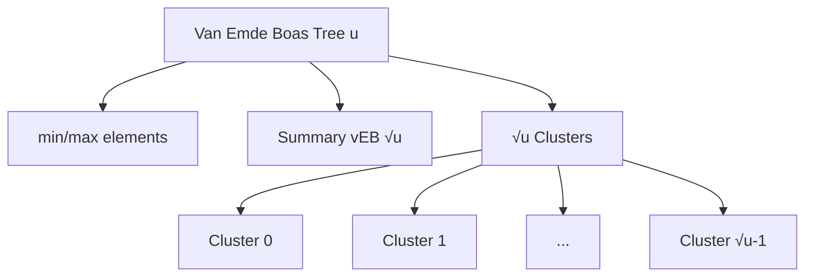

# Van Emde Boas Trees

## Introduction

Most traditional data structures like binary search trees, AVL trees, or hash tables have operations with time complexities that depend on the number of elements stored. For example, a balanced binary search tree typically provides O(log n) operations, where n is the number of elements.

But what if we could create a data structure where the operations depend on the universe size (the range of possible values) rather than the number of elements actually stored? This is exactly what **Van Emde Boas Trees** (vEB trees) accomplish.

Named after their inventor Peter van Emde Boas, these specialized data structures provide O(log log u) time complexity for basic operations, where u is the size of the universe (the maximum possible value plus one). This makes them exceptionally efficient when working with integers in a bounded range.

## Understanding Van Emde Boas Trees

### Basic Concept

A Van Emde Boas tree (vEB tree) is designed to store integers from the universe `{0, 1, 2, ..., u-1}` where u is a power of 2. The structure is recursive and divides the universe into blocks, using a "divide and conquer" approach.

Key operations supported by vEB trees:
- **insert(x)**: Insert element x
- **delete(x)**: Delete element x
- **member(x)**: Check if x is present
- **successor(x)**: Find the smallest element greater than x
- **predecessor(x)**: Find the largest element smaller than x
- **minimum()**: Find the minimum element
- **maximum()**: Find the maximum element

All these operations run in O(log log u) time, making vEB trees extremely efficient for certain use cases.

### The Structure

A vEB tree with universe size u consists of:

1. A **summary** structure, which is a smaller vEB tree with universe size √u
2. √u **clusters**, each of which is a vEB tree with universe size √u
3. **min** and **max** values directly stored in the tree

This recursive structure is what allows for the O(log log u) time complexity.

Let's visualize the structure:



### Key Insight

The key insight in vEB trees is how we map elements to clusters:

- For an element x in the universe `{0, 1, ..., u-1}`:
  - The **high(x)** = ⌊x/√u⌋ tells us which cluster x belongs to
  - The **low(x)** = x mod √u gives the position within that cluster

This decomposition allows us to navigate the structure efficiently.

## Implementing Van Emde Boas Trees

Let's implement a basic version of Van Emde Boas Tree in Python:

```python
import math

class VEBTree:
    def __init__(self, universe_size):
        # Universe size must be a power of 2
        self.universe_size = universe_size
        self.min = None
        self.max = None
        
        # Base case: for smallest possible universe
        if universe_size <= 2:
            return
            
        # For larger universes, create summary and clusters
        self.summary = None  # VEB tree for tracking which clusters contain elements
        self.clusters = [None] * self._sqrt_size()  # Array of VEB trees

    def _sqrt_size(self):
        return int(math.sqrt(self.universe_size))
        
    def _high(self, x):
        return x // self._sqrt_size()
        
    def _low(self, x):
        return x % self._sqrt_size()
        
    def _index(self, high, low):
        return high * self._sqrt_size() + low
        
    def is_member(self, x):
        # Base case: empty tree
        if self.min is None:
            return False
            
        # Direct check for min and max
        if x == self.min or x == self.max:
            return True
            
        # Base case: small universe
        if self.universe_size <= 2:
            return False
            
        # Check in the appropriate cluster
        cluster_index = self._high(x)
        if self.clusters[cluster_index] is None:
            return False
            
        return self.clusters[cluster_index].is_member(self._low(x))
    
    def insert(self, x):
        # Handle empty tree case
        if self.min is None:
            self.min = self.max = x
            return
            
        # Handle duplicate insertion
        if x == self.min or x == self.max:
            return
            
        # Handle new minimum
        if x < self.min:
            x, self.min = self.min, x
        
        # Handle new maximum
        if x > self.max:
            self.max = x
        
        # Base case: small universe
        if self.universe_size <= 2:
            return
            
        # Insert into appropriate cluster
        cluster_index = self._high(x)
        
        # Create cluster if it doesn't exist
        if self.clusters[cluster_index] is None:
            self.clusters[cluster_index] = VEBTree(self._sqrt_size())
            
            # Update summary structure
            if self.summary is None:
                self.summary = VEBTree(self._sqrt_size())
            self.summary.insert(cluster_index)
        
        # Insert into cluster
        self.clusters[cluster_index].insert(self._low(x))

    def minimum(self):
        return self.min
        
    def maximum(self):
        return self.max
```

This implementation includes the basic structure and fundamental operations. Let's see a simple usage example:

```python
# Creating a vEB Tree with universe size 16 (2^4)
veb = VEBTree(16)

# Inserting elements
elements = [2, 10, 6, 3, 8, 15, 1]
for e in elements:
    veb.insert(e)

# Testing membership
print(f"Is 6 in the tree? {veb.is_member(6)}")  # True
print(f"Is 7 in the tree? {veb.is_member(7)}")  # False

# Getting min and max
print(f"Minimum element: {veb.minimum()}")  # 1
print(f"Maximum element: {veb.maximum()}")  # 15
```

Output:
```
Is 6 in the tree? True
Is 7 in the tree? False
Minimum element: 1
Maximum element: 15
```

### Understanding the Implementation

Let's break down how the implementation works:

1. The `VEBTree` class represents a tree with a specific universe size
2. For each tree, we directly store the minimum and maximum elements
3. For universe sizes > 2, we create:
   - A summary structure (another vEB tree)
   - An array of clusters (each a smaller vEB tree)
4. The operations map elements to their appropriate clusters using the high/low calculations
5. The summary structure keeps track of which clusters have elements

## Operations in Detail

### Successor Operation

One of the most powerful aspects of vEB trees is the efficient successor and predecessor operations. Let's implement the successor operation:

```python
def successor(self, x):
    # Base case: empty tree or x >= max
    if self.min is None or x >= self.max:
        return None
        
    # Direct check for min
    if x < self.min:
        return self.min
        
    # Base case: small universe
    if self.universe_size <= 2:
        return self.max
        
    # Check if there's a successor in the current cluster
    cluster_index = self._high(x)
    cluster_pos = self._low(x)
    
    if (self.clusters[cluster_index] is not None and 
        cluster_pos < self.clusters[cluster_index].maximum()):
        # Find successor within cluster
        offset = self.clusters[cluster_index].successor(cluster_pos)
        return self._index(cluster_index, offset)
    
    # Otherwise, find next cluster with elements
    next_cluster = self.summary.successor(cluster_index) if self.summary else None
    if next_cluster is None:
        return None
        
    # Get the minimum of that cluster
    return self._index(next_cluster, self.clusters[next_cluster].minimum())
```

This implementation showcases how vEB trees efficiently find successors by:
1. First checking if the successor is in the same cluster
2. If not, using the summary structure to find the next non-empty cluster
3. Then retrieving the minimum value from that cluster

### Delete Operation

Let's also implement the delete operation to complete our basic vEB tree:

```python
def delete(self, x):
    # Handle empty tree or element not present
    if self.min is None:
        return
        
    # Single element case
    if self.min == self.max:
        if x == self.min:
            self.min = self.max = None
        return
    
    # Handle deletion of min (special case)
    if x == self.min:
        # Find the next smallest element
        first_cluster = self.summary.minimum() if self.summary else 0
        x = self._index(first_cluster, self.clusters[first_cluster].minimum())
        self.min = x
    
    # Base case: small universe
    if self.universe_size <= 2:
        if x == 0:
            self.min = 1
        else:
            self.min = 0
        self.max = self.min
        return
    
    # Delete from appropriate cluster
    cluster_index = self._high(x)
    cluster_pos = self._low(x)
    
    if self.clusters[cluster_index] is not None:
        self.clusters[cluster_index].delete(cluster_pos)
        
        # If cluster becomes empty, update summary
        if self.clusters[cluster_index].minimum() is None:
            self.clusters[cluster_index] = None
            self.summary.delete(cluster_index)
            
            # Handle deletion of max (special case)
            if x == self.max:
                if self.summary.maximum() is None:
                    self.max = self.min
                else:
                    last_cluster = self.summary.maximum()
                    self.max = self._index(last_cluster, self.clusters[last_cluster].maximum())
        # If not empty but x was max, update max
        elif x == self.max:
            self.max = self._index(cluster_index, self.clusters[cluster_index].maximum())
```

## Time Complexity Analysis

The beauty of vEB trees lies in their time complexity:

| Operation   | Time Complexity |
|-------------|-----------------|
| Insert      | O(log log u)    |
| Delete      | O(log log u)    |
| Lookup      | O(log log u)    |
| Successor   | O(log log u)    |
| Predecessor | O(log log u)    |
| Minimum     | O(1)            |
| Maximum     | O(1)            |

Where u is the universe size (the maximum possible value plus one).

To understand why operations are O(log log u), consider:
1. Each operation involves a constant number of operations in the current tree
2. The recursion depth is log₂(log₂ u) because:
   - At each level, the universe size goes from u to √u
   - So it takes log₂ u recursive steps to reach size 2
   - Taking log₂ of this gives us log₂(log₂ u)

## Space Complexity

The space complexity of vEB trees is O(u), which is a drawback compared to other data structures like balanced BSTs that use O(n) space where n is the number of elements.

There are space-optimized versions like the "proto-vEB" structure which uses O(u log log u) space, or the more complex but effective "y-fast trie" which needs only O(n log u) space.

## Practical Applications

Van Emde Boas trees shine in scenarios where:

1. **Integer keys in a limited range**: When your keys are integers within a known, limited universe.

2. **Priority queue operations**: When you need fast insert, delete-min, and decrease-key operations.

3. **Network routers**: For IP lookup tables where fast search and update operations are needed.

4. **Scheduling algorithms**: For task scheduling where tasks have integer priorities within a bounded range.

5. **Database indexing**: For specialized indexes on integer keys within a known range.

### Example: Job Scheduler

Here's a simplified job scheduler using vEB trees:

```python
class JobScheduler:
    def __init__(self, max_priority):
        # Initialize vEB tree with universe size that's a power of 2
        universe_size = 1
        while universe_size < max_priority:
            universe_size *= 2
        
        self.priority_queue = VEBTree(universe_size)
        self.jobs = {}  # Maps priority to job details
    
    def add_job(self, job_id, priority, details):
        # Add job to scheduler
        if priority in self.jobs:
            self.jobs[priority].append((job_id, details))
        else:
            self.jobs[priority] = [(job_id, details)]
            self.priority_queue.insert(priority)
    
    def get_highest_priority_job(self):
        # Get job with highest priority (lowest number)
        priority = self.priority_queue.minimum()
        if priority is None:
            return None
        
        job_info = self.jobs[priority][0]
        
        # Remove job from list
        self.jobs[priority].pop(0)
        
        # If no more jobs with this priority, remove from vEB tree
        if not self.jobs[priority]:
            del self.jobs[priority]
            self.priority_queue.delete(priority)
        
        return (priority, job_info)

# Example usage
scheduler = JobScheduler(100)  # Priorities from 0 to 99
scheduler.add_job("backup-db", 5, {"command": "pg_dump db > backup.sql"})
scheduler.add_job("send-email", 2, {"to": "admin@example.com", "subject": "Alert"})
scheduler.add_job("cleanup", 10, {"command": "rm -rf /tmp/cache"})

# Process jobs in priority order
job1 = scheduler.get_highest_priority_job()  # Will get the priority 2 job
job2 = scheduler.get_highest_priority_job()  # Will get the priority 5 job
job3 = scheduler.get_highest_priority_job()  # Will get the priority 10 job

print(f"Processing job with priority {job1[0]}: {job1[1][0]}")
print(f"Processing job with priority {job2[0]}: {job2[1][0]}")
print(f"Processing job with priority {job3[0]}: {job3[1][0]}")
```

Output:
```
Processing job with priority 2: send-email
Processing job with priority 5: backup-db
Processing job with priority 10: cleanup
```

## Limitations and Considerations

While vEB trees offer impressive time complexities, they have limitations:

1. **Space requirement**: The O(u) space complexity makes them impractical for large universes.

2. **Power of 2 constraint**: The standard implementation requires universe size to be a power of 2.

3. **Integer keys only**: They only work with integer keys in a predefined range.

4. **Implementation complexity**: They're more complex to implement than other data structures.

5. **Cache performance**: The recursive structure can lead to poor cache performance with many levels.

## Summary

Van Emde Boas trees are specialized data structures that offer extremely efficient O(log log u) time complexity for operations on integer keys within a limited universe. They achieve this by recursively dividing the universe into smaller blocks and maintaining a summary structure to quickly navigate between them.

Key takeaways:
- Optimal for integer keys in a bounded range
- O(log log u) operations for insert, delete, search, successor, predecessor
- O(1) operations for minimum and maximum
- Uses O(u) space, which can be a limitation
- Complex to implement but powerful for specific use cases

While they may not be everyday data structures, understanding vEB trees expands your knowledge of advanced algorithmic techniques and gives you a powerful tool for specific scenarios where integer operations need to be extremely fast.

## Additional Resources and Exercises

### Further Reading

- "Introduction to Algorithms" by Cormen, Leiserson, Rivest, and Stein (CLRS) - Chapter 20 covers vEB trees in detail
- "Advanced Data Structures" by Peter Brass
- MIT OpenCourseWare's Advanced Data Structures course

### Exercises

1. **Basic Operations**: Implement and test the predecessor operation in the VEBTree class.

2. **Space Optimization**: Research and implement a space-optimized version of vEB trees.

3. **Practical Application**: Build a simple IP routing table using vEB trees where you can insert, lookup, and delete IP addresses efficiently.

4. **Performance Comparison**: Compare the performance of vEB trees with other data structures (binary search trees, hash tables) for different universe sizes and operation patterns.

5. **Extension**: Enhance the vEB implementation to handle non-power-of-2 universe sizes.

By mastering Van Emde Boas trees, you're adding a powerful specialized data structure to your algorithmic toolkit that can provide unmatched performance for specific integer-based operations.