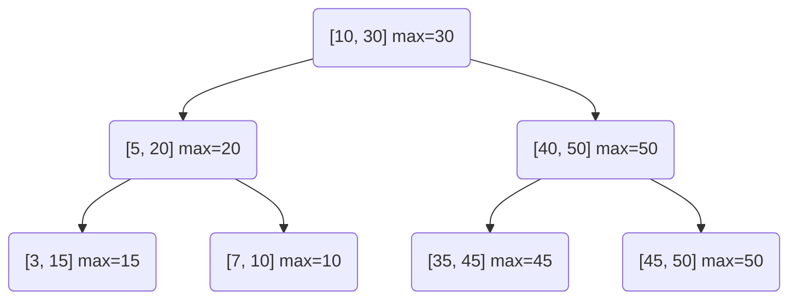

# Interval Trees

## Introduction

An interval tree is a specialized data structure designed to efficiently store and query intervals or segments. An interval is represented by a pair of values that define its starting and ending points. Interval trees are particularly useful when we need to find all intervals that overlap with a given query interval or point.

Imagine you're building a calendar application and need to check if a new event conflicts with existing events. Or perhaps you're developing a resource allocation system where you need to find all resources allocated during a specific time period. These are classic use cases for interval trees.

In this lesson, we'll explore how interval trees work, how to implement them, and their real-world applications.

## Understanding Intervals

Before diving into interval trees, let's clarify what we mean by intervals:

- An interval represents a range with a start and end point, often denoted as [start, end].
- Two intervals overlap if they share at least one point.

For example, the intervals [1, 5] and [3, 7] overlap because they share the points 3, 4, and 5.

## Basic Structure of an Interval Tree

An interval tree is typically built on top of a self-balancing binary search tree like a Red-Black tree or an AVL tree. Each node in the tree stores:

1. An interval (with start and end points)
2. The maximum end point value in the subtree rooted at this node
3. Pointers to left and right children

The tree is ordered based on the start point of each interval, similar to a standard binary search tree. The maximum end point value is used to optimize overlap queries.

Let's define the structure for an interval tree node:

```java
class IntervalNode {
    int start;          // Start point of the interval
    int end;            // End point of the interval
    int max;            // Maximum end point in the subtree rooted at this node
    IntervalNode left;  // Left child
    IntervalNode right; // Right child
    
    public IntervalNode(int start, int end) {
        this.start = start;
        this.end = end;
        this.max = end;
        this.left = null;
        this.right = null;
    }
}
```

## Building an Interval Tree

To build an interval tree, we insert intervals one by one, similar to inserting values in a BST (Binary Search Tree), but with additional steps to maintain the maximum end point value at each node.

Here's how we insert a new interval into the tree:

```java
class IntervalTree {
    IntervalNode root;
    
    public IntervalTree() {
        root = null;
    }
    
    public void insert(int start, int end) {
        root = insert(root, start, end);
    }
    
    private IntervalNode insert(IntervalNode node, int start, int end) {
        // If the tree is empty, create a new node
        if (node == null) {
            return new IntervalNode(start, end);
        }
        
        // If start is less than node's start, insert in left subtree
        if (start < node.start) {
            node.left = insert(node.left, start, end);
        }
        // Otherwise, insert in right subtree
        else {
            node.right = insert(node.right, start, end);
        }
        
        // Update the max value of this node
        node.max = Math.max(node.max, end);
        
        return node;
    }
}
```

## Querying Overlapping Intervals

The primary operation on an interval tree is finding all intervals that overlap with a given interval or point. The maximum end point value at each node helps us optimize this search.

Let's implement a function to search for intervals that overlap with a given interval [start, end]:

```java
class IntervalTree {
    // ... previous code ...
    
    public List<int[]> searchOverlapping(int start, int end) {
        List<int[]> result = new ArrayList<>();
        searchOverlapping(root, start, end, result);
        return result;
    }
    
    private void searchOverlapping(IntervalNode node, int start, int end, List<int[]> result) {
        // Base case: if node is null, return
        if (node == null) {
            return;
        }
        
        // Check if current node's interval overlaps with query interval
        if (overlaps(node.start, node.end, start, end)) {
            result.add(new int[]{node.start, node.end});
        }
        
        // If left child exists and its max is >= query start, search left subtree
        if (node.left != null && node.left.max >= start) {
            searchOverlapping(node.left, start, end, result);
        }
        
        // If node's start is <= query end, search right subtree
        if (node.start <= end) {
            searchOverlapping(node.right, start, end, result);
        }
    }
    
    private boolean overlaps(int start1, int end1, int start2, int end2) {
        return start1 <= end2 && start2 <= end1;
    }
}
```

## Visual Representation

To better understand how an interval tree is structured, let's visualize a simple example:



In the above diagram, each node shows the interval [start, end] and the maximum end point value in its subtree.

## Time Complexity Analysis

Let's analyze the time complexity of operations on an interval tree:

1. **Insert**: O(log n) on average, assuming the tree remains balanced.
2. **Delete**: O(log n) on average.
3. **Search for Overlapping Intervals**: O(log n + k), where n is the number of intervals in the tree and k is the number of intervals that overlap with the query.

The search operation is particularly efficient because we can skip entire subtrees that don't contain any overlapping intervals using the maximum end point value.

## Complete Implementation Example

Let's put everything together in a complete implementation of an interval tree:

```java
import java.util.ArrayList;
import java.util.List;

class IntervalTree {
    class IntervalNode {
        int start;
        int end;
        int max;
        IntervalNode left;
        IntervalNode right;
        
        public IntervalNode(int start, int end) {
            this.start = start;
            this.end = end;
            this.max = end;
            this.left = null;
            this.right = null;
        }
    }
    
    IntervalNode root;
    
    public IntervalTree() {
        root = null;
    }
    
    public void insert(int start, int end) {
        root = insert(root, start, end);
    }
    
    private IntervalNode insert(IntervalNode node, int start, int end) {
        if (node == null) {
            return new IntervalNode(start, end);
        }
        
        if (start < node.start) {
            node.left = insert(node.left, start, end);
        } else {
            node.right = insert(node.right, start, end);
        }
        
        node.max = Math.max(node.max, end);
        
        return node;
    }
    
    public List<int[]> searchOverlapping(int start, int end) {
        List<int[]> result = new ArrayList<>();
        searchOverlapping(root, start, end, result);
        return result;
    }
    
    private void searchOverlapping(IntervalNode node, int start, int end, List<int[]> result) {
        if (node == null) {
            return;
        }
        
        if (overlaps(node.start, node.end, start, end)) {
            result.add(new int[]{node.start, node.end});
        }
        
        if (node.left != null && node.left.max >= start) {
            searchOverlapping(node.left, start, end, result);
        }
        
        if (node.start <= end) {
            searchOverlapping(node.right, start, end, result);
        }
    }
    
    private boolean overlaps(int start1, int end1, int start2, int end2) {
        return start1 <= end2 && start2 <= end1;
    }
    
    // Method to print all intervals in the tree (for debugging)
    public void printTree() {
        List<int[]> allIntervals = new ArrayList<>();
        collectIntervals(root, allIntervals);
        System.out.println("All intervals in the tree:");
        for (int[] interval : allIntervals) {
            System.out.println("[" + interval[0] + ", " + interval[1] + "]");
        }
    }
    
    private void collectIntervals(IntervalNode node, List<int[]> result) {
        if (node == null) {
            return;
        }
        collectIntervals(node.left, result);
        result.add(new int[]{node.start, node.end});
        collectIntervals(node.right, result);
    }
}
```

## Usage Example

Let's see how to use the interval tree with a concrete example:

```java
public class Main {
    public static void main(String[] args) {
        IntervalTree tree = new IntervalTree();
        
        // Insert some intervals
        tree.insert(15, 20);
        tree.insert(10, 30);
        tree.insert(5, 12);
        tree.insert(17, 19);
        tree.insert(30, 40);
        
        // Print all intervals in the tree
        tree.printTree();
        
        // Search for overlapping intervals
        int queryStart = 14;
        int queryEnd = 16;
        System.out.println("\nIntervals overlapping with [" + queryStart + ", " + queryEnd + "]:");
        
        List<int[]> overlapping = tree.searchOverlapping(queryStart, queryEnd);
        for (int[] interval : overlapping) {
            System.out.println("[" + interval[0] + ", " + interval[1] + "]");
        }
    }
}
```

Output:
```
All intervals in the tree:
[5, 12]
[10, 30]
[15, 20]
[17, 19]
[30, 40]

Intervals overlapping with [14, 16]:
[10, 30]
[15, 20]
```

## Real-World Applications

Interval trees find applications in various domains:

### 1. Calendar Applications

Calendar applications use interval trees to efficiently check for event conflicts. When a user attempts to add a new event, the application can quickly determine if it overlaps with existing events.

```java
class CalendarEvent {
    String title;
    int startTime; // in minutes from midnight
    int endTime;   // in minutes from midnight
    
    // Constructor
    public CalendarEvent(String title, int startTime, int endTime) {
        this.title = title;
        this.startTime = startTime;
        this.endTime = endTime;
    }
}

class Calendar {
    IntervalTree eventTree;
    
    public Calendar() {
        eventTree = new IntervalTree();
    }
    
    public boolean addEvent(CalendarEvent event) {
        // Check if the new event conflicts with any existing event
        List<int[]> conflicts = eventTree.searchOverlapping(event.startTime, event.endTime);
        
        if (conflicts.isEmpty()) {
            // No conflicts, add the event
            eventTree.insert(event.startTime, event.endTime);
            return true;
        } else {
            // Conflict found
            return false;
        }
    }
}
```

### 2. Database Query Optimization

Databases use interval trees to optimize range queries, particularly for time-series data or date ranges.

### 3. Computational Geometry

Interval trees can be used for segment intersection problems, range searching, and other geometric algorithms.

### 4. Network Routing

In network management, interval trees help track allocated IP ranges and find available address spaces.

## Variant: Augmented Interval Trees

For more advanced use cases, interval trees can be augmented with additional information. For example, you might want to store:

- The count of intervals in each subtree
- Additional metadata related to each interval
- Priority information for overlapping intervals

## Exercises

1. **Basic Implementation**: Implement the delete operation for the interval tree.
2. **Optimization**: Modify the interval tree to use an AVL or Red-Black tree for better balance.
3. **Application**: Build a simple meeting scheduler that uses an interval tree to track occupied time slots and find available times.
4. **Extension**: Extend the interval tree to handle intervals with priorities, where higher priority intervals take precedence in case of overlaps.
5. **Challenge**: Implement a function that returns the maximum number of overlapping intervals at any point.

## Summary

Interval trees are powerful data structures that efficiently solve the problem of finding all intervals that overlap with a given query interval. They are built on top of binary search trees with additional information (the maximum end point) at each node to optimize the search process.

Key points to remember:
- Interval trees store intervals (ranges) and allow for efficient overlap queries
- They are typically implemented as augmented BSTs (Binary Search Trees)
- Each node stores an interval and the maximum end point in its subtree
- Overlap queries can be performed in O(log n + k) time
- Real-world applications include calendar systems, database query optimization, and computational geometry

As you continue your journey into advanced data structures, interval trees represent an excellent example of how augmenting a basic data structure with additional information can create a powerful tool for solving specific problems efficiently.

## Additional Resources

- "Introduction to Algorithms" by Cormen, Leiserson, Rivest, and Stein covers interval trees in detail.
- "Computational Geometry: Algorithms and Applications" by de Berg et al. discusses applications of interval trees in geometric problems.
- Online Judge platforms like LeetCode and HackerRank have problems that can be efficiently solved using interval trees.

Happy coding!