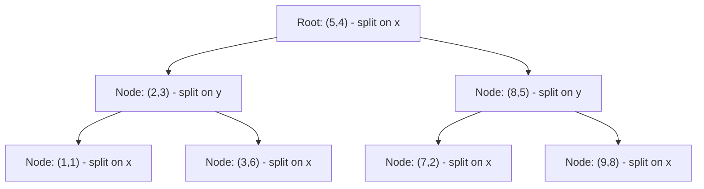
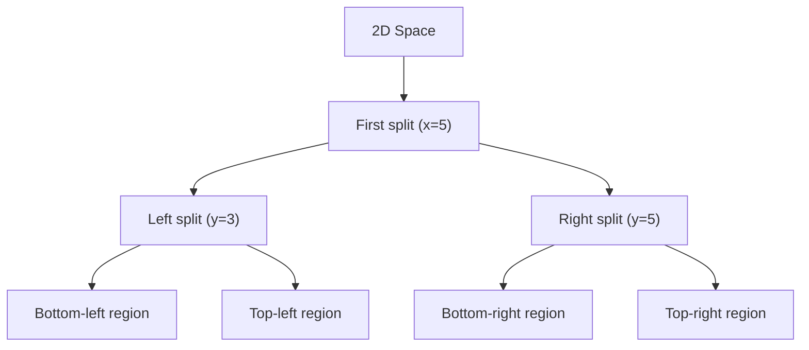

# K-d Trees

## Introduction

K-d trees (short for k-dimensional trees) are a space-partitioning data structure that organize points in a k-dimensional space. They are particularly useful for applications that involve multidimensional search keys, such as nearest neighbor searches and range searches.

Imagine you have a large number of points in a 2D or 3D space, and you frequently need to find the closest point to a given query point. A naive approach would require checking the distance to every point, which is inefficient for large datasets. K-d trees solve this problem by partitioning the space in a way that allows for much faster searches.

## Understanding K-d Trees

### What is a K-d Tree?

A k-d tree is a binary tree where:

1. Each node represents a point in k-dimensional space
2. Each non-leaf node divides the space into two half-spaces along one dimension
3. Points to the left of the node have a smaller value in the splitting dimension
4. Points to the right have a greater value in the splitting dimension

The splitting dimension typically cycles through all dimensions as we move down the tree. For example, in a 2D space (k=2), the root node might split along the x-axis, its children along the y-axis, its grandchildren along the x-axis again, and so on.

### Visual Representation

Let's visualize how a k-d tree partitions a 2D space:



This represents how the tree might look, but let's see how the actual space is partitioned:



## Building a K-d Tree

Building a k-d tree involves recursively partitioning the point set along alternating dimensions:

1. Choose a splitting dimension (typically cycling through dimensions)
2. Find the median point along that dimension
3. Create a node with that median point
4. Recursively build the left subtree with points on the "less than" side
5. Recursively build the right subtree with points on the "greater than" side

Let's implement a K-d tree in Python for 2D points:

```python
class KdNode:
    def __init__(self, point, dim, left=None, right=None):
        self.point = point  # The point (x, y)
        self.dim = dim      # The dimension to split on (0 for x, 1 for y)
        self.left = left    # Left subtree
        self.right = right  # Right subtree

def build_kdtree(points, depth=0):
    if not points:
        return None
    
    k = len(points[0])  # Dimensionality of points
    dim = depth % k     # Current dimension to split on
    
    # Sort points based on the current dimension
    points.sort(key=lambda x: x[dim])
    
    # Find median point
    median_idx = len(points) // 2
    
    # Create node and recursively build subtrees
    return KdNode(
        point=points[median_idx],
        dim=dim,
        left=build_kdtree(points[:median_idx], depth+1),
        right=build_kdtree(points[median_idx+1:], depth+1)
    )
```

Let's see this in action with a simple example:

```python
# Example points in 2D space
points = [(2, 3), (5, 4), (9, 6), (4, 7), (8, 1), (7, 2)]

# Build the k-d tree
root = build_kdtree(points)

# Print tree structure
def print_tree(node, level=0):
    if node is not None:
        print("  " * level + f"({node.point[0]}, {node.point[1]}) - split on {'x' if node.dim == 0 else 'y'}")
        print_tree(node.left, level + 1)
        print_tree(node.right, level + 1)

print_tree(root)
```

Output:
```
(7, 2) - split on x
  (4, 7) - split on y
    (2, 3) - split on x
    (5, 4) - split on x
  (9, 6) - split on y
    (8, 1) - split on x
```

## Searching in K-d Trees

### Finding the Nearest Neighbor

One of the most common applications of k-d trees is finding the nearest neighbor to a query point. The algorithm works as follows:

1. Start with the root node
2. Recursively traverse the tree, choosing the appropriate branch based on the query point
3. When reaching a leaf, save it as the "current best"
4. Backtrack, and for each node:
   - Check if the node's point is closer than the current best
   - Check if the opposite branch could contain a closer point by examining the distance to the splitting plane

Here's an implementation of nearest neighbor search:

```python
import math

def distance(p1, p2):
    """Calculate Euclidean distance between two points"""
    return math.sqrt(sum((a - b) ** 2 for a, b in zip(p1, p2)))

def nearest_neighbor(root, query_point, best=None):
    if root is None:
        return best
    
    # Update best if current point is closer
    if best is None or distance(query_point, root.point) < distance(query_point, best):
        best = root.point
    
    # Current splitting dimension
    dim = root.dim
    
    # Determine which subtree to search first (closer branch)
    if query_point[dim] < root.point[dim]:
        first, second = root.left, root.right
    else:
        first, second = root.right, root.left
    
    # Search the closer branch
    best = nearest_neighbor(first, query_point, best)
    
    # Check if we need to search the other branch
    # by comparing distance to splitting plane with current best distance
    if second is not None:
        dist_to_plane = abs(query_point[dim] - root.point[dim])
        if dist_to_plane < distance(query_point, best):
            # The other branch could contain a closer point
            best = nearest_neighbor(second, query_point, best)
    
    return best
```

Let's test our nearest neighbor search:

```python
# Example usage
query_point = (6, 5)
nearest = nearest_neighbor(root, query_point)
print(f"Nearest point to {query_point} is {nearest}, with distance {distance(query_point, nearest)}")
```

Output:
```
Nearest point to (6, 5) is (5, 4), with distance 1.4142135623730951
```

### Range Search

Another common operation is finding all points within a certain distance or region. The k-d tree allows us to prune branches that can't contain points in our target range:

```python
def range_search(root, query_point, radius):
    """Find all points within a given radius of the query point"""
    result = []
    
    def search(node):
        if node is None:
            return
        
        # Check if current point is within radius
        if distance(query_point, node.point) <= radius:
            result.append(node.point)
        
        # Current splitting dimension
        dim = node.dim
        
        # Check if we need to search left subtree
        if query_point[dim] - radius <= node.point[dim]:
            search(node.left)
        
        # Check if we need to search right subtree
        if query_point[dim] + radius >= node.point[dim]:
            search(node.right)
    
    search(root)
    return result
```

Usage example:

```python
# Find points within radius 3 of (6, 5)
points_in_range = range_search(root, (6, 5), 3)
print(f"Points within radius 3 of (6, 5): {points_in_range}")
```

Output:
```
Points within radius 3 of (6, 5): [(7, 2), (5, 4), (9, 6), (4, 7)]
```

## Time Complexity

- **Building a K-d tree**: O(n log n) in the average case, where n is the number of points
- **Inserting a new point**: O(log n) in the average case
- **Finding the nearest neighbor**: O(log n) in the average case, but can degrade to O(n) in the worst case
- **Range search**: O(√n + k) in the average case for a balanced tree, where k is the number of reported points

## Practical Applications

K-d trees are widely used in various applications, including:

### 1. Computer Graphics and Spatial Databases

K-d trees are used for efficient collision detection in video games and simulations. By organizing objects in 3D space, you can quickly determine which objects might collide.

```python
# Simplified collision detection example
def check_collision(object_tree, new_object, collision_radius):
    nearby_objects = range_search(object_tree, new_object.position, collision_radius)
    # Further processing with the smaller set of potential collisions
    return nearby_objects
```

### 2. Machine Learning - K-Nearest Neighbors Algorithm

The k-nearest neighbors (KNN) algorithm uses k-d trees to efficiently find the k nearest data points to a query point, which is essential for classification and regression tasks.

```python
def knn(root, query_point, k=3):
    """Find k nearest neighbors to the query point"""
    # Priority queue to keep track of the k nearest neighbors
    import heapq
    nearest = []  # Will store (-distance, point) pairs
    
    def search(node):
        if node is None:
            return
        
        # Calculate distance to current point
        dist = distance(query_point, node.point)
        
        # Add to our nearest points if needed
        if len(nearest) < k:
            heapq.heappush(nearest, (-dist, node.point))
        elif -dist > nearest[0][0]:  # If closer than our furthest point
            heapq.heappop(nearest)
            heapq.heappush(nearest, (-dist, node.point))
        
        # Current furthest distance in our k-nearest list
        furthest_dist = -nearest[0][0] if nearest else float('inf')
        
        # Determine which subtree to search first
        dim = node.dim
        if query_point[dim] < node.point[dim]:
            first, second = node.left, node.right
        else:
            first, second = node.right, node.left
        
        # Search closer branch first
        search(first)
        
        # Check if we need to search the other branch
        if len(nearest) < k or abs(query_point[dim] - node.point[dim]) < furthest_dist:
            search(second)
    
    search(root)
    # Return only the points, sorted by increasing distance
    return [point for _, point in sorted(nearest, key=lambda x: -x[0])]
```

### 3. Geographic Information Systems (GIS)

K-d trees help in map applications for finding nearby points of interest:

```python
# Finding nearby restaurants example
def find_nearby_restaurants(restaurant_tree, user_location, max_distance=5):
    nearby = range_search(restaurant_tree, user_location, max_distance)
    
    # Sort by distance for display
    nearby.sort(key=lambda point: distance(point, user_location))
    
    return nearby
```

### 4. Image Processing

K-d trees can accelerate color quantization algorithms, where similar colors in an image are grouped together:

```python
# Simplified color quantization example
def quantize_colors(image_pixels, k=16):
    # Build k-d tree from all pixel colors (RGB values)
    pixel_tree = build_kdtree(list(set(image_pixels)))
    
    # Find k representative colors
    # (This is simplified; real quantization would use clustering)
    result = {}
    for pixel in image_pixels:
        # Map each pixel to its nearest representative color
        nearest_color = nearest_neighbor(pixel_tree, pixel)
        result[pixel] = nearest_color
        
    return result
```

## Limitations and Considerations

While k-d trees are powerful, they have some limitations:

1. **Dimensionality curse**: K-d trees become less efficient as the number of dimensions increases (typically beyond 10-20 dimensions)
2. **Balance issues**: Without rebalancing, the tree can become unbalanced, degrading performance
3. **Static structure**: Standard k-d trees don't handle frequent insertions and deletions well

## Optimizations

Several optimizations can improve k-d tree performance:

1. **Optimized median finding**: Use the median-of-medians algorithm or approximate medians
2. **Leaf buckets**: Store multiple points in leaf nodes to reduce tree height
3. **Axis selection heuristics**: Choose splitting dimensions based on the variance of points rather than cycling through dimensions

```python
def build_optimized_kdtree(points, depth=0):
    if not points or len(points) <= 5:  # Leaf bucket optimization
        return KdNode(points, None, None, is_leaf=True) if points else None
    
    # Calculate variance along each dimension
    k = len(points[0])
    variances = []
    for dim in range(k):
        values = [p[dim] for p in points]
        variances.append(sum((v - sum(values)/len(values))**2 for v in values))
    
    # Choose dimension with highest variance
    dim = variances.index(max(variances))
    
    # Find median
    points.sort(key=lambda x: x[dim])
    median_idx = len(points) // 2
    
    return KdNode(
        point=points[median_idx],
        dim=dim,
        left=build_optimized_kdtree(points[:median_idx], depth+1),
        right=build_optimized_kdtree(points[median_idx+1:], depth+1)
    )
```

## Summary

K-d trees are a versatile space-partitioning data structure that excel at organizing points in multidimensional spaces. They provide efficient solutions for nearest neighbor searches and range queries, making them valuable in various domains like computational geometry, machine learning, and graphics.

Key takeaways:
- K-d trees partition space by cycling through dimensions at each level
- They enable O(log n) nearest neighbor searches in the average case
- Construction takes O(n log n) time for a balanced tree
- They're especially useful for low to moderate dimensional data (typically k < 20)
- Applications include KNN algorithm, collision detection, and geographic information systems

## Additional Resources and Exercises

### Resources

- "Computational Geometry: Algorithms and Applications" by Mark de Berg et al.
- "Introduction to Algorithms" by Cormen, Leiserson, Rivest, and Stein
- [Stanford CS lecture on K-d Trees](https://graphics.stanford.edu/courses/cs368-00-spring/TA/manuals/Kdtree.pdf)

### Exercises

1. **Basic Implementation**: Implement a k-d tree and nearest neighbor search for 3D points.
2. **Performance Analysis**: Compare the performance of a k-d tree to a brute force approach for nearest neighbor search with varying dataset sizes.
3. **Extended Functionality**: Implement k-nearest neighbors search using your k-d tree.
4. **Application Exercise**: Use a k-d tree to implement a simple recommendation system based on user features.
5. **Visualization**: Create a visualization of how a k-d tree partitions 2D space at each level.
6. **Advanced Challenge**: Implement a dynamic k-d tree that supports efficient insertions and deletions while maintaining balance.

By mastering k-d trees, you'll have a powerful tool in your algorithmic toolkit for solving multidimensional search problems efficiently.