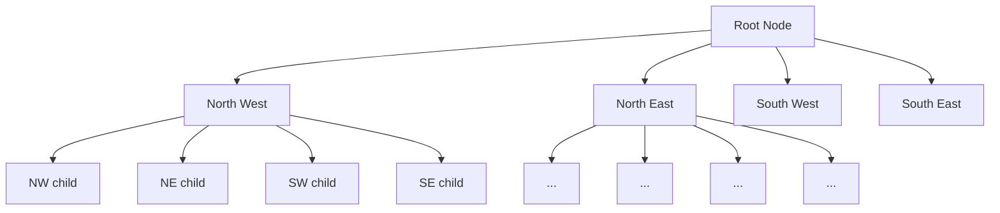

# Quad Trees

## Introduction

A Quad Tree is a tree data structure that recursively divides a two-dimensional space into four equal quadrants (regions). Each node in a quad tree has exactly four children or none at all. This hierarchical spatial partitioning technique is particularly useful for representing spatial data efficiently, such as points, rectangles or other objects in a two-dimensional space.

Quad trees are often used when you need to:

- Quickly locate objects in a 2D space
- Detect collisions between objects
- Implement efficient range searches
- Compress image data

The key advantage is that they reduce the number of objects that need to be checked for spatial operations from O(n²) comparisons to O(n log n) in many common scenarios.

## Quad Tree Structure

A quad tree divides space into four quadrants, typically labeled:

- North West (NW)
- North East (NE)
- South West (SW)
- South East (SE)



The subdivision continues recursively as needed, depending on the data being stored and the chosen subdivision criteria.

## Types of Quad Trees

### Point Quad Tree

Used to store point data. The dividing lines are determined by the position of the points.

### Region Quad Tree (PR Quad Tree)

Divides the space into equal quadrants regardless of where the data points are located.

### Edge Quad Tree

Used for representing lines rather than points.

### Compressed Quad Tree

An optimized version that avoids empty quadrants.

## Implementation of a Point Quad Tree

Let's implement a basic point quad tree in JavaScript:

```javascript
class Point {
  constructor(x, y, data = null) {
    this.x = x;
    this.y = y;
    this.data = data;
  }
}

class Rectangle {
  constructor(x, y, w, h) {
    this.x = x; // center x
    this.y = y; // center y
    this.w = w; // half width
    this.h = h; // half height
  }
  
  contains(point) {
    return (point.x >= this.x - this.w &&
            point.x <= this.x + this.w &&
            point.y >= this.y - this.h &&
            point.y <= this.y + this.h);
  }
  
  intersects(range) {
    return !(range.x - range.w > this.x + this.w ||
             range.x + range.w < this.x - this.w ||
             range.y - range.h > this.y + this.h ||
             range.y + range.h < this.y - this.h);
  }
}

class QuadTree {
  constructor(boundary, capacity = 4) {
    this.boundary = boundary;
    this.capacity = capacity;
    this.points = [];
    this.divided = false;
    
    // Children quadrants
    this.northwest = null;
    this.northeast = null;
    this.southwest = null;
    this.southeast = null;
  }
  
  // Insert a point into the QuadTree
  insert(point) {
    // If point is not within boundary, don't insert
    if (!this.boundary.contains(point)) {
      return false;
    }
    
    // If there's space in this quad tree and it's not divided yet
    if (this.points.length < this.capacity && !this.divided) {
      this.points.push(point);
      return true;
    }
    
    // Otherwise, subdivide and add the point to whichever node will accept it
    if (!this.divided) {
      this.subdivide();
    }
    
    if (this.northwest.insert(point)) return true;
    if (this.northeast.insert(point)) return true;
    if (this.southwest.insert(point)) return true;
    if (this.southeast.insert(point)) return true;
    
    // Shouldn't happen
    return false;
  }
  
  // Create four children that fully divide this quad into four quads of equal area
  subdivide() {
    const x = this.boundary.x;
    const y = this.boundary.y;
    const w = this.boundary.w / 2;
    const h = this.boundary.h / 2;
    
    const nw = new Rectangle(x - w/2, y - h/2, w, h);
    const ne = new Rectangle(x + w/2, y - h/2, w, h);
    const sw = new Rectangle(x - w/2, y + h/2, w, h);
    const se = new Rectangle(x + w/2, y + h/2, w, h);
    
    this.northwest = new QuadTree(nw, this.capacity);
    this.northeast = new QuadTree(ne, this.capacity);
    this.southwest = new QuadTree(sw, this.capacity);
    this.southeast = new QuadTree(se, this.capacity);
    
    this.divided = true;
    
    // Move points to children
    for (let p of this.points) {
      this.northwest.insert(p);
      this.northeast.insert(p);
      this.southwest.insert(p);
      this.southeast.insert(p);
    }
    
    this.points = [];
  }
  
  // Find all points that lie within a range
  query(range, found = []) {
    // If range doesn't intersect boundary, return empty array
    if (!this.boundary.intersects(range)) {
      return found;
    }
    
    // Check points in this quad
    for (let point of this.points) {
      if (range.contains(point)) {
        found.push(point);
      }
    }
    
    // If this has children, check them too
    if (this.divided) {
      this.northwest.query(range, found);
      this.northeast.query(range, found);
      this.southwest.query(range, found);
      this.southeast.query(range, found);
    }
    
    return found;
  }
}
```

## Using the Quad Tree

Let's see how to use our quad tree implementation:

```javascript
// Create a boundary for our quad tree (a 200x200 square centered at 100,100)
const boundary = new Rectangle(100, 100, 100, 100);

// Create a quad tree with capacity of 4 points per node
const qt = new QuadTree(boundary, 4);

// Insert some random points
for (let i = 0; i < 20; i++) {
  const x = Math.random() * 200;
  const y = Math.random() * 200;
  const p = new Point(x, y, `Point ${i}`);
  qt.insert(p);
}

// Query for points in a specific region
const queryRegion = new Rectangle(50, 50, 30, 30);
const pointsInRegion = qt.query(queryRegion);

console.log(`Found ${pointsInRegion.length} points in the query region`);
for (const point of pointsInRegion) {
  console.log(`Point at (${point.x.toFixed(2)}, ${point.y.toFixed(2)}): ${point.data}`);
}

// Output might look like:
// Found 3 points in the query region
// Point at (45.32, 63.21): Point 3
// Point at (71.45, 42.18): Point 9
// Point at (56.89, 49.37): Point 15
```

## Time and Space Complexity

For a quad tree with n points:

- **Insertion**: O(log n) on average
- **Query**: O(log n + k) where k is the number of points in the query region
- **Space**: O(n)

The exact complexity depends on the distribution of points and the structure of the tree.

## Real-World Applications

### 1. Game Development

Quad trees are extensively used in game development for collision detection and efficiently rendering only visible objects:

```javascript
// Example: Collision detection in a simple 2D game

function checkCollisions(gameObjects, quadTree) {
  // Clear the quad tree and reinsert all objects
  quadTree.clear();
  for (let obj of gameObjects) {
    quadTree.insert(obj);
  }
  
  for (let obj of gameObjects) {
    // Create a search area around this object
    const searchArea = new Rectangle(
      obj.x, 
      obj.y, 
      obj.width / 2 + COLLISION_BUFFER,
      obj.height / 2 + COLLISION_BUFFER
    );
    
    // Find potential collision candidates
    const potentialCollisions = quadTree.query(searchArea);
    
    // Check only these candidates for actual collisions
    for (let other of potentialCollisions) {
      if (obj !== other && isColliding(obj, other)) {
        handleCollision(obj, other);
      }
    }
  }
}
```

### 2. Geographic Information Systems (GIS)

GIS applications use quad trees to efficiently store and query spatial data:

```javascript
// Example: Finding all restaurants within a certain area on a map

function findNearbyRestaurants(map, center, radius) {
  // Create a search region
  const searchRegion = new Rectangle(center.lat, center.lng, radius, radius);
  
  // Query the map's quad tree for points of interest
  const pointsOfInterest = map.quadTree.query(searchRegion);
  
  // Filter for restaurants
  return pointsOfInterest.filter(poi => poi.type === 'restaurant');
}
```

### 3. Image Processing and Compression

A variant of quad trees is used in image compression, particularly for images with large areas of the same color:

```javascript
function compressImage(image, threshold) {
  const qt = new QuadTreeImageCompressor(image);
  return qt.compress(threshold);
}

class QuadTreeImageCompressor {
  compress(threshold) {
    // If the color variance in this node is less than the threshold
    // represent the entire quadrant with a single color
    if (this.getColorVariance() < threshold) {
      return this.getAverageColor();
    }
    
    // Otherwise, subdivide and compress each quadrant
    this.subdivide();
    return [
      this.northwest.compress(threshold),
      this.northeast.compress(threshold),
      this.southwest.compress(threshold),
      this.southeast.compress(threshold)
    ];
  }
}
```

### 4. Computer Graphics

Quad trees are used in computer graphics for level of detail rendering:

```javascript
function renderScene(camera, quadTree) {
  // Get the visible region based on camera position
  const visibleRegion = getVisibleRegion(camera);
  
  // Query the quad tree for objects in this region
  const visibleObjects = quadTree.query(visibleRegion);
  
  // Sort objects by distance to camera
  visibleObjects.sort((a, b) => {
    return distanceToCamera(camera, a) - distanceToCamera(camera, b);
  });
  
  // Render objects with appropriate level of detail
  for (const obj of visibleObjects) {
    const distance = distanceToCamera(camera, obj);
    const detailLevel = calculateDetailLevel(distance);
    renderObject(obj, detailLevel);
  }
}
```

## Summary

Quad trees are powerful spatial data structures that efficiently organize 2D space. They excel at:

- Reducing the computational complexity of spatial operations
- Enabling efficient range queries
- Supporting collision detection in games
- Optimizing geographic data searches
- Compressing image data

The recursive subdivision pattern of quad trees makes them intuitive to understand and implement. While we focused on point quad trees in this tutorial, the concept extends to other types like region quad trees, edge quad trees, and compressed quad trees.

## Exercises

1. **Basic Implementation**: Extend the QuadTree class to implement a `clear()` method that removes all points.

2. **Visualization**: Create a simple visualization of a quad tree using HTML Canvas, showing how points are distributed and how the space is partitioned.

3. **Performance Analysis**: Compare the performance of a quad tree versus a naive approach for finding all points in a region as the number of points increases.

4. **Advanced Implementation**: Modify the quad tree to handle rectangles instead of points.

5. **Real-world Application**: Implement a simple 2D game collision system using quad trees.

## Additional Resources

- "Computational Geometry: Algorithms and Applications" by Mark de Berg et al.
- "Foundations of Multidimensional and Metric Data Structures" by Hanan Samet
- [Quad Tree Visualization](https://en.wikipedia.org/wiki/Quadtree) - Wikipedia page with visualizations
- Several online tutorials and interactive demos are available that help visualize how quad trees partition space and improve performance for spatial operations

Happy coding with quad trees! They're a fascinating data structure that elegantly solves many spatial problems.