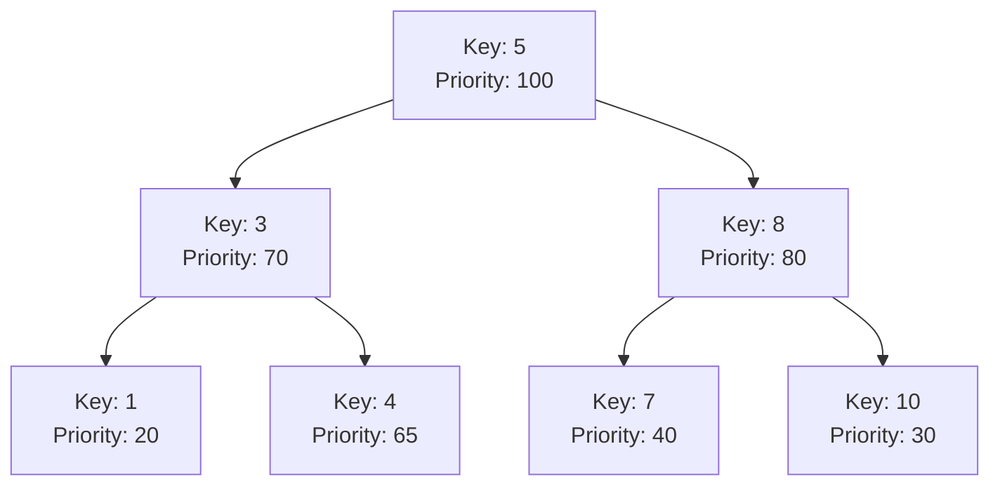

# Treap

## Introduction

A Treap is a fascinating hybrid data structure that combines the properties of two fundamental data structures: a **binary search tree** (BST) and a **heap**. The name "Treap" itself is a blend of "tree" and "heap," reflecting its dual nature. 

In a Treap, each node contains:
- A **key** value that follows the binary search tree property
- A **priority** value that follows the heap property (typically a max-heap)

What makes Treaps special is that they use randomization to achieve balance, making them simpler to implement than self-balancing trees like AVL or Red-Black trees, while still providing good expected performance.

## Why Learn Treaps?

- **Balanced Performance**: Treaps provide O(log n) expected time for operations without complex balancing rules
- **Simple Implementation**: Much easier to code than other balanced BSTs
- **Versatility**: Useful for implementing ordered sets, maps, and priority queues
- **Randomized Algorithm**: Demonstrates the power of randomization in algorithm design

## Treap Structure and Properties

A Treap node contains:
1. A key (following BST property)
2. A priority (typically a random value following max-heap property)
3. Left and right child pointers

The Treap maintains two properties:
- **BST Property**: For any node, all keys in its left subtree are smaller, and all keys in its right subtree are larger
- **Heap Property**: The priority of any node is greater than or equal to the priorities of its children

Here's a visual representation of a Treap:



## Implementing a Treap

Let's implement a basic Treap in C++:

```cpp
#include <iostream>
#include <cstdlib>  // For rand()

class Treap {
private:
    struct Node {
        int key;
        int priority;
        Node* left;
        Node* right;
        
        Node(int k) : key(k), priority(rand()), left(nullptr), right(nullptr) {}
    };
    
    Node* root;
    
    // Helper functions for rotations
    Node* rotateRight(Node* y) {
        Node* x = y->left;
        y->left = x->right;
        x->right = y;
        return x;
    }
    
    Node* rotateLeft(Node* x) {
        Node* y = x->right;
        x->right = y->left;
        y->left = x;
        return y;
    }
    
    // Recursive insert function
    Node* insert(Node* root, int key) {
        if (!root) {
            return new Node(key);
        }
        
        if (key < root->key) {
            root->left = insert(root->left, key);
            
            // Fix heap property if violated
            if (root->left->priority > root->priority) {
                root = rotateRight(root);
            }
        } else if (key > root->key) {
            root->right = insert(root->right, key);
            
            // Fix heap property if violated
            if (root->right->priority > root->priority) {
                root = rotateLeft(root);
            }
        }
        // If key already exists, do nothing
        
        return root;
    }
    
    // Recursive delete function
    Node* remove(Node* root, int key) {
        if (!root) {
            return nullptr;
        }
        
        if (key < root->key) {
            root->left = remove(root->left, key);
        } else if (key > root->key) {
            root->right = remove(root->right, key);
        } else {
            // Node found, delete it
            
            // Case 1: Leaf node
            if (!root->left && !root->right) {
                delete root;
                return nullptr;
            }
            // Case 2: One child is NULL
            else if (!root->left) {
                Node* temp = root->right;
                delete root;
                return temp;
            } else if (!root->right) {
                Node* temp = root->left;
                delete root;
                return temp;
            }
            // Case 3: Two children
            else {
                // Decide which way to rotate based on priorities
                if (root->left->priority > root->right->priority) {
                    root = rotateRight(root);
                    root->right = remove(root->right, key);
                } else {
                    root = rotateLeft(root);
                    root->left = remove(root->left, key);
                }
            }
        }
        return root;
    }
    
    void inorder(Node* root) {
        if (root) {
            inorder(root->left);
            std::cout << "Key: " << root->key << ", Priority: " << root->priority << std::endl;
            inorder(root->right);
        }
    }
    
    void cleanup(Node* root) {
        if (root) {
            cleanup(root->left);
            cleanup(root->right);
            delete root;
        }
    }
    
public:
    Treap() : root(nullptr) {
        // Seed random number generator
        srand(time(nullptr));
    }
    
    ~Treap() {
        cleanup(root);
    }
    
    void insert(int key) {
        root = insert(root, key);
    }
    
    void remove(int key) {
        root = remove(root, key);
    }
    
    void display() {
        inorder(root);
    }
};
```

## Operations in a Treap

Let's explore the key operations in a Treap:

### Insertion

To insert a key into a Treap:
1. Insert the key as in a normal BST
2. Assign a random priority to the new node
3. Perform rotations as needed to maintain the heap property

Here's how insertion works step by step:

```cpp
// Usage example
int main() {
    Treap t;
    
    // Insert elements
    t.insert(5);
    t.insert(3);
    t.insert(8);
    t.insert(1);
    t.insert(7);
    
    std::cout << "Treap contents:" << std::endl;
    t.display();
    
    return 0;
}
```

Possible output (priorities will vary due to randomization):
```
Treap contents:
Key: 1, Priority: 234
Key: 3, Priority: 874
Key: 5, Priority: 989
Key: 7, Priority: 345
Key: 8, Priority: 567
```

### Search

Searching in a Treap is identical to searching in a binary search tree:

```cpp
bool search(Node* root, int key) {
    if (!root) {
        return false;
    }
    
    if (key == root->key) {
        return true;
    } else if (key < root->key) {
        return search(root->left, key);
    } else {
        return search(root->right, key);
    }
}
```

### Deletion

Deletion is more complex and can be done in two ways:

1. **BST with Rotations**: First find the node, then use rotations to move it down to a leaf position, then remove it
2. **BST Delete with Heap Property Fix**: Delete as in a BST, then fix heap property

The implementation we saw above uses the first approach.

## Time and Space Complexity

| Operation | Average Case | Worst Case |
|-----------|--------------|------------|
| Search    | O(log n)     | O(n)       |
| Insert    | O(log n)     | O(n)       |
| Delete    | O(log n)     | O(n)       |
| Space     | O(n)         | O(n)       |

While the worst case is O(n), it's extremely unlikely due to randomization. The expected height of a random Treap is O(log n), making operations efficient in practice.

## Applications of Treaps

Treaps are useful in various scenarios:

### 1. Implementing Ordered Sets and Maps

Treaps can efficiently maintain a set of elements in sorted order while allowing fast insertions and deletions.

### 2. Priority Queue with Ordering

When you need both priorities and ordering of elements.

### 3. Fast Set Operations

Treaps can be used to implement Union, Intersection, and Difference operations between sets efficiently.

### 4. Persistent Data Structures

Treaps can be adapted to create persistent versions (where previous versions are preserved after modifications).

### Practical Example: Text Editor Buffer

Consider implementing a text editor buffer that supports efficient insertion and deletion at any position:

```cpp
class TextEditorBuffer {
private:
    struct Node {
        char data;
        int priority;
        int subtreeSize;  // Size of the subtree rooted at this node
        Node* left;
        Node* right;
        
        Node(char c) : data(c), priority(rand()), subtreeSize(1), 
                       left(nullptr), right(nullptr) {}
    };
    
    Node* root;
    
    // Update subtree size
    void updateSize(Node* node) {
        if (node) {
            node->subtreeSize = 1;
            if (node->left) node->subtreeSize += node->left->subtreeSize;
            if (node->right) node->subtreeSize += node->right->subtreeSize;
        }
    }
    
    // Split treap into two treaps at position
    std::pair<Node*, Node*> split(Node* root, int pos) {
        if (!root) {
            return {nullptr, nullptr};
        }
        
        int leftSize = root->left ? root->left->subtreeSize : 0;
        
        if (pos <= leftSize) {
            auto [l, r] = split(root->left, pos);
            root->left = r;
            updateSize(root);
            return {l, root};
        } else {
            auto [l, r] = split(root->right, pos - leftSize - 1);
            root->right = l;
            updateSize(root);
            return {root, r};
        }
    }
    
    // Merge two treaps
    Node* merge(Node* left, Node* right) {
        if (!left) return right;
        if (!right) return left;
        
        if (left->priority > right->priority) {
            left->right = merge(left->right, right);
            updateSize(left);
            return left;
        } else {
            right->left = merge(left, right->left);
            updateSize(right);
            return right;
        }
    }
    
public:
    TextEditorBuffer() : root(nullptr) {
        srand(time(nullptr));
    }
    
    // Insert character at position
    void insert(int pos, char c) {
        Node* newNode = new Node(c);
        auto [left, right] = split(root, pos);
        root = merge(merge(left, newNode), right);
    }
    
    // Delete character at position
    void remove(int pos) {
        auto [left, rightWithPos] = split(root, pos);
        auto [nodeToRemove, right] = split(rightWithPos, 1);
        delete nodeToRemove;  // Free memory
        root = merge(left, right);
    }
    
    // Get character at position
    char charAt(int pos) {
        Node* current = root;
        while (current) {
            int leftSize = current->left ? current->left->subtreeSize : 0;
            if (pos == leftSize) {
                return current->data;
            } else if (pos < leftSize) {
                current = current->left;
            } else {
                pos -= leftSize + 1;
                current = current->right;
            }
        }
        return '\0';  // Position out of bounds
    }
    
    // Get the entire text as a string
    std::string getText() {
        std::string result;
        inorderTraversal(root, result);
        return result;
    }
    
private:
    void inorderTraversal(Node* node, std::string& result) {
        if (node) {
            inorderTraversal(node->left, result);
            result += node->data;
            inorderTraversal(node->right, result);
        }
    }
};
```

Example usage:

```cpp
int main() {
    TextEditorBuffer buffer;
    
    // Insert some text
    buffer.insert(0, 'H');  // H
    buffer.insert(1, 'e');  // He
    buffer.insert(2, 'l');  // Hel
    buffer.insert(3, 'l');  // Hell
    buffer.insert(4, 'o');  // Hello
    
    std::cout << "Text: " << buffer.getText() << std::endl;
    
    // Insert in the middle
    buffer.insert(2, 'X');  // HeXllo
    std::cout << "After insertion: " << buffer.getText() << std::endl;
    
    // Delete a character
    buffer.remove(2);  // Hello
    std::cout << "After deletion: " << buffer.getText() << std::endl;
    
    return 0;
}
```

Output:
```
Text: Hello
After insertion: HeXllo
After deletion: Hello
```

## Split and Merge Operations

Two powerful operations in Treaps are split and merge, which are useful for range operations:

### Split

Splits a Treap into two Treaps at a given key:

```cpp
// Split treap into < key and ≥ key
std::pair<Node*, Node*> split(Node* root, int key) {
    if (!root) {
        return {nullptr, nullptr};
    }
    
    if (key < root->key) {
        auto [left, right] = split(root->left, key);
        root->left = right;
        return {left, root};
    } else {
        auto [left, right] = split(root->right, key);
        root->right = left;
        return {root, right};
    }
}
```

### Merge

Merges two Treaps where all keys in the first Treap are less than all keys in the second:

```cpp
Node* merge(Node* left, Node* right) {
    if (!left) return right;
    if (!right) return left;
    
    if (left->priority > right->priority) {
        left->right = merge(left->right, right);
        return left;
    } else {
        right->left = merge(left, right->left);
        return right;
    }
}
```

## Implicit Treap (Array Treap)

An implicit Treap uses positions as keys, allowing array-like operations with logarithmic performance. This is the basis of our text editor example.

## Comparison with Other Balanced Trees

| Feature | Treap | AVL Tree | Red-Black Tree |
|---------|-------|----------|----------------|
| Balance | Probabilistic | Strictly balanced | Approximately balanced |
| Implementation | Simple | Complex | Very complex |
| Rotations per operation | O(1) expected | O(log n) worst case | O(1) worst case |
| Space overhead | Lower | Medium | Medium |
| Performance in practice | Good | Very good | Good |

## Summary

Treaps combine the simplicity of implementation with good expected performance:

- They merge binary search tree and heap properties
- Randomization provides good expected balance
- Operations have O(log n) expected time complexity
- Treaps are simple to implement compared to other balanced BSTs
- They support powerful operations like split and merge
- Useful for ordered sets, maps, and more complex structures

Treaps demonstrate how randomization can simplify algorithm design while still achieving good performance characteristics, making them an important tool in a programmer's arsenal.

## Exercises

1. Implement a function to find the k-th smallest element in a Treap
2. Modify the Treap implementation to support duplicates
3. Implement range queries to count elements between two keys
4. Create a Treap-based implementation of an ordered multiset
5. Implement split and merge operations and use them to implement set operations (union, intersection)

## Additional Resources

- "Introduction to Algorithms" by Cormen, Leiserson, Rivest, and Stein
- "Randomized Algorithms" by Motwani and Raghavan
- "Treaps: The Magical Algorithm" on Competitive Programming websites
- "Advanced Data Structures" by Peter Brass

Mastering Treaps will not only enhance your understanding of randomized data structures but also provide you with a powerful tool for solving complex algorithmic problems efficiently.