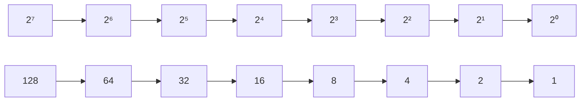

# Binary Number System

## Introduction

The binary number system is the foundation of all digital computing. Unlike our everyday decimal system that uses 10 digits (0-9), the binary system uses only two digits: 0 and 1. These binary digits, commonly known as "bits," are the most fundamental units of information in computing.

In this guide, we'll explore:
- What the binary number system is and why computers use it
- How to read and write binary numbers
- Converting between binary and decimal
- Performing arithmetic operations in binary
- Real-world applications of binary in programming

## What is the Binary Number System?

### Definition

The binary number system is a base-2 numeric system that uses only two symbols: 0 and 1. Each position in a binary number represents a power of 2, increasing from right to left.

### Why Computers Use Binary

Computers use binary for several important reasons:

1. **Electronic simplicity**: Digital circuits are easier to design with two states (on/off, high/low voltage)
2. **Reliability**: Having only two states makes the system less prone to errors
3. **Boolean logic**: Binary aligns perfectly with Boolean operations (AND, OR, NOT)
4. **Storage efficiency**: Binary representation can be efficiently implemented in hardware

### Binary vs. Decimal

Here's how binary differs from our familiar decimal system:

| Decimal (Base 10) | Binary (Base 2) |
|------------------|----------------|
| Uses digits 0-9    | Uses only 0 and 1 |
| Position values are powers of 10 (10⁰, 10¹, 10², etc.) | Position values are powers of 2 (2⁰, 2¹, 2², etc.) |
| Example: 254 = 2×10² + 5×10¹ + 4×10⁰ | Example: 1101 = 1×2³ + 1×2² + 0×2¹ + 1×2⁰ |

## Reading and Writing Binary Numbers

### Understanding Place Values

In binary, each position represents a power of 2:



For example, the binary number `1011` can be interpreted as:

```
1 0 1 1
| | | |
| | | +-- 1 × 2⁰ = 1
| | +---- 0 × 2¹ = 0
| +------ 1 × 2² = 4
+-------- 1 × 2³ = 8
                  = 13 in decimal
```

## Converting Between Number Systems

### Binary to Decimal Conversion

To convert a binary number to decimal:
1. Identify the position value of each bit (power of 2)
2. Multiply each bit (0 or 1) by its position value
3. Sum all the results

#### Example:

Let's convert binary `10110` to decimal:

```
1    0    1    1    0
|    |    |    |    |
2⁴   2³   2²   2¹   2⁰
|    |    |    |    |
16   8    4    2    1
|    |    |    |    |
1×16 0×8  1×4  1×2  0×1 = 16 + 0 + 4 + 2 + 0 = 22
```

So, binary `10110` equals decimal `22`.

### Decimal to Binary Conversion

To convert a decimal number to binary:
1. Divide the number by 2
2. Record the remainder (0 or 1)
3. Continue dividing the quotient by 2 until you reach 0
4. Read the remainders from bottom to top

#### Example:

Let's convert decimal `37` to binary:

```
37 ÷ 2 = 18 remainder 1
18 ÷ 2 = 9  remainder 0
9  ÷ 2 = 4  remainder 1
4  ÷ 2 = 2  remainder 0
2  ÷ 2 = 1  remainder 0
1  ÷ 2 = 0  remainder 1
```

Reading the remainders from bottom to top gives us `100101`.

### Code Example: Converting Between Binary and Decimal

Here's how you can convert between binary and decimal in various programming languages:

#### JavaScript:

```javascript
// Decimal to binary
function decimalToBinary(decimal) {
  return decimal.toString(2);
}

// Binary to decimal
function binaryToDecimal(binary) {
  return parseInt(binary, 2);
}

// Examples
console.log(decimalToBinary(37));  // Output: "100101"
console.log(binaryToDecimal("100101"));  // Output: 37
```

#### Python:

```python
# Decimal to binary
def decimal_to_binary(decimal):
    return bin(decimal)[2:]  # Remove '0b' prefix

# Binary to decimal
def binary_to_decimal(binary):
    return int(binary, 2)

# Examples
print(decimal_to_binary(37))  # Output: "100101"
print(binary_to_decimal("100101"))  # Output: 37
```

#### Java:

```java
// Decimal to binary
public static String decimalToBinary(int decimal) {
    return Integer.toBinaryString(decimal);
}

// Binary to decimal
public static int binaryToDecimal(String binary) {
    return Integer.parseInt(binary, 2);
}

// Example usage
public static void main(String[] args) {
    System.out.println(decimalToBinary(37));  // Output: "100101"
    System.out.println(binaryToDecimal("100101"));  // Output: 37
}
```

## Binary Arithmetic Operations

### Addition

Binary addition follows these rules:
- 0 + 0 = 0
- 0 + 1 = 1
- 1 + 0 = 1
- 1 + 1 = 10 (0 with carry 1)

#### Example:

```
  1 1 1 1 (carries)
   1 0 1 1 (first number: 11 in decimal)
 + 0 1 0 1 (second number: 5 in decimal)
 ---------
   1 0 0 0 0 (result: 16 in decimal)
```

### Subtraction

Binary subtraction rules:
- 0 - 0 = 0
- 1 - 0 = 1
- 1 - 1 = 0
- 0 - 1 = 1 with borrowing 1

#### Example:

```
   1 0 1 1 (first number: 11 in decimal)
 - 0 1 0 1 (second number: 5 in decimal)
 ---------
   0 1 1 0 (result: 6 in decimal)
```

### Bitwise Operations

Bitwise operations perform operations on individual bits:

| Operation   | Symbol | Description                            |
|-------------|--------|----------------------------------------|
| AND         | `&`    | 1 if both bits are 1                   |
| OR          | `\|`   | 1 if at least one bit is 1             |
| XOR         | `^`    | 1 if exactly one bit is 1              |
| NOT         | `~`    | Inverts all bits                       |
| Left Shift  | `<<`   | Shifts bits left, filling with 0s      |
| Right Shift | `>>`   | Shifts bits right, preserving sign bit |

#### Example: Bitwise AND

```
   1 0 1 1 (first number: 11 in decimal)
 & 0 1 0 1 (second number: 5 in decimal)
 ---------
   0 0 0 1 (result: 1 in decimal)
```

## Real-World Applications of Binary

### Application 1: Storing Data in Memory

Every piece of data in a computer is ultimately stored in binary. This includes:

- **Text**: Each character is assigned a binary code (e.g., ASCII or Unicode)
- **Images**: Pixels are represented as binary values for color and intensity
- **Audio**: Sound waves are sampled and converted to binary values
- **Video**: Sequences of image frames stored in binary

### Application 2: IP Addressing

IPv4 addresses are 32-bit binary numbers, usually represented in dotted decimal notation:

```
192.168.1.1 is actually 11000000.10101000.00000001.00000001 in binary
```

### Application 3: Bit Manipulation in Programming

Binary operations are incredibly useful for:

#### Setting, clearing, and toggling bits

```javascript
// Setting a bit at position p
function setBit(number, p) {
  return number | (1 << p);
}

// Clearing a bit at position p
function clearBit(number, p) {
  return number & ~(1 << p);
}

// Toggling a bit at position p
function toggleBit(number, p) {
  return number ^ (1 << p);
}

// Checking if a bit at position p is set
function isBitSet(number, p) {
  return (number & (1 << p)) !== 0;
}

// Example
const num = 10;  // Binary: 1010
console.log(setBit(num, 0).toString(2));     // 1011 (11 in decimal)
console.log(clearBit(num, 1).toString(2));   // 1000 (8 in decimal)
console.log(toggleBit(num, 3).toString(2));  // 0010 (2 in decimal)
console.log(isBitSet(num, 3));               // true (bit at position 3 is set)
```

#### Using bit flags for multiple options

```javascript
// Define bit flags
const OPTIONS = {
  READABLE: 1 << 0,    // 0001
  WRITABLE: 1 << 1,    // 0010
  EXECUTABLE: 1 << 2,  // 0100
  HIDDEN: 1 << 3       // 1000
};

// Create a configuration
let config = OPTIONS.READABLE | OPTIONS.WRITABLE;  // 0011

// Check if option is set
function hasOption(config, option) {
  return (config & option) !== 0;
}

console.log(hasOption(config, OPTIONS.READABLE));    // true
console.log(hasOption(config, OPTIONS.EXECUTABLE));  // false

// Add an option
config |= OPTIONS.EXECUTABLE;  // Now config is 0111
console.log(hasOption(config, OPTIONS.EXECUTABLE));  // true

// Remove an option
config &= ~OPTIONS.WRITABLE;  // Now config is 0101
console.log(hasOption(config, OPTIONS.WRITABLE));    // false
```

### Application 4: Color Representation

RGB colors use binary to represent color intensity:

```javascript
// RGB color (Red: 255, Green: 0, Blue: 128)
const red = 255;    // 11111111 in binary
const green = 0;    // 00000000 in binary
const blue = 128;   // 10000000 in binary

// Combined in one 24-bit number (commonly represented in hex)
const colorHex = "#" + red.toString(16).padStart(2, '0') + 
                       green.toString(16).padStart(2, '0') + 
                       blue.toString(16).padStart(2, '0');
console.log(colorHex);  // #ff0080
```

## Summary

The binary number system is fundamental to understanding how computers work at the lowest level. Key points to remember:

- Binary uses only two digits: 0 and 1
- Each position in a binary number represents a power of 2
- Computers use binary because electronic circuits can easily represent two states
- Converting between decimal and binary is a common operation in programming
- Binary is the foundation for bit manipulation techniques
- Many real-world applications use binary, from data storage to networking

## Exercises for Practice

1. Convert the following decimal numbers to binary:
   - 42
   - 127
   - 255

2. Convert these binary numbers to decimal:
   - 10101
   - 11111111
   - 10000000

3. Calculate the following binary operations:
   - 1010 + 1101
   - 1100 - 0101
   - 1010 & 1100
   - 1010 | 0101

4. Write a function to count the number of set bits (1s) in a binary number.

5. Implement a program that uses bit manipulation to determine if a number is a power of 2.

## Additional Resources

- [Binary Number System on Khan Academy](https://www.khanacademy.org/math/algebra/introduction-to-algebra/algebra-alternate-number-bases/v/number-systems-introduction)
- [Bit Manipulation Tricks for Competitive Programming](https://www.hackerearth.com/practice/basic-programming/bit-manipulation/basics-of-bit-manipulation/tutorial/)
- [Binary, Decimal and Hexadecimal Numbers](https://www.mathsisfun.com/binary-decimal-hexadecimal.html)

Now that you understand the binary number system, you're ready to explore more advanced bit manipulation techniques!