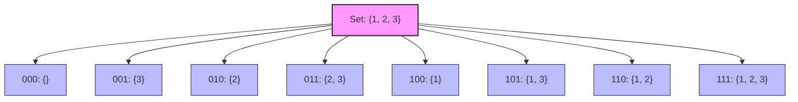

# Subset Generation

## Introduction

Subset generation is a fundamental problem in computer science where we need to generate all possible subsets of a given set. For example, if we have a set {1, 2, 3}, we want to generate all its subsets: {}, {1}, {2}, {3}, {1, 2}, {1, 3}, {2, 3}, and {1, 2, 3}.

This process is also known as **power set** generation. For a set with n elements, there are exactly 2^n possible subsets. As the size of the set grows, the number of subsets increases exponentially.

Bit manipulation offers an elegant and efficient approach to this problem. In this tutorial, we'll learn how to use bitwise operations to generate all subsets of a set, which is particularly useful in competitive programming and algorithmic problem-solving scenarios.

## Understanding the Connection Between Bits and Subsets

Before diving into the code, let's understand the core concept. The key insight is that we can represent the presence or absence of each element in a subset using a binary digit (bit):

- 0 means the element is not present in the subset
- 1 means the element is present in the subset

For a set with n elements, we can use an n-bit number to represent any subset.

Let's illustrate with our {1, 2, 3} example:

| Bits | Binary | Subset    |
|------|--------|-----------|
| 0    | 000    | {}        |
| 1    | 001    | {3}       |
| 2    | 010    | {2}       |
| 3    | 011    | {2, 3}    |
| 4    | 100    | {1}       |
| 5    | 101    | {1, 3}    |
| 6    | 110    | {1, 2}    |
| 7    | 111    | {1, 2, 3} |

Notice that for each bit position, we include the corresponding element in our subset if that bit is 1.

## Generating All Subsets: Step-by-Step Algorithm

Here's the step-by-step approach to generate all subsets:

1. For a set with n elements, we need to enumerate all numbers from 0 to 2^n - 1
2. For each number, we check which bits are set (equal to 1)
3. For each set bit, we include the corresponding element in our subset

Let's implement this in code:

```cpp
#include <iostream>
#include <vector>

using namespace std;

vector<vector<int>> generateSubsets(vector<int>& nums) {
    int n = nums.size();
    int totalSubsets = 1 << n; // 2^n
    vector<vector<int>> result;
    
    for (int i = 0; i < totalSubsets; i++) {
        vector<int> subset;
        for (int j = 0; j < n; j++) {
            // Check if jth bit is set in i
            if (i & (1 << j)) {
                subset.push_back(nums[j]);
            }
        }
        result.push_back(subset);
    }
    
    return result;
}

int main() {
    vector<int> nums = {1, 2, 3};
    vector<vector<int>> subsets = generateSubsets(nums);
    
    cout << "All subsets:" << endl;
    for (const auto& subset : subsets) {
        cout << "{ ";
        for (int num : subset) {
            cout << num << " ";
        }
        cout << "}" << endl;
    }
    
    return 0;
}
```

Output:
```
All subsets:
{ }
{ 1 }
{ 2 }
{ 1 2 }
{ 3 }
{ 1 3 }
{ 2 3 }
{ 1 2 3 }
```

Let's break down the key parts:

1. `1 << n` is a bitwise left shift that computes 2^n efficiently
2. `i & (1 << j)` checks if the jth bit is set in number i
   - `1 << j` shifts 1 to the jth position (creating a mask with only the jth bit set)
   - Bitwise AND (`&`) with `i` checks if that particular bit is set

## Python Implementation

Here's the same algorithm implemented in Python:

```python
def generate_subsets(nums):
    n = len(nums)
    total_subsets = 1 << n  # 2^n
    result = []
    
    for i in range(total_subsets):
        subset = []
        for j in range(n):
            # Check if jth bit is set in i
            if i & (1 << j):
                subset.append(nums[j])
        result.append(subset)
    
    return result

# Example usage
nums = [1, 2, 3]
subsets = generate_subsets(nums)

print("All subsets:")
for subset in subsets:
    print(subset)
```

Output:
```
All subsets:
[]
[1]
[2]
[1, 2]
[3]
[1, 3]
[2, 3]
[1, 2, 3]
```

## Time and Space Complexity

- **Time Complexity**: O(n × 2^n) where n is the number of elements in the set
  - We generate 2^n subsets
  - For each subset, we perform n checks (one for each element)
  
- **Space Complexity**: O(n × 2^n)
  - We store 2^n subsets
  - Each subset can contain up to n elements

## Practical Applications

### 1. Solving the Subset Sum Problem

The subset sum problem asks if there's a subset of a given set that adds up to a specific target sum. We can use the subset generation technique to check all possible subsets:

```cpp
bool hasSubsetSum(vector<int>& nums, int targetSum) {
    int n = nums.size();
    int totalSubsets = 1 << n;
    
    for (int i = 0; i < totalSubsets; i++) {
        int sum = 0;
        for (int j = 0; j < n; j++) {
            if (i & (1 << j)) {
                sum += nums[j];
            }
        }
        
        if (sum == targetSum) {
            return true;
        }
    }
    
    return false;
}
```

### 2. Combinatorial Problems - Team Selection

Suppose you need to select teams from n people. You can generate all possible team combinations:

```python
def generate_teams(people):
    n = len(people)
    total_combinations = 1 << n
    teams = []
    
    # Skip empty team (i=0)
    for i in range(1, total_combinations):
        team = []
        for j in range(n):
            if i & (1 << j):
                team.append(people[j])
        teams.append(team)
    
    return teams

# Example
people = ["Alice", "Bob", "Charlie", "Dave"]
all_teams = generate_teams(people)
print(f"Total possible teams: {len(all_teams)}")

# Print teams with exactly 2 members
two_member_teams = [team for team in all_teams if len(team) == 2]
print("\nTeams with 2 members:")
for team in two_member_teams:
    print(team)
```

### 3. Handling Permissions and Flags

Bit manipulation for subset generation is similar to how permissions are represented in systems. Each permission (read, write, execute) can be represented as a bit, and combinations form permission sets:

```cpp
// Permission flags
const int READ = 1;     // 001
const int WRITE = 2;    // 010
const int EXECUTE = 4;  // 100

bool checkPermission(int userPermissions, int requiredPermission) {
    // Check if user has the required permission
    return (userPermissions & requiredPermission) == requiredPermission;
}

void displayPermissions(int permissions) {
    cout << "Permissions: ";
    if (permissions & READ) cout << "Read ";
    if (permissions & WRITE) cout << "Write ";
    if (permissions & EXECUTE) cout << "Execute";
    cout << endl;
}

int main() {
    int userA = READ | WRITE;           // 011 - User A has read and write permissions
    int userB = READ | WRITE | EXECUTE; // 111 - User B has all permissions
    
    displayPermissions(userA); // Output: Permissions: Read Write
    displayPermissions(userB); // Output: Permissions: Read Write Execute
    
    cout << "User A can execute: " << (checkPermission(userA, EXECUTE) ? "Yes" : "No") << endl;
    cout << "User B can execute: " << (checkPermission(userB, EXECUTE) ? "Yes" : "No") << endl;
    
    return 0;
}
```

## Optimizations and Variants

### Generating Subsets of a Specific Size

Sometimes we only need subsets of a certain size. We can modify our algorithm to generate only those:

```cpp
vector<vector<int>> generateSubsetsOfSizeK(vector<int>& nums, int k) {
    int n = nums.size();
    int totalSubsets = 1 << n;
    vector<vector<int>> result;
    
    for (int i = 0; i < totalSubsets; i++) {
        // Count set bits in i
        int bitCount = __builtin_popcount(i); // GCC built-in function
        
        // Only process if number of set bits equals k
        if (bitCount == k) {
            vector<int> subset;
            for (int j = 0; j < n; j++) {
                if (i & (1 << j)) {
                    subset.push_back(nums[j]);
                }
            }
            result.push_back(subset);
        }
    }
    
    return result;
}
```

For Python, we can use the `bin().count('1')` approach to count set bits:

```python
def generate_subsets_of_size_k(nums, k):
    n = len(nums)
    total_subsets = 1 << n
    result = []
    
    for i in range(total_subsets):
        # Count set bits in i
        bit_count = bin(i).count('1')
        
        if bit_count == k:
            subset = []
            for j in range(n):
                if i & (1 << j):
                    subset.append(nums[j])
            result.append(subset)
    
    return result
```

## Visual Representation of Subset Generation

Here's a visual representation of how bit patterns correspond to subsets:



## Summary

Subset generation using bit manipulation is a powerful technique that leverages the binary representation of numbers to efficiently enumerate all possible combinations of elements in a set. By representing the presence or absence of elements with bits, we can:

- Generate all 2^n subsets of a set with n elements
- Efficiently check and manipulate these subsets
- Solve various combinatorial problems

The key insights in this approach are:
1. Using bits to represent whether an element is included (1) or excluded (0)
2. Leveraging the natural counting of binary numbers from 0 to 2^n-1 to enumerate all subsets
3. Using bitwise operations to efficiently check and extract elements for each subset

This technique is especially useful in competitive programming, algorithmic interviews, and any scenario where you need to explore all possible combinations of elements.

## Practice Exercises

1. **Basic Exercise**: Generate all subsets of the set {5, 7, 9, 11} and print them.

2. **Subset Sum**: Find if there's a subset of a given set of integers that adds up to a given sum.

3. **Optimization Problem**: Find the subset with the maximum sum such that no two elements are adjacent in the original set.

4. **Challenge**: Generate all subsets of a set with duplicate elements, ensuring no duplicate subsets are produced.

5. **Advanced**: Implement an algorithm to generate subsets in lexicographic order using bit manipulation.

Remember, mastering bit manipulation for subset generation gives you a powerful tool for solving a wide range of algorithmic problems efficiently!