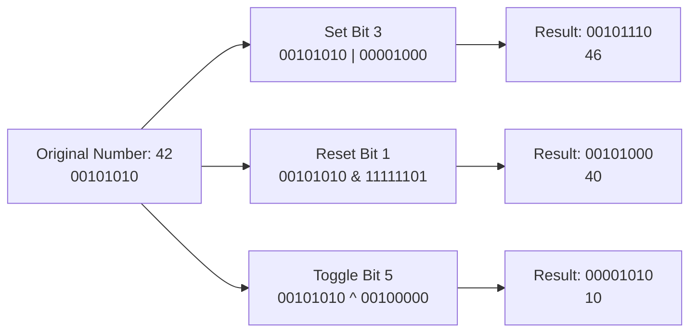

# Set Reset Toggle Bits

## Introduction

Bit manipulation is a fundamental skill in programming that involves operating directly on bits—the smallest units of information in computing. Among the most common bit operations are **setting**, **resetting**, and **toggling** bits, which allow you to precisely control individual bits within an integer value.

These operations are especially valuable in:
- Embedded systems programming
- Memory-efficient data structures
- Flag/state management
- Hardware communication protocols
- Performance optimization

In this tutorial, we'll explore how to manipulate individual bits using bitwise operators, with clear examples and practical applications.

## Understanding Bit Positions

Before diving into bit operations, it's important to understand how bits are positioned in a binary number. For an 8-bit integer:

```
Bit position:  7 6 5 4 3 2 1 0
Bit value:     1 0 1 1 0 0 1 0
```

Positions are numbered starting from 0 on the right (least significant bit) and increasing as we move left. Each position represents a power of 2 (2^0, 2^1, 2^2, etc.).

## Setting Bits

Setting a bit means changing its value to 1, regardless of its current state.

### How to Set a Bit

To set the nth bit of a number, use the bitwise OR operator (`|`) with a number that has the nth bit as 1 and all other bits as 0.

```c
// To set the nth bit
result = number | (1 << n);
```

The `1 << n` creates a number with only the nth bit set to 1 (a bitmask).

### Example: Setting the 3rd Bit

```c
#include <stdio.h>

int main() {
    unsigned int number = 34;   // Binary: 00100010
    int bitPosition = 3;
    unsigned int result = number | (1 << bitPosition);
    
    printf("Original number: %u (binary: %08b)\n", number, number);
    printf("After setting bit %d: %u (binary: %08b)\n", bitPosition, result, result);
    
    return 0;
}
```

Output:
```
Original number: 34 (binary: 00100010)
After setting bit 3: 42 (binary: 00101010)
```

## Resetting Bits

Resetting a bit means changing its value to 0, regardless of its current state.

### How to Reset a Bit

To reset the nth bit of a number, use the bitwise AND operator (`&`) with a number that has the nth bit as 0 and all other bits as 1.

```c
// To reset the nth bit
result = number & ~(1 << n);
```

The `~(1 << n)` creates a number with all bits set to 1 except the nth bit, which is 0.

### Example: Resetting the 2nd Bit

```c
#include <stdio.h>

int main() {
    unsigned int number = 38;   // Binary: 00100110
    int bitPosition = 2;
    unsigned int result = number & ~(1 << bitPosition);
    
    printf("Original number: %u (binary: %08b)\n", number, number);
    printf("After resetting bit %d: %u (binary: %08b)\n", bitPosition, result, result);
    
    return 0;
}
```

Output:
```
Original number: 38 (binary: 00100110)
After resetting bit 2: 34 (binary: 00100010)
```

## Toggling Bits

Toggling a bit means flipping its value—changing 0 to 1 and 1 to 0.

### How to Toggle a Bit

To toggle the nth bit of a number, use the bitwise XOR operator (`^`) with a number that has the nth bit as 1 and all other bits as 0.

```c
// To toggle the nth bit
result = number ^ (1 << n);
```

### Example: Toggling the 4th Bit

```c
#include <stdio.h>

int main() {
    unsigned int number = 42;   // Binary: 00101010
    int bitPosition = 4;
    unsigned int result = number ^ (1 << bitPosition);
    
    printf("Original number: %u (binary: %08b)\n", number, number);
    printf("After toggling bit %d: %u (binary: %08b)\n", bitPosition, result, result);
    
    return 0;
}
```

Output:
```
Original number: 42 (binary: 00101010)
After toggling bit 4: 26 (binary: 00011010)
```

## Checking Bit Value

Before manipulating bits, you might want to check what value a specific bit currently has.

### How to Check a Bit

To check the value of the nth bit, use the bitwise AND operator with a number that has only the nth bit set to 1.

```c
// To check if the nth bit is set
bool isSet = (number & (1 << n)) != 0;
```

### Example: Checking a Bit

```c
#include <stdio.h>
#include <stdbool.h>

int main() {
    unsigned int number = 42;   // Binary: 00101010
    int bitPosition = 3;
    bool isSet = (number & (1 << bitPosition)) != 0;
    
    printf("Number: %u (binary: %08b)\n", number, number);
    printf("Is bit %d set? %s\n", bitPosition, isSet ? "Yes" : "No");
    
    return 0;
}
```

Output:
```
Number: 42 (binary: 00101010)
Is bit 3 set? No
```

## Practical Applications

### 1. Flag Management

Bit manipulation is perfect for managing boolean flags efficiently:

```c
#define FLAG_READ    (1 << 0)  // 0000 0001
#define FLAG_WRITE   (1 << 1)  // 0000 0010
#define FLAG_EXECUTE (1 << 2)  // 0000 0100

int main() {
    unsigned char permissions = 0;  // No permissions initially
    
    // Set read permission
    permissions |= FLAG_READ;
    
    // Set execute permission
    permissions |= FLAG_EXECUTE;
    
    // Check if write permission is set
    if (permissions & FLAG_WRITE) {
        printf("Write permission is granted\n");
    } else {
        printf("No write permission\n");
    }
    
    // Toggle execute permission (remove it)
    permissions ^= FLAG_EXECUTE;
    
    printf("Final permissions: %d\n", permissions);
    return 0;
}
```

Output:
```
No write permission
Final permissions: 1
```

### 2. Memory-Efficient Boolean Array

When you need to store many boolean values, using bits is more efficient than an array of booleans:

```c
#include <stdio.h>

#define SET_BIT(arr, bit) ((arr)[(bit) / 8] |= (1 << ((bit) % 8)))
#define RESET_BIT(arr, bit) ((arr)[(bit) / 8] &= ~(1 << ((bit) % 8)))
#define TEST_BIT(arr, bit) ((arr)[(bit) / 8] & (1 << ((bit) % 8)))

int main() {
    // Can store 80 booleans in just 10 bytes
    unsigned char boolArray[10] = {0};
    
    // Set the 17th boolean to true
    SET_BIT(boolArray, 17);
    
    // Check if the 17th boolean is true
    if (TEST_BIT(boolArray, 17)) {
        printf("Bit 17 is set!\n");
    }
    
    // Reset the 17th boolean
    RESET_BIT(boolArray, 17);
    
    // Check again
    if (!TEST_BIT(boolArray, 17)) {
        printf("Bit 17 is now reset!\n");
    }
    
    return 0;
}
```

Output:
```
Bit 17 is set!
Bit 17 is now reset!
```

### 3. Hardware Register Manipulation

When working with hardware, you often need to modify specific bits in control registers:

```c
// Example: Configuring a hypothetical hardware timer

#define TIMER_CONTROL_REG  0x40020000  // Address of control register
#define ENABLE_BIT         0           // Timer enable bit
#define MODE_BIT_0         1           // Timer mode bit 0
#define MODE_BIT_1         2           // Timer mode bit 1
#define INTERRUPT_BIT      3           // Timer interrupt enable bit

void configureTimer() {
    volatile unsigned int* controlReg = (volatile unsigned int*)TIMER_CONTROL_REG;
    
    // Read current value
    unsigned int regValue = *controlReg;
    
    // 1. Enable timer
    regValue |= (1 << ENABLE_BIT);
    
    // 2. Set mode bits to 01 (first reset then set appropriate bits)
    regValue &= ~(1 << MODE_BIT_1);  // Reset bit 1
    regValue |= (1 << MODE_BIT_0);   // Set bit 0
    
    // 3. Enable interrupts
    regValue |= (1 << INTERRUPT_BIT);
    
    // Write back to register
    *controlReg = regValue;
}
```

This code demonstrates how to safely modify individual bits in a hardware register without affecting other bits.

## Visualizing Bit Manipulation



## Common Mistakes and Best Practices

### Mistakes to Avoid

1. **Forgetting that bit positions are zero-indexed**: The rightmost bit is position 0, not 1.
2. **Sign-extension issues**: Be careful when working with signed integers, as shifting can cause unexpected sign extension.
3. **Not considering the integer size**: Different platforms may have different integer sizes.

### Best Practices

1. **Use unsigned types** when doing bit manipulation to avoid sign-related issues.
2. **Create readable macros or functions** for your bit operations to improve code readability.
3. **Comment your bit manipulations** to make your code more maintainable.
4. **Consider endianness** when working with multi-byte values.

## Summary

Bit manipulation is a powerful technique that allows you to efficiently control individual bits within integer values:

- **Setting a bit**: Use the bitwise OR operator (`|`) to change a bit to 1
- **Resetting a bit**: Use the bitwise AND operator (`&`) with a complement (`~`) to change a bit to 0
- **Toggling a bit**: Use the bitwise XOR operator (`^`) to flip a bit value
- **Checking a bit**: Use the bitwise AND operator to test if a bit is set

These operations are essential for efficient programming in areas like embedded systems, hardware interfaces, and performance-critical applications.

## Additional Resources and Exercises

### Exercises

1. Write a function that counts the number of set bits (1s) in an integer.
2. Implement a function that reverses the bit order in a byte.
3. Create a function that sets bits `i` through `j` (inclusive) in a number to 1.
4. Create a bit vector class that efficiently stores and manipulates a large array of boolean values.
5. Implement a function that determines if a number is a power of 2 using bit manipulation.

### Additional Resources

- **Bit Twiddling Hacks**: Stanford's collection of bit manipulation tricks
- **Hacker's Delight**: A book by Henry S. Warren Jr. focused on bit manipulation algorithms
- **The Art of Computer Programming, Volume 4A**: Donald Knuth's comprehensive coverage of bit operations

Master these techniques, and you'll have powerful tools at your disposal for solving complex problems efficiently!